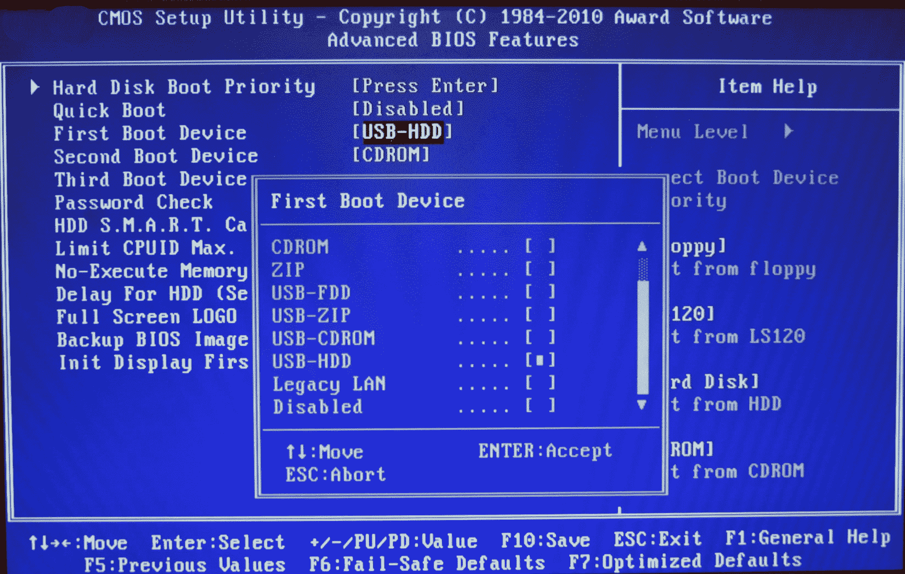
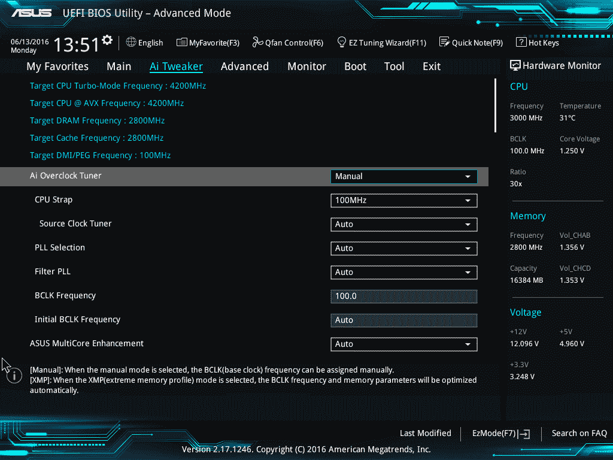

# UEFI vs BIOS:有什么区别？

> 原文：<https://www.freecodecamp.org/news/uefi-vs-bios/>

因此，你可能听说过 BIOS 和 UEFI 这两个缩写词，尤其是在尝试切换操作系统或进行超频时。

您可能知道这些首字母缩写代表什么(分别是统一可扩展固件接口和基本输入/输出系统)。但是你有没有想过它们是如何在计算机系统中使用的？

现在让我们揭开这些术语及其含义的神秘面纱。

## 引导程序

首先，我知道我们偏离了主题，但我保证这会对你以后的一些概念有所帮助。

那么，计算机是如何启动的呢？让我们一步一步来:

1.  你按下笔记本电脑/台式机上的电源按钮。
2.  CPU 启动了，但是需要一些指令来工作(记住，CPU 总是需要做一些事情)。由于主存储器在这个阶段是空的，CPU 推迟从主板上的固件芯片加载指令，并开始执行指令。
3.  固件代码执行开机自检(POST)，初始化剩余的硬件，检测连接的外围设备(鼠标、键盘、pendrive 等)。)并检查所有连接的设备是否正常。您可能记得它是开机自检成功后台式机发出的“嘟嘟”声。
4.  最后，固件代码循环通过所有存储设备并寻找引导加载程序(通常位于磁盘的第一个扇区)。如果找到了引导加载程序，固件就会将计算机的控制权交给它。

出于本文的目的，我们不需要了解关于这个主题的更多信息。但是如果你感兴趣，那么继续读下去(否则，你可以跳到下一节)。

5.  所以现在引导加载程序已经加载了，它的工作就是加载操作系统的其余部分。GRUB 就是这样一个引导加载程序，它能够加载类 unix 操作系统，也能够链式加载 Windows 操作系统。Boot-loader 只在磁盘的第一个扇区可用，它是 512 字节。鉴于现代操作系统的复杂性，这些引导加载程序中的一些倾向于进行多阶段加载，其中主引导加载程序在不限于 512 字节的环境中加载第二阶段引导加载程序。

6.  然后，引导加载程序将内核加载到内存中。然后，类 Unix 操作系统运行`init`进程(主进程，其他进程从该进程分叉/执行),最后初始化[运行级别](https://en.wikipedia.org/wiki/Runlevel)。

7.  在 Windows 中，`wininit.exe`与其他一些进程一起加载，如用于服务控制的`services.exe`、用于本地安全性和权限(类似于运行级别)的`lsass.exe`以及用于本地会话管理的`lsm.exe`。

8.  在所有这些之后，并且在一些其他驱动程序被初始化之后，图形用户界面(GUI)被加载并且你被呈现在登录屏幕上。

这是引导过程的一个非常高层次的概述。如果你对操作系统感兴趣，我建议你多读一些关于 osdev.net 的书。

现在让我们回到最初的话题。

## BIOS:

BIOS 代表基本输入/输出系统，我们在上面的引导过程中谈到的固件。

它存储在 EPROM(可擦除可编程只读存储器)上，允许制造商轻松推出更新。

它提供了许多帮助功能，允许读取附加存储的引导扇区和在屏幕上打印东西。在启动程序的初始阶段，您可以通过按`del`、`F2`或`F10`来访问 BIOS。

## UEFI:

ASUS UEFI 

UEFI 代表统一可扩展固件接口。它的工作与 BIOS 相同，但有一个基本的区别:它将所有关于初始化和启动的数据存储在。efi 文件，而不是存储在固件上。

这个。efi 文件存储在硬盘上一个称为 EFI 系统分区(ESP)的特殊分区中。这个 ESP 分区还包含引导加载程序。

UEFI 旨在克服旧 BIOS 的许多限制，包括:

1.  UEFI 支持最大 9 兆字节的驱动器，而 BIOS 仅支持 2.2 兆字节。
2.  UEFI 提供更快的启动时间。
3.  UEFI 有独立的驱动支持，而 BIOS 有存储在其 ROM 中的驱动支持，所以更新 BIOS 固件有点困难。
4.  UEFI 提供类似“安全启动”的安全性，防止计算机从未经授权/未签名的应用程序启动。这有助于防止 rootkits，但也阻碍了双重引导，因为它将其他操作系统视为未签名的应用程序。目前只有 Windows 和 Ubuntu 是 signed OS(说错了告诉我)。
5.  UEFI 在 32 位或 64 位模式下运行，而 BIOS 在 16 位模式下运行。因此 UEFI 能够提供 GUI(用鼠标导航),而 BIOS 只允许用键盘导航。

## 你可能不需要 UEFI

尽管所有现代计算机都默认配备了 UEFI，但您可能会选择 BIOS 而不是 UEFI 的一些原因如下:

1.  如果你是初学者，并且不在乎摆弄任何类型的固件，BIOS 是适合你的。
2.  如果每个硬盘或分区的容量小于 2 TB，可以使用 BIOS。
3.  BIOS 允许在不改变任何设置的情况下运行多个操作系统。从现代的角度来看，这可能是一个安全问题，但是，嘿，对用户来说没有麻烦。
4.  BIOS 向操作系统提供系统信息。因此，如果您的操作系统运行在 16 位模式下，它不需要编写代码来与硬件交互。它可以直接使用 BIOS 提供的方法。否则，如果操作系统切换到 32 位或 64 位模式，那么它需要提供自己的子程序来与硬件交互。
5.  如果你喜欢键盘和基于文本的用户界面，而不是鼠标和图形用户界面，那么 BIOS 就是你的选择。

UEFI 考虑到了这些限制，并提供了传统模式。在它里面你可以运行任何东西，就像你有一个 BIOS 固件一样。但是请记住，英特尔已经宣布，从 2020 年开始，它将不再支持传统的 BIOS。

## 结论

这篇文章概述了 BIOS 和 UEFI 之间的区别。它还建议你什么时候选择它们中的任何一个，以及它们之间有什么不同。

如果你有任何问题，我会一直在推特上。谢谢你的时间。