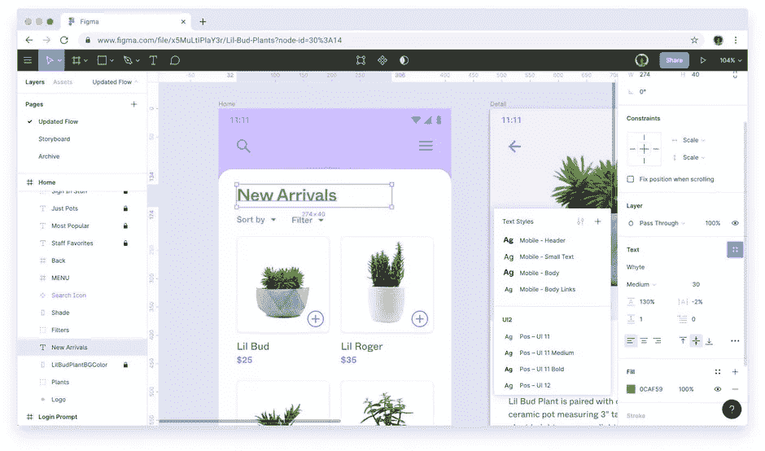

# 使用 Figma 进行用户界面设计-教程

> 原文：<https://www.freecodecamp.org/news/ui-design-with-figma-tutorial/>

Figma 是一个矢量图形编辑器和原型工具，常用于 UI 设计。

我们刚刚发布了一个 10 小时的 Figma 课程，将教你如何使用该工具进行 UI 设计。

约瑟夫·布兰登开发了这个课程。约瑟夫是一个伟大的教练，他已经在他的 YouTube 频道上教了成千上万的人。

Figma looks like this.

以下是本综合课程中涵盖的所有部分:

*   创建 Figma 帐户
*   创建和命名 Figma 设计文件
*   在 Figma 中创建形状
*   Figma 中的选择
*   在 Figma 中编辑形状
*   Figma 中的排版介绍
*   Figma 中的设计树
*   首次设计任务
*   Figma 中的颜色
*   Figma 中的绘图工具
*   用户界面 UX 设计中的边距和填充
*   Figma 自动布局
*   Figma 中的格式化原则
*   Figma 约束和调整大小
*   Figma 网站设计
*   雅各布的设计原则
*   样式和组件介绍
*   Figma 组件变体
*   Figma 网站的布局设计和配置
*   Figma 中的布局网格
*   响应式设计导论
*   材料设计指南
*   Tailwind UI 简介
*   顺风 UI 设计项目
*   响应式登录页面设计项目
*   设计移动应用
*   Figma 中的图像
*   布尔组
*   Figma 代币
*   Figma 中的动画和 Figmotion
*   移动设计项目

观看下面的完整课程或在 freeCodeCamp.org YouTube 频道观看[(10 小时观看)。](https://youtu.be/jwCmIBJ8Jtc)

[https://www.youtube.com/embed/jwCmIBJ8Jtc?feature=oembed](https://www.youtube.com/embed/jwCmIBJ8Jtc?feature=oembed)