# UI/UX 设计指南:什么是 UI 设计师，他们和 UX 设计师有什么不同？

> 原文：<https://www.freecodecamp.org/news/ui-ux-design-guide/>

你有没有注意到现在用户界面和用户体验设计被认为是不同的话题？

你不是唯一一个。

我们生活在一个美丽的设计时代，新的技术和趋势层出不穷。随着越来越多的开发人员参与 UI/UX 设计，前端开发也获得了越来越大的发展势头。

虽然 UI 和 UX 设计经常被放在同一个基座上，但它们有着本质的不同，初学者应该了解两者之间的区别。

了解到这一点后，我和我的团队从[创意 Tim](https://creative-tim.com) 做了大量的研究，并就这两个巨大领域中最重要的部分创建了一个全面的指南:

1.  [**UI 设计——事情看起来是怎样的**](#uidesignhowthingslook)
2.  [**UX 设计——工作原理**](#uxdesignhowthingswork)
3.  [**UI 和 UX 设计的关键区别是什么？**](#whatarethekeydifferencesbetweenuianduxdesign)
4.  [**UI/UX 设计师是做什么的？**](#whatdouiuxdesignersdo)
5.  UI/UX 组合角色的缺点是什么？
6.  [**UI/UX 设计师如何合作？**](#howdouiuxdesignersworktogether)
7.  [**UI 和 UX 设计师的工资是多少？**](#whatarethesalariesofuianduxdesigners)
8.  [**如何成为 UI 或 UX 专家？应该上什么样的设计课程/教程？**](#howdoyoubecomeauioruxexpertwhatkindofdesigncoursestutorialsshouldyoutake)
9.  [**应该专攻哪个？UI 还是 UX 设计？**](#whichshouldyouspecializeinuioruxdesign)

## **用户界面设计——事物的外观**

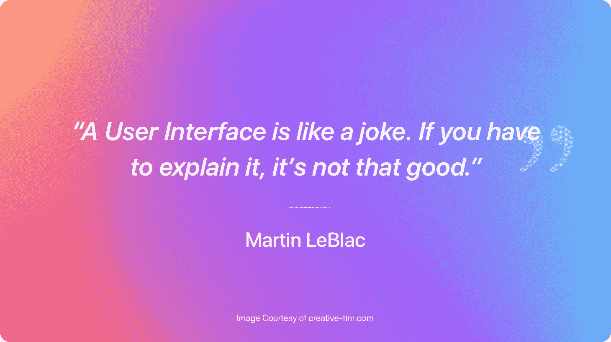

UI(用户界面)处理应用程序的图形布局，包括按钮、屏幕布局、动画、过渡、微交互等等。简而言之，UI 就是事物的外观。

UI 设计包括以下格式:

*   图形用户界面(GUI):GUI 设计涉及用户如何与系统的视觉和数字控制面板进行交互。计算机的桌面就是图形用户界面的一个例子。
*   **[【VUI】](https://en.wikipedia.org/wiki/Voice_user_interface)**:VUI 设计处理的是用户与使用语音的系统之间的交互。像三星移动设备的 Bixby 和 iPhones 的 Siri 这样的智能助手就是 vui 的例子。
*   **[基于手势的界面](https://en.wikipedia.org/wiki/Gesture_recognition)** :这主要用于虚拟现实(VR)和其他基于手势的设计场景，处理用户在 3D 空间内的参与。以下是我们在 VR 中对[软 UI 管理仪表板](https://www.creative-tim.com/product/soft-ui-dashboard-pro)的完整编码模拟示例:

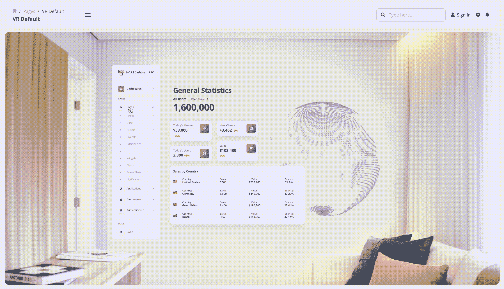

[Source](https://demos.creative-tim.com/soft-ui-dashboard-pro/pages/dashboards/default.html)

对于好的 UI 设计，您应该考虑以下特征:

*   设计应该专注于帮助用户以最小的努力快速完成任务。完成任务应该是一种无缝的体验。
*   它应该是愉快的，令人满意的，没有挫折的。
*   用户界面设计应该传达公司/组织的品牌价值。

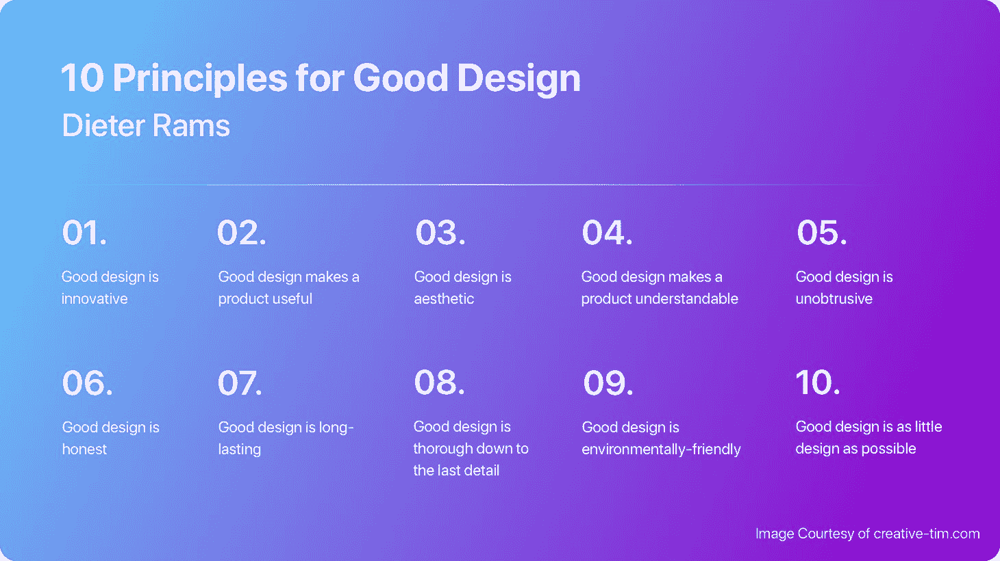

## **UX 设计——事物的运作方式**

UX(用户体验)设计处理用户如何与系统交互。逻辑导航和流畅直观的体验都属于 UX 的设计。简而言之，这种类型的设计有助于用户获得积极的体验。

要了解 UX 流程，以下是主要步骤:

*   交互设计处理用户如何通过使用系统的交互组件(页面转换、动画、按钮等等)来毫不费力地完成他们的任务。
*   **用户研究**包括进行广泛的研究，从新客户或现有客户那里收集反馈和想法，了解最终用户的需求，并根据这些参数做出设计决策。
*   **信息架构**涉及用户完成任务所需的信息和内容的组织。这需要 UX 设计师理解不同内容之间的关系，并以最容易理解的方式呈现出来。

对于良好的 UX 设计，您应该遵循以下实践:

*   产品应该易于使用，符合逻辑，不言自明。
*   产品要解决用户的问题。
*   产品应该能被广泛的人群接触和使用。
*   产品应该为用户创造积极的体验，让他们能够顺利完成任务。

### **认知偏差**

伟大的 UX 设计师必须意识到我们所有人的认知偏差，因为这可能会影响用户和界面之间的交互。许多营销策略都基于这些偏见:

[Source](https://upload.wikimedia.org/wikipedia/commons/6/65/Cognitive_bias_codex_en.svg)

## UI 和 UX 设计的主要区别是什么？

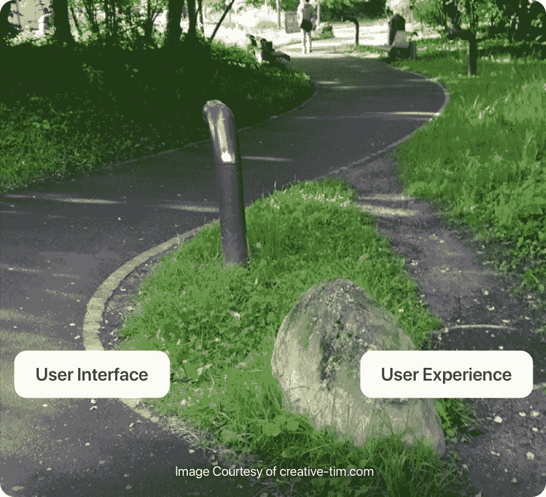

用户界面和 UX 设计经常被用作可互换的术语。

虽然最终产品需要来自两种设计方法的大量输入，但是设计 UI 和 UX 的过程是非常不同的。

UX 设计主要处理用户解决问题的整个过程。

另一方面，UI 设计关注的是当问题被解决时，产品的外观和感觉。

以下是用户界面和 UX 设计的主要区别:

*   **主要关注点:**UI 设计师的主要关注点是处理最终产品的质量和视觉效果，使用 hi-fi 模型作为原型。UX 设计师更关注最终产品的目的和功能，更关心逻辑。此外，UI 设计师处理产品设计的技术细节，而 UX 设计师更关注项目管理和项目分析。
*   色彩的运用: UI 设计师用全彩色设计原型，而 UX 设计师则用黑色、白色或灰色。
*   **工具:** UI 设计师使用[草图](https://www.sketch.com/)、 [Flinto](https://www.flinto.com/) 、[原理](https://principleformac.com/)、[视觉](https://www.invisionapp.com/)等工具进行协同形象设计。UX 设计师使用基于线框的原型工具，如 [Mockplus](https://www.mockplus.com/) 。
*   艺术元素:用户界面设计者必须在他们的设计中加入艺术元素，因为这关系到最终用户的所见所闻所感。UX 设计有更多的社会成分，因为它需要了解用户想要在最终产品中体验什么。

下面是同一个最终产品的 UX 和用户界面原型的例子:

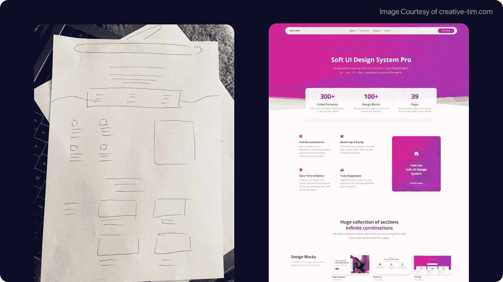

[Source](https://www.creative-tim.com/product/soft-ui-design-system-pro)

## UI/UX 设计师是做什么的？

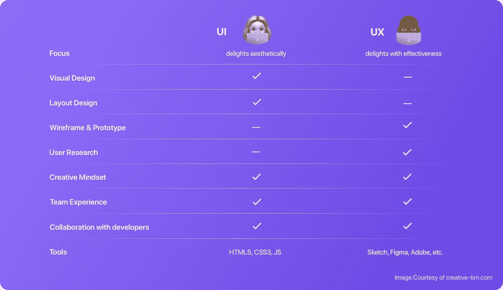

如果你想成为一名伟大的 UI 设计师，你应该培养以下技能/职责:

*   在敏捷团队中工作。
*   创建用户流、线框、原型等等。
*   可视化工具如 [InVision](https://www.invisionapp.com/) 、 [Sketch](https://www.sketch.com/) 、 [Photoshop](https://www.photoshop.com/) 、 [Figma](https://www.figma.com/) 等。关于选择哪种工具的更多细节，请查看我们在本文中的研究:[InVision vs Sketch vs Figma vs Photoshop](https://www.freecodecamp.org/news/adobe-xd-vs-sketch-vs-figma-vs-invision/)
*   前端编程语言，如 HTML5、CSS3 和 JavaScript。
*   执行从开始到最终交付的视觉设计阶段。
*   与 UX 设计师、开发人员、质量保证和产品经理合作，为产品设计和实现创新的视觉理念。
*   通过设计向用户传达公司的品牌和风格。
*   利用客户分析和研究创造产品的外观和感觉。
*   管理产品的响应性、交互性和动画，并使其适应所有设备的屏幕尺寸。

如果你想成为一名伟大的 **UX 设计师**，你应该培养这些技能/责任:

*   在敏捷团队中工作。
*   对 UX 流程有深刻的理解。
*   原型制作工具如 [Adobe Creative Suite](https://www.adobe.com/creativecloud.html) 、 [Sketch](https://www.sketch.com/) 、 [InVision](https://www.invisionapp.com/) 、 [Axure](https://www.axure.com/) 等。
*   解决问题的能力和对一切与设计、人、生活和技术相关的事物的好奇心。
*   利益相关者管理和客户互动。
*   创建流程图、线框、网站地图、原型和 UX 交付物。
*   与开发人员、产品经理、UI 设计人员、外部利益相关者和 QA 工程师密切合作，根据市场动态、用户反馈和技术限制迭代设计。
*   分析客户需求、竞争对手、产品结构和设计产品体验的策略。
*   为移动、web、桌面和其他硬件终端创建无缝设计和交互策略。

## 用户界面/UX 组合角色的缺点是什么？

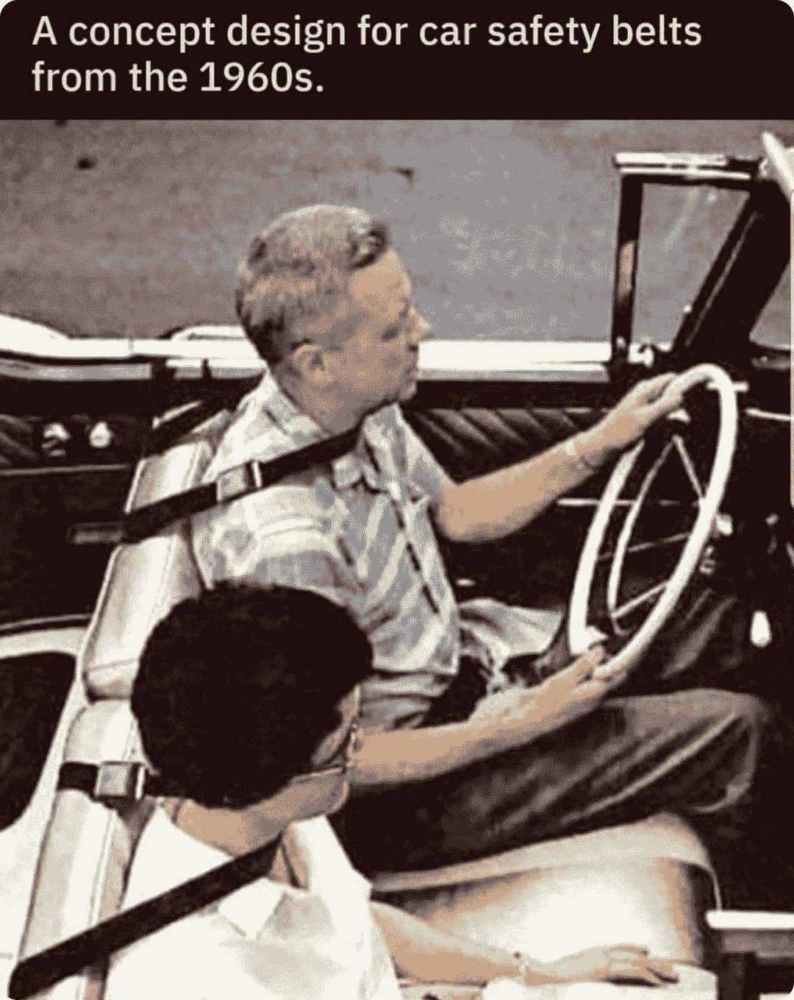

拥有一个 UI/UX 的组合角色就像同时戴着两顶不同的帽子。

虽然大多数组织宣传 UI/UX 角色是一个单一的组合角色，但是 UI 和 UX 设计师有不同的技能组合。他们的主要关注点、思维方式和产品原型制作方法大相径庭。

一个组合的 UI/UX 角色需要不断地在概念化和可视化之间切换，这通常是困难的，并且会减少每个规程所需要的注意力。

## UI/UX 设计师如何合作？

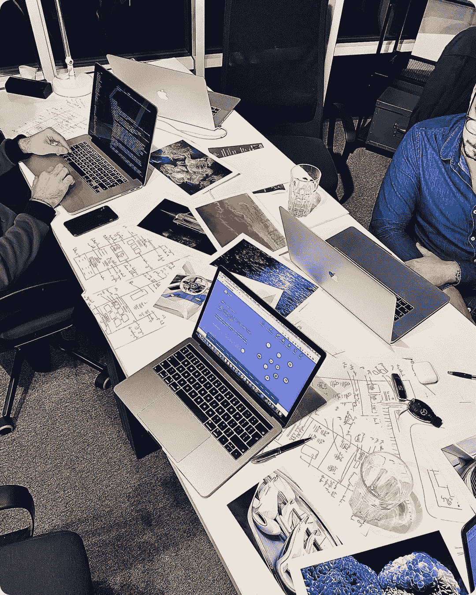

虽然 UI 设计和 UX 设计需要非常不同的技能，但它们都是重要的组成部分，必须协调工作才能给最终用户最好的体验。

一个用户界面设计可能很漂亮，但是如果没有一个好的 UX 设计，导航可能会很笨拙和混乱。另一方面，一个产品的用户体验可以是完美的，但是如果没有一个好看的用户界面就什么都不是了。

任何前端开发和设计过程都应该从理解用户的需求开始。UX 和 UI 设计师应该与其他开发人员、经理和产品负责人合作，了解最终产品应该能够做什么，感觉应该如何，看起来应该是什么样子。

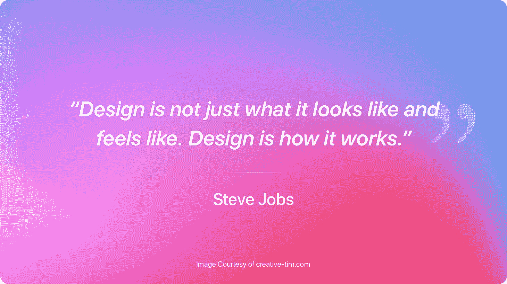

UX 设计师通常参与产品设计的早期阶段，因为他们需要设计用户需要解决问题时发生的活动流程。这包括分析和项目管理活动。

随后，UI 设计人员基于 UX 设计人员提供的模型来构建美学和交互。

有鉴于此，可以肯定地说，UX 和 UI 是携手并进的。虽然也有同一个人两者都做的例子，但是一个设计原则不能离开另一个而存在。

## UI 和 UX 设计师的工资是多少？

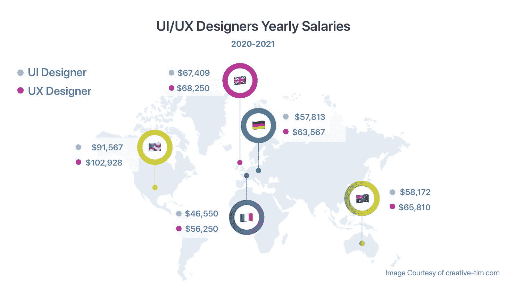

UI 设计师全球平均工资 50k，美国平均工资 91k，德国 57k，法国 47k，英国 67k。

UX 设计师的收入略高，全球平均水平为 5.2 万英镑。美国 UX 设计师的平均收入为 10.2 万英镑，德国为 5.3 万英镑，法国为 4.9 万英镑，英国为 6.8 万英镑。(来源:[玻璃门](http://www.glassdoor.com/))

注意:上面列出的所有薪水都是该地区的平均值，单位是美元。

## 如何成为 UI 或 UX 专家？应该上什么样的设计课程/教程？

成为 UI 或 UX 专家始于对 UI/UX 设计真正感兴趣。一旦你知道你感兴趣，你应该寻找资源，参加设计课程，帮助你为就业市场做好准备。

像 [UI 设计项目](https://careerfoundry.com/en/courses/become-a-ui-designer/)和[学习 UI 设计](https://learnui.design/)这样的在线课程可以帮助你开始成为一名 UI 设计师的旅程。

对于 UX 设计，可以在线学习，[付费课程](https://www.interaction-design.org/courses)，或者[网络大学](https://online.rmit.edu.au/course/sc-user-experience-design-dtr105)的课程。你也可以看看[最好的在线课程网站来学习 UI/UX](https://uxplanet.org/30-best-online-course-websites-to-learn-ui-ux-updated-6b104762731a) ，这样你就可以看到哪些网站提供免费课程，以及这些网站上的用户反馈。

对于 UX 设计，有许多[付费课程](https://www.interaction-design.org/courses)，来自[在线大学的课程](https://online.rmit.edu.au/course/sc-user-experience-design-dtr105)。你也可以查看一下[学习 UI/UX 设计](https://uxplanet.org/30-best-online-course-websites-to-learn-ui-ux-updated-6b104762731a)的最佳在线课程列表，这样你就可以看到哪些网站提供免费课程，并阅读用户反馈。

假设你已经具备了成为一名 UI/UX 设计师所需要的一些技能。在这种情况下，你也可以看看像 UX 设计的[行为模式](https://uxdesign.cc/10-essential-cognitive-behavior-patterns-for-ux-design-7f0cc2e00d31)、你可以使用的 [UX 方法](https://uxdesign.cc/65-ux-methods-and-when-to-use-them-73e70c742d12)、来自世界最佳设计师的[灵感平面设计](https://dribbble.com/tags/article)以及设计师应该阅读的[学术研究论文](https://uxdesign.cc/5-academic-research-papers-every-designer-should-read-f24b170db295)这样的文章。

### 你应该专攻哪一个？UI 还是 UX 设计？

专攻 UI 或 UX 设计是个人偏好，取决于你的特殊技能。

然而，有大量的公司宣传 UI/UX 设计师的组合角色。

虽然这两者的角色和职责各不相同，但 UI/UX 设计仍然有一个利基市场，因此对这两者都有足够的了解是一个好主意。

虽然很难实现，但从薪酬和在公司中的重要性来看，UI/UX 结合的职业生涯可以证明是富有成效的。

然而，一个组合的 UI/UX 设计师角色很难执行，因为它需要不断地从一种心态转换到另一种心态。所以专注于一个角色通常是更好的选择。

例如，如果你很有艺术感，知道有效的颜色组合，并且了解产品如何在视觉上得到增强，那么 UI 设计是一个很好的选择。

另一方面，如果你擅长管理用户和利益相关者的需求，拥有优秀的分析技能，并且了解如何改善用户体验，UX 设计将更适合你。

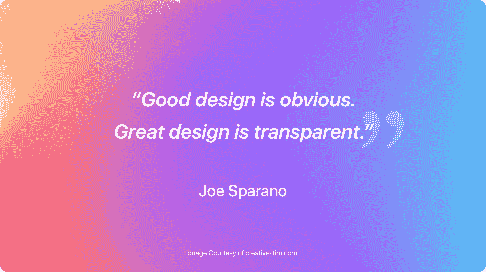

## **最终想法**

用户界面和用户体验设计都需要理解用户的需求。

一旦你有了这种理解，前端开发和设计就不一定是一件复杂的事情——有许多现成的组件、工具和套件可以使设计更容易、更有效。

Creative Tim 为你提供大量免费和优质的、完全编码的 UI 工具，如模板、仪表盘和设计系统。

如果您想以可扩展的方式使用手绘草图组件构建您的插图，只需看看创意 Tim 的产品: [IRA Design](https://iradesign.io/) 。

让我们在推特上保持联系。