# 如何使用 Hyperledger 在区块链上创建应用程序

> 原文：<https://www.freecodecamp.org/news/ultimate-end-to-end-tutorial-to-create-an-application-on-blockchain-using-hyperledger-3a83a80cbc71/>

作者:尼哈里卡·辛格

# 如何使用 Hyperledger 在区块链上创建应用程序


Photo by [Sasha](https://unsplash.com/photos/RRUl-jSXaYk?utm_source=unsplash&utm_medium=referral&utm_content=creditCopyText) on [Unsplash](https://unsplash.com/search/photos/banking?utm_source=unsplash&utm_medium=referral&utm_content=creditCopyText)

我们将使用 Hyperledger Composer 建立一个数字银行。它会有客户和账户。最后，你可以在区块链上转账并记录所有交易。我们将为此公开一个 RESTful API，这样即使一个不知道区块链是什么的人也可以围绕它创建一个漂亮的用户界面(UI)。我们还将在 Angular 中创建这个应用程序的 UI。

我非常兴奋能和你分享这个循序渐进的指南。所以让我们马上开始吧！


Source: [https://giphy.com/explore/excited](https://giphy.com/explore/excited)

当我第一次编写代码时，我遇到了错误。很多很多。但我认为那很好，因为它让我学到了很多东西。错误是必不可少的。我觉得打开和关闭它会让事情变得更好。它几乎让我失去理智，但它是每个黑客生活中不可或缺的一部分。

在开始之前，您需要确保您正在使用的机器配备了所需的配置。您可能需要下载某些先决条件，并设置一个基本的开发环境。以下是相关链接。在开始开发应用程序之前，遵循这些步骤，否则你肯定会遇到愚蠢的错误。

首先安装 [Hyperledger composer](https://hyperledger.github.io/composer/installing/installing-prereqs.html) 。然后安装[开发环境](https://hyperledger.github.io/composer/installing/development-tools.html)。

在安装环境时，没有必要启动 Playground。

确保 docker 正在运行，并且当您运行**时。/startFabric.sh** 这需要几分钟时间。所以要有耐心。

现在你的机器都设置好了，我们可以开始编码了！


Source: [http://www.forthebrokenhearted.net/170254395/4208888/posting/](http://www.forthebrokenhearted.net/170254395/4208888/posting/)

#### 第一步:勾勒出你的商业网络

我们的业务网络定义(BND)由数据模型、事务逻辑和访问控制规则组成。数据模型和访问控制规则是用特定于领域的语言编写的(很容易掌握)。交易逻辑将用 JavaScript 编码。

要创建 BND，我们需要在磁盘上创建一个合适的项目结构。我们将使用约曼创建一个基本的商业网络。要创建项目结构，请打开您的终端并运行以下命令:

```
$ yo hyperledger-composer
```

这将拍出如下一系列问题。您需要使用箭头键来浏览答案。

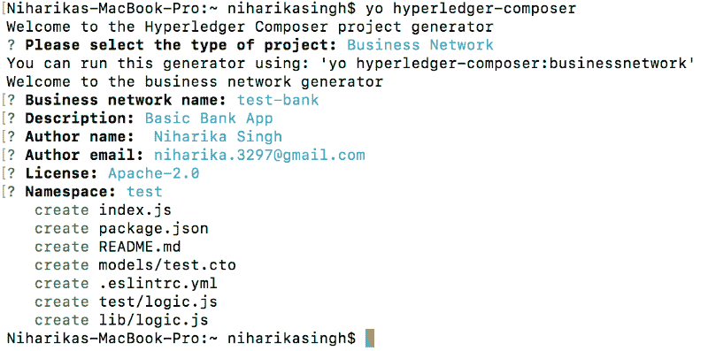

在您喜欢的文本编辑器中打开此项目。我在用视觉代码。这是文件结构的样子:

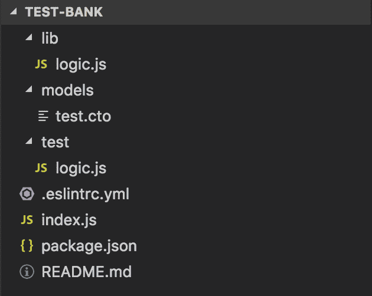

**删除 test/logic.js 的内容，我们暂时不会用。**

#### 步骤 2.1:对我们的业务网络进行编码

首先，我们将定义**模型/test.cto** 。它包含业务网络中所有资产、参与者和事务的类定义。这个文件是用 [Hyperledger Composer 建模语言](https://hyperledger.github.io/composer/reference/cto_language.html)编写的。

```
namespace test
```

```
asset Account identified by accountId {o String accountId--> Customer ownero Double balance}
```

```
participant Customer identified by customerId {o String customerIdo String firstNameo String lastName}
```

```
transaction AccountTransfer {--> Account from--> Account too Double amount}
```

**账户**是用**账户 Id 唯一标识的资产。**每个账户都与**客户**关联，该客户是账户的**所有者**。**账户**有一个属性 **balance** 表示账户在任一时刻有多少钱。

**客户**是由**客户 Id 唯一标识的参与者。**每个**客户**都有**名**和**姓**。

**账户转账**是从一个**账户**可以发生**到**和**的交易。并且要转移多少钱存储在**金额中。****

#### **步骤 2.2:业务网络编码(lib/logic.js)**

在这个文件中，我们将在 JavaScript 中添加事务逻辑。

```
/*** Sample transaction* @param {test.AccountTransfer} accountTransfer* @transaction*/
```

```
function accountTransfer(accountTransfer) {if (accountTransfer.from.balance < accountTransfer.to.balance) {throw new Error ("Insufficient funds");}
```

```
accountTransfer.from.balance -= accountTransfer.amount;accountTransfer.to.balance += accountTransfer.amount;
```

```
return getAssetRegistry('test.Account').then (function (assetRegistry) {return assetRegistry.update(accountTransfer.from);}).then (function () {return getAssetRegistry('test.Account');}).then(function (assetRegistry) {return assetRegistry.update(accountTransfer.to);});
```

```
}
```

**@param {test。account transfer } account transfer**是我们放在文件顶部的装饰器，用于将事务与我们的 JavaScript 函数链接起来。然后我们验证资金所在的账户是否有足够的资金。否则，将会引发错误。然后我们对账户余额进行基本的加减运算。

此时，最重要的一步是在区块链上更新这个。为此，我们调用我们的资产 Account 的 **getAssetRegistry** API。然后我们**为发放资金的账户和接收资金的账户更新**检索到的**资产注册表**。

#### 第三步:生成业务网络档案 _nba)

既然已经定义了业务网络，那么必须将它打包到一个可部署的业务网络档案(`.bna`)文件中。

步骤 3.1:在您的终端中导航到题库应用程序。

步骤 3.2:运行以下命令:

```
$ composer archive create -t dir -n .
```

这将在**测试库**文件夹中创建一个. bna 文件。

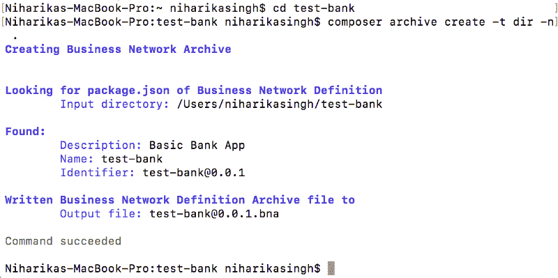

#### 步骤 4:在结构上部署业务网络存档文件

**步骤 4.1:安装 composer 运行时**

```
$ composer runtime install --card PeerAdmin@hlfv1 --businessNetworkName test-bank
```

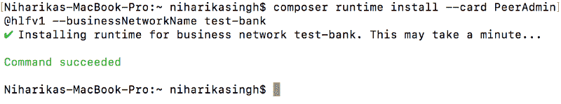

**步骤 4.2:部署业务网络**

```
$ composer network start --card PeerAdmin@hlfv1 --networkAdmin admin --networkAdminEnrollSecret adminpw --archiveFile test-bank@0.0.1.bna --file networkadmin.card
```

(确保您在试题库文件夹中)。

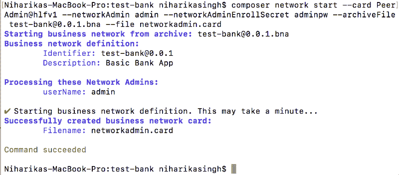

**步骤 4.3:导入网络管理员身份作为可用的业务网卡**

```
$ composer card import --file networkadmin.card
```

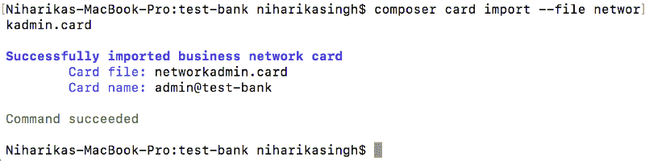

**步骤 4.4:** 为了检查业务网络是否已经成功部署，**运行以下命令来 ping 网络:**

```
$ composer network ping --card admin@test-bank
```

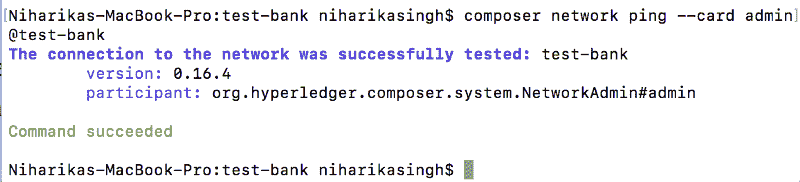

#### 步骤 5:公开 RESTful API

要从命令行创建 RESTful API，请运行以下命令:

```
$ composer-rest-server
```

这样会拍出很多问题。

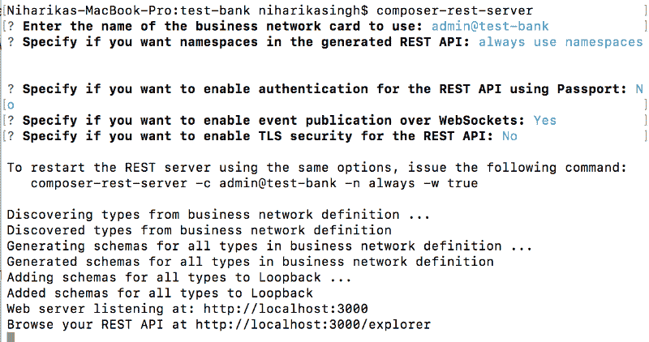

现在把你的浏览器指向[http://localhost:3000/explorer。](http://localhost:3000/explorer.)

你会看到你美丽的区块链 API。

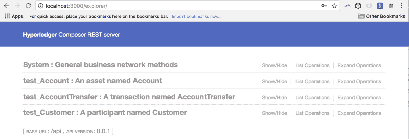

现在让我们添加两个客户。

首先，让我们添加一个名为 Niharika Singh 的客户:

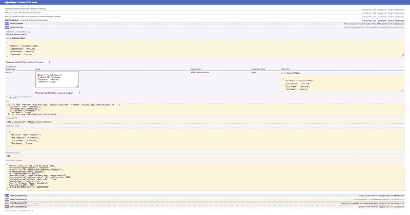

我们得到一个 200 的响应代码。

现在，我们将以类似的方式添加名为 Tvesha Singh 的客户。

要检查您是否正确添加了它们，请获取它们。


您将在响应正文中看到两个客户。

现在，让我们添加两个与这两个客户相关联的帐户。

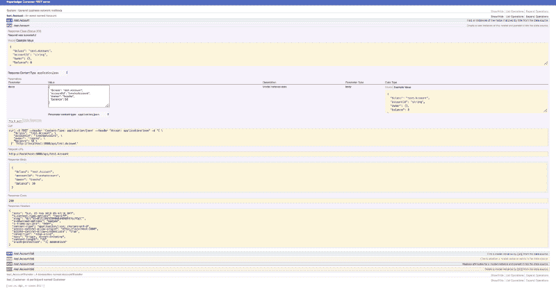

以这种方式添加帐户。现在，让他们检查您是否正确添加了他们。

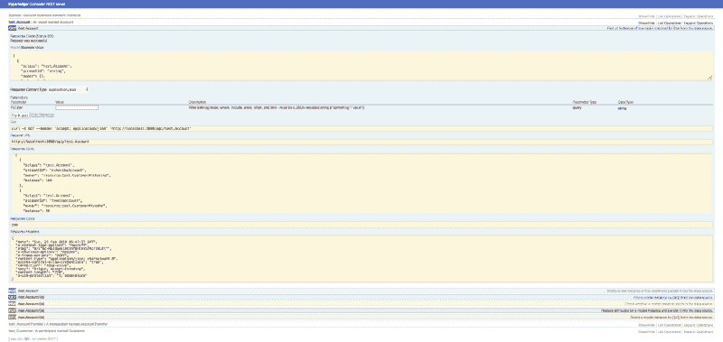

现在让我们把 75 从尼哈里卡转到特维沙。

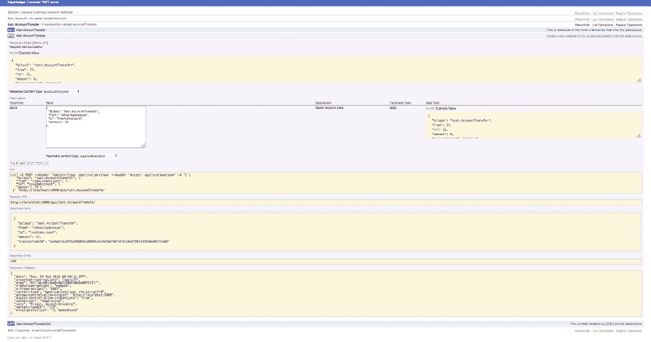

让我们通过获取帐户信息来检查余额是否被更新。

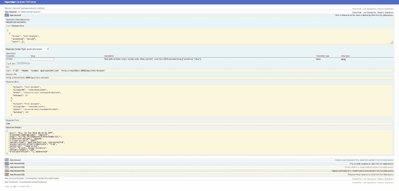

维奥拉。它工作了。尼哈里卡现在有 25 个，特维沙有 125 个。

#### 第六步:角度前端

要自动创建角形脚手架，请在 test-bank 文件夹中运行以下命令:

```
$ yo
```

这将提出多个问题。

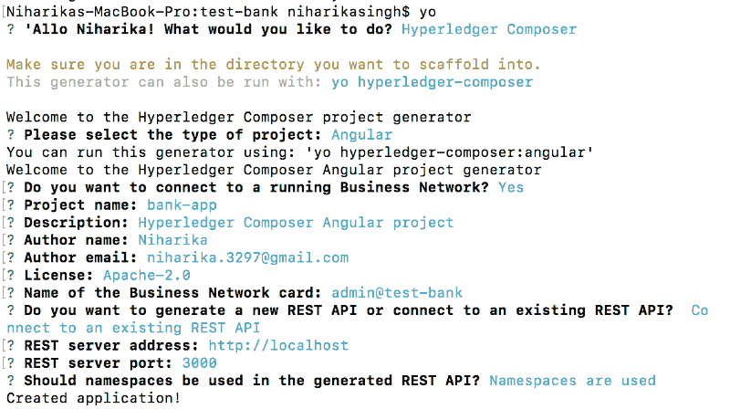

这需要几分钟的时间。

导航进入**银行应用程序。**

```
$ npm start
```

这将启动 Angular 服务器。

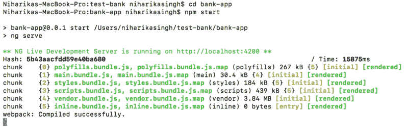

角度文件结构创建如下:

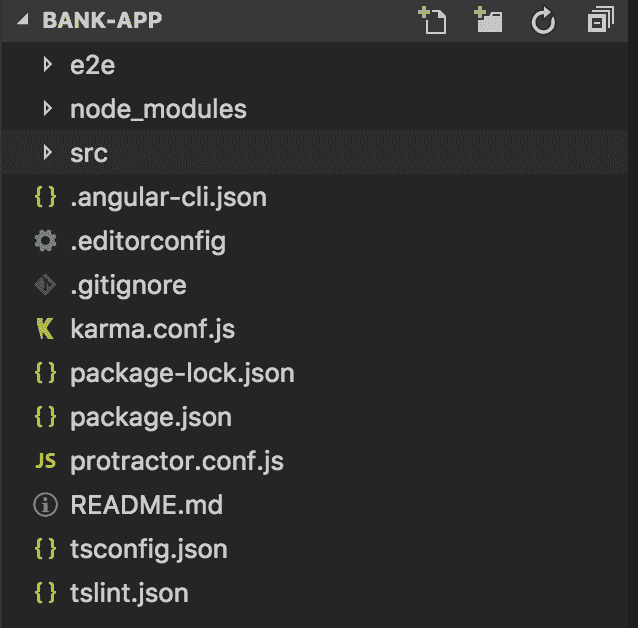

将浏览器指向 [http://localhost:4200。](http://localhost:4200.)这就是奇迹发生的地方！您会看到这个屏幕:

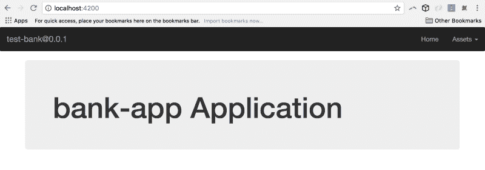

现在转到右上角的**资产**，点击**账户**。

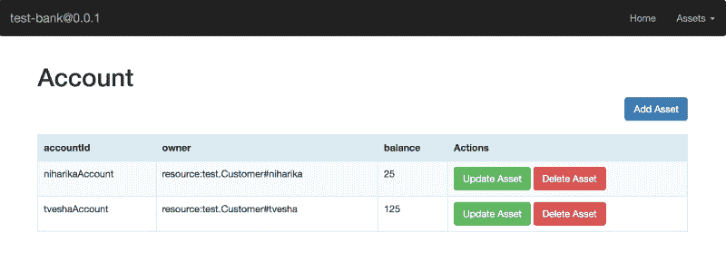

这些是我们创建的确切账户。

所以现在你可以玩这个了。

您已经准备好了前端和后端！

发生在 localhost:3000 上的所有事务都反映在 localhost:4200 上，反之亦然。这都是区块链的错。


Source: [https://giphy.com/explore/thats-how-its-done](https://giphy.com/explore/thats-how-its-done)

最近我写了一篇关于区块链用例的文章。我列出并解释了大约 20 个想法。它们可以在这里找到:

[**印度怎样才能区块链化？**](https://medium.com/quillhash/how-can-india-get-blockchained-7f1c7ada98e8)
[*【区块链时代刚刚开始，就像任何其他技术一样，区块链也会遇到一些障碍……*medium.com](https://medium.com/quillhash/how-can-india-get-blockchained-7f1c7ada98e8)

> ***如果你有一个商业想法，想用技术和建筑细节来实现它，请随时联系我，电话:***