# 如何成为一名优秀的开源项目所有者——终极指南

> 原文：<https://www.freecodecamp.org/news/ultimate-owners-guide-to-open-source/>

有没有想过拥有自己的开源项目？我打赌你有——你正在读这篇文章。

也许你现在正在思考这个问题。也许你来这里是为了了解将要发生什么，你将要面对什么样的挑战，以及如何应对这些挑战。嗯，你来对地方了。

下面的指南是基于我在**拥有**一个开源项目的个人经历。我指的是拥有——而不仅仅是贡献——一个开源项目。这有很大的不同，我们将会知道为什么。

### 所以让我们开始吧...开源的最终所有者指南

## 目录

*   [简介](#first-a-bit-about-me)
*   [什么是开源](#so-what-is-open-source)
*   [为什么要开始一个开源项目](#why-start-an-open-source-project)
*   [如何开始一个开源项目](#how-to-start-an-open-source-project)
*   [如何写文档](#how-to-write-documentation-for-your-open-source-project)
*   [如何宣传你的开源项目](#how-to-publicize-your-open-source-project)
*   [如何管理问题和拉式请求](#how-to-manage-issues-and-pull-requests-in-your-open-source-project)
*   [如何实现流程自动化](#how-to-automate-your-process)
*   [版本管理](#version-management)

## 首先，简单介绍一下我

我叫 Jeb，几年来我一直在维护一些开源项目。最受欢迎也是我学到最多的是 [@angular-builders](https://github.com/just-jeb/angular-builders) 。在写这篇文章的时候，它在 Github 上有大约 900 颗星，每月大约有 100 万次下载。

是的，它甚至没有接近 Angular 或 React 这样的大型项目——但我觉得我有足够的经验与你分享，以帮助你避免我犯的同样的错误。更重要的是，帮助你理解拥有一个开源项目的成本。

## 那么什么是开源呢？

让我们首先建立一种通用语言，并在关键术语和定义上达成一致。
什么是开源？下面是一个非常通用的[定义](https://en.wikipedia.org/wiki/Open_source_(disambiguation))来自一个众所周知的 **开源** 百科全书(又名维基百科):

> [开源](https://en.wikipedia.org/wiki/Open_source)是允许复制或修改对公众开放的信息的概念。

或者，就[软件开发](https://en.wikipedia.org/wiki/Open-source_model)模型而言:

> 开源模式是一种去中心化的软件开发模式，鼓励开放合作的 T2 模式。
> 
> [开源软件开发](https://en.wikipedia.org/wiki/Open-source_software_development)的一个主要原则是[对等生产](https://en.wikipedia.org/wiki/Peer_production)，产品如源代码、[蓝图](https://en.wikipedia.org/wiki/Blueprint)和文档免费提供给公众。

在维基百科的例子中，我们有编辑文章的人(贡献者)和批准编辑的人(更有经验的成员，版主)。

如果我们把它投射到软件世界，编辑们将会组成一个开源项目的核心团队，贡献者也将会是贡献者。

维基百科是一个巨大的开源项目，但这一切都是从一些小事开始的。维基百科诞生于 Nupedia，它的创建是有原因的:

> 尽管有感兴趣的编辑的邮件列表，还有全职主编[拉里·桑格](https://en.wikipedia.org/wiki/Larry_Sanger)，一个被威尔斯雇佣的研究生[哲学](https://en.wikipedia.org/wiki/Philosophy)，Nupedia 的内容写作极其缓慢，第一年只写了 12 篇文章。

因此，这是第一个问题发挥作用的地方...

### 你为什么要为开源而烦恼呢？

你可以想象，向更广泛的受众开放一些东西的一个主要原因是 **获得合作者。**

> 我们在一起很强大。
> (扎里亚，2016 年)

在撰写本文时，维基百科[拥有](https://en.wikipedia.org/wiki/Wikipedia:Wikipedians) 37，899，499 个注册账户，其中 134，022 个正在积极编辑。

随便想想…****134022 活跃合作者。****哦，而且它[有 6M 内容页面](https://en.wikipedia.org/wiki/Special:Statistics)！

如果 Nupedia 没有转向开源模式，这些数字还会一样吗？我非常怀疑。

谈到软件，没有什么不同。为了解决某个问题，你必须写代码。为了解决一个大问题，你必须写很多代码。为了正确地解决它，你必须编写高质量的代码，做出高质量的设计，等等。

这一切都需要资源 **，** 说实话，你可能没有。毕竟，你要付房租。

## 为什么要开始一个开源项目？

虽然获得合作者是一个合理的激励，但几乎没有人仅仅因为这个原因就开始一个新的开源项目。你的理由可能不同，但让我们谈谈最受欢迎的理由。

### #1 你想解决一个没有免费解决方案的问题

你面临一个问题，但是外面没有任何东西可以为你解决它(或者有一些东西，但是要花钱)，所以你必须自己解决它。你设法解决了它，你真的对你的工作感到兴奋，你认为其他人可以从中受益。所以你开源了这个项目。

### #2 你想成为创始人

你希望被认为是一个开源项目的创始人，你希望在你的简历中有这样一句话。你有自我(毕竟，我们都是人)。如果这是你选择*的主要原因，那么我向你保证——读完这个指南后，你会重新考虑的。很可能不值得。*

### *#3 你比别人更想解决问题*

*您面临一个问题，有一个开源项目实际上为您解决了这个问题，但是它不够好(在您看来)或者没有您需要的确切功能。*

*如果你仅仅因为这个原因创建了一个新的开源项目，那么*你很可能处于第二位(自我)。让自己成为一名贡献者，并为现有的项目创建一个 PR。**

**如果现有的项目有一个不同的愿景，制作一个 PR 不是一个选项，你应该考虑或者通过在你的项目中重用它的功能来扩展它，或者[分叉](https://help.github.com/en/github/getting-started-with-github/fork-a-repo)它。以后可能会省去你很多头疼的事。**

### **#4 你想通过创建一个开源项目来解决问题**

**你面临一个问题，但没有任何东西能帮你解决。所以你认为从一开始就把解决方案作为开源是一个非常好的主意。**

**在我看来，不是。**

**解决问题，确保它对你有用，然后去做第一件事。**

**这是我最常发现的四种激励人们创建一个新的开源项目的方法。但是在本指南中，我们将主要关注场景#1。**

**原因很简单——我相信，如果你开始一个开源项目的*的主要原因不是渴望分享和贡献你的成果，那么这个理由就站不住脚了。***

**很长一段时间以来，你帮助别人的事实可能是你得到的唯一回报。如果这不是你想要的那种满足感，那么也许你应该就此打住，不要浪费时间。**

**还有另一个非常流行的场景值得一提:有些公司向社区开放他们的部分代码。这样的例子有 Angular(由谷歌维护)、React(由脸书维护)、VSCode(由微软维护)等等。**

**他们的理由可能各不相同，但赢得合作者和为社区做贡献肯定是其中之一。**

**虽然我不能否认这种实践的重要性，但是这种场景与其他场景有很大的不同，因为维护这种项目 ****的员工会因为他们的工作得到**** 的报酬。**

**如果你在一家考虑创建开源项目的公司工作，这里的大部分内容对你来说仍然是相关的，但是动机可能会有所不同。**

### **那么你应该创建一个开源项目吗？**

**如果我必须用一句话来总结这一部分，那就是:**

> **确保你的意图符合你的期望。**

**相信你想拥有一个开源项目并不等同于实际拥有一个，正如你将在接下来的章节中看到的。**

****

## **如何开始一个开源项目**

**所以你处于场景# 1——你有一个特定问题的解决方案，你渴望与世界分享它。我们再强调一遍:**

1.  **这与你的自负无关**
2.  **你不希望从中受益**
3.  **你真的想帮助别人解决同样的问题**

**如果你对所有这些问题的回答都是肯定的，那么这里有一个快速的清单，以确保你做的事情是正确的:**

1.  **确保开源是正确的格式。如果你想与世界分享一些小事情，那么一篇博客帖子可能就足够了。**
2.  **仔细检查是否已经不存在类似的项目。也许你的解决方案是一个已建立的开源项目的完美公关。**

### **为即将到来的事情做好准备**

**正如我提到的，拥有一个开源项目伴随着许多挑战。**

**一个突出的问题是它需要你大量的时间。你为项目所做的一切都需要时间，无论是编写代码、管理问题、更新依赖关系、与人交谈、回答问题等等。**

**你在开源上投入的每一分钟都是你本可以拥有但却没有投入到你的家庭、你的爱好、你的健康等等的一分钟。**

**你唯一能做得更好的就是开始授权。当(或者应该说“如果”)你有了足够多的合作者，你就可以把一部分职责外包给你信任的人。**

### **代码分离**

**所以我们开始吧，你有一个解决你的具体问题的方法，你认为其他人可以从中受益。它仍然集成在您的代码库中，您可能不想让整个代码库开源(除非您想)。**

**首先，您必须将这些代码与您的代码库的其余部分分离开来。**

**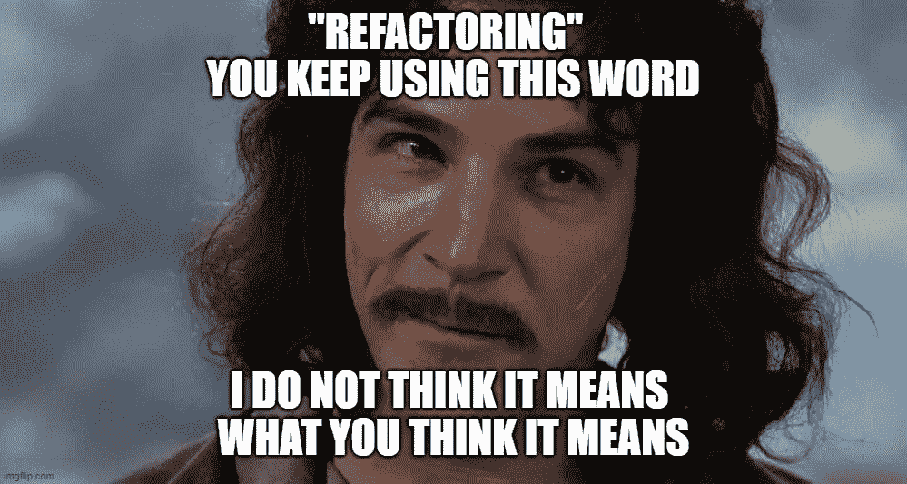**

**…这最终意味着所有将要打开的代码都将驻留在一个单独的目录中。**

### **使代码通用化**

**确保新目录中的代码是通用的，并且没有绑定到您的特定问题。如果需要，创建一个抽象层。**

**举个例子，我带着一个非常具体的需求(来自我的另一个开源项目[)开始了](https://github.com/just-jeb/electron-angular-native) [angular-builders](https://github.com/just-jeb/angular-builders) ，为 Angular build 添加一个本地模块的定制加载器。**

**我本可以创建 **本地模块构建器** 来实现这个目的。然而，我意识到，以相对较低的成本，我可以创建一个更通用的解决方案来解决类似的(但不是相同的！)问题。
T5[custom-web pack](https://github.com/just-jeb/angular-builders/tree/master/packages/custom-webpack)builder 就是这样诞生的。**

### *保持简单*

*通用是很好的，但是注意不要对此过于兴奋。*

*过早优化和过泛化是软件工程中两个众所周知的问题。你应该找到这个甜蜜点，在这里你的解决方案解决了你的问题之外的问题，但不是世界上所有的问题。*

*如果你建立一个量表，其中你特定问题的解决方案是 1，所有世界问题的解决方案是 100，那么你应该从 2 开始。*

*你的通用代码应该比你的特定代码能解决更多的问题。*

### *[吃自己的狗粮](https://en.wikipedia.org/wiki/Eating_your_own_dog_food)*

*在你的代码库中，每一步都要使用这种通用代码——这样做可以确保去掉不必要的部分，只留下需要的部分。它还可以确保您将要打开的代码正常工作。*

*记住，你是你的开源项目的第一个用户。*

### *不要被起诉*

*如果您从公司代码库中提取代码，请咨询您的上级，如果需要，还可以咨询法律部门。确保他们支持你的计划，并且你要打开的代码不受你公司知识产权的约束。*

*这也将帮助你决定哪个[开源许可](https://opensource.org/licenses)更适合你的项目。*

*当一切都工作正常，代码被分离出来，足够通用，并且你获得了所有的批准(如果需要的话)，那么是时候向世界开放它了。*

**

*一旦你的开源代码被分离和一般化，是时候把它从你的代码库中完全分离出来了。*

### *公开你的代码*

*首先，你必须开放你的项目的源代码(归根结底，这就是为什么它是一个开源项目！).*

*在线托管源代码有[个不同的选项](https://stackify.com/source-code-repository-hosts/)，但我们将使用默认选项——GitHub。*

1.  *[在 GitHub 上创建新的回购协议](https://help.github.com/en/github/getting-started-with-github/create-a-repo)*
2.  *克隆存储库*
3.  *从您之前创建的目录中移动源代码(暂时不要删除目录)。*
4.  *提交和推送——瞧，它现在是一个开源项目。*

***或者是？***

### *创建一个包*

*您的项目是公开可用的，但是没有人在使用它(包括您，因为您在更大的代码库中使用了该代码的副本)。也没有人意识到它的存在。*

*此外，你的项目在网上公开可用的唯一格式是 **源代码*。使用它的唯一方式是将代码复制粘贴到代码库中。不是很方便的方式吧？**

*为了正确分发您的项目，您必须:*

1.  *从源代码中创建一个包*
2.  *让这个包在一个公共包注册中心可用(取决于您的生态系统，例如，对于 Java，它可能是 [Maven Central Repository](https://search.maven.org/) ，对于 JavaScript，它可能是 [Npm 包注册中心](https://www.npmjs.com/)等等)*

*这是当你添加一个构建链到你的新的闪亮的仓库，定义你的项目的名字，等等。*

*我不打算分解整个过程，因为它非常依赖于您的生态系统、工具集和您使用的语言。*

*你可能是一个全能的人，对他来说定义一个新项目，添加一个构建链并发布包是小菜一碟。如果是这样的话，那对你有好处！*

*你也可能是一个习惯于只写代码的人，但是从来没有面对过所有这些定义、配置、工件之类的东西。对你来说这可能是一个全新的世界。*

*如果你是那个人，是时候学习了。不会很快，我向你保证，但我们会到达那里。*

### *无论如何...*

*当你完成了填充你头脑中所有缺失的拼图，你已经了解了关于相关包注册表的一切，你的包实际上已经发布了， **然后是** **，只有到那时** 你才能真正认为你的项目是开源的。*

***此时你实际上可以告诉人们:“嘿，我已经有了你的问题的解决方案，只需将这个包添加到你的项目中并使用它！”***

### *执行健全性检查*

*在你的项目被广泛传播之前，确保它是有效的。*

*对您的包进行健全性检查实际上是从您的大型代码库中删除通用目录，并使用公开可用的包来代替。
**毕竟，你是你的开源项目** 的第一个用户。*

### *如何在您的代码基础上处理进一步的开发*

*当您开始在代码库中使用这个包时，开发流程很可能会改变。以前，现在开放源代码是你的代码库的一部分——你可以立即使用这些变化。*

*但是现在它就像你的代码中使用的任何第三方包一样是一个外部包。*

*因此，当您在全新的开源项目中开发新特性时，您必须首先发布它，以便能够在更大的代码库中使用它。但是，如果你不确定它是否有效，你就不能发布它，因为一旦发布，它可能会影响其他用户。*

*因此，为了避免发布不完整的版本，您可以做以下几件事:*

1.  *用测试覆盖你的代码，包括单元测试和端到端测试。T2 我想我不必让你相信考试有多重要。*
2.  *将这个包的新版本打包并安装到您更大的代码库中。
    **一旦证实一切正常**就可以发布了。***
3.  *发布一个测试版，只对那些明确想要的人开放，而不是对全世界开放。
    **例如在**NPM 包注册表中有** [**dist 标签**](https://docs.npmjs.com/cli/dist-tag) **可以用于此目的。**
    **默认标签是** `**latest**` **，当你运行** `**npm install mypackage**` **时，它有效运行** `**npm install mypackage@latest**` **。当你在另一个标签下发布一个新版本时，例如** `**beta**` **，*人*将不得不从这个标签显式安装，以便获得最新版本:**
    `**npm install mypackage@beta**` **。***

### *包装它*

*不像前一部分完全是理论性的，这一部分实际上需要你做一些工作。根据你的经验和学习能力，你可能需要几天甚至几周的时间来完成这个强制性的步骤。我们还没开始呢。*

*这就是为什么我有责任再问你一次:*

> *你准备好为社区贡献大量宝贵的时间了吗？*

**

## *如何为您的开源项目编写文档*

*本文的前两部分面向那些考虑创建开源项目的人。我想让他们知道会发生什么，并让他们在开源世界中领先一步。*

*这一部分，以及即将到来的部分，也将与那些已经维护了一个开源项目并希望改进他们所做的事情的人相关。*

### *这部分的基线:*

> *您已经有了一个开源项目，它可以在 GitHub 上获得，并且可以通过其中一个包注册表轻松使用。*

### *为什么需要文档，它应该包含什么？*

> *一个没有文档的开源项目是一个死项目*

*它已经死了，因为没有人会深入你的代码，找出应该如何使用它。甚至在 **之前如何** 、甚至没有人会知道*你的代码应该做什么。**

**所以这些基本上是你的文档应该包含的两个东西——**什么** 和 **如何** 。这些是基石，文件的必备之物。**

### *如何撰写项目描述*

*描述是每个人进入 GitHub 库时看到的第一件事。因此，一个好的描述应该以简短和信息丰富的方式回答 **什么** 的问题。例如:*

*[反应](https://github.com/facebook/react):*

> ***一个用于构建用户界面的声明式、高效、灵活的 JavaScript 库。【https://reactjs.org】***

*[Moment.js:](https://github.com/moment/moment)*

> ***解析、验证、操作并显示*J*ava*Sc*script 中的日期。[http://momentjs.com](http://momentjs.com/)T8***

*[棱角分明的建设者](https://github.com/just-jeb/angular-builders)(这个是我的):*

> ***【Angular build facade extensions(Jest 和自定义 webpack 配置)***

*您可以在存储库的`About`部分编辑描述:*

*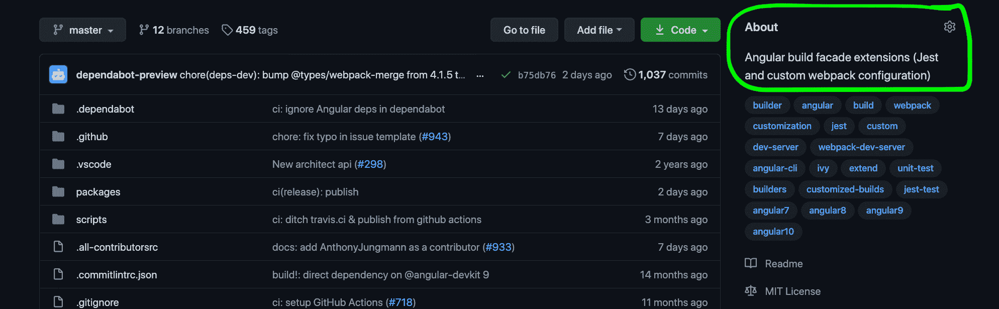*

### *如何写自述？MD 文件*

*自述文件。MD 是你项目根目录下的一个文件，用 [Markdown 语法](https://help.github.com/en/github/writing-on-github/basic-writing-and-formatting-syntax)编写，里面包含了某人需要知道的关于你项目的所有信息。*

*自述文件应该包含一个详细的描述(详细描述了 **什么** 的问题)和关于 **如何使用** 项目的非常详细的说明。
使用说明应涵盖 **公共 API** 的每一个部分，最好有使用示例。*

*以下是编写好的 API 文档的几点:*

*   ***保持简单**–API 和示例越简单，用户就越容易理解它的功能和使用方法*
*   ***保持结构化**–对每个 API 方法使用相同的模板和可视化结构。这样，您就可以定义自己的语言来与用户交流 API。*
*   ***成为用户**–总是从用户的角度写 API 描述。假设您对内部情况一无所知，并且只有这份文档。*
*   ***保持最新**——随着项目的发展，API 可能会发生变化。确保您的自述文件始终包含最新的 API 和示例。*

*自述文件可以(但不是必须)包含以下内容:*

*   *链接到投稿指南*
*   *贡献者列表*
*   *链接到更改日志*
*   *最新版本*
*   *许可证*
*   *构建状态*
*   *下载计数器*
*   *链接到聊天以获得快速反馈*

*这里的是一个好的自述文件的例子。*

### *什么是徽章？*

*徽章是一种很好的方式来直观地展示你的项目的基本信息，比如:构建状态、版本、许可和你的项目使用的各种工具。*

*有很多选择，但我建议你使用 [shields.io](https://shields.io/) 徽章。
他们几乎什么都有徽章。*

*将徽章添加到您的自述文件非常简单:*

1.  *转到 [shields.io](https://shields.io/)*
2.  *选择适当的类别*
3.  *单击您想要添加到自述文件中的徽章*
4.  *填写所需信息(如果有)*
5.  *从下拉菜单中选择复制降价*
6.  *将降价信息粘贴到您的自述文件中*

*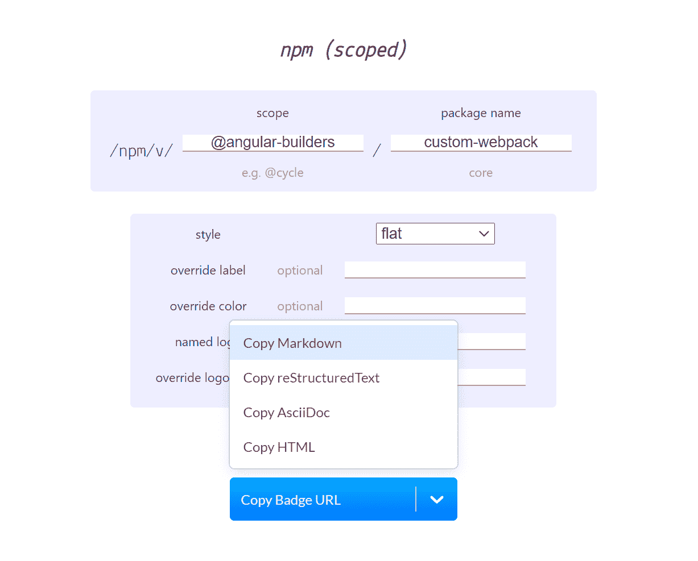*

*徽章通常放在自述文件的顶部，详细描述之前。看起来是这样的:*

*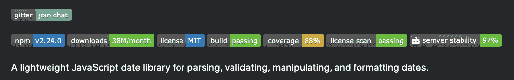*

### *确保你有测试*

*API 参考很棒，但是没有什么比得上使用公共 API 的真实代码。*

*补充你的文档的最好方法之一是用描述性测试来覆盖好代码。有时测试比任何文档更能解释代码。*

### *包装它*

*在这一部分中，我们只讨论了文档的基础知识。例如，它不仅仅是一个自述或描述。随着项目的发展和问题的出现，它们成为文档不可或缺的一部分。*

> *然而，对于任何像样的开源项目来说，拥有一个包含公共 API 的自述文件是最起码的要求*

**

## *如何宣传你的开源项目*

*我们已经讨论了开始一个项目意味着什么，如何最佳地完成它，以及如何为它写好文档。*

*现在让我们来谈谈如何吸引公众对你的项目的注意，并优化它来吸引和正确管理贡献。*

### *这部分的基线是:*

> *你已经有了一个开源项目，它可以在 GitHub 上获得，有很好的文档记录，可以通过一个包注册中心轻松使用。*

### *如何传播你的项目*

*让我们面对房间里的大象:随着项目的增长，你根本无法独自处理所有的事情。所以，如果你想让这个项目长久存在并繁荣发展，你需要更多的人来参与。*

*为了让更多的人参与到你的项目中，你需要更多的人了解它，最重要的是相信它。*

*从我的经验来看，向合适的受众展示你的开源软件的最好方式是 ****使用一个众所周知的资源**** 并写一篇关于你的项目的博客。*

*资源可能是纯粹面向开发的(比如开发到 **)** )或者不是(比如中等)。*

*所有这些资源的一个共同点是它们都有固定的受众，而且是相关的受众。*

*你也可以在不同的在线资源之间交叉发布你的文章，这样你就能覆盖更多的读者。但是请注意，交叉发布有一些缺点:*

*   *这些平台中的每一个都可能有不同的标记语言，你必须重做所有的格式化*
*   *维护——如果事情发生变化(事情 **将** 发生变化),你需要更新所有资源上的博文。*

*如果你选择中型，我强烈建议你将文章提交给大型出版社之一。这需要你付出额外的努力，因为你必须使你的文章符合出版物的要求。但这也会确保你的文章接触到大量的，更重要的是， **相关的** 受众。*

*你也可以决定去一个[计量付费墙](https://help.medium.com/hc/en-us/articles/360018834314-Stories-that-are-part-of-the-metered-paywall)(你可以通过这样做赚钱！):*

> ***作为付费墙一部分的故事也有资格通过主题发布给媒体读者，这将在我们的主页、主题页面、每日文摘和应用** 中为媒体推荐内容*

*我不能告诉你哪一个更好，但我个人的偏好是出版物，因为它确保你的文章被曝光，而不是模糊的“符合分发条件”的术语。*

*如果你的博客帖子像病毒一样传播，那么它会产生级联效应，为你的开源项目带来更多线索。*

*例如，如果在发表文章后，你的 Github 项目在一天内获得了几十颗星，它可以进入 Github [趋势](https://github.com/trending)页面，这本身就是另一个曝光来源。*

*让你的博文变得伟大的几点:*

*   *从问题陈述开始。它甚至可能是博客文章的标题。
    **通常人们都在寻找一个特定问题的解决方案，在他们决定*投资*时间来阅读你的帖子之前，他们应该知道这是否是他们正在寻找的。下面是我写的一篇文章的例子。*
    **如你所见在标题中清楚的陈述了它所解决的问题。**
    **如果你谷歌“定制角度构建”这是你会得到的第一个*结果* s *之一，从搜索页面你可以看到它解决了哪个问题。*****
*   描述为什么以及你的项目如何解决这个问题
*   提供详细的分步指南，从安装开始，到工作示例结束。
*   创建一个示例项目，该项目使用您的开放源代码并链接到博客文章中的源代码。
    **有很多开发人员更喜欢一个工作示例，而不是任何博客帖子。**
*   在发布之前获得一些反馈。
    **让你的朋友看一遍，不要告诉他们是关于什么的，看看他们自己是否能弄明白。如果他们不能，那么可能是不清楚，你需要详细说明。**

发表博文后，确保在社交媒体上与你的朋友、家人和街上的陌生人分享。

这将增加你项目的曝光率——但你也必须让人们 **想要** 为你的项目做贡献。

### 如何让你的项目对贡献者有吸引力

最好的办法是和其他人一起开始开源。这样，从一开始，你就有了一个可以分担负担的团队。

然而，情况并非总是如此。

如果你独自开始，你必须吸引贡献者。根据我的经验，有两种类型:

1.  想要产生影响并寻找项目贡献的人(这些很少但仍然存在)。
2.  有人使用了你的软件包，发现了一个错误或缺乏某些功能。

在这两种情况下，仅仅在 Github 上分享你的源代码和一篇关于如何使用它的博客文章是不够的。这里有几件事可以让人们愿意做出贡献:

#### 有一个待定的实现列表。

它可能包含已知的错误、计划的特性或其他内容。这个列表将使#1 类型的贡献者更容易选择正确的项目并发布 PR。它可以是一个独立的列表，或者你可以(或许应该)使用 GitHub 上的问题和标签。

#### 有一个[投稿指南](https://help.github.com/en/github/building-a-strong-community/setting-guidelines-for-repository-contributors)。

一个非常基本的贡献者指南应该解释存储库的结构，并且有一个构建和运行你的项目和测试的逐步指南。扩展的指南可以包含架构、设计决策、行为准则等等。

一个很好的例子是 [Atom 的贡献者指南](https://github.com/atom/atom/blob/master/CONTRIBUTING.md)。不要低估它的价值！当项目增长时，这需要花费相当多的时间来完成，我希望我在一开始就创建它，并随着项目的发展逐渐更新它。

不幸的是，我没有人指出它的重要性，今天[我的项目](https://github.com/just-jeb/angular-builders)没有贡献者指南。它总是在我的待办事项清单上，但总有比它更紧急的事情。

#### 认可你的贡献者。

在项目主页上列出你的贡献者将会给他们额外的激励去做出贡献。

仅仅添加用户名就足够了，但是我建议您使用 [All Contributors](https://github.com/all-contributors/all-contributors) 。除了为您的所有贡献者创建一个带有个人资料图像和徽章的别致部分，它还通过创建向此部分添加贡献者的 PRs 来自动添加新的贡献者。

### 包装它

在这一部分中，我们已经讨论了几件事，它们将增加你的项目的曝光率，并为人们提供打开 PR 或问题的初始激励。

> 但这不会让他们继续做贡献者，也不会确保他们将完成他们开始的工作。

## 如何在您的开源项目中管理问题和拉请求

既然我们已经探索了共享信息和使您的开源项目更有吸引力，让我们讨论一下 **贡献、** 每个开源项目的圣杯。

### 什么是开源贡献？

对开源项目的贡献是除所有者之外的人所做的任何改变。实际上，它有两种形式:

#### 问题

下面是 Github [对问题的回答:](https://help.github.com/en/github/managing-your-work-on-github/about-issues)

> 你可以收集用户反馈，报告软件错误，组织你想要完成的任务。问题不仅仅是报告软件错误的地方。

简而言之，问题是任何需要采取某种行动的信息。

#### 拉请求(PRs)

下面是 Github [对](https://help.github.com/en/github/collaborating-with-issues-and-pull-requests/about-pull-requests)关于拉请求的描述:

> **Pull requests 让你告诉别人你已经推送到 GitHub 上的一个存储库中的一个分支的变更。一旦打开了一个拉请求，您就可以与协作者讨论和评审潜在的变更，并在您的变更被合并到基础分支之前添加后续提交。**

简而言之，拉请求是对项目的实际变更。

### 如何处理问题和 PRs

那么，你实际上如何处理问题和 PRs，以及如何处理贡献者创建的问题和 PRs？

#### 用一个个人的例子

我能给你最好的建议就是 **用一个个人的例子** 来融入某种工作方法。这意味着当你在开发一个新的特性时，你应该为此创建一个 PR，一旦它符合你的所有标准，就合并它。

当你发现一个错误或者想到一些缺失的功能时，你应该制造一个问题。

这种方法不仅可以组织你的工作，使你的项目有条不紊，还可以为贡献者提供一个参考，他们可以从中学习和适应他们的问题和相应的 PRs。

此外，如果你有很高的标准(意味着你相信每个 PR 都应该有适当的文档、测试覆盖等等)，那么你应该像对待其他贡献者一样对待自己。你不能要求别人做你自己没有做的事情。

此外，有时你应该对贡献者比对自己更宽容。尤其是如果你的项目处于早期阶段，并且没有很多贡献者。这就引出了下面这一点。

#### 所有的工作都受到赞赏

与他人合作就是相互尊重。你应该尊重你的贡献者。回答他们的问题时要有耐心(即使是看起来很简单的问题)，提出建设性的批评时要有礼貌*。*

*记住:欣赏你的贡献者的工作是至关重要的。如果有人只是制造了一个问题(即使没有彻底的研究，甚至没有复制)——感谢他们。他们不厌其烦地把椅子移近桌子，坐直身子，打一些他们认为对你有益的东西。感谢他们，如果需要，以礼貌和尊重的方式询问更多细节。*

*如果有人创造了一个不符合你高标准的公关——感谢他们。感谢他们，礼貌地要求他们修改代码/编写测试/添加文档等等。给他们一个你的 PRs 的链接作为参考，或者给他们一个投稿指南的链接。*

*建设性和积极的对话会给那些贡献者更多的动力来继续他们的工作。否则就不会…*

#### *质量与数量*

*最终，几乎总会有一个折衷(除非你拥有一个巨大的开源项目，比如 Angular 或 React)。你可以决定不放松你的标准，哪怕是一点点，很可能你会自己完成所有的工作。*

*或者，你可以决定降低贡献者的标准(但这将使你的标准无效，因为它们没有被应用)。*

*我了解到每个贡献者都需要不同的方法。这真的取决于个人和他们对自己贡献的个人兴趣。*

*您应该考虑诸如问题的紧迫性、贡献者的经验、代码的复杂性、所需修复或特性的复杂性、贡献者的动机等因素。*

*通常，我会礼貌地要求改变，等上几天，如果什么都没发生，我会自己去改变，当然，前提是这个问题相当重要。至于不太重要的(值得拥有的)补丁或特性——我通常把它们完全留给社区。*

*随着时间的推移，随着问题和 PRs 数量的增加，对它们进行跟踪、优先排序和分类成为一项艰巨的任务。这意味着标签变得极其重要。*

#### *使用有用的标签*

*[Github labels](https://help.github.com/en/github/managing-your-work-on-github/about-labels) 是一个很棒的工具，可以让你的问题和公关保持优先和有条理。虽然这允许您通过标签进行搜索和过滤，但我发现这里最有帮助的是它能够帮助您可视化项目的整体状态。*

*因此，您可以进入“问题”页面，并看到您的大多数问题都被标记为`bug`(这意味着您应该停止向前推进，而是专注于解决它们。)*

*或者，您可以看到大多数问题被标记为`enhancement`或必需的`features`。`priority`是另一个有用的标签，可以帮助你首先关注重要的事情。*

*此外，您的贡献者可以(也将会)从您使用标签中受益。例如，回到 ****获取协作者**** ，某人可以进入“问题”页面，并直观地识别需要社区帮助的问题(`help-wanted`、`pr-welcome`等等)。)*

*除了具有单一责任的标签(如`bug`或`enhancement`)，我建议使用标签来界定问题/PR 的范围或将其放在一定的范围内。例如:*

*   *`priority:low`，`priority:high`*
*   *`required:investigation`、`required:tests`、`required:docs`*
*   *或者在单一回购的情况下:`packages:package1`、`packages:package2`等。*

*以下是我的项目中带有标签的问题页面的示例:*

*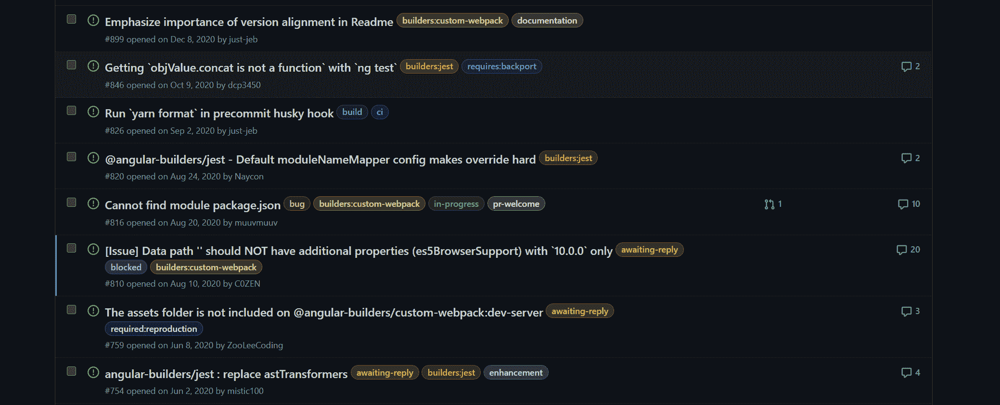*

*标签可以很容易地辨别出哪些问题需要您(或您的贡献者)的关注，这些问题与哪个组件相关，以及需要什么才能继续。*

#### *使用 PR 和问题模板*

*我强烈建议您花几分钟时间，为[问题](https://help.github.com/en/github/building-a-strong-community/configuring-issue-templates-for-your-repository)和[公关](https://help.github.com/en/github/building-a-strong-community/creating-a-pull-request-template-for-your-repository)定义模板。*

> ***使用问题和拉取请求模板，您可以自定义和标准化您希望参与者在存储库中打开问题和拉取请求时包含的信息。***

*这将为你节省大量时间，因为你不必对每一个问题或公共关系做出回应，要求提供额外的信息或变化。有时您仍然必须这样做(因为有些贡献者根本不关注模板)，但是这种情况会比您不创建模板时少得多。*

*下面是一个默认问题的示例，当在存储库中定义相应的模板时，您会看到该问题:*

*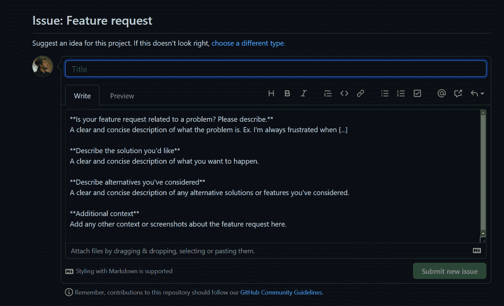*

#### *使用 Github 应用程序和操作*

*有相当多的 Github 应用程序和动作可以帮助你管理 PRs 和问题。这个列表会不断增加，但我个人认为这些是最有用的:*

*   *陈旧的机器人*
*   *[在制品](https://github.com/marketplace/wip)*
*   *[自动批准](https://github.com/dkhmelenko/autoapproval)*
*   *[PR 贴标机](https://github.com/actions/labeler)*

#### *确保你有所回应*

*如果我给另一个开源项目开了一个问题或一个 PR，并且花了很长时间才得到回复，那么我就换了。[这里的](https://github.com/greenkeeperio/monorepo-definitions/pull/24)就是一个例子:*

*   *最初的反应相当迅速，仅用了两天时间*
*   *讨论颇有成果*
*   *公关仍然是开放的，没有更新到底是什么丢失/错误*

*结果换了另一个套餐。*

*如果你不响应，你的项目也是如此:如果你花了两个星期来响应等待你的 PRs，而不是等待贡献者对你要求的更改，那么你将失去用户(即潜在贡献者)。*

*所以，帮你自己一个忙——积极回应。它不一定是对某人问题的即时解决方案，但是即使让用户知道你将在下周调查他们的问题，也已经给了他们一些确定性和时间框架。*

*坏消息是你应该袖手旁观你的承诺。如果这些时常远离你，不要担心——我们都有个人生活，如果你有一些紧急的事情推迟了你的开源工作，这是可以理解的。*

*如果出现这种情况，那么就做一个简短的更新——没什么大不了的，只要写一两个字让人们知道他们期待已久的功能已经被推迟了。*

### *如何优先处理你的问题*

*有一些方法可以帮助你区分最重要问题的优先次序。*

*首先，人们应该如何识别最重要的问题？在我看来，最重要的问题是用户最想要的，无论是新功能、缺陷修复还是其他。*

*有时用户会表达他们对这个问题的兴趣，但很可能他们不会。因此，我向你介绍一种非常简单的方法来了解用户对什么感兴趣:*

*Github 上的每个项目都有一个“洞察”标签，还有一个“流量”部分:*

*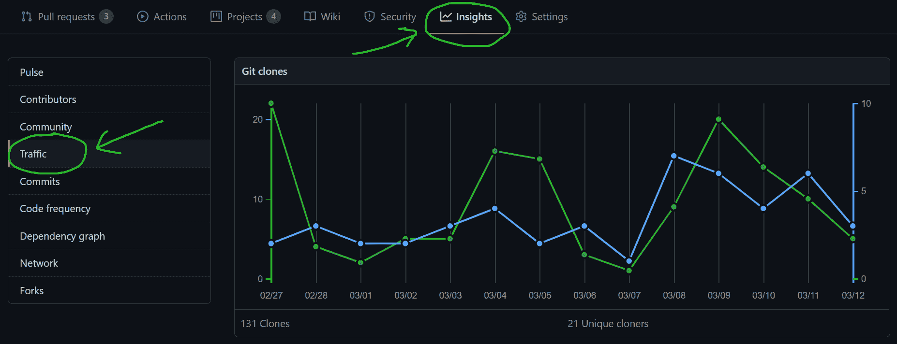*

*在这一部分的底部，您可以找到热门内容表格，让您深入了解哪些页面是访问者浏览最多的:*

*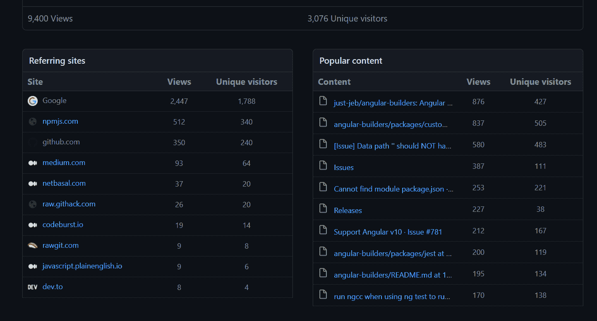*

*此表中列出的问题是最常访问的问题，因此最有可能对用户很重要。*

*当您确定了最重要的问题后，您需要在问题页面上突出显示它们。这里有几种方法可以做到这一点:*

#### *锁定问题*

*每个存储库最多可以有三个固定问题。锁定的问题出现在您的问题页面的顶部，因此几乎不可能错过它们:*

*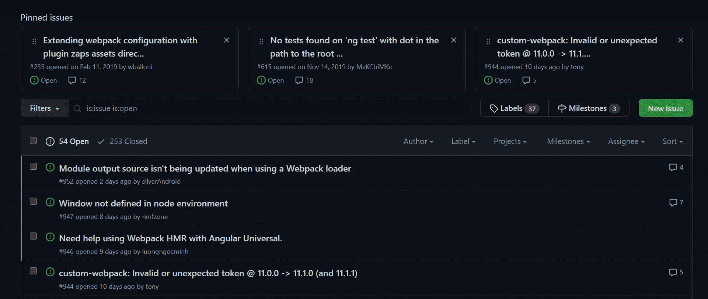*

#### *添加标签*

*我们已经谈到了使用 标签的 **，这是 **应用**`help-wanted`以及`priority:high`标签的一个很好的例子。这些标签将让潜在的贡献者知道这个问题是重要的，任何帮助都是值得赞赏的。***

#### 连续累计

在将每个 Pull 请求合并到主分支之前，对其进行构建和测试，会让您对将要合并到主分支中的代码有足够的信心(取决于测试覆盖率)。

虽然我不得不提到它是公关管理过程的一部分，但它是一项任务的*自动化，否则你必须自己完成，因此它与公关管理没有直接关系。*

*您仍然可以检查每一个 PR，在本地构建它，运行测试，如果一切都是绿色的，那么合并(因此持续集成与 PRs 管理没有直接关系)。不过不要担心，我们将在下一节详细介绍它。*

### *包装它*

*保持你的项目整洁有序是非常重要的，因为——众所周知——整洁仅次于虔诚。它不仅使管理过程更加有效，而且还改善了您的项目的整体印象。*

> *PRs 和 issues(以及代码库)是您的开源项目外观的组成部分。不要低估它们的价值。*

**

## *如何自动化您的流程*

*管理贡献(即问题和 PRs)的一个自然部分是自动化——可能是 OSS 项目管理最重要的方面之一。*

### *为什么要自动化？*

*如果说我在拥有开源系统的这些年里学到了什么的话，那就是你必须自己做的例行工作越少，你就有越多的时间从事实际工作(比如修复 bug 和开发新功能)。因此，我寻求 ****尽我所能的自动化。*****

*下面是我希望我们如何实现这个目标:让我们首先检查两个工作流程，(非自动化和全自动化)，看看你有多少时间实际上被投入到日常任务中。然后，我们将探讨如何改进工作流程，以便有更多的时间来修复 bug。*

### *最坏的情况—没有自动化*

*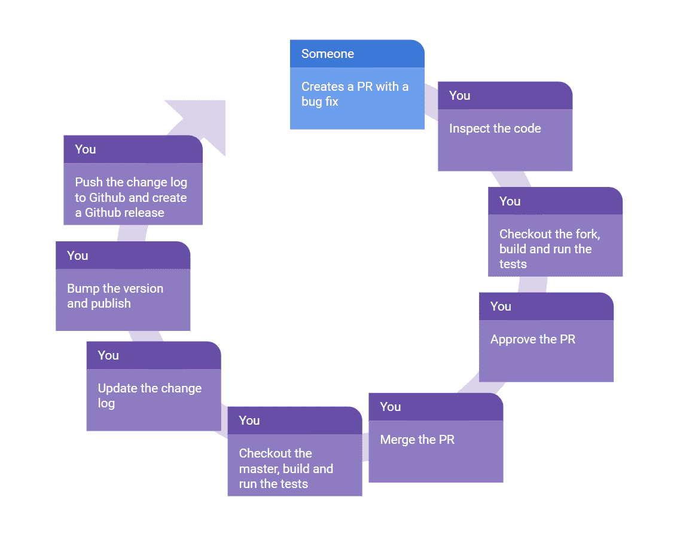*

*如您所见，在没有自动化的情况下，所有的工作都由您来做。光是修复一个 bug 就要做很多工作，除此之外，这是每次 有 bug 修复或新特性时***都要做的工作！****

*现在让我们看看另一种情况。*

### *最好的情况—一切都是自动化的*

*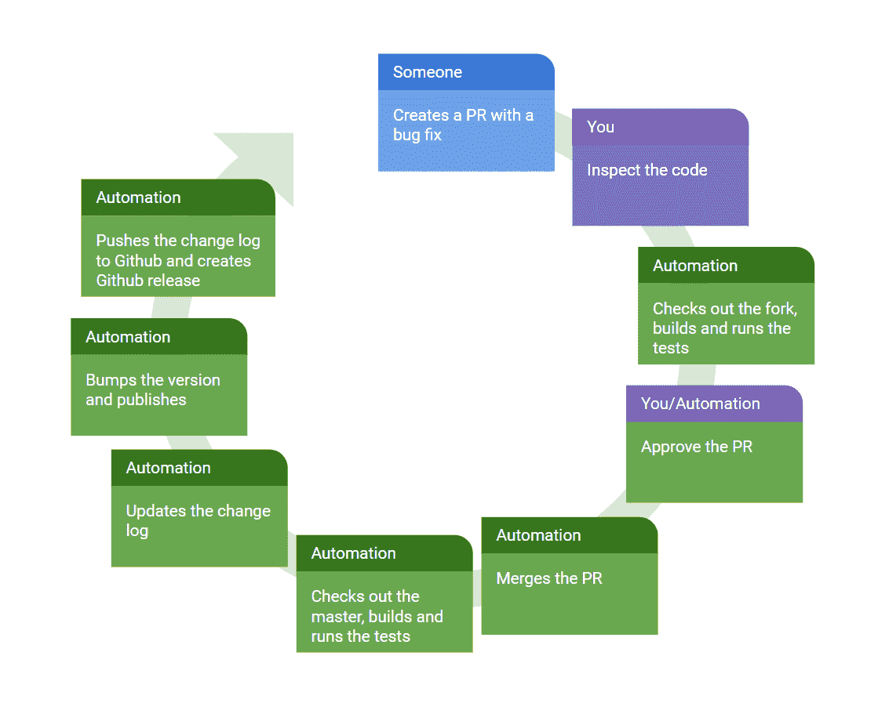*

*在这种情况下，您只需要做您必须做的事情——检查代码并(有时)批准拉取请求。其他一切都是自动完成的。*

*科幻？不，这叫 ****连续整合**** 和 ****连续部署**** 。在这里，我们不打算讨论构建脚本和特定于系统的配置的细节。取而代之的是，我们将回顾你需要的工具，让你自己决定细节。*

### *什么是持续集成(CI)？*

> *持续集成(CI)是将来自多个参与者的代码变更自动集成到一个软件项目中的实践。CI 过程由自动工具组成，这些工具在集成之前断言新代码的正确性。*

*一个非常基本的 CI 运行将包括 ****构建**** 和 ****单元测试**** ，然而它不限于这两个。它还可能包括各种静态代码分析工具、linters 等等。这是你定义标准的地方。*

### *为什么您应该使用端到端测试*

*构建和单元测试为您提供了代码更改的快速反馈，花费的时间相对较短，如果出现问题，很快就会失败。但是端到端(E2E)测试在 CI 中有着特殊的地位。*

*E2E 测试不仅应该涵盖代码的正确性，还应该涵盖您的部署流程、包完整性等等。*

*当我偶然发布了一个不包含任何代码的包的新版本时，我自己也意识到了这一点。构建已经通过，单元测试和 E2E 测试都是绿色的(那些是通过链接测试项目的构建输出目录安装的)。哪里失败了？在包装阶段。*

*这里有一个要点:E2E 测试应该像真实用户一样测试你的包。*

*为了实现这一点，我建议如下:*

1.  *在 CI 运行期间，启动本地包注册中心。每种语言/生态系统都有几个选项，例如对于 Java 或 Scala 项目，你有 [Nexus Repository](https://blog.sonatype.com/using-nexus-3-as-your-repository-part-1-maven-artifacts) ，对于 JavaScript，有 [Verdaccio](https://github.com/verdaccio/verdaccio) (我正在 [@angular-builders](https://github.com/just-jeb/angular-builders) 中使用)*
2.  *有一个单独的项目使用您的包(这可以驻留在同一个 repo 中)。这个项目中的测试应该测试您的包的功能。*
3.  *将此项目配置为使用本地包注册表。*
4.  *在构建您的包之后，将其发布到本地包注册中心(在您的 CI 系统中启动)。*
5.  *将最新版本的包(您刚刚发布的)安装到您的测试项目中。*
6.  *进行测试。*

*它不仅会测试您的包的完整性和可靠性，还会在持续部署时为您节省一些工作。*

### *竞争情报系统如何工作*

*有很多 CI 系统都有开源项目的免费计划，其中有 [Travis CI](https://travis-ci.com/) 、 [CircleCI](https://circleci.com/) 、 [AppVeyor](https://www.appveyor.com/) 、 [Github Actions](https://github.com/features/actions) 等等。*

*它们都是一样的，基本上是一样的，它们将你的代码签出到虚拟机，运行你定义的脚本(通常运行构建和测试)，然后向 GitHub 报告成功或失败。*

*所有这些系统都有一个用于与 GitHub 集成的[应用](https://github.com/marketplace?category=continuous-integration&type=apps),所有这些系统的集成流程都非常相似:*

1.  *在平台上注册。*
2.  *在你的 GitHub 账号里安装相应的 app。*
3.  *[配置对所选存储库的访问权限](https://github.com/settings/installations)。*
4.  *创建一个配置文件(如`travis.yaml`)来定义构建矩阵、所需的构建链和 CI 脚本。*
5.  *把它推给主人*

*这将使您的 CI 在每个 PR 上运行，并向 GitHub 报告状态——但这还不够。您真正想要的是阻止合并到主分支，直到 PR 通过所有检查。*

*这是通过定义分支保护规则来实现的。为了定义这些，您应该转到您的存储库中的" ****【分支】**** 部分" ****【设置】**** ，然后按下" ****【添加规则】**** 按钮:*

*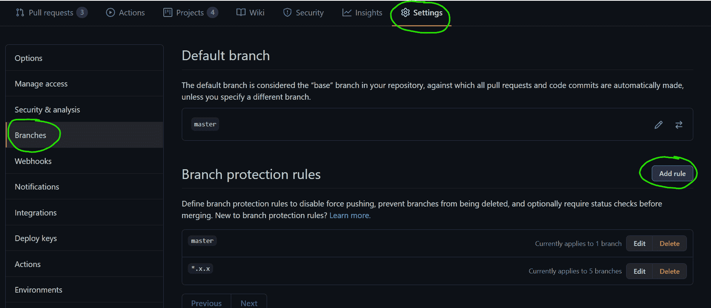*

*然后勾选 ****要求状态检查通过后再合并**** 复选框:*

*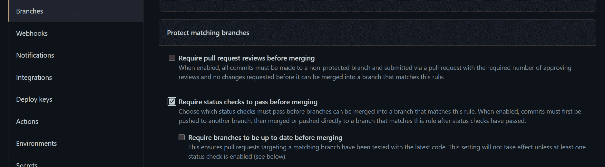*

*如你所见，相应的 Github Apps 复选框已经出现在这里，所以剩下的唯一事情就是启用它们。*

*确切的构建脚本实际上取决于您的生态系统、编写项目的语言、您使用的框架等等。因此，我们不会在这里讨论它——您必须自己查阅 CI 系统的文档来了解细节。但是，您现在已经对 CI 是什么以及它如何自动化您的 PRs 有了相当好的了解，所以让我们继续。*

### *持续部署(CD)的工作原理*

> ***持续部署(CD)是一个软件发布过程，使用自动化测试来验证对代码库的更改是否正确和稳定，以便立即自主部署到生产环境中。***

*在我们的例子中，生产环境是当一个包在包注册中心公开时。这是一个不可逆转的阶段，因为一旦您发布了它，您就不能取消发布，因为它是公开可用的(因此可能会被使用)。*

*持续部署有多种策略，这实际上取决于项目及其复杂性。但是在我看来，发布应该完全由一个主分支完成，因为这使得工作流程变得非常容易。方法如下:*

1.  *每个 PR 代表一个 bug 修复或者一个新特性。*
2.  *代码在到达主程序之前就已经被测试过了(包括 E2E)。*
3.  *主服务器是受保护的分支，因此只要您不合并失败的 PRs，主服务器就保持稳定。*
4.  *每次 PR 合并到主配置项都会触发主配置项运行，最终发布新版本。*

*这将确保所有的发布都是连续的，并且将使特定的 PR 与特定的版本联系起来变得非常容易。*

*为了自动化软件包发布，我们需要一些东西:*

1.  *基于提交消息的自动版本升级。*
2.  *基于提交消息的自动变更日志更新。*
3.  *自动将包发布到公共包存储库中。*
4.  *Github 上的自动发布。*

*好消息:所有这些都已经得到了语义发布的支持。坏消息:你将不得不投入一些时间来让它工作(但最终它会有回报)。*

### *语义发布是如何工作的*

> *语义发布自动化了整个包的发布工作流程，包括:确定下一个版本号，生成发布说明，发布包。
> 
> **这样就去除了人的情感和版本号之间的直接联系，严格遵循[语义版本化](http://semver.org/)规范。***

*我们不会在这里涵盖整个集成过程，因为他们有非常好的文档，没有理由在这里复述。不过，我要提几点:*

*   *在开始语义发布之前，确保你理解了[语义版本规范](https://semver.org/)和[约定提交](https://www.conventionalcommits.org/en/v1.0.0/)格式。*
*   *为了让语义发布工作得更好，您应该强制执行某些提交消息格式。为此，您可以将[commit list](https://github.com/conventional-changelog/commitlint)作为 [husky](https://github.com/typicode/husky) 预提交钩子来运行。当有人创建本地提交时，它将强制执行常规提交，但它不能对直接从 GitHub web UI 执行的提交做任何事情(当有人想要快速修复他们的 PR 时，经常会发生这种情况)。因此我建议你通过 [commitlint Github Action](https://github.com/marketplace/actions/commit-linter) 来备份。*

*在您将语义发布设置为工作流的一部分之后，您就差不多完成了，并且您不再需要将您的时间花费在这些常规流程上。虽然还有一个优化你可以做。*

### *如何使项目保持最新*

*如果您的项目没有外部依赖关系，请跳过这一部分。然而，大多数项目依赖于其他包，而其他包往往会发生变化。*

*让你的项目和它的依赖项保持同步是很重要的，但是 **很费时间** 。幸运的是，我们有一个解决方案。事实上，其中有几个如[绿色守护者](https://greenkeeper.io/)、[翻新](https://renovate.whitesourcesoftware.com/)、[依赖机器人](https://dependabot.com/)。*

*所有这些产品的想法都差不多，所以我只引用 Dependabot 的“它是如何工作的”一节:*

> *******1。dependent bot 检查更新******
> **dependent bot 拉下你的依赖文件，寻找任何过时或不安全的需求。***

> ****2。* *****【从属机器人】打开拉取请求*******
> **如果您的任何依赖项过期，从属机器人将打开单独的拉取请求来更新每个请求。***

> ***3。* *****您检查并合并*******
> **您检查您的测试是否通过，扫描包含的变更日志和发布说明，然后满怀信心地点击合并。**

您可能已经注意到，只有当您有一个工作配置项时，这才有意义。

### 包装它

如果您有一个完全自动化的 CI/CD 周期，并且在您的 OSS 存储库中打开了一个新问题，您可以在几分钟内提供一个错误修复。

事实上，您可以从手机进入移动 Github 版本，修复一两行 bug，并提交代码。剩下的是自动完成的，您的客户会马上得到一个新版本。

我自己能够多次快速、轻松地为我的客户获得一个固定版本。

> **拥有强大的自动化并不是让*腾出*一些休闲时间，而是让你把时间投入到真正重要的事情上，并提高你的反应能力。**

## 版本管理

在本指南的最后，我想谈谈版本管理，这是一个对于任何拥有相当数量用户的 OSS 项目都很重要的方面。您将了解版本符号、重大变更、后向端口等更多内容。

### 什么是软件版本控制？

让我们看看维基百科对软件版本有什么说法。

> ******软件升级版本化**** 是给[计算机软件](https://en.wikipedia.org/wiki/Computer_software)的唯一状态分配唯一*版本名*或唯一*版本号*的过程。**
> 
> **现代计算机软件经常使用两种不同的软件版本化方案进行跟踪——可能在一天内递增多次的[内部版本号](https://en.wikipedia.org/wiki/Software_versioning#Internal_version_numbers)，例如修订控制号，以及通常很少改变的*发布版本*，例如语义版本化[【1】](https://en.wikipedia.org/wiki/Software_versioning#cite_note-semver-1)或[项目代码名称](https://en.wikipedia.org/wiki/Code_name#Project_code_name)。**

事实上，有多种方法可以唯一地识别您的软件产品版本。

最广为人知的方法是给它一个名字。

地球上的绝大多数人，甚至那些间接与技术有关的人，可能都听说过 Android 冰淇淋三明治和棉花糖或 Mac OS Leopard，它的冷冻表亲雪豹和大苏尔。

程序员们可能听说过月食及其天体月球、火星和光子。

所有这些都是软件产品的主要版本。

虽然名字对营销很有帮助，但有时也会让人困惑。
事实上，谷歌已经不再在安卓版本名称中使用糖果，因为他们:

> **多年来从用户那里听到反馈，这些名字并不总是能被全球社区** 中的每个人直观地理解

这是理所当然的，但也许我们还没有进化到足以从动物物种中推断出版本号，尽管雪豹比美洲豹酷多了。

天体和糖果是更容易理解的概念，但前提是你要按字母顺序命名它们(就像 Android 和 Eclipse 那样)。但有一点是肯定的——没有比数字更好的确定接班人的方法了。

因此，如果你把你的软件产品的第一个版本命名为“产品 1 ”,第二个版本命名为“产品 2 ”,很直观的说第二个版本是更新的，不是吗？

然而，与不公开 API 的独立软件产品不同，被其他软件消费的软件(像大多数 OSS 产品一样)需要更好的版本控制，而不仅仅是一系列数字。

例如，如果我们使用一个简单的数字序列来进行版本控制，用户如何区分一个 bug 修复和一个破坏现有 API 的变更？

答案是…语义版本化。

### 什么是语义版本化？

语义版本(也称为 SemVer)是一种广泛采用的版本方案，它使用以下格式的 3 位数序列:`MAJOR.MINOR.PATCH`。
规则很简单——给定一个版本号`MAJOR.MINOR.PATCH`，递增:

*   `MAJOR`进行不兼容的 API 更改时的版本
*   以向后兼容的方式添加功能时的版本
*   版本当你做向后兼容的 bug 修正。

预发布和构建元数据的附加标签是对`MAJOR.MINOR.PATCH`格式的扩展。

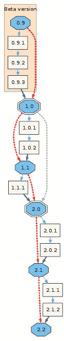

它提供了一种清晰简洁的方式，将软件产品中的变更传达给用户。

但最重要的是，它被各种包管理器和构建工具广泛采用(像 [NPM](https://docs.npmjs.com/about-semantic-versioning#using-semantic-versioning-to-specify-update-types-your-package-can-accept) 和 [Maven](https://docs.oracle.com/middleware/1212/core/MAVEN/maven_version.htm#MAVEN8903) ，它允许用户依赖于特定的 ****版本范围**** 而不是特定的版本。

例如，指定版本范围`^2.2.1`而不是明确的版本`2.2.1`将让用户接受任何向后兼容的错误修复或在版本`2.2.1`之上发布的新功能。

也就是说，构建工具和包管理器依赖于用户和包所有者之间的契约——一个由 SemVer 定义的契约。

这意味着责任是 **你的**——你是那个定义什么是重大改变，什么是微小改变的人。你可以意外地发布一个突破性的变更作为一个 bug 修复(补丁版本)，它 **将** 打破依赖于一个范围的构建。

破坏构建是一件可怕的事情，所以我建议您使用带有预定义消息格式的`semantic-release`和提交格式强制工具。

你可以在官方网站[semver.org](https://semver.org/)找到更多关于语义版本的信息。

现在，我们已经了解了 **识别** 的突破性变化，让我们来谈谈 **介绍** 它们。

### 如何管理突发变更

突破性变更是对您的公共 API 的变更，以不兼容的方式删除、重命名或更改您与用户的合同。

理想情况下，您应该在代码中保持向后兼容性，并且永远不会引入任何突破性的变化。但是当你醒来时，你会发现一个残酷的现实。

软件在发展，你的代码也在发展。用户的需求在变化，你的 API 也在变化。你作为开发者成长，你的产品也是如此。

因此，特别是作为一个不拿工资的开源开发者，你不能允许自己维护项目中存在的所有遗留代码。有时候，你需要摆脱它。

问题是怎么做？

一如既往，这是一种权衡。您会更好地了解这种或那种变化对用户的影响。

你不需要 **有** 来不惜一切代价保持向后兼容，也不需要在每一个老版本中实现所有的新特性。但这肯定是你 **应该** 考虑的事情。

如果用户的迁移成本相对较低，那么做一个突破性的改变是很好的，在旧版本中不支持这个特性是很合理的。

但是，如果迁移成本很高，并且绝大多数用户无法承担这一工作，那么您可能应该考虑首先使这一更改向后兼容，并发布一个不赞成的警告。

弃用警告通常与新 API 一起发布，而旧 API 仍然受支持。这样，用户就有时间进行迁移。一旦他们这样做了，在下一个主要版本中，弃用警告和旧的 API 就可以安全地删除了。

在任何情况下，无论何时引入突破性的变更，都要确保您有一份迁移指南，其中有一步一步的迁移说明。

此外，出于礼貌，如果你能 **给用户时间** 来准备一个突破性的改变，那就太好了，尤其是如果它没有宽限期的话(新旧 API 都支持)。

解释突破性变化、其背后的原因以及预期的时间框架是非常有帮助的。它可以是一条推文，一篇博客文章，甚至是你的产品的一个新的次要版本，带有一个弃用警告。

请记住，虽然一个突破性的变化本质上是一种负面体验，但一个 **突然的** 突破性的变化是一个 **极端的** 负面体验。

### 自动迁移

我们可以将重大变更分为两类——非确定性和确定性。

不确定性是指您无法预测迁移工作的结果，例如当您完全删除某个 API 的某个部分时。

在这种情况下，由用户决定他们是否想用其他第三方库替换它，自己实现它，或者也贬低它。

确定性变更是给定代码`X`和用户输入`I`，允许您将其转换成代码`Y`的变更。例如，更改函数名或导入语句。

如果你引入了决定性的突破性改变，你可以编写一个自动化程序来改变用户的代码库并调整它以适应新的 API。

有了这种自动化，您将不必关心向后兼容性和详细的迁移指南。您为用户提供了一种升级他们代码的方法，而他们一点也不费力，这在软件更新中是至关重要的。

然而，这里也有一个内在的权衡。编写代码需要时间，就像编写迁移指南一样。当然，编写将复杂代码流迁移到新 API 的代码比编写用新函数名替换函数名的代码要花费更多的时间。

有时候你就是承受不起这种努力。

如果你决定去做，有一些工具可以帮助你实现你想要的。

最广为人知且与语言无关的是脸书的 [Codemode](https://github.com/facebook/codemod) 。

> codemod 是一个工具/库，帮助你进行大规模的代码库重构，这些重构可以部分自动化，但仍然需要人工监督和偶尔的干预。

也有更复杂的工具使用 [AST](https://en.wikipedia.org/wiki/Abstract_syntax_tree) ，可以用于更复杂的任务，而不仅仅是寻找& Replace。

例如，另一个名为 [JSCodeShift](https://github.com/facebook/jscodeshift) 的脸书库(特定于 JS/TS)。
或[代码迁移](https://github.com/ranyitz/code-migrate)——一个工具(也是 JS/TS 专用的),它允许您相对容易地编写引导迁移，并为用户提供基于 CLI 的漂亮提示。

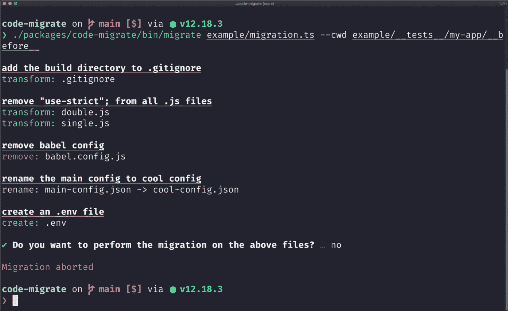

一些大型 OSS 项目甚至有他们自己的解决方案。这种解决方案的一个例子是[Angular schematics](https://angular.io/guide/schematics)——一个支持复杂逻辑的基于模板的代码生成器。

自动代码迁移可以作为一个单独的包发布(像`my-cool-oss-migrate-v4-v5`)，并在迁移指南中作为一个步骤提及。

或者，迁移可以是包含重大变更的主版本的一部分，并在用户代码库中安装该版本时执行。选择权在你。

### 反向移植

另一种常见的做法是将重要的更改移植到以前的版本。例如，在一个主要版本(有突破性的改变)之后发现了一个严重的错误，但是它也适用于以前的版本。

在这种情况下，您不能期望您的用户因为一个 bug 而执行冗长乏味的迁移。另一方面，签出旧版本，在其上实现修复，并将其作为旧版本的小改动发布可能会很麻烦。

> 解决方案:每个主要版本都有一个受保护的分支。

每当你计划发布一个主版本时，你从主分支中创建一个名为`c.x.x`的分支，其中`c`是当前的主版本号。
你把所有这样的树枝都保护起来(就像主枝一样)，这样你就不会不小心折断它们。然后，任何时候你必须从一个新的主要版本中支持一个特性或者一个 bug 修复，你要么在这个分支上重新实现它，要么(如果可能的话)从主分支中挑选提交。

此外，一个值得一提的策略是为下一个 主要版本的 **建立一个单独的分支(而不是只为以前的主要版本建立分支)。**

这通常与大规模项目(如 Webpack 或 Babel)相关，这些项目在每个新的主要版本中都有很多变化。

为即将到来的主要版本建立一个单独的分支允许对其进行处理并发布以供测试，同时仍然将最相关的版本(并对其进行处理)保留在主分支中。

一旦发布了新的主版本，它的分支就变成了主分支，并且为下一个主版本创建了一个新的分支。

## 最后的想法

我希望你喜欢这个指南，并且现在已经很好地理解了拥有一个开源项目意味着什么。

最后，我想和你分享一件事，当你拥有一个开源项目时，你应该永远记住。

### 倾听你的用户

这听起来可能违反直觉，但这是事实——你不是唯一定义路线图的人，用户也定义它。事实上，大部分是用户定义的。如果你拥有一个开源项目，那么你这样做是为了帮助别人，而不是你自己。

拥有多个反馈渠道。有些用户只有一个简短的问题，你可以在一秒钟内给出答案。

有一些潜在的贡献者想讨论路线图，但不想公开讨论。给他们一个联系你的方式。提供懈怠或不和谐的链接，分享你的 Twitter 账号，等等。渠道越多越好。

说到渠道，如果您有任何问题或想法，欢迎随时在 [Twitter](https://twitter.com/_Just_JeB_) 上给我发 DM。

你也可以在我的博客上阅读更多类似的文章。