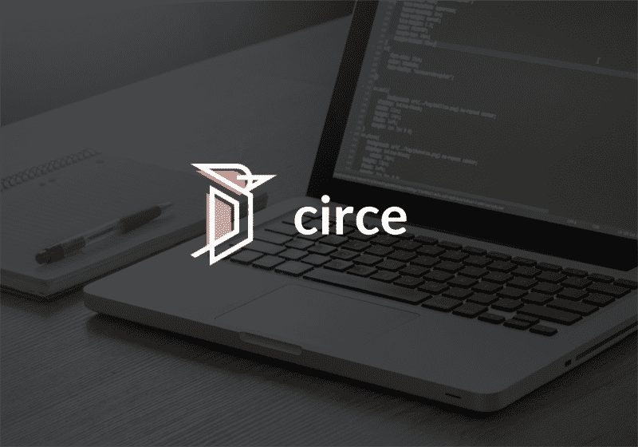
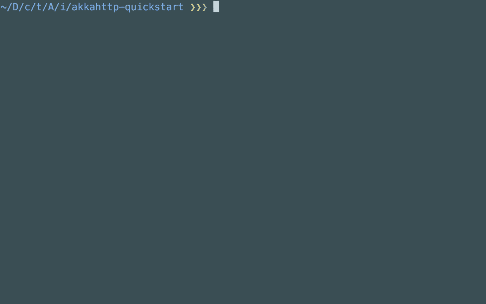
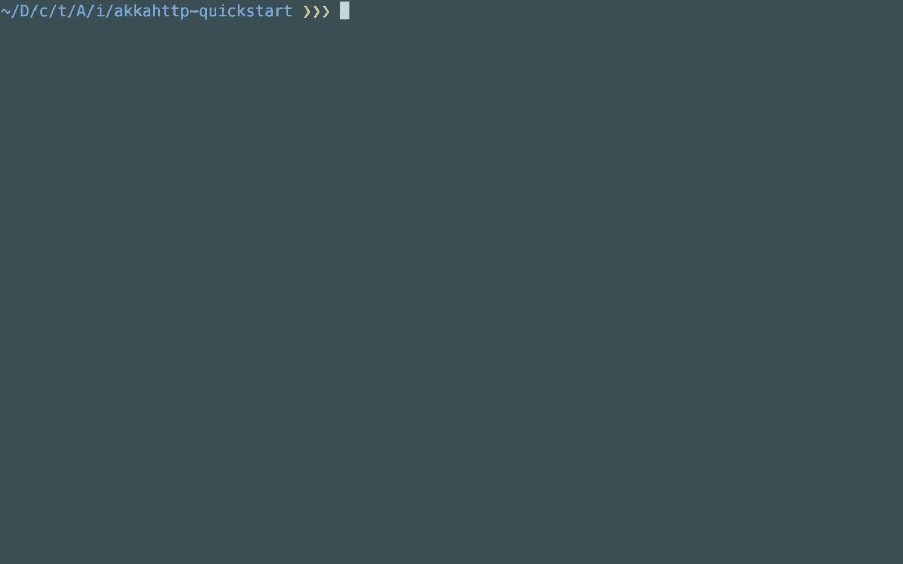

# 如何用喀尔刻在 Akka HTTP 中封送 JSON

> 原文：<https://www.freecodecamp.org/news/un-marshalling-json-in-akka-http-with-circe-3dcc2764eedb/>

米格尔·洛佩兹

# 如何用喀尔刻在 Akka HTTP 中封送 JSON



尽管 Akka HTTP 应用程序中通常使用的(解)封 JSON 库是 spray-json，但我还是决定尝试一下 circe。我在我正在学习的 Akka HTTP 初学者课程中使用它。* ***咳嗽*** * [免费的](http://link.codemunity.io/circe-akka-http-quickstart-course)？*c ***ough****

在这篇文章中，我想告诉你我为什么要尝试它。

要将 circe 与 Akka HTTP——以及其他 JSON 库一起使用，我们必须手动创建封送拆收器。幸运的是，有一个额外的库已经为我们做了这些。

### 项目设置和概述

克隆[项目的存储库](https://github.com/Codemunity/akkahttp-quickstart)，并检出`branch 3.3-repository-implementation`。

在`src/main/scala`下，您会找到以下文件:

```
$ tree srcsrc└── main    └── scala        ├── Main.scala        ├── Todo.scala        └── TodoRepository.scala2 directories, 3 files
```

对象是应用程序的入口点。到目前为止，它有一个 hello world 路由，并将其绑定到给定的主机和路由。

`Todo`是我们应用程序的模型。而`TodoRepository`负责持久化和访问 todos。到目前为止，它只有一个内存实现来保持简单和专注。

### 列出所有待办事项

我们将改变`Main`对象的路径，以列出存储库中所有的待办事项。我们还将添加一些初始 todos 进行测试:

```
import akka.actor.ActorSystemimport akka.http.scaladsl.Httpimport akka.stream.ActorMaterializerimport scala.concurrent.Awaitimport scala.util.{Failure, Success}object Main extends App {  val host = "0.0.0.0"  val port = 9000  implicit val system: ActorSystem = ActorSystem(name = "todoapi")  implicit val materializer: ActorMaterializer = ActorMaterializer()  import system.dispatcher  val todos = Seq(    Todo("1", "Clean the house", "", done = false),    Todo("2", "Learn Scala", "", done = true),  )  val todoRepository = new InMemoryTodoRepository(todos)  import akka.http.scaladsl.server.Directives._  def route = path("todos") {    get {      complete(todoRepository.all())    }  }  val binding = Http().bindAndHandle(route, host, port)  binding.onComplete {    case Success(_) => println("Success!")    case Failure(error) => println(s"Failed: ${error.getMessage}")  }  import scala.concurrent.duration._  Await.result(binding, 3.seconds)}
```

现在我们在`/todos`下监听请求，并使用`todoRepository`中的所有待办事项进行响应。

但是，如果我们尝试运行它，它不会编译:

```
Error:(26, 34) type mismatch; found   : scala.concurrent.Future[Seq[Todo]] required: akka.http.scaladsl.marshalling.ToResponseMarshallable      complete(todoRepository.all())
```

编译错误告诉我们，它不知道如何将我们的 todos 整理成 JSON。

我们需要导入 circe 和支持库:

```
import akka.http.scaladsl.server.Directives._import de.heikoseeberger.akkahttpcirce.FailFastCirceSupport._import io.circe.generic.auto._def route = path("todos") {  get {    complete(todoRepository.all())  }}
```

有了这两个额外的行，我们现在可以运行我们的`Main`对象并测试我们的新路线。

向`http://localhost:9000/todos`发出获取请求:



我们要拿回我们的托多斯！？

### 创建待办事项

事实证明，将 JSON 解组到我们的模型中也不需要太多努力。但是我们的`TodoRepository`暂时不支持保存 todos。让我们首先添加该功能:

```
import scala.concurrent.{ExecutionContext, Future}trait TodoRepository {  def all(): Future[Seq[Todo]]  def done(): Future[Seq[Todo]]  def pending(): Future[Seq[Todo]]  def save(todo: Todo): Future[Todo]}class InMemoryTodoRepository(initialTodos: Seq[Todo] = Seq.empty)(implicit ec: ExecutionContext) extends TodoRepository {  private var todos: Vector[Todo] = initialTodos.toVector  override def all(): Future[Seq[Todo]] = Future.successful(todos)  override def done(): Future[Seq[Todo]] = Future.successful(todos.filter(_.done))  override def pending(): Future[Seq[Todo]] = Future.successful(todos.filterNot(_.done))  override def save(todo: Todo): Future[Todo] = Future.successful {    todos = todos :+ todo    todo  }}
```

我们给特征和实现添加了一个方法`save`。因为我们使用了一个`Vector`,我们的`save`实现将存储重复的 todos。对于本教程的目的来说，这很好。

让我们添加一个新的路由来监听 POST 请求。该路由接收一个`Todo`作为请求体，并将其保存到我们的存储库中:

```
def route = path("todos") {  get {    complete(todoRepository.all())  } ~ post {    entity(as[Todo]) { todo =>      complete(todoRepository.save(todo))    }  }}
```

使用`entity`指令，我们可以构建一个路由，将传入的 JSON 自动解析到我们的模型。它还拒绝带有无效 JSON 的请求:


我们将`done`字段作为一个字符串发送，它应该是一个布尔值，我们的 API 用错误的请求响应了它。

让我们创建一个有效的请求来创建一个新的 todo:


这次我们将属性作为`done := false`发送，它告诉 HTTPie 将值作为`Boolean`而不是`String`发送。

我们得到了我们的 todo 和一个 200 状态码，这意味着进展顺利。我们可以通过再次查询 todos 来确认它是否有效:



我们有三个 todos，硬编码的和新创建的。

### 包扎

我们通过添加依赖项(在项目中已经完成)和导入两个库，将 JSON 封送和解封添加到我们的应用程序中。

喀尔刻知道如何在没有我们太多干预的情况下处理我们的模型。

在以后的文章中，我们将探索如何用 spray-json 实现同样的功能。

敬请期待！

如果你喜欢这个教程，并且想学习如何为一个 todo 应用程序构建一个 API，请查看我们新的**免费**课程！？？？

[**Akka HTTP 快速入门**](http://link.codemunity.io/circe-akka-http-quickstart-course)
[*在这个免费课程中学习如何用 Akka HTTP 创建 web 应用程序和 API！*link . codecommunity . io](http://link.codemunity.io/circe-akka-http-quickstart-course)

最初发布于[www . code unity . io](https://www.codemunity.io/tutorials/akka-http-json-circe/)。