# 如何通过吃披萨来理解 RxJS 操作符:用例子解释 zip、forkJoin 和 combineLatest

> 原文：<https://www.freecodecamp.org/news/understand-rxjs-operators-by-eating-a-pizza/>

# RxJS 是什么？

> ***反应式编程是一种异步编程范式，关注数据流和变化的传播* - **维基****

> RxJS 是一个使用 observables 的反应式编程库，它使得编写异步或基于回调的代码更加容易

RxJS 中的基本概念是

*   一个可观测的数据是一个数据流
*   **观察员**最多可以注册 3 次回访:

1.  *接下来的*被称为 1:M 时间，用于向观察者推送新的值
2.  发生错误时，最多调用 1 次*错误*
3.  完成时最多调用 1 次*完成*

*   **订阅**“启动”可观察流

没有订阅流不会开始发出值。这就是我们所说的**感冒**T4。

这类似于订阅报纸或杂志...在你订阅之前，你不会开始得到它们。然后，它在生产者(可观察的)和消费者(观察者)之间创建了一对一的关系。

# 什么是 RxJS 运算符？

操作符是纯函数，支持用操作处理集合的函数式编程风格。有两种运算符:

*   创建运算符
*   可管道化运算符:变换、过滤、速率限制、扁平化

主题是一种特殊类型的可观察对象，它允许将值**多播**给许多观察者。普通的可观察对象是**单播**(每个订阅的观察者拥有可观察对象的独立执行)，而主题是组播的。这就是我们所说的**热** **可观测。**

在本文中，我将重点关注`zip`、`combineLatest`和`forkJoin`操作符。这些是 RxJS 组合运算符，这意味着它们使我们能够连接来自多个可观测量的信息。发出值的顺序、时间和结构是它们之间的主要区别。

让我们单独看一下每一个。

# zip()

*   直到每个内部可观察对象发出至少一个值，才开始发出
*   `zip`只要能从所有内部可观测值中收集到发射值，就发射
*   `zip`以数组形式发出值

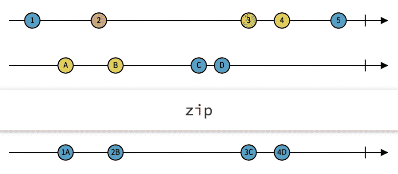

让我们想象一下，你和你的两个好朋友马里奥和路易吉在罗马最好的意大利餐厅。你们每个人都点了一杯饮料、一份比萨饼和一份甜点。你指定服务员先送饮料，然后送披萨，最后送甜点。

这种情况可以用三种不同的观察值来表示，代表三种不同的顺序。在这种特定情况下，服务员可以使用`zip`操作符按类别带来(发出)不同的订单项目。

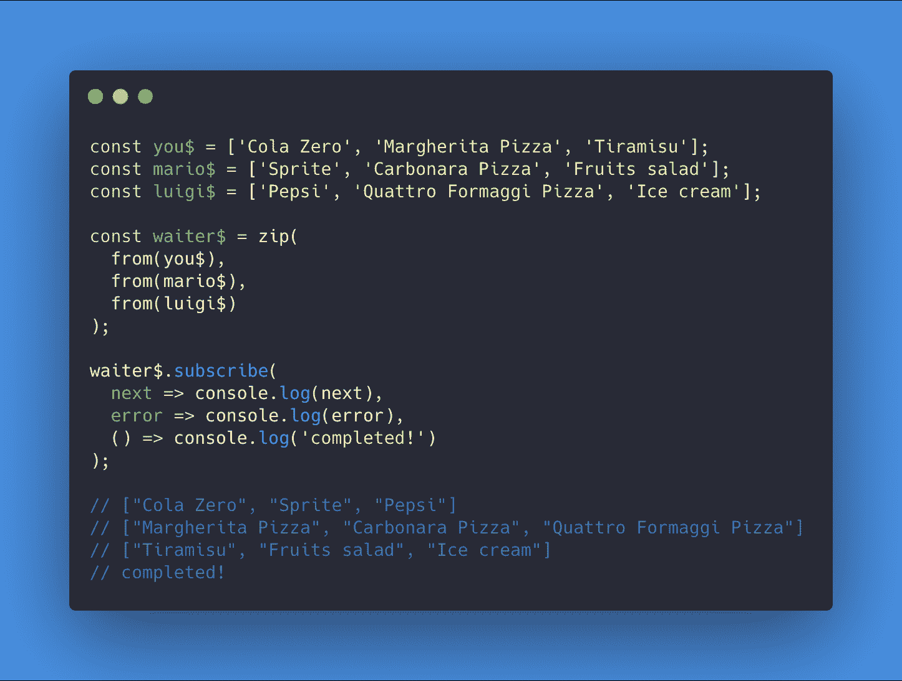

**警告￥t1**

如果你和你的女朋友回到同一家意大利餐馆，但她不想吃饭，这就是会发生的情况:

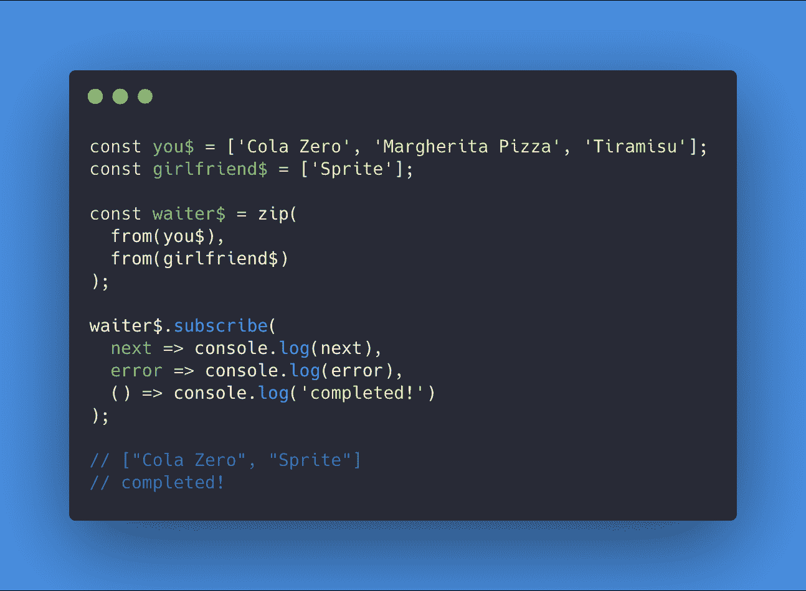

如果`waiter$`使用了`zip`操作符，你只能得到你的饮料！

为什么？

因为，当`waiter$`发出饮料时，`girlfriend$`的可观察性是完整的，不能从中收集更多的价值。希望`waiter$`能为我们使用另一个运营商，这样我们就不会和女朋友分手？

# 组合测试()

*   直到每个内部可观察对象发出至少一个值，才开始发出
*   当任何内部可观察对象发出一个值时，从每个对象发出最后一个发出的值

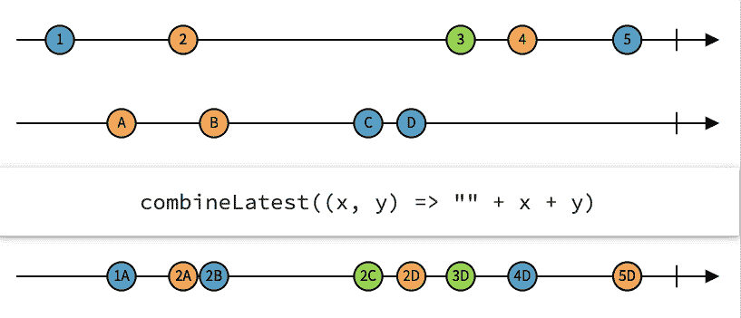

在同一家餐馆，聪明的`waiter$`现在决定使用`combineLatest`运算符。

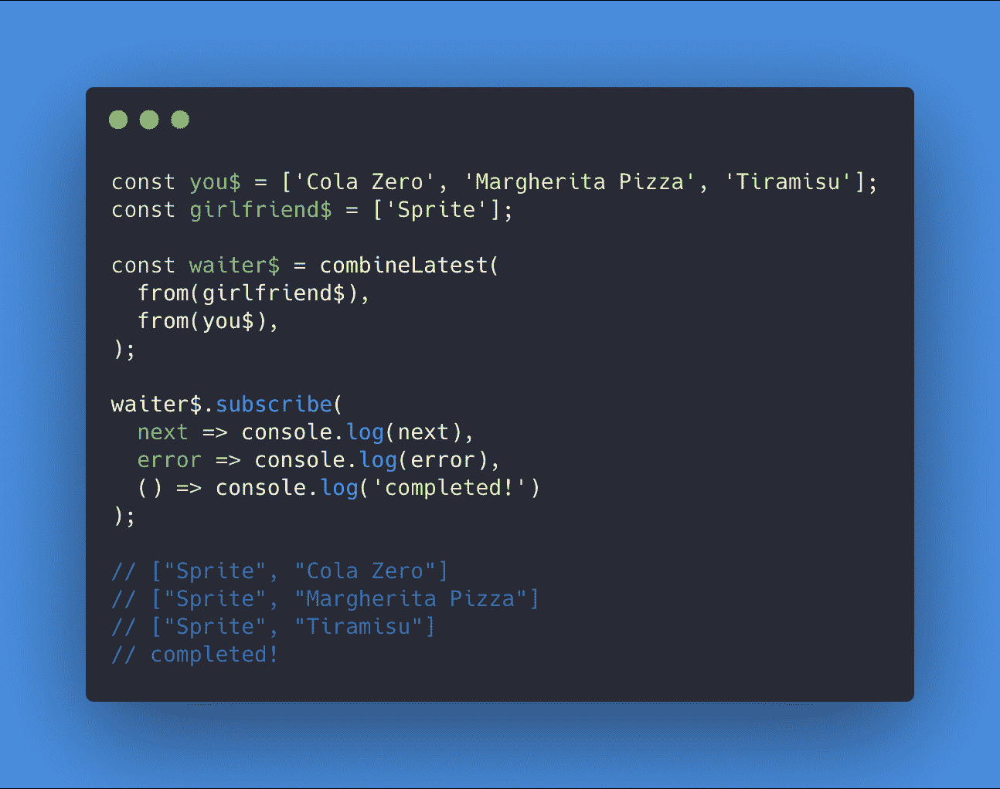

**警告￥t1**

有了`combineLatest`，所提供的内部观察值的**顺序**就很重要了。

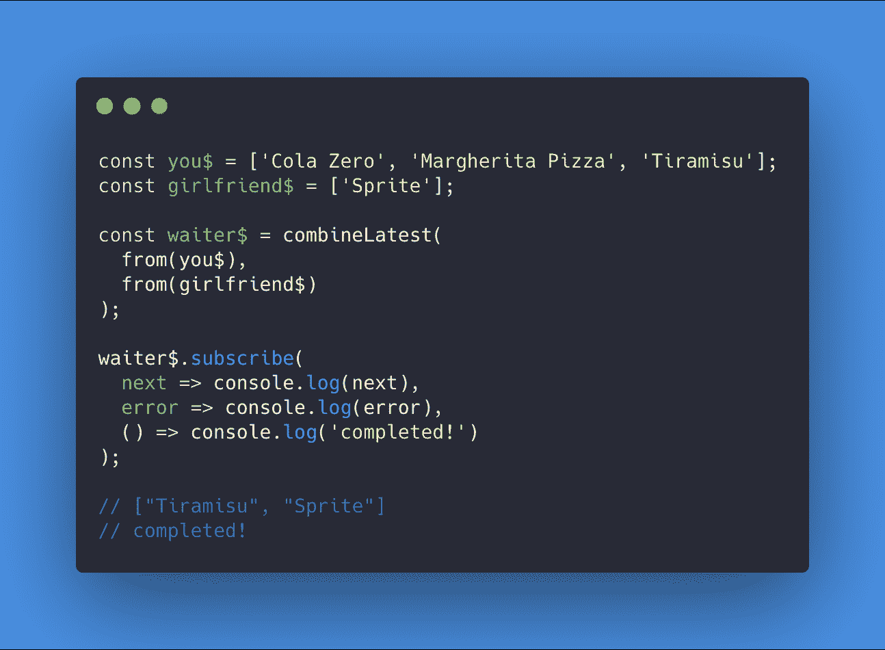

如果先将`you$`提供给`waiter$`，它将只发出一个值`["Tiramisu", "Sprite"]`。

这是因为`combineLatest`直到每个内部可观察对象发出至少一个值时才开始发出。当第一个内部可观测值发出最后一个值时，开始发出。然后，`combineLatest`发出从两个内部观测值收集的最后值。

# forkJoin()

*   `forkJoin`在**所有**完成后，从每个内部可观测量中发出最后一次发出的值
*   如果其中一个观测不完整，将永远不会发射

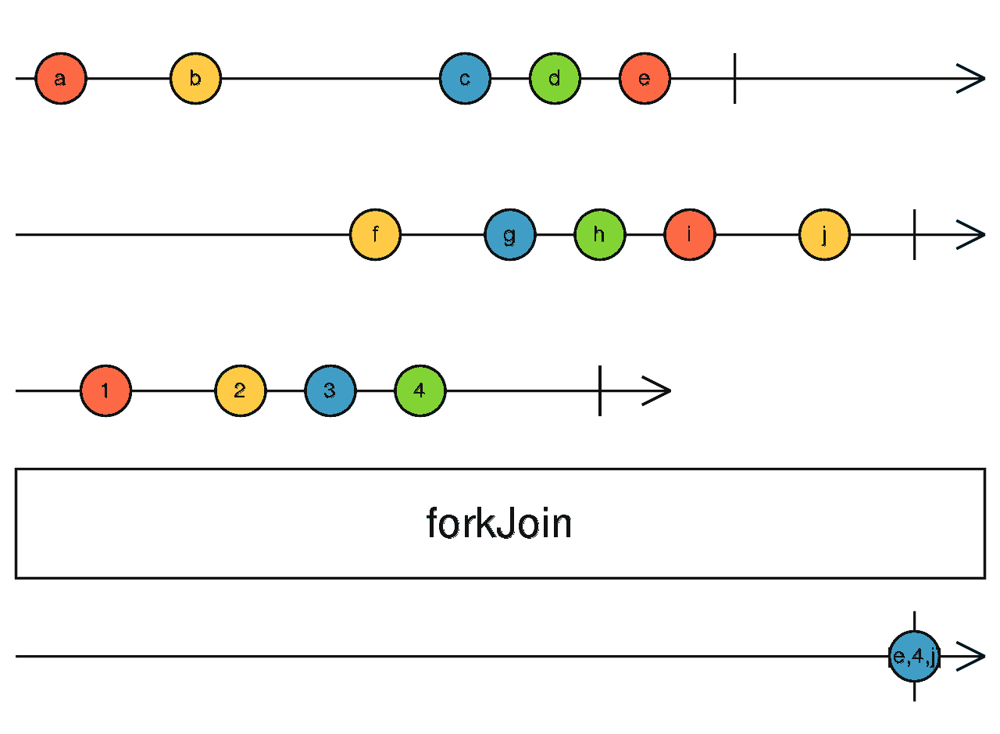

当你去餐馆点比萨饼时，你不会想知道比萨饼是如何制作的所有步骤。如果奶酪在西红柿之前加入，或者相反。你只是想得到你的披萨！这就是`forkJoin`发挥作用的地方。

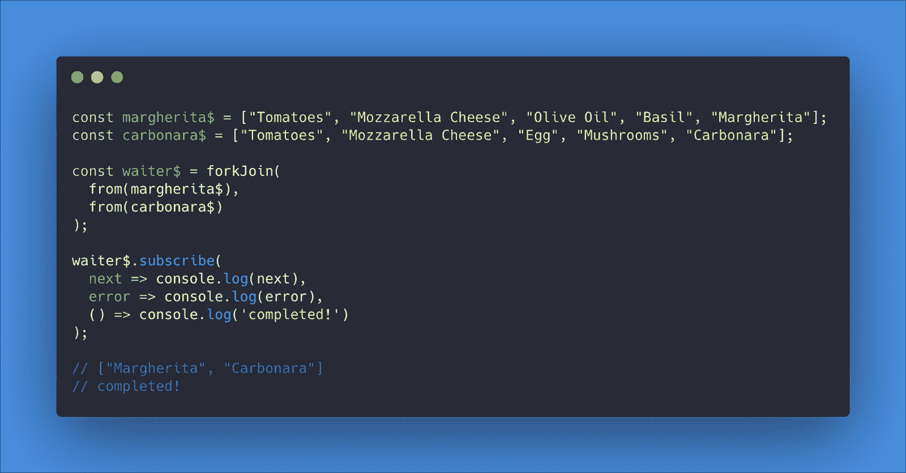

**警告￥t1**

*   如果其中一个内部观察值抛出错误，所有值都将丢失
*   `forkJoin`没完成

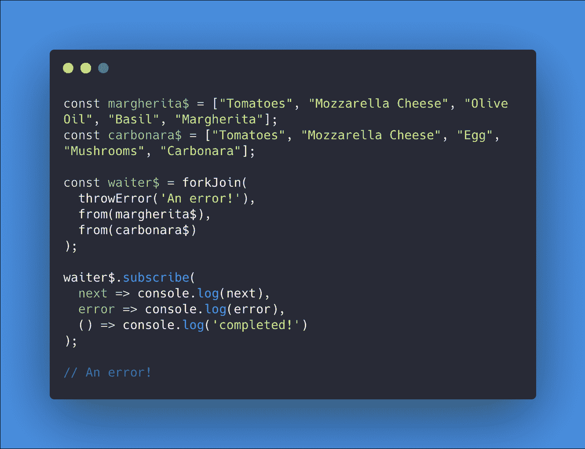

*   如果你只关心**所有的**内部观测成功完成，你可以从外部的**中捕捉到错误**
*   然后，`forkJoin`完成

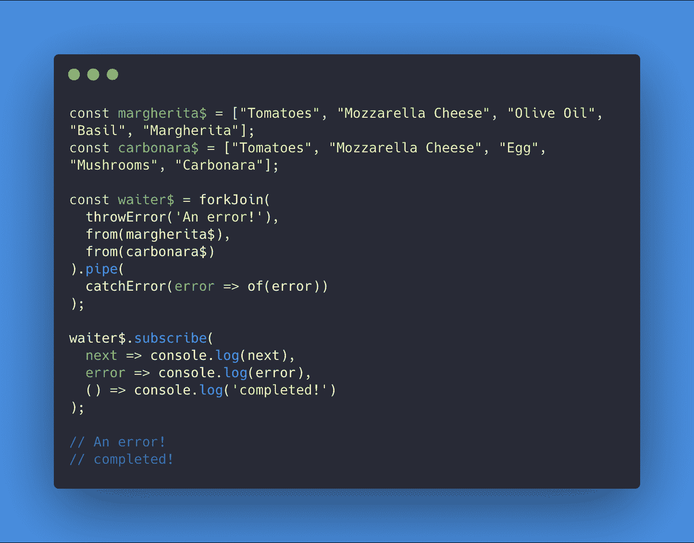

*   如果你不在乎内部观察成功与否，你必须从每一个内部观察中捕捉错误
*   然后，`forkJoin`完成

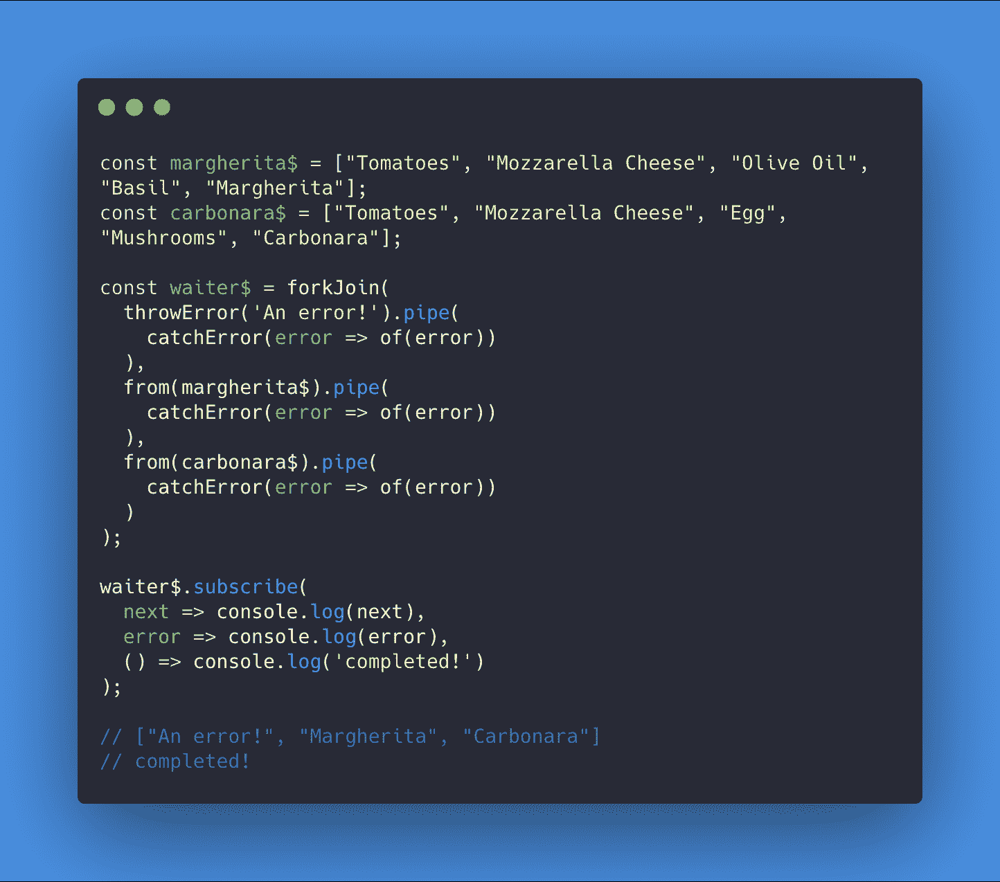

就我个人而言，当我和朋友一起去餐馆时，我不会在意他们中的一个人是否收到了烧焦的披萨。我只想要我的？所以我会要求`waiter$`从内在的可观察到的事物中单独捕捉错误。

# 包裹

我们在这篇文章中讨论了很多！好的例子对于更好地理解 RxJS 操作符以及如何明智地选择它们很重要。

对于像`zip`、`combineLatest`和`forkJoin`这样的组合运算符，你提供的内部可观察值的顺序也是至关重要的，因为它会驱使你做出意想不到的行为。

RxJS 中还有更多的内容，我将在以后的文章中介绍。

我希望你喜欢这篇文章！？

？您可以[在 Twitter 上关注我](https://twitter.com/tSamoss)以获得关于新 Angular/RxJS 博客帖子和酷技巧的通知！