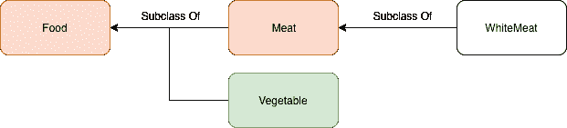
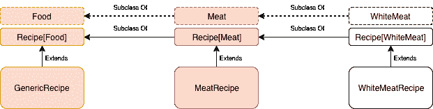
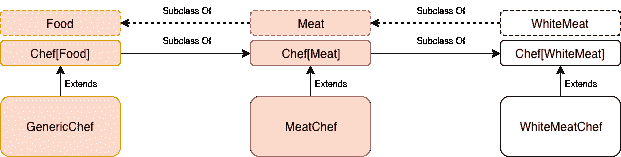

# 如何通过建造餐厅来理解 Scala variances

> 原文：<https://www.freecodecamp.org/news/understand-scala-variances-building-restaurants/>

我知道类型差异不是编写 Scala 代码的基础。我在日常工作中使用 Scala 已经差不多一年了，老实说，我从来没有担心过这个问题。

但是，我觉得这是一个有趣的“高级”课题，于是开始研究。立即理解它并不容易，但是如果有正确的例子，理解起来可能会容易一点。让我试着用一个基于食物的类比...

## 什么是类型方差？

首先，我们要定义什么是类型方差。当你用面向对象的语言开发时，你可以定义复杂的类型。这意味着一个类型可以用另一个类型(组件类型)来参数化。

想一想`List`的例子。如果不指定列表中包含哪些类型，就不能定义`List`。你可以把列表中包含的类型放在方括号中:`List[String]`。定义复杂类型时，可以根据组件类型及其子类型之间的关系，指定如何改变其子类型关系。

好吧，听起来很乱...让我们实际一点。

## 建立一个餐饮帝国

我们的目标是建立一个餐饮帝国。我们想要普通的和专业的餐馆。我们将开设的每家餐厅都需要一份由不同食谱组成的菜单，以及一名(可能)明星厨师。

食谱可以由不同种类的食物(鱼、肉、白肉、蔬菜等)组成。)，而我们聘请的厨师必须会做那种菜。这是我们的模型。现在是编码时间！

## 不同种类的食物

对于我们基于食物的例子，我们从定义`Trait Food`开始，只提供食物的名称。

```
trait Food {

  def name: String

} 
```

然后我们可以创建`Meat`和`Vegetable`，它们是`Food`的子类。

```
class Meat(val name: String) extends Food 
```

```
class Vegetable(val name: String) extends Food 
```

最后，我们定义了一个`WhiteMeat`类，它是`Meat`的子类。

```
class WhiteMeat(override val name: String) extends Meat(name) 
```

听起来很合理，对吗？所以我们有这种类型的层次结构。



我们可以创建一些不同类型的食物实例。它们将会是我们在餐厅提供的食谱的原料。

```
// Food <- Meat
val beef = new Meat("beef")

// Food <- Meat <- WhiteMeat
val chicken = new WhiteMeat("chicken")
val turkey = new WhiteMeat("turkey")

// Food <- Vegetable
val carrot = new Vegetable("carrot")
val pumpkin = new Vegetable("pumpkin") 
```

## 配方，协变类型

让我们定义协变类型`Recipe`。它采用一个组件类型来表示食谱的基本食物——即基于肉、蔬菜等的食谱。

```
trait Recipe[+A] {

  def name: String

  def ingredients: List[A]

} 
```

这个`Recipe`有名字和成分列表。配料表有同类型的`Recipe`。为了表示`Recipe`在其类型`A`中是协变的，我们将其写为`Recipe[+A]`。通用食谱基于每一种食物，肉类食谱基于肉类，而白肉食谱在其配料清单中只有白肉。

```
case class GenericRecipe(ingredients: List[Food]) extends Recipe[Food] {

  def name: String = s"Generic recipe based on ${ingredients.map(_.name)}"

} 
```

```
case class MeatRecipe(ingredients: List[Meat]) extends Recipe[Meat] {

  def name: String = s"Meat recipe based on ${ingredients.map(_.name)}"

} 
```

```
case class WhiteMeatRecipe(ingredients: List[WhiteMeat]) extends Recipe[WhiteMeat] {

  def name: String = s"Meat recipe based on ${ingredients.map(_.name)}"

} 
```

如果一个类型遵循其组成类型的子类型的相同关系，则该类型是协变的。这意味着`Recipe`遵循其组成食物相同的亚型关系。



让我们定义一些将成为不同菜单一部分的食谱。

```
// Recipe[Food]: Based on Meat or Vegetable
val mixRecipe = new GenericRecipe(List(chicken, carrot, beef, pumpkin))
// Recipe[Food] <- Recipe[Meat]: Based on any kind of Meat
val meatRecipe = new MeatRecipe(List(beef, turkey))
// Recipe[Food] <- Recipe[Meat] <- Recipe[WhiteMeat]: Based only on WhiteMeat
val whiteMeatRecipe = new WhiteMeatRecipe(List(chicken, turkey)) 
```

## 厨师，一个相反的类型

我们定义了一些食谱，但是我们需要一个厨师来烹饪。这给了我们谈论逆变的机会。如果一个类型遵循其组成类型的子类型的逆关系，则该类型是逆变的。让我们定义我们的复杂类型`Chef`，它是组件类型中的逆变。组件类型将是厨师可以烹饪的食物。

```
trait Chef[-A] {

  def specialization: String

  def cook(recipe: Recipe[A]): String
} 
```

一个`Chef`有一个专业和方法来烹饪一个基于特定食物的食谱。我们表示把它写成`Chef[-A]`是逆变。现在，我们可以创造一个能够烹饪普通食物的厨师，一个能够烹饪肉类的厨师和一个专门烹饪白肉的厨师。

```
class GenericChef extends Chef[Food] {

  val specialization = "All food"

  override def cook(recipe: Recipe[Food]): String = s"I made a ${recipe.name}"
} 
```

```
class MeatChef extends Chef[Meat] {

  val specialization = "Meat"

  override def cook(recipe: Recipe[Meat]): String = s"I made a ${recipe.name}"
} 
```

```
class WhiteMeatChef extends Chef[WhiteMeat] {

  override val specialization = "White meat"

  def cook(recipe: Recipe[WhiteMeat]): String = s"I made a ${recipe.name}"
} 
```

由于`Chef`是逆变的，`Chef[Food]`是`Chef[Meat]`的子类，而【】是`Chef[WhiteMeat]`的子类。这意味着子类型之间的关系与其组成类型 Food 相反。



好了，我们现在可以定义在我们的餐馆里雇佣不同的专业厨师了。

```
// Chef[WhiteMeat]: Can cook only WhiteMeat
val giuseppe = new WhiteMeatChef
giuseppe.cook(whiteMeatRecipe)

// Chef[WhiteMeat] <- Chef[Meat]: Can cook only Meat
val alfredo = new MeatChef
alfredo.cook(meatRecipe)
alfredo.cook(whiteMeatRecipe)

// Chef[WhiteMeat]<- Chef[Meat] <- Chef[Food]: Can cook any Food
val mario = new GenericChef
mario.cook(mixRecipe)
mario.cook(meatRecipe)
mario.cook(whiteMeatRecipe) 
```

## 餐馆，东西聚集的地方

我们有食谱，我们有厨师，现在我们需要一个餐厅，厨师可以烹饪食谱菜单。

```
trait Restaurant[A] {

  def menu: List[Recipe[A]]
  def chef: Chef[A]

  def cookMenu: List[String] = menu.map(chef.cook)
} 
```

我们对餐厅之间的子类型关系不感兴趣，可以定义为不变量。不变类型不遵循组件类型的子类型之间的关系。换句话说，`Restaurant[Food]`不是`Restaurant[Meat]`的子类或超类。他们根本不相关。我们将有一个 T2，在那里你可以吃到不同种类的食物。`MeatRestaurant`专门做以肉类为主的菜肴，而`WhiteMeatRestaurant`只专门做以白肉为主的菜肴。每个要实例化的餐馆都需要一个菜单，也就是一个食谱列表，以及一个能够烹饪菜单中的食谱的厨师。这里是`Recipe`和`Chef`的子类型关系发挥作用的地方。

```
case class GenericRestaurant(menu: List[Recipe[Food]], chef: Chef[Food]) extends Restaurant[Food] 
```

```
case class MeatRestaurant(menu: List[Recipe[Meat]], chef: Chef[Meat]) extends Restaurant[Meat] 
```

```
case class WhiteMeatRestaurant(menu: List[Recipe[WhiteMeat]], chef: Chef[WhiteMeat]) extends Restaurant[WhiteMeat] 
```

让我们开始定义一些通用的餐馆。在普通餐馆里，菜单由各种食物的食谱组成。因为`Recipe`是协变的，所以`GenericRecipe`是`MeatRecipe`和`WhiteMeatRecipe`的超类，所以我可以将它们传递给我的`GenericRestaurant`实例。对于厨师来说，事情是不同的。如果餐馆需要一个会做一般食物的厨师，我不能让一个只会做特定食物的厨师加入。类`Chef`是协变的，所以`GenericChef`是`MeatChef`的子类，而`MeatChef`是`WhiteMeatChef`的子类。这意味着我不能向我的实例传递任何不同于`GenericChef`的东西。

```
val allFood = new GenericRestaurant(List(mixRecipe), mario)
val foodParadise = new GenericRestaurant(List(meatRecipe), mario)
val superFood = new GenericRestaurant(List(whiteMeatRecipe), mario) 
```

同样的道理也适用于`MeatRestaurant`和`WhiteMeatRestaurant`。我只能传递给实例一个菜单，它由比所需的更具体的食谱组成，但是厨师可以烹饪比所需的更普通的食物。

```
val meat4All = new MeatRestaurant(List(meatRecipe), alfredo)
val meetMyMeat = new MeatRestaurant(List(whiteMeatRecipe), mario) 
```

```
val notOnlyChicken = new WhiteMeatRestaurant(List(whiteMeatRecipe), giuseppe)
val whiteIsGood = new WhiteMeatRestaurant(List(whiteMeatRecipe), alfredo)
val wingsLovers = new WhiteMeatRestaurant(List(whiteMeatRecipe), mario) 
```

就这样，我们的餐馆帝国准备好赚大钱了！

## 结论

好了，伙计们，在这个故事中，我尽力解释了 Scala 中的类型差异。这是一个高级的话题，但出于好奇，还是值得了解一下。我希望餐馆的例子能有助于使它更容易理解。如果有些地方不清楚，或者我写错了(我还在学习！)不要犹豫，留下评论吧！

再见！？