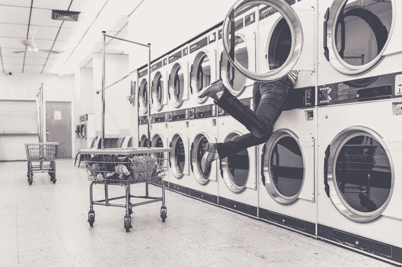

# 通过家务理解异步 JavaScript 回调

> 原文：<https://www.freecodecamp.org/news/understanding-asynchronous-javascript-callbacks-through-household-chores-e3de9a1dbd04/>

作者斯蒂芬·马约

# 通过家务理解异步 JavaScript 回调



#### 如果你曾经洗过衣服，你就能理解面试是如何进行的。

前几天，我读了凯文·科诺年科(Kevin Kononenko)写的非常有趣且易于理解的 MVC 框架指南。他通过在酒吧点饮料来解释[模型-视图-控制器范例，我认为这是我最喜欢的编程解释之一！](https://medium.freecodecamp.com/model-view-controller-mvc-explained-through-ordering-drinks-at-the-bar-efcba6255053#.9bjays8jc)

我真的很欣赏它，因为它写得没有自命不凡或精英主义的味道，这让我想知道为什么许多其他有经验的程序员不能帮助没有这种态度的新手？

我目前在韩国教英语，我们老师必须一直像凯文一样思考。如今，明确解释语法概念真的不太好，所以好老师会尝试用故事、电影、音乐和图像将目标语言(即他们想教的语法或词汇)融入语境。

这种教学方法在 20 世纪 80 年代受到了英国语言学家的影响，并影响了今天的现代外语教学法。也许同样的事情现在正发生在编码教育上！

Kevin 将是一个很难理解的角色，但是我想通过做日常家务的上下文来解释 JavaScript 中异步回调是如何工作的。

#### 同步蜜汁清单

大声对我的妻子说，在我学习编码的时候，她一直在做双倍的家务。我欠她太多了！

我通常在周日帮忙做家务，她为我列出的甜蜜清单是这样的:

1.  洗衣服
2.  给狗洗澡
3.  分类回收
4.  平衡预算
5.  想想我们晚餐吃什么。

撇开技术不谈:从本质上讲，JavaScript 是一种同步编程语言，这意味着它一次运行一行代码。在当前行执行完毕之前，它不能继续执行下一行代码。考虑这个例子:

```
function syncChores() {  console.log('Do the laundry');  console.log('wash the dog');  console.log('sort the recycling');}
```

```
syncChores();
```

```
/* Output appears in the same order it was written:
```

```
 Do the laundry   wash the dog   sort the recycling
```

```
*/
```

现在想象一下，如果我在现实生活中同步做家务。会发生什么？那会是什么样子？

如果你回到我的清单，你会发现洗衣服是第一项。完成一个典型的洗涤周期大约需要 35 分钟，另外还需要 45 分钟烘干一批衣物。因此，在这 80 分钟里，我只是懒洋洋地坐着，不做任何其他杂务，同时等待衣服洗完。

这是伪代码的样子:

```
function doLaundry() {  startWashCycle();  switchToDryer();  foldAndIronClothes();}
```

```
function washDog() {  // imagine some dog-washing code here}
```

```
function sortRecycling() {  // and imagine some sorting code here}
```

```
doLaundry();// Now wait a full 80 minutes before completing other functions
```

```
// Now I can finally wash my dog!washDog();sortRecycling();
```

不是很有效率吧？在现实生活中，忙碌的成年人会异步处理这些家务，这意味着他们会开始洗衣服，继续做清单上的其他任务，并在洗衣周期结束后回到洗衣房。

当衣服洗好了的时候，回到洗衣房的动作类似于 JavaScript 的回调函数，我们的洗衣机会用一些警报或蜂鸣器来召唤我们！这让我们可以继续做其他家务，然后在洗衣工作准备好的时候继续做。

#### 异步蜜饯列表

让我们再次做家务，这次是异步的。伪代码是什么样子的？

```
function doLaundry(callback) {  // imagine initial code that kicks off wash cycle  // takes 80 minutes to complete wash cycle
```

```
 callback(err, cleanLaundry);}
```

```
doLaundry(function(err, cleanLaundry) {  // sometimes our washing machines break down  // better handle that possible error
```

```
 if (err) throw err;
```

```
 // if no errors, switch to dryer after wash is complete
```

```
 // Tada! Our call back alerting us that washing is complete!
```

```
 switchToDryer(cleanLaundry);
```

```
});
```

```
// as we wait, JavaScript will run this stuff now!
```

```
washDog();
```

```
// still time for more chores!
```

```
sortRecycling();
```

```
// the following will be undefined because it is not yet ready
```

```
console.log(cleanLaundry);
```

```
// Now the laundry is ready! // Let's go back and switch clothes to the dryer
```

```
// The clothes are drying. Let's continue doing more chores.// Tanya will be impressed with my productivity!
```

```
balanceBudget();
```

和 Kevin 的文章一样，这只是为了澄清回调的概念。如果你想要一个更实用的指南，看看[回拨地狱](http://callbackhell.com)。

#### 轮到你了

如果你能把抽象的概念应用到实际情况中，那会很有帮助。你能想一想你在家里、学校或工作中做的类似同步和异步代码的事情吗？把它们写在下面的评论里吧！