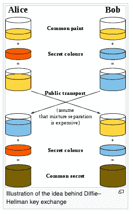
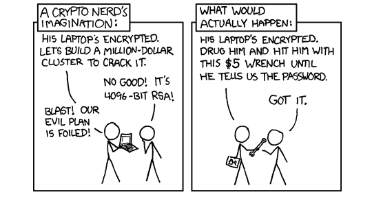

# 举例说明加密算法

> 原文：<https://www.freecodecamp.org/news/understanding-encryption-algorithms/>

最基本的密码学是使用代码和密码来保护信息的科学。

加密是对消息进行编码，目的是只让预期的接收者理解消息的含义。这是一个双向功能(您需要能够撤销对消息所做的任何扰乱)。这是为了保护传输中的数据。

如果您正在寻找对称和非对称算法之间的差异的一般背景，以及什么是加密的一般概述，请从这里开始。本文将主要介绍两种最常用的加密算法。

总的来说，对称算法在最初创建时有一个主要问题——它们只有在双方都知道共享秘密的情况下才能有效运行。如果他们不这样做，在没有第三方窃听的情况下安全地交换密钥是极其困难的。

如果第三方获得了密钥，他们就很容易破解加密，破坏了安全通信的目的。

Diffie-Hellman 通过允许陌生人在公共信道上交换信息来解决这个问题，这些信息可以用来形成一个共享密钥。共享密钥很难破解，即使所有通信都被监控。

## 迪菲-海尔曼是怎么工作的？

Diffie-Hellman 就是所谓的密钥交换协议。这是 Diffie-Hellman 的主要用途，尽管它也可以用于加密(通常不是，因为使用 D-H 交换密钥更有效，然后切换到(明显更快的)对称加密进行数据传输)。

其工作方式如下:

[https://en.wikipedia.org/wiki/Diffie–Hellman_key_exchange#/media/File:Diffie-Hellman_Key_Exchange.svg](https://en.wikipedia.org/wiki/Diffie%E2%80%93Hellman_key_exchange#/media/File:Diffie-Hellman_Key_Exchange.svg)

基本上，有两方，Alice 和 Bob，同意一种起始颜色(任意的，但每次都必须不同)。他们还有一种他们自己保留的秘密颜色。然后，他们将这种颜色与共享颜色混合，产生两种不同的颜色。然后，他们将这种颜色传递给另一方，另一方将这种颜色与他们的秘密颜色混合，从而得到相同的秘密颜色。

这依赖于将两种颜色混合在一起相对容易，但是为了找到秘密颜色而将它们分开是非常困难的想法。实际上，这是用数学来完成的。

例如:

1.  鲍勃和爱丽丝同意两个数字，一个大素数，p = 29，基数 g = 5
2.  现在，鲍勃选择了一个秘密数字 x (x = 4 ),并执行以下操作:X = g^x % p(在这种情况下,%表示余数。例如，3%2 是 3/2，余数是 1)。X = 5 ^4 % 29 = 625 % 29 = 16
3.  爱丽丝还选择了一个秘密数字 y (y = 8 ),并执行以下操作:Y = g^y % p. Y = 5 ^ 8 % 29 = 390，625 % 29 = 24
4.  鲍勃将 X 发送给爱丽丝，爱丽丝将 Y 发送给鲍勃。
5.  然后鲍勃做了如下的事情:K = Y^x % p，K = 24 ^ 4 % 29 = 331，776 % 29 = 16
6.  然后，爱丽丝做了如下操作:K = X^y % p，K = 16 ^ 8 % 29 = 4，294，967，296 % 29 = 16

最棒的(*可能是神奇的*)是，鲍勃和爱丽丝都有相同的数字 K，现在可以用这个秘密交谈，因为没有其他人知道 K。

该协议的安全性取决于几个因素:

1.  (事实)生成素数相对容易，即使是大素数(比如 p)。
2.  (事实)模幂运算很容易。换句话说，计算 X = g ^ x % p 相对容易
3.  (基于当前计算能力和数学的假设)没有质因数的模根提取非常困难。本质上，如果不知道 X 和 y，就很难找到 K，即使你已经窥探了流量，可以看到 p，g，X 和 y。

因此，假设这是正确实现的，那么做创建密钥所需的数学计算相对容易，但是做试图通过暴力破解密钥所需的数学计算是极其困难和耗时的。

即使攻击者能够破解这个密钥，Diffie-Hellman 也允许完美的前向保密。

### 什么是完全前向保密？

这就是说，如果你破解了服务器现在用来通信的加密，并不意味着服务器曾经进行的所有通信都能够被读取。

换句话说，它只允许你看到现在正在使用的通信(即与这个秘密密钥)。由于每组通信都有不同的密钥，因此您必须分别破解它们。

如果每个会话都有一个不同的临时密钥，这是可能的。因为 Diffie-Hellman 总是为每个会话使用新的随机值，(因此为每个会话生成新的密钥)，所以它被称为短暂的 Diffie Hellman (EDH 或 DHE)。许多密码套件利用这一点来实现完美的前向保密。

由于 Diffie-Hellman 允许您以纯文本形式交换密钥材料，而不用担心泄露共享的秘密，并且算法对于攻击者来说太复杂而无法暴力破解，因此攻击者无法获得会话密钥(即使他们可以获得会话密钥，为每个会话使用不同的、短暂的密钥意味着他们只能窥探这个会话——过去或将来都不能)。

任何 Diffie-Hellman 密钥交换都支持前向保密，但只有临时密钥交换(每个会话使用不同的密钥)才能提供完美的前向保密。

Scott Helme 发表了一篇文章，深入探讨了这一点，并解释了如何在您的服务器上实现这一点。

### 迪菲-海尔曼的局限性是什么？

D-H 的最大限制是不验证身份。换句话说，任何人都可以声称自己是 Alice 或 Bob，并且没有内置的机制来验证他们的声明是真实的。

此外，如果实现不是以安全的方式进行的，算法可能会被足够的专用资源破解(不太可能，但对于学术团队或民族国家行为者来说是可能的)。

例如，如果没有为随机数生成器提供足够的熵来支持所需的强度，就会发生这种情况——换句话说，因为计算机生成的数字从来都不是真正随机的，所以您人为注入的不确定性的程度关系到您实现的强度。

此外，2015 年演示的一次攻击表明，当许多服务器使用相同的素数作为密钥交换的开始时，Diffie-Hellman 的整体安全性低于预期。

本质上，攻击者可以简单地预先计算对该素数的攻击，从而更容易危及任何使用该素数的服务器的会话。

这是因为数百万台服务器使用相同的质数进行密钥交换。预计算这种类型的攻击仍然需要学术或国家级别的资源，并且不太可能影响绝大多数人。

然而，对于那些必须担心民族国家攻击者的人来说，幸运的是，有一种不同的方法可以使用椭圆曲线加密(ECDHE)来实现 DH 密钥交换。这超出了本文的范围，但是如果您有兴趣了解更多关于这种交换背后的数学知识，请查看本文。

要更详细地了解 DH 的弱点，请查看白皮书和网站[。](https://weakdh.org/)

## 南非共和国(Republic of South Africa)

RSA 以创建者的名字命名——Rivest、Shamir、ad leman——它是一种生成公钥和私钥的方式。

从技术上讲，有两种 RSA 算法(一种用于数字签名，一种用于不对称加密。)——本文涵盖了非对称加密算法。

这允许进行密钥交换——首先为交易各方分配公钥/私钥，然后生成对称密钥，最后使用公钥/私钥对安全地传递共享对称密钥。

因为非对称加密通常比对称加密慢，并且不可伸缩，所以使用非对称加密来安全地交换对称密钥是非常常见的。

那么，它是如何工作的呢？

1.  选择 2 个非常大的质数(至少 512 位，或 155 个十进制数字)，x 和 y(这些数字需要保密并随机选择)
2.  找到产品，即 z = x*y
3.  在 3 和 n - 1 之间选择一个奇数的公共整数 e，与(x-1)(y-1)没有公因数(除了 1)(所以与 x-1 和 y-1 互质)。
4.  求 x - 1 和 y - 1 的最小公倍数，称为 l。
5.  从 x，y，e 计算私有指数 d . de = 1% L . d 是 e % L 的逆(你知道逆是存在的，因为 e 与 z - 1 和 y - 1 互质)。这个系统工作是因为 p = (p ^ e) ^d % z
6.  输出(z，e)作为公钥，输出(z，d)作为私钥。

现在，如果 Bob 想要发送消息给 Alice，他使用以下公式从明文(P)生成密文(C ):

C = P^e % z

为了解密该消息，Alice 计算如下:

P = C^d % z

d 和 e 之间的关系确保加密和解密函数是相反的。这意味着解密函数能够成功地恢复原始消息，并且在没有私钥(z，d)(或质因数 x 和 y)的情况下很难恢复原始消息。

这也意味着您可以在不损害系统安全性的情况下将 z 和 e 公开，这样您就可以很容易地与其他没有共享密钥的人进行通信。

您也可以使用相反的操作来获得邮件的数字签名。首先，对明文使用解密操作。例如，s =签名(p) = p ^ d % z

然后，收件人可以通过应用加密功能并将结果与邮件进行比较来验证数字签名。例如，m =验证(s) = S ^ e % z

通常，当这样做时，明文是消息的散列，这意味着您可以只通过一次取幂来对消息进行签名(不管长度如何)。

系统的安全性基于以下几点:

1.  (事实)生成质数相对容易，即使是大质数(像 x 和 y)。
2.  (事实)乘法很容易。很容易找到 z。
3.  (基于当前数学的假设)因式分解很难。给定 z，恢复 x 和 y 相对较难。这是可行的，但需要一段时间，而且成本很高。据估计，在一台价值 1000 万美元的机器上恢复一个 1024 位数的质因数需要一年时间。规模翻倍将会成倍增加所需的工作量(几十亿倍的工作量)。

    随着技术的不断进步，这些成本(和所需的工作)将会降低，但在这一点上，这种类型的加密，如果实施得当，不太可能成为妥协的来源。一般来说，只有民族国家的黑客才有这种资金和对单一目标的专注。此外，如果有一种更简单的方法来损害系统(见下文)，这可能是一个更好的选择。

[https://xkcd.com/538/](https://xkcd.com/538/)

4.(事实)模幂运算很容易。换句话说，计算 c = p ^ e % z 相对容易

5.(事实)如果你有质因数(如果你有 z，c，e 和质因数 x 和 y，很容易找到 p，使得 c = p ^ e % z)，模根提取-颠倒上述过程-很容易。

6.(基于当前计算能力和数学的假设)没有质因数的模根提取是非常困难的(如果你有 z，c，e，但是没有 x 和 y，找到 p 使得 c = p ^ e % z 是相对困难的，特别是如果 a 足够大)。

想向更聪明的人学习更多数学知识吗？查看这篇文章。

## 太好了，哪个更好？

这取决于您的用例。这两种算法之间有一些不同之处——首先是完全前向保密(PFS ),我们之前在 Diffie-Hellman 的上下文中讨论过。虽然从技术上来说，您可以生成短暂的 RSA 密钥对，并使用 RSA 提供完美的前向保密性，但计算成本比 Diffie-Hellman 高得多——这意味着 Diffie-Hellman 是 SSL/TLS 实现的更好选择，因为您需要完美的前向保密性。

虽然这两种算法之间存在一些性能差异(就服务器所需的工作而言)，但在选择一种算法时，性能差异通常不会大到足以产生影响。

相反，一般来说，确定哪种更好的主要考虑因素取决于哪种更受您的用例支持(例如，在实现 SSL 时，由于完美的前向保密性，您可能需要 Diffie Hellman ),或者哪种更受欢迎或被接受为行业标准。

例如，虽然 Diffie-Hellman 得到了美国政府的批准，并得到了一个机构的支持，但该标准并没有发布——而 RSA(由一个私人组织标准化)提供了一个免费的标准，这意味着 RSA 在私人组织中变得非常流行。

如果你有兴趣阅读更多，这里有一个很棒的关于差异的帖子。

有兴趣学习黑客如何使用密码攻击吗？试试来自 Cryptopals 的这一组挑战。

> 我对加密学了解得越多，就越觉得爱丽丝和鲍勃应该当面谈谈。
> 
> — Paul Reinheimer (@preinheimer) [March 13, 2017](https://twitter.com/preinheimer/status/841273046317060105?ref_src=twsrc%5Etfw)