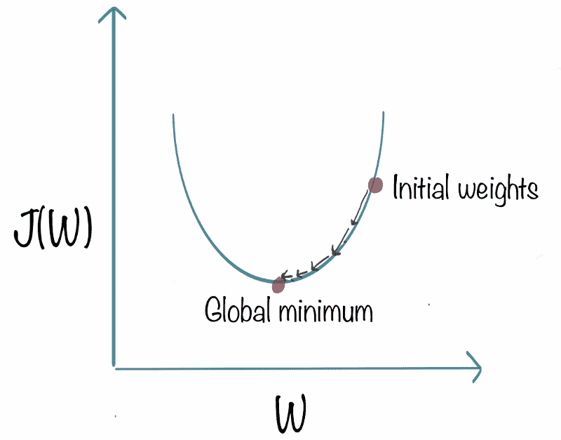

# 如何理解梯度下降，最流行的 ML 算法

> 原文：<https://www.freecodecamp.org/news/understanding-gradient-descent-the-most-popular-ml-algorithm-a66c0d97307f/>

作者:凯沙夫·丹达尼亚

# 如何理解梯度下降，最流行的 ML 算法

梯度下降是用于训练机器学习模型的最流行和最广泛使用的算法之一。

[机器学习](https://www.commonlounge.com/discussion/9325cf512f514e21815ec4c2e2e6e0e3)模型通常具有参数(权重和偏差)和成本函数，以评估一组特定参数有多好。许多机器学习问题归结为为最小化成本函数的模型寻找一组权重。

比如，如果预测是 *p* ，目标是 *t* ，我们的误差度量是平方误差，那么代价函数 *J(W) = (p - t)* 。

注意，预测值 *p* 取决于输入 *X* 以及机器学习模型和参数 *W* 的(当前)值。在训练过程中，我们的目标是找到一组 *W* 的值，使得 *(p - t)* 很小。这意味着我们的预测 *p* 将接近目标 *t* 。

Gradient descent illustration for Linear Regression

梯度下降是一种迭代方法。我们从模型参数(权重和偏差)的一些值开始，并慢慢地改进它们。

为了改进给定的一组权重，我们尝试获得与当前权重相似的权重的成本函数值(通过计算梯度)。然后我们朝着降低成本函数的方向前进。

通过重复这个步骤数千次，我们将不断地最小化我们的成本函数。

### 梯度下降的伪代码

梯度下降用于最小化由模型参数 *W* 参数化的成本函数 *J(W)* 。

梯度(或导数)告诉我们成本函数的倾斜度或斜率。因此，为了最小化成本函数，我们向与梯度相反的方向移动。

1.  **随机初始化**权重 *W* 。
2.  **计算成本函数 w.r.t 参数的梯度** *G* 。这是使用偏微分来完成的: *G = ∂J(W)/∂W.* 梯度的值 *G* 取决于输入、模型参数的当前值和成本函数。如果你手动计算梯度，你可能需要重温微分的主题。
3.  **以与 G 成比例的量更新权重**，即 *W* = *W - ηG*
4.  重复进行，直到成本 *J* ( *w* )停止降低，或者满足一些其他预定义的**终止标准**。

在步骤 3 中， *η* 是**学习速率**，它决定了我们达到最小值所采取的步长。我们需要非常小心这个参数。 *η* 的高值可能超过最小值，非常低的值将非常缓慢地达到最小值。

终止标准的一个流行选择是成本 *J* ( *w* )在验证数据集上停止减少。

### 梯度下降的直觉

想象你被蒙住眼睛在崎岖不平的地形上，你的目标是到达最低的高度。

你可以使用的一个最简单的策略是从各个方向感受地面，并向地面下降最快的方向迈一步。

如果你不断重复这个过程，你可能会在湖边结束，或者更好，在巨大的山谷中的某个地方。

*Source: [Andrej Karpathy’s Stanford Course Lecture 3](http://bit.ly/2e7pXyx)*

崎岖的地形类似于成本函数，最小化成本函数类似于试图到达更低的高度。

你是盲目的，因为我们没有奢侈的评估(或“看到”)每一个可能的参数集的函数值。

感觉你周围地形的坡度类似于计算坡度，而迈出一步类似于更新参数的一次迭代。

顺便说一下——作为一个小题外话——本教程是 [Commonlounge](https://www.commonlounge.com/) 上的[免费数据科学课程](https://www.commonlounge.com/discussion/367fb21455e04c7c896e9cac25b11b47)和[免费机器学习课程](https://www.commonlounge.com/discussion/33a9cce246d343dd85acce5c3c505009/main)的一部分。这些课程包括许多实践作业和项目。如果你对学习数据科学/ ML 感兴趣，绝对推荐去看看。

### 梯度下降的变体

梯度下降有多种变体，取决于有多少数据用于计算梯度。

这些变化的主要原因是计算效率。一个数据集可能有数百万个数据点，计算整个数据集的梯度在计算上可能非常昂贵。

*   **批量梯度下降**计算**整个训练数据**的成本函数 w.r.t 对参数 *W* 的梯度。由于我们需要计算整个数据集的梯度来执行一次参数更新，批量梯度下降可能会非常慢。
*   **随机梯度下降(SGD)** 使用**单个训练数据点** *x_i* (随机选择)计算每次更新的梯度。想法是这样计算的梯度是使用整个训练数据计算的梯度的随机近似。现在，每次更新的计算速度都比批量梯度下降快得多，经过多次更新，我们将朝着相同的方向前进。
*   在**小批量梯度下降**中，我们计算每个小批量训练数据的梯度。也就是我们先把训练数据分成小批(比如说每批 *M* 个样本)。我们对每个小批量执行一次更新。 *M* 通常在 30–500 的范围内，这取决于问题。通常使用小批量 GD，因为计算基础设施——编译器、CPU、GPU——通常针对执行向量加法和向量乘法进行了优化。

其中，SGD 和小批量 GD 最受欢迎。

在典型的场景中，在满足终止标准之前，我们对训练数据进行多次检查。每一遍被称为一个*时期*。另外，请注意，由于在 SGD 和小批量 GD 中，更新步骤的计算效率要高得多，因此我们通常会在满足终止标准的检查之间执行 100-1000 次更新。

### 选择学习率

通常，学习率的值是手动选择的。我们通常从诸如 0.1、0.01 或 0.001 的小值开始，并基于成本函数是非常缓慢地降低(增加学习率)还是爆炸/不稳定(降低学习率)来调整它。

虽然手动选择学习率仍然是最常见的做法，但已经提出了几种方法来自动选择合适的学习率，如 Adam optimizer、AdaGrad 和 RMSProp。

由 Keshav Dhandhania 和 Savan Visalpara 合著。

*最初发布于[www.commonlounge.com](https://www.commonlounge.com/discussion/69a34ad6029549f39087d00d052607ab/main)的[免费机器学习课程](https://www.commonlounge.com/discussion/33a9cce246d343dd85acce5c3c505009/main)和[免费数据科学课程](https://www.commonlounge.com/discussion/367fb21455e04c7c896e9cac25b11b47)的一部分。*