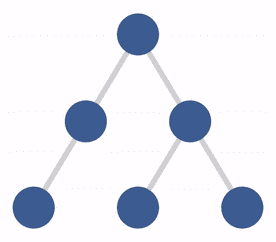
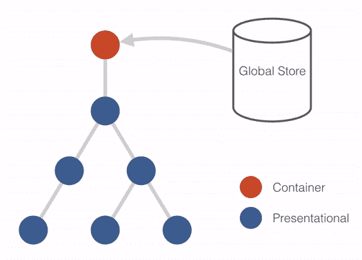
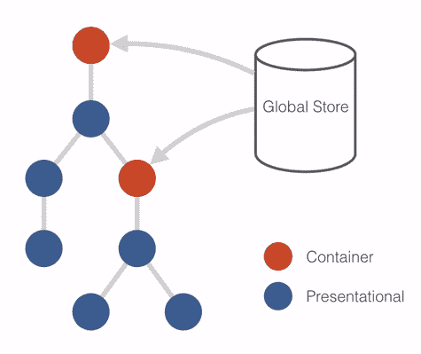

# 了解高阶元件

> 原文：<https://www.freecodecamp.org/news/understanding-higher-order-components-6ce359d761b/>

汤姆·科尔曼

# 了解高阶元件

#### 了解快速变化的反应最佳实践。

如果您是 React 新手，您可能听说过“高阶组件”和“容器”组件。如果是这样，你可能想知道这一切大惊小怪的是什么。或者，您可能已经为提供 API 的库使用了 API，但对术语有些困惑。

作为 Apollo 的 React integration 的维护者(这是一个流行的开源库，大量使用了高阶组件),也是它的大部分文档的作者，我自己也花了一些时间来理解这个概念。

我希望这篇文章也能对你有所启发。

### **一个反应再引物**

这篇文章假设你熟悉 React——如果不熟悉的话，这里有很多很棒的内容。例如，Sacha Greif 的 [5 React Concepts post](https://medium.freecodecamp.com/the-5-things-you-need-to-know-to-understand-react-a1dbd5d114a3) 是一个很好的起点。不过，让我们来回顾几件事情，让我们的故事更清晰。

React 应用程序由一组**组件**组成。一个组件被传递了一组输入属性(**道具**)并产生一些 HTML 呈现到屏幕上。当组件的属性改变时，它会重新呈现，HTML 也可能会改变。

当应用程序的用户通过某种事件(比如鼠标点击)与 HTML 交互时，组件通过触发一个**回调**属性或者改变某个内部**状态**来处理它。更改内部状态也会导致它及其子对象重新渲染。

这导致了组件的生命周期，因为组件是第一次呈现，附加到 DOM，传递新的道具等等。

组件的 render 函数返回一个或多个其他组件的实例。生成的**视图树**是一个很好的心智模型，要记住应用程序的组件是如何交互的。一般来说，他们只通过给孩子传递道具或触发父母传递的回调来互动。

Data flow in a React view tree

### **反应 UI vs 状态性**

现在看起来几乎过时了，但是曾经有一段时间，所有的东西都是按照模型、视图和控制器(或者视图模型，或者演示者，等等)之间的区别来描述的。在这种分类中，视图的任务是**渲染**并处理用户交互，控制器的任务是**准备数据**。

React 最近的一个趋势是向**功能性无状态组件**发展。这些最简单的“纯”组件只将它们的属性转换成 HTML，并在用户交互时调用回调属性:

它们是功能性的，因为你真的可以把它们当成功能。如果你的整个视图树都是由它们组成的，那么你实际上是在谈论一个大函数来产生由对许多小函数的调用组成的 HTML。

功能性无状态组件的一个很好的特性是它们非常容易测试，并且容易理解。这意味着它们更容易开发，调试更快。

但是你不能总是逃脱惩罚。UI 确实需要状态。例如，你的菜单可能需要在用户悬停在它上面时打开(唉，我希望不是！)—而在 React 中做到这一点的方法当然是使用 state。要使用状态，可以使用基于类的组件。

事情变得复杂的地方是将用户界面的“全局状态”连接到视图树中。

### 全球状态

UI 中的全局状态是与单个组件不直接且唯一相关的状态。它通常包含两种主要类型的内容:

1.来自某个服务器的应用程序中的**数据**。通常情况下，数据会在多个地方使用，因此不是单个组件独有的。

2.**全局 UI 状态**，(比如 URL，从而用户在看哪个页面)。

全局状态的一种方法是将其附加到应用程序中最高的“根”组件，并沿树向下传递给所有需要它的组件。然后，通过回调链将对该状态的所有更改传递回树中。

Data flow from the store into a view tree, with a single container

不过，这种方法很快就变得不实用了。这意味着根组件需要理解它的整个树的需求，同样也需要理解整个树中每个子树的每个父组件的需求。这就是下一个概念的来源。

### **容器和外观组件**

这个问题通常通过允许组件在视图树中的任何地方访问全局状态来解决(通常需要一些限制)。

在这个世界中，组件可以分为访问全局状态的组件和不访问全局状态的组件。

没有的“纯”组件是最容易测试和理解的(特别是如果它们是功能性的无状态组件)。一旦一种成分“不纯”，它就被污染了，很难处理。

出于这个原因，[出现了一种模式](https://medium.com/@dan_abramov/smart-and-dumb-components-7ca2f9a7c7d0)来将每个“不纯”的组件分成**两个**组件:

*   完成“脏”全局状态工作的**容器**组件
*   没有的**表示性**组件。

我们现在可以像对待上面的简单组件一样对待表示组件，并在容器中隔离脏的、复杂的数据处理工作。

Data flow with multiple containers

### 集装箱

一旦你同意了表示/容器组件的分离，编写容器组件就变得有趣了。

你注意到的一件事是，它们看起来根本不像一个组件。他们可能:

*   获取一个全局状态(比如来自 Redux)并传递给它们的子节点。
*   运行一个数据访问(比如 GraphQL)查询，并将结果传递给它们的子查询。

此外，如果我们遵循良好的关注点分离，我们的容器将**只呈现一个子组件**。容器必须绑定到子容器，因为子容器在渲染函数中是固定的。或者是？

### 一般化容器

对于任何“类型”的容器组件(例如访问 Redux 存储的组件)，实现看起来都是一样的，只是在细节上有所不同:它们呈现哪个子组件，以及它们获取哪些确切的数据。

例如，在 Redux 的世界中(如果我们没有`react-redux`的`connect` HOC ),一个容器可能看起来像:

尽管这个容器没有做真正的 Redux 容器会做的大部分事情，但是你已经可以看到，除了我们正在包装的`mapStateToProps`和特定的`MyComponent`的实现之外，还有很多样板文件，我们每次编写 Redux 访问容器时都必须编写**。**

### 生成容器

事实上，更简单的方法可能是编写一个函数，让**根据相关信息生成**容器组件(在本例中是子组件和`mapStateToProps`函数)。

这是一个**高阶组件** (HOC)，它是一个**函数**，接受一个子组件和一些选项，然后为该子组件构建一个容器。

它是“高阶的”，就像“高阶函数”——一个构建函数的函数。事实上，您可以将 React 组件视为产生 UI 的功能。这对于功能性的无状态组件尤其适用，但是如果你仔细看，它对于纯有状态的表示组件也适用。特设正是一个高阶函数。

### **hoc 示例**

有很多，但有一些值得注意的:

*   最常见的大概就是 [Redux 的](http://redux.js.org) `connect`函数，上面我们的`buildReduxContainer`函数不过是寒酸版的。
*   [React 路由器的](https://github.com/ReactTraining/react-router) `withRouter`功能，该功能简单地将路由器从上下文中抓取出来，并使其成为孩子的道具。
*   `[react-apollo](http://dev.apollodata.com/react/)`的主接口是`graphql` HOC，给定一个组件和一个 GraphQL 查询，它将查询结果提供给孩子。
*   [Recompose](https://github.com/acdlite/recompose) 是一个充满 hoc 的库，它完成各种你可能想从组件中抽象出来的小任务。

### **定制 hoc**

你应该在你的应用程序中编写新的 hoc 吗？当然，如果你有可以通用的组件模式。

> 除了简单地共享实用程序库和简单的组合，hoc 是在 React 组件之间共享行为的最佳方式。

编写一个 HOC 就像返回一个类的函数一样简单，就像我们在上面看到的`buildReduxContainer`函数一样。如果你想了解更多关于当你建造 hoc 时你能做什么，我建议你阅读弗兰·吉雅罗关于这个主题的极其全面的帖子。

### 结论

高阶组件本质上是以一种**功能**的方式对组件中的关注点进行分离的编码。React 的早期版本使用类和混合来实现代码重用，但所有迹象都表明这种更具功能性的方法将推动 React 的未来设计。

如果当你听到函数式编程技术的时候，你的眼睛变得呆滞无神，不要担心！React 团队已经做了大量的工作，他们从这些方法中提取了最简化的部分，引导我们去编写更加模块化、组件化的 ui。

如果你想学习更多关于以现代的、面向组件的方式构建应用程序的知识，请查看我在 [Chroma](http://hichroma.com) 的[系列文章](https://blog.hichroma.com/ui-components/home)，如果你喜欢这篇文章，请考虑？ing 并分享吧！