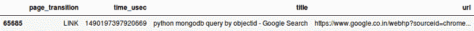
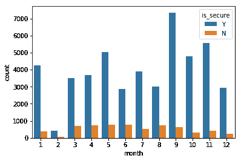
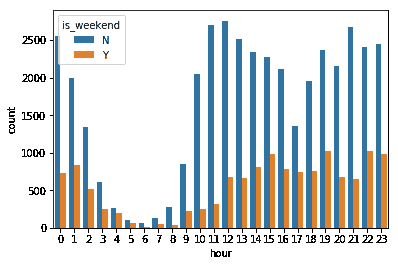
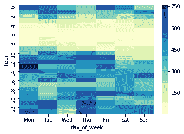
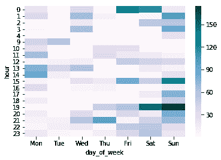
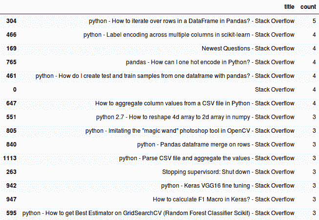
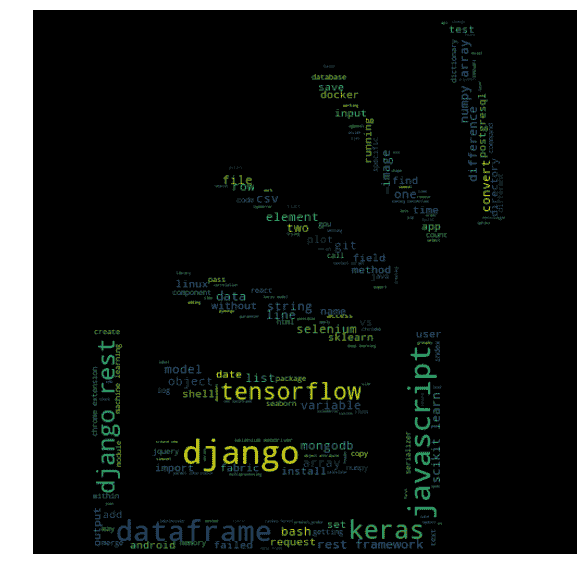

# 使用熊猫和 Seaborn 了解我的浏览模式

> 原文：<https://www.freecodecamp.org/news/understanding-my-browsing-pattern-using-pandas-and-seaborn-162b97e33e51/>

作者:Kartik Godawat

# 使用熊猫和 Seaborn 了解我的浏览模式


[https://unsplash.com/photos/vVIwtmqsIuk](https://unsplash.com/photos/vVIwtmqsIuk)

> 通过三种方法我们可以学到智慧。首先，通过反思，这是最高尚的；第二，通过模仿，这是最容易的；第三是经验，这是最痛苦的。——孔子

为了跟踪我在浏览器上花费的时间，我在 Chrome 上使用了[无限](https://chrome.google.com/webstore/detail/be-limitless/jdpnljppdhjpafeaokemhcggofohekbp?hl=en)扩展。虽然它给了我在类别下花费的时间，但我认为检查我过去一年的所有浏览数据可能是有用的。

这里开始了我的探索，去理解我的浏览数据中的所有内容。

在这个过程中，我用了熊猫和 Seaborn。Pandas 是一个用于数据操作和分析的 python 库。 [Seaborn](https://seaborn.pydata.org) 构建在 matplotlib 之上，这使得创建可视化比以往任何时候都更容易。

#### 获取历史数据

这个过程的第一步是获取过去一年的所有浏览数据。谷歌 chrome 以 SQLite 格式在设备上存储了过去 3 个月的历史记录，但我最终使用[谷歌外卖](http://takeout.google.com)导出了我的谷歌跟踪数据。导出的 json 包含我在所有设备上的浏览历史，包括移动设备。

Chrome 存储的或 Google 跟踪的历史记录不能给我会话信息，即在每个标签上花费的时间。因此，我的分析主要集中在访问次数和访问时间，而不是会话或持续时间。我其实松了一口气，因为知道谷歌还没有跟踪它。

数据下载完成后，我开始将数据加载到熊猫的数据框架中:

```
import pandas as pdwith open("BrowserHistory.json") as f:    data = json.loads(f.read())    df = pd.DataFrame(data["Browser History"])
```

```
# A possible param if differentiation is needed b/w different clientsdf.drop('client_id', axis=1, inplace=True)df.drop('favicon_url', axis=1, inplace=True)df.sample(1)
```

输出如下所示:



*page_transition:* 包含页面打开类型的信息，如重新加载、键入&回车、链接打开等。我对只过滤链接和输入感到满意

```
df = df[(df['page_transition'] == "LINK") | (df['page_transition'] == "TYPED")]
```

#### 提取/外推新列(特征):

首先，我需要将时间(以微秒计)转换为人类可读的日期时间格式。然后我需要从中派生出一些特性，比如小时、天、月或星期几。从 URL 字段中提取顶级域名可能是一个有用的分析字段。所以我使用 [tldextract](https://github.com/john-kurkowski/tldextract) 在 dataframe 中创建新的域列。

```
def convert_time(x):    return datetime.datetime.fromtimestamp(x/1000000)
```

```
days_arr = ["Mon","Tue", "Wed", "Thu", "Fri", "Sat", "Sun"]def get_day_of_week(x):    return days_arr[x.weekday()]
```

```
def get_domain(x):    domain = tldextract.extract(x)[1]    sub_domain = tldextract.extract(x)[0]    if sub_domain == "mail":        return sub_domain + "." + domain    # Ugly hack to differentiate b/w drive.google.com and google.com    if domain == "google" and sub_domain=="www":        return "google_search"     return domain
```

```
# time_usec column is picked and for each row, convert_time(row) is called. The result is stored in the same dataframe under column dtdf['dt'] = df['time_usec'].apply(convert_time)...df['domain'] = df['url'].apply(get_domain)
```

然后，我推断领域信息，将众所周知的领域归入我定义的一个或另一个类别(桶):

```
def get_category(x):    if x in ["coursera", "kadenze", "fast", "kaggle", "freecodecamp"]:        return "Learning"    elif x in ["ycombinator", "medium", "hackernoon"]:        return "TechReads"    ...    else:        return "Other"
```

```
# Cluster popular domains into a categorydf['category'] = df['domain'].apply(get_category)
```

在所有操作之后，dataframe 现在包含以下各列，基本分析可以开始了。

**可用列:**标题、日期、小时、月、安全、周末、星期几、域、类别

### 探索数据和创建可视化

#### 安全与不安全使用:

一旦我有了一个包含一些数字和分类列(月)的数据框架，创建一个图表就非常容易了。

```
import seaborn as snssns.countplot(x="month", hue="is_secure", data=df)
```



Downward trend for http-only websites while surfing recently

```
# Manual inspection, picking 50 random domains which were insecurerandom.sample(df[df["is_secure"] == "N"].domain.unique(), 50)
```

```
# To view data for such domainsdf[(df["domain"] == "mydomain") & (df["is_secure"] == "N")]["url"]
```

在看了几次这样的访问后，我最终选择了这个网站。在通过 HTTP 预订丛林探险时，它**要求护照或 Aadhar(印度的 SSN)号码，以及电子邮件和手机。我没有早点注意到！最终预订是通过一个单独的安全网关处理的。然而，比起 HTTPS，我还是觉得输入我的人口和护照信息更安全。**

一个更严格的解决方案是将所有这样的域添加到像 [BlockSite](https://chrome.google.com/webstore/detail/block-site-website-blocke/eiimnmioipafcokbfikbljfdeojpcgbh?hl=en) 这样的扩展中，而不是手动探索行。它们可以在需要时启用。

#### 工作日与周末浏览器的使用情况:

```
#is_weekend="Y" for saturday and sunday, "N" otherwisesns.countplot(x="hour", hue="is_weekend", data=df)
```



Indicator that I sleep longer on weekends :P

#### 几个月来的浏览器使用情况:

为了实现这一点，我选择了基于月份条件的行子集，然后按照小时和日期对所有内容进行分组，形成 GitHub 风格的热图。

```
from matplotlib import pyplot as plt
```

```
# Getting unique values after grouping by hour and datedf_new = df[(df["month"] >= 11)].groupby(["hour", "date"])["domain"].size()df_new = df_new.reset_index(name="count")
```

```
plt.figure(figsize = (16,5))
```

```
# Pivot the dataframe to create a [hour x date] matrix containing countssns.heatmap(df_new.pivot("hour", "date", "count"), annot=False, cmap="PuBuGn")
```


Vertically empty lines mean I was either on vacation or was not using Chrome browser.

上面的代码很容易被过滤掉。这可以通过添加更多的条件来识别有效率和无效率的标签打开时间，并查看几天内的模式来实现。例如:

```
cat_arr = ["Shopping", "TravelBookings", "YouTube", "Social"]
```

```
df_new = df[(df["category"] in cat_arr)].groupby(["hour", "date"])["domain"].size()
```

#### 按星期几和小时划分的浏览器访问量:

我创建了另一种类型的聚合热图，尝试可视化工作时间和星期几。

```
df_heat = df.groupby(["hour", "day_of_week"])["domain"].size().reset_index()df_heat2 = df_heat.pivot("hour", "day_of_week", "domain")sns.heatmap(df_heat2[days_arr] , cmap="YlGnBu")
```



10–4 pm weekday productive hours with high browser visits on Thursday evenings

人们会认为周五下午 5 点以后到周一早上的使用量会很少。但对我来说，有趣的是周三晚上浅色的区域。

现在使用我手动将域分类的自定义类别。我再次生成相同的热图。但是现在有了热门购物网站的条件。请注意，该列表是由我根据自己的记忆手动创建的，并随机查看我访问过的唯一域。

```
df_heat = df[df["category"] == "Shopping"].groupby(["hour", "day_of_week"])["category"].size().reset_index()
```



令人满意的是，我通常不会在上班时间疯狂购物。但是，图表鼓励我手动探索周四(20:00–21:00)和周五(15:00–16:00，00:00–01:00)。从更高的层面来说，我非常自信我从不在上班时间购物。然而，热图显示了这种访问的一些实例，粉碎了我的幻想。

#### 最常被提及的 stackoverflow 问题:

一个好朋友曾经告诉我:

> 理解 stackoverflow 的用法可以帮助你理解你需要改进的地方，或者你应该记住的配置/语法。

无论如何，粗略地看一下每个月/季度最频繁的访问是有好处的。

```
df_so = df[df["domain"] == "stackoverflow"].groupby(["url", "title"]).size()df_so = df_so.reset_index(name='count').sort_values('count',ascending=False)[["title", 'count']]
```

```
df_so.head(15)
```



“Newest question” and None titled rows show there’s scope for data-preprocessing right in this context

也许我应该缓存向我展示如何迭代熊猫数据帧的页面！

除了 stackoverflow，我最常访问的与熊猫相关的网站之一是 Chris Albon 关于 python 和数据争论的笔记。

一般来说，观察你最常访问的页面如何在几个月内改变主题是非常有趣的。例如，他们可能会从简单的问题转移到更复杂、更深入的问题。这是真的，因为你对新事物有了更多的理解。

最后，只是为了好玩，我把过去一年里所有栈溢出搜索的标题串联起来。然后我生成了一个看起来不错的单词云。



非常感谢您抽出时间。如果你喜欢阅读，请给我一些掌声，让更多的人看到这篇文章。谢谢大家！下次再见，祝你愉快:)

GitHub 上有一个工作笔记本，里面有更多的可视化内容和一些关于数据的快速分析。请使用您自己的历史转储进行尝试，并分享有趣的见解！