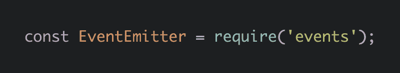

# 了解 Node.js 事件驱动架构

> 原文：<https://www.freecodecamp.org/news/understanding-node-js-event-driven-architecture-223292fcbc2d/>

> **更新:**这篇文章现在是我的书《Node.js Beyond The Basics》的一部分。

> 阅读此内容的更新版本和更多关于节点在[](https://jscomplete.com/g/node-events)**的信息。**

**大多数 Node 对象——如 HTTP 请求、响应和流——都实现了`EventEmitter`模块，因此它们可以提供一种发出和监听事件的方法。**

****

**事件驱动性质的最简单形式是一些流行的 Node.js 函数的回调样式——例如，`fs.readFile`。在这个类比中，事件将被触发一次(当节点准备好调用回调时)，回调充当事件处理程序。**

**我们先来探讨一下这个基本形态。**

#### **准备好了给我打电话，Node！**

**节点处理异步事件的最初方式是使用回调。这是很久以前的事了，在 JavaScript 有原生承诺支持和 async/await 特性之前。**

**回调基本上只是传递给其他函数的函数。这在 JavaScript 中是可能的，因为函数是第一类对象。**

**理解回调并不表示代码中的异步调用是很重要的。函数可以同步和异步调用回调。**

**例如，这里有一个主机函数`fileSize`,它接受一个回调函数`cb`,并且可以基于一个条件同步和异步地调用那个回调函数:**

```
`function fileSize (fileName, cb) {
  if (typeof fileName !== 'string') {
    return cb(new TypeError('argument should be string')); // Sync
  }
  fs.stat(fileName, (err, stats) => {
    if (err) { return cb(err); } // Async
    cb(null, stats.size); // Async
  });
}`
```

**请注意，这是一种导致意外错误的不良做法。将宿主函数设计为总是同步或总是异步使用回调。**

**让我们探索一个用回调方式编写的典型异步节点函数的简单示例:**

```
`const readFileAsArray = function(file, cb) {
  fs.readFile(file, function(err, data) {
    if (err) {
      return cb(err);
    }
    const lines = data.toString().trim().split('\n');
    cb(null, lines);
  });
};`
```

**`readFileAsArray`取一个文件路径和一个回调函数。它读取文件内容，将其分割成一个行数组，并使用该数组调用回调函数。**

**这里有一个使用它的例子。假设我们在同一个目录中有文件`numbers.txt`,内容如下:**

```
`10
11
12
13
14
15`
```

**如果我们的任务是计算文件中的奇数，我们可以使用`readFileAsArray`来简化代码:**

```
`readFileAsArray('./numbers.txt', (err, lines) => {
  if (err) throw err;
  const numbers = lines.map(Number);
  const oddNumbers = numbers.filter(n => n%2 === 1);
  console.log('Odd numbers count:', oddNumbers.length);
});`
```

**该代码将数字内容读入一个字符串数组，将它们解析为数字，并对奇数进行计数。**

**这里纯粹使用了 Node 的回调样式。回调函数有一个可空的错误优先参数`err`,我们将回调函数作为宿主函数的最后一个参数传递。你应该总是在你的函数中这样做，因为用户可能会认为。让宿主函数接收回调作为它的最后一个参数，并让回调期望一个错误对象作为它的第一个参数。**

#### **回调的现代 JavaScript 替代品**

**在现代 JavaScript 中，我们有 promise 对象。承诺可以替代异步 API 的回调。promise 对象允许我们分别处理成功和错误情况，而不是将回调作为参数传递并在同一位置处理错误，它还允许我们链接多个异步调用，而不是嵌套它们。**

**如果`readFileAsArray`函数支持承诺，我们可以如下使用:**

```
`readFileAsArray('./numbers.txt')
  .then(lines => {
    const numbers = lines.map(Number);
    const oddNumbers = numbers.filter(n => n%2 === 1);
    console.log('Odd numbers count:', oddNumbers.length);
  })
  .catch(console.error);`
```

**我们没有传入回调函数，而是对宿主函数的返回值调用了一个`.then`函数。这个`.then`函数通常让我们访问回调版本中得到的相同的 lines 数组，我们可以像以前一样对它进行处理。为了处理错误，我们在结果上添加了一个`.catch`调用，这样我们就可以在错误发生时访问它。**

**由于有了新的 promise 对象，在现代 JavaScript 中让主机函数支持 Promise 接口变得更加容易。下面是修改后的`readFileAsArray`函数，除了它已经支持的回调接口之外，它还支持 promise 接口:**

```
`const readFileAsArray = function(file, cb = () => {}) {
  return new Promise((resolve, reject) => {
    fs.readFile(file, function(err, data) {
      if (err) {
        reject(err);
        return cb(err);
      }
      const lines = data.toString().trim().split('\n');
      resolve(lines);
      cb(null, lines);
    });
  });
};`
```

**所以我们让函数返回一个 Promise 对象，它包装了`fs.readFile`异步调用。promise 对象公开了两个参数，一个`resolve`函数和一个`reject`函数。**

**每当我们想调用出错的回调函数时，我们也使用 promise `reject`函数；每当我们想调用带有数据的回调函数时，我们也使用 promise `resolve`函数。**

**在这种情况下，我们需要做的另一件事是为回调参数设置一个默认值，以防代码被 promise 接口使用。对于这种情况，我们可以在参数中使用一个简单的默认空函数:`() =>` {}。**

#### **使用 async/await 消费承诺**

**当需要对异步函数进行循环时，添加 promise 接口会使代码更容易处理。有了回调，事情就变得乱七八糟。**

**承诺稍微提高了一点，函数生成器也稍微提高了一点。也就是说，使用异步代码的一个更新的替代方法是使用`async`函数，它允许我们将异步代码视为同步代码，使其整体可读性更好。**

**下面是我们如何使用 async/await 来使用`readFileAsArray`函数:**

```
`async function countOdd () {
  try {
    const lines = await readFileAsArray('./numbers');
    const numbers = lines.map(Number);
    const oddCount = numbers.filter(n => n%2 === 1).length;
    console.log('Odd numbers count:', oddCount);
  } catch(err) {
    console.error(err);
  }
}
countOdd();`
```

**我们首先创建一个异步函数，它只是一个普通的函数，前面有单词`async`。在异步函数内部，我们调用`readFileAsArray`函数，就好像它返回 lines 变量一样，为了实现这一点，我们使用了关键字`await`。之后，我们继续编写代码，就好像`readFileAsArray`调用是同步的一样。**

**为了让事情运行，我们执行异步函数。这个非常简单，可读性更强。为了处理错误，我们需要将异步调用包装在一个`try` / `catch`语句中。**

**有了这个 async/await 特性，我们不必使用任何特殊的 API(比如。然后和。接住)。我们只是对函数做了不同的标记，并使用纯 JavaScript 编写代码。**

**我们可以对任何支持 promise 接口的函数使用 async/await 特性。然而，我们不能将它用于回调风格的异步函数(例如 setTimeout)。**

### **事件发射器模块**

**EventEmitter 是一个促进 Node 中对象之间通信的模块。EventEmitter 是节点异步事件驱动架构的核心。Node 的许多内置模块都继承自 EventEmitter。**

**这个概念很简单:发射器对象发出命名事件，这些事件导致先前注册的侦听器被调用。因此，发射器对象基本上有两个主要特征:**

*   **发出名称事件。**
*   **注册和注销侦听器函数。**

**为了使用 EventEmitter，我们只需创建一个扩展 EventEmitter 的类。**

```
`class MyEmitter extends EventEmitter {}`
```

**发射器对象是我们从基于 EventEmitter 的类中实例化的:**

```
`const myEmitter = new MyEmitter();`
```

**在这些发射器对象生命周期的任何时候，我们都可以使用 emit 函数来发射我们想要的任何命名事件。**

```
`myEmitter.emit('something-happened');`
```

**发出事件是某种情况已经发生的信号。这种情况通常与发射对象的状态变化有关。**

**我们可以使用`on`方法添加侦听器函数，这些侦听器函数将在每次发射器对象发出它们相关的名称事件时被执行。**

#### **事件！==异步**

**让我们来看一个例子:**

```
`const EventEmitter = require('events');

class WithLog extends EventEmitter {
  execute(taskFunc) {
    console.log('Before executing');
    this.emit('begin');
    taskFunc();
    this.emit('end');
    console.log('After executing');
  }
}

const withLog = new WithLog();

withLog.on('begin', () => console.log('About to execute'));
withLog.on('end', () => console.log('Done with execute'));

withLog.execute(() => console.log('*** Executing task ***'));`
```

**类`WithLog`是一个事件发射器。它定义了一个实例函数`execute`。这个`execute`函数接收一个参数，一个任务函数，并用日志语句包装它的执行。它在执行前后触发事件。**

**为了查看这里将会发生的顺序，我们在两个命名事件上注册侦听器，最后执行一个示例任务来触发事件。**

**这是它的输出:**

```
`Before executing
About to execute
*** Executing task ***
Done with execute
After executing`
```

**关于上面的输出，我想让你注意的是，这一切都是同步发生的。这段代码没有任何异步之处。**

*   **我们首先得到“执行前”行。**
*   **然后，`begin`命名的事件导致“即将执行”行。**
*   **然后，实际执行行输出“***执行任务***”行。**
*   **然后,`end`命名的事件导致“完成执行”行**
*   **我们最后得到“执行后”行。**

**就像普通的回调一样，不要假设事件意味着同步或异步代码。**

**这很重要，因为如果我们传递一个异步的`taskFunc`到`execute`，发出的事件将不再准确。**

**我们可以用一个`setImmediate`调用来模拟这种情况:**

```
`// ...

withLog.execute(() => {
  setImmediate(() => {
    console.log('*** Executing task ***')
  });
});`
```

**现在输出将是:**

```
`Before executing
About to execute
Done with execute
After executing
*** Executing task ***`
```

**这是不对的。异步调用后的行，是由“执行完毕”和“执行后”调用引起的，不再准确。**

**要在异步函数完成后发出事件，我们需要将回调(或承诺)与这种基于事件的通信结合起来。下面的例子说明了这一点。**

**使用事件而不是常规回调的一个好处是，我们可以通过定义多个侦听器对同一个信号做出多次反应。为了用回调完成同样的任务，我们必须在单个可用的回调中编写更多的逻辑。事件是应用程序允许多个外部插件在应用程序核心之上构建功能的一种很好的方式。您可以将它们视为挂钩点，以允许围绕状态变化定制故事。**

#### **异步事件**

**让我们将同步示例转换成更有用的异步示例。**

```
`const fs = require('fs');
const EventEmitter = require('events');

class WithTime extends EventEmitter {
  execute(asyncFunc, ...args) {
    this.emit('begin');
    console.time('execute');
    asyncFunc(...args, (err, data) => {
      if (err) {
        return this.emit('error', err);
      }

      this.emit('data', data);
      console.timeEnd('execute');
      this.emit('end');
    });
  }
}

const withTime = new WithTime();

withTime.on('begin', () => console.log('About to execute'));
withTime.on('end', () => console.log('Done with execute'));

withTime.execute(fs.readFile, __filename);`
```

**`WithTime`类执行一个`asyncFunc`并使用`console.time`和`console.timeEnd`调用报告那个`asyncFunc`花费的时间。它在执行前后发出正确的事件序列。并且还发出错误/数据事件来处理异步调用的常见信号。**

**我们通过传递一个`fs.readFile`调用来测试一个`withTime`发射器，这是一个异步函数。我们现在可以监听数据事件，而不是用回调来处理文件数据。**

**当我们执行这段代码时，我们得到了正确的事件序列，正如预期的那样，并且我们得到了执行的报告时间，这很有帮助:**

```
`About to execute
execute: 4.507ms
Done with execute`
```

**请注意我们是如何需要将回调与事件发射器结合起来实现这一点的。如果`asynFunc`也支持承诺，我们可以使用 async/await 特性来做同样的事情:**

```
`class WithTime extends EventEmitter {
  async execute(asyncFunc, ...args) {
    this.emit('begin');
    try {
      console.time('execute');
      const data = await asyncFunc(...args);
      this.emit('data', data);
      console.timeEnd('execute');
      this.emit('end');
    } catch(err) {
      this.emit('error', err);
    }
  }
}`
```

**我不知道你怎么想，但对我来说，这比基于回调的代码或任何其他代码更具可读性。然后/。抓线。async/await 特性让我们尽可能地接近 JavaScript 语言本身，我认为这是一个巨大的胜利。**

#### **事件参数和错误**

**在前面的示例中，有两个事件是用额外的参数发出的。**

**error 事件与 error 对象一起发出。**

```
`this.emit('error', err);`
```

**数据事件与数据对象一起发出。**

```
`this.emit('data', data);`
```

**在命名事件之后，我们可以根据需要使用任意多的参数，所有这些参数都可以在我们为这些命名事件注册的侦听器函数中获得。**

**例如，为了处理数据事件，我们注册的侦听器函数将访问传递给发出的事件的数据参数，而该数据对象正是`asyncFunc`所公开的。**

```
`withTime.on('data', (data) => {
  // do something with data
});`
```

**`error`事件通常是一个特殊的事件。在我们基于回调的例子中，如果我们不使用侦听器处理错误事件，节点进程实际上将会退出。**

**为了演示这一点，用一个错误的参数再次调用 execute 方法:**

```
`class WithTime extends EventEmitter {
  execute(asyncFunc, ...args) {
    console.time('execute');
    asyncFunc(...args, (err, data) => {
      if (err) {
        return this.emit('error', err); // Not Handled
      }

      console.timeEnd('execute');
    });
  }
}

const withTime = new WithTime();

withTime.execute(fs.readFile, ''); // BAD CALL
withTime.execute(fs.readFile, __filename);`
```

**上面的第一个执行调用将触发一个错误。节点进程将崩溃并退出:**

```
`events.js:163
      throw er; // Unhandled 'error' event
      ^
Error: ENOENT: no such file or directory, open ''`
```

**第二个执行调用将受到这次崩溃的影响，可能根本不会执行。**

**如果我们为特殊的`error`事件注册一个监听器，节点流程的行为将会改变。例如:**

```
`withTime.on('error', (err) => {
  // do something with err, for example log it somewhere
  console.log(err)
});`
```

**如果我们这样做，将会报告第一次执行调用的错误，但是节点进程不会崩溃和退出。另一个执行调用将正常完成:**

```
`{ Error: ENOENT: no such file or directory, open '' errno: -2, code: 'ENOENT', syscall: 'open', path: '' }
execute: 4.276ms`
```

**请注意，Node 当前的行为与基于承诺的函数不同，它只输出一个警告，但这最终会改变:**

```
`UnhandledPromiseRejectionWarning: Unhandled promise rejection (rejection id: 1): Error: ENOENT: no such file or directory, open ''
DeprecationWarning: Unhandled promise rejections are deprecated. In the future, promise rejections that are not handled will terminate the Node.js process with a non-zero exit code.`
```

**处理发出的错误异常的另一种方法是为全局`uncaughtException`流程事件注册一个监听器。然而，用该事件全局捕捉错误是一个坏主意。**

**关于`uncaughtException`的标准建议是避免使用它，但是如果你必须这样做(比如报告发生了什么或者进行清理)，你应该让进程退出:**

```
`process.on('uncaughtException', (err) => {
  // something went unhandled.
  // Do any cleanup and exit anyway!

  console.error(err); // don't do just that.

  // FORCE exit the process too.
  process.exit(1);
});`
```

**然而，假设多个错误事件同时发生。这意味着上面的`uncaughtException`监听器将被多次触发，这对于一些清理代码来说可能是个问题。这方面的一个例子是对数据库关闭操作进行多次调用。**

**`EventEmitter`模块公开了一个`once`方法。这个方法只发出一次调用侦听器的信号，而不是每次都发出信号。因此，这是一个使用 uncaughtException 的实际用例，因为对于第一个未捕获的异常，我们将开始清理，并且我们知道无论如何我们都要退出进程。**

#### **侦听器的顺序**

**如果我们为同一个事件注册了多个侦听器，那么这些侦听器的调用将是有序的。我们注册的第一个侦听器是第一个被调用的侦听器。**

```
`// प्रथम
withTime.on('data', (data) => {
  console.log(`Length: ${data.length}`);
});

// दूसरा
withTime.on('data', (data) => {
  console.log(`Characters: ${data.toString().length}`);
});

withTime.execute(fs.readFile, __filename);`
```

**上面的代码将导致在“字符”行之前记录“长度”行，因为这是我们定义这些侦听器的顺序。**

**如果您需要定义一个新的监听器，但是首先调用这个监听器，那么您可以使用`prependListener`方法:**

```
`// प्रथम
withTime.on('data', (data) => {
  console.log(`Length: ${data.length}`);
});

// दूसरा
withTime.prependListener('data', (data) => {
  console.log(`Characters: ${data.toString().length}`);
});

withTime.execute(fs.readFile, __filename);`
```

**上述操作将首先记录“字符”行。**

**最后，如果您需要删除一个监听器，您可以使用`removeListener`方法。**

**这个题目我就说这么多。感谢阅读！下次见！**

**学习 React 还是 Node？签出我的图书:**

*   **[通过构建游戏学习 react . js](http://amzn.to/2peYJZj)**
*   **[Node.js 超越基础](http://amzn.to/2FYfYru)**