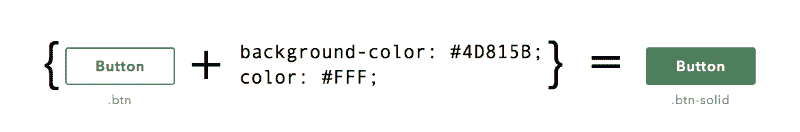
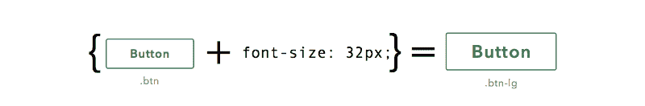
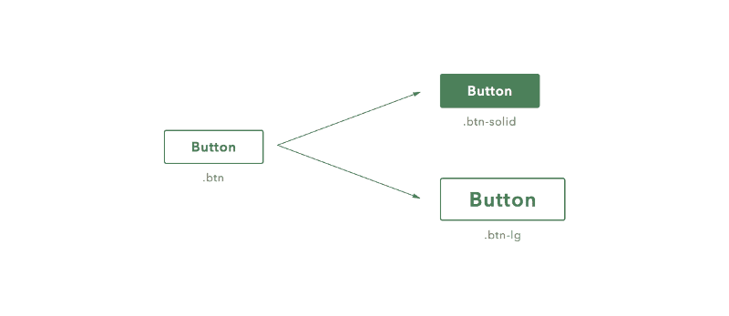
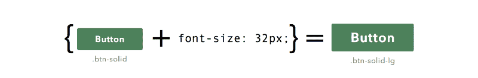
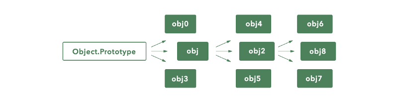
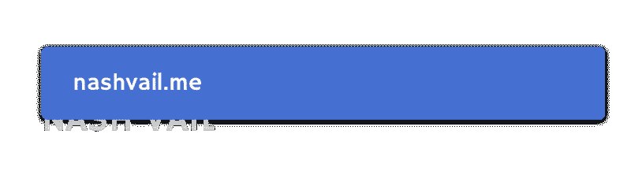

# 用 CSS 解释 JavaScript 的原型继承

> 原文：<https://www.freecodecamp.org/news/understanding-prototypal-inheritance-in-javascript-with-css-93b2fcda75e4/>

纳什·韦尔

# 用 CSS 解释 JavaScript 的原型继承


原型继承可以说是 JavaScript 中最不为人所知的方面。好消息是，如果你理解 CSS 是如何工作的，你也能理解 JavaScript 原型是如何工作的。

当一些简单的东西能够解释一些看似复杂的东西时，这是很美好的，一个类比——就像一个打桩机把一根杆子深深地扎进地里，一个类比把观点带回家。

我喜欢类比，一个喜欢类比的人。

开始了。

### CSS 按钮中的原型


看到上面的两个按钮了吗？我们要用 CSS 来设计它们。

让我们继续快速为这两个按钮编写样式，从`.btn`开始

```
.btn { min-width: 135px; min-height: 45px; font-family: ‘Avenir Next’, sans-serif; font-size: 18px; font-weight: bold; letter-spacing: 1.3px; color: #4D815B; background-color: #FFF; border: 2px solid #4D815B; border-radius: 4px;  padding: 5px 20px; cursor: pointer;}
```

这是一段相当简单的 CSS 代码。

现在让我们来看看`.btn-solid`的风格

```
.btn-solid { min-width: 135px; min-height: 45px; font-family: ‘Avenir Next’, sans-serif; font-size: 18px; font-weight: bold; letter-spacing: 1.3px; color: #FFF; background-color: #4D815B; border: 2px solid #4D815B; border-radius: 4px;  padding: 5px 20px; cursor: pointer;}
```

你可能已经注意到了，除了粗体以外，`.btn-solid`中的所有其他样式都与`.btn`中的相同。如果你熟悉[萨斯](http://www.sass-lang.com/documentation/file.SASS_REFERENCE.html#extend)，你可能知道`.btn-solid`风格可以用萨斯改写成这样:

```
.btn-solid { @extend .btn; color: #FFF; background-color: #4D815B;}
```



.btn-solid is a specialized version of .btn

正如你所看到的，`.btn-solid`从`.btn`继承样式，然后覆盖其中的一些(字体和背景颜色)来创建它自己。由此我们得出结论，`.btn-solid` 是`.btn` *的特殊化版本。*或者，换句话说，`.btn-solid`是`.btn`，但是字体和背景颜色不同。这是有道理的，对不对？但是等等，还有更多。

假设我们想要创建一个更大的按钮，`.btn-lg`。我们将使用`.btn`作为**原型**来提供基本款式。然后，类似于我们如何修改背景和字体颜色来创建`.btn-solid`，我们将修改字体大小属性到一个更大的值来创建一个更大的按钮。



`.btn-lg`和`.btn-solid`都是`.btn`的专门版本。`.btn`向`.btn-lg`和`.btn-solid`提供基础样式，然后它们覆盖一些基础样式来创建自己。这告诉我们，我们决定的单个按钮——在我们的例子中是`.btn`——可以用作多个项目的基础样式的供应商。



在这一节中，我们试图为 CSS 按钮定义原型的概念。原型是提供基本样式的实体，可以对其进行扩展以创建不同的按钮实例。原型的这个定义非常接近于编程术语中原型的实际含义。

在编程术语中，原型是向第二个对象提供基本行为的对象。然后，第二个对象扩展这个基本行为，形成自己的专门化。让我们在下一节看看 CSS 按钮中的原型是如何映射到 JavaScript 的。

### JavaScript 中的原型

考虑以下 JavaScript 对象:

```
let obj = { a: 1};
```

我们知道`a`的值可以被`obj.a`访问，因为`a`显然是`obj`的属性。除此之外，你还可以调用`obj.hasOwnProperty('a')`来检查`obj`是否真的有一个名为`a`的属性。

现在等一下——从我们看到的情况来看，`obj`没有定义名为`hasOwnProperty`的属性。`hasOwnProperty`从何而来？要回答这个问题，我们必须回到我们刚刚完成创建的按钮。

仅定义了背景和字体颜色。例如，`border-radius`从哪里来？我们知道`.btn-solid`是`.btn`的特殊化，所以我们可以看到`.btn-solid`正在从`.btn`获得`border-radius`、`width`、`height`、`padding`等风格。会不会跟`obj`一样？

就像`.btn-solid`和`.btn-lg`从`.btn`获得它们的基本样式一样，`obj`或任何其他 JavaScript 对象从**另一个对象—** `Object.prototype`获得它们的基本行为。而这个`Object.prototype`上面定义了`hasOwnProperty`。结果，这给了`obj`对`hasOwnProperty`方法的访问——就像`.btn-solid`访问`.btn`的`border-radius`属性一样。


obj is a specialization of Object.Prototype

这种——一个对象 (obj) **从另一个对象** (Object.prototype)继承其属性和基本行为——就是我们所说的原型继承。请注意，相互作用中没有涉及`class`。

JavaScript 原型和我们的 CSS“原型”的实际内部工作方式是不同的。但是出于我们类比的目的，我们可以忽略它们在幕后是如何工作的。

不是 JavaScript 中唯一可用的原型。有`Array.prototype`、`Function.prototype`、`Number.prototype`等几个。所有这些原型的工作是为它们的实例提供基本行为或实用方法。

例如，JavaScript 中声明的每个数组都可以访问`.push`、`.sort`、`.forEach`和`.map`，这仅仅是因为原型链接。出于同样的原因，每个功能都可以访问`.call`、`.apply`、`.bind`。

原型和原型继承不是 JavaScript 特有的。它们是 JavaScript 内部使用的构造，允许我们在自己的程序中使用它。在我们研究如何做到这一点之前，我们需要理解什么是原型链接。

### 原型链接

我们需要再次回到按钮的类比。假设我想创建一个大的实心按钮，`.btn-solid-lg`:



`.btn-solid-lg`的基本样式由`.btn-solid`提供，`.btn-solid-lg`覆盖字体大小属性来创建自己。

不过，仔细看看。仅定义了两种样式背景色和颜色(字体)。这意味着`.btn-solid-lg`只有 3 种样式:背景色、颜色和字体大小。`width`、`height`、`border-radius`从哪里来？

好吧，给你个提示:


An indecipherable hint.

如果你想创建一个超大按钮`.btn-solid-xlg`，你可以用`.btn-solid-lg`作为原型。但是所有这些如何映射到 JavaScript 呢？

在 JavaScript 中，你也可以创建原型链。一旦你理解了这一点，你就拥有了一整套工具来编写惊人强大的代码。是的，*惊人的强大*。

让我们看看 JavaScript 中的原型链是如何工作的。

还记得我们在上一节中创建的对象吗？我们小心翼翼命名为`obj`的那个？你知道吗，以`obj`为原型，你可以创建任意多的对象。

`[Object.create](https://developer.mozilla.org/en/docs/Web/JavaScript/Reference/Global_Objects/Object/create)`允许您从指定的原型对象创建一个新对象。这意味着您可以创建另一个对象`obj2`，它的第一个原型是`obj`:

```
let obj2 = Object.create(obj);
```

```
// Add a property 'b' to obj2obj2.b = 2;
```

如果你一直在跟踪，你应该意识到即使`obj2`没有定义属性`a`，执行`console.log(obj2.a)`也不会导致错误，相反`1`会被记录到控制台。有点像这样:


当`obj2`寻找`a`时，它首先搜索自己的属性。如果它找不到相应的属性，它会询问它的原型(obj)，最终在那里找到`a`。如果是这样的情况，它仍然找不到`a`，搜索将继续沿着原型链向上，直到到达最后一个链接`Object.prototype`。

另一方面，如果`a`是在`obj2`上定义的，它将覆盖所有其他的`a`,如果在它的任何原型上定义的话。类似于`.btn-solid`如何覆盖`.btn`的`color`和`background-color`属性。这叫**属性盖过**。

但是原型链的长度呢？有限制吗？

原型链的长度没有限制。分支也没有任何限制。这意味着你可以用`Object.prototype`、`obj`或`obj2`作为原型创建多个实例。



You can branching at each object as many times as you need to.

那么这些关于原型和原型链接的新知识将如何帮助你编写更好的代码呢？

### 用原型编写更好的代码

这篇文章的目标是向你解释什么是原型，以及原型继承是如何工作的。我希望我已经成功了。

对于这最后一部分，我将允许自己继续一个小咆哮。我希望你不介意。

如果你看看网上可用的 JavaScript 代码——无论是 Github 上的开源项目还是 Codepen 上的 pens 你会发现大多数都使用构造器模式来创建对象。

```
function Circle(radius) {  this.radius = radius;}
```

```
Circle.prototype.area = function() {  return Math.PI * this.radius * this.radius;}
```

```
// Constructor pattern for creating new objectslet circ = new Circle(5);
```

构造器模式看起来像类。在早期，当 JavaScript 远不如现在流行时，`new`关键字是作为一种营销策略被添加进来的。

这种间接方式旨在让受过传统训练的程序员对 JavaScript 更熟悉。虽然这样做有多成功还存在争议，但它无意中也掩盖了语言的真正原型性质。

现实是，尽管构造函数看起来像类，但它们的行为一点也不像类。在 JavaScript 中，有对象，以及从其他对象扩展而来的对象。构造函数和类从来没有出现过。构造器模式不必要地使事情变得复杂，有很多事情在幕后发生。

我恳求你——既然你已经对原型有了坚实的理解——停止使用构造器模式。

为什么不这样做呢？

```
let Circle = {  create(radius) {    // Creating prototypal linkage using Object.create    let obj = Object.create(this);    obj.radius = radius;    return obj;  },  area() {    return Math.PI * this.radius * this.radius;  }};
```

```
let circ = Circle.create(5);
```

我希望这个类比能帮助你更好地理解原型、原型链接和原型继承。现在，您可以编写更好的代码，并停止使用自命不凡的类。

感谢阅读！如果我的文章有帮助，请点击下面的绿色小心脏来推荐它，并请与您的开发伙伴分享。

如果需要进一步阅读，请查阅 adit Shah 的[为什么原型继承很重要](http://aaditmshah.github.io/why-prototypal-inheritance-matters/)。

#### 想要更多吗？我定期在 nashvail.me 的[博客上发表文章。](https://nashvail.me)那里见，祝你愉快！

