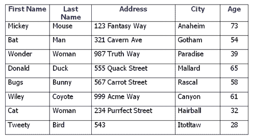

# 理解 Ruby on Rails 的基础知识:SQL 数据库及其工作原理

> 原文：<https://www.freecodecamp.org/news/understanding-the-basics-of-ruby-on-rails-sql-databases-and-how-they-work-7a628cd42073/>

在[了解了 Ruby](https://medium.freecodecamp.org/learning-ruby-from-zero-to-hero-90ad4eecc82d) 之后，我们采取的第一步是理解[网络和 Ruby on Rails 请求-响应周期](https://medium.com/the-renaissance-developer/ruby-on-rails-http-mvc-and-routes-f02215a46a84)是如何工作的。

现在是时候了解数据库以及它们如何与 Ruby on Rails 连接了。基本上，答案是模型:来自`MVC`的`M`，正如我们在这里了解到的。

在学习用 Rails 进行 web 开发之前，我真心推荐先学习一下[**Ruby**](https://medium.freecodecamp.org/learning-ruby-from-zero-to-hero-90ad4eecc82d)。

我们开始吧！

### 什么是数据库？

嗯……首先想到的是存储数据的东西。

但是这个定义是相当不严谨的！数组、散列、链表或任何数据结构都可以是能够存储数据的东西。

当您关闭计算机时，您会丢失存储在该数组中的所有数据值(与所有数据结构相同)。所以把我所有的`precious data`都存起来不是个好主意。

MY PRECIOUS DATA

这里我们需要解决两个问题:

1.  存储数据并随时获取。
2.  以一种有组织有结构的方式存储数据，这样我们就可以很容易地获取数据。

我应该将所有数据存储在记事本中吗？只要把里面的所有信息用逗号隔开，保存`txt file`，就大功告成了。现在我可以打开它，得到我想要的所有数据。我们可以存储数据并随时获取…问题解决了！

我们解决了这个问题，但我们忽略了另一个问题。现在所有的数据都存储起来了，我们不会丢失。但是在文件里结构不太好。我们需要以一种有组织的、结构良好的形式存储和获取数据的规则。

让我们思考一下如何以一种结构良好的方式组织数据。

如何组织表格中的所有数据？

因此，我们有:表格的标题(*列名:名、姓、地址等*)包含我们要存储的值。例如，如果我们要存储 ***字符串【米奇】*** *(值)*，它将被存储在 ***【名字】*** *列*。

*   **表**:先说 ***人***
*   **列** : ***名*** *，**姓**，**地址**等*
*   **行**:在这种情况下，我们可以说，一行可以是一个 ***人*** ，例如，名为*米奇*，姓为*鼠标、*“地址”123 *幻想方式、*等。
*   **字段**:数据库中存储的所有数据。

现在我们有了一个结构良好的方法来存储数据**:在一个表中！**

### 如何获取、删除、插入和更新数据？

我们将使用 SQL 语言(*我就不提 NoSQL 世界了！*)来操纵数据。让我们从最基本的开始。

1.  **GET:** 如果我们想从**person**表中获取所有数据( ***person*** )，我们需要从那个表中选择它。

( ***)** 符号意味着它将从**人**表中选择所有列。如果我们可以获得所有的列，我们就可以指定这个 select 需要哪些列。

2.**删除:**我们想删除**人员**表中的所有数据。

但是删除表中的所有数据并不常见。我们通常会用一个条件来删除，比如“我要删除所有 21 岁以下的人。”我们将在这篇文章的后面了解如何做到这一点！

3. **INSERT:** 我们将数据插入/存储到表中。

或者我们可以指定要插入数据的列。

4.**更新:**我们已经存储了数据，但是我们想更新它。

### 在查询中使用条件

现在我们可以使用 SQL 语言来查询(选择、删除、插入、更新)数据。

*   但是如果我们只想删除姓氏为 ***木下*** 的记录呢？
*   或者我们要更新一个名字 ***莱安德罗*** 姓氏 ***木下*** 的特定人？
*   还是只选择 people 表中的所有数据，并按年龄从年轻到年长排序？

是的，我们使用像**这样的条件，其中**和**排序，**以及像**或**和**和**这样的运算符。让我们看一些例子:

*   从人员表中删除姓氏为 ***木下*** 的所有记录。

*   用名字 ***莱安德罗*** 和姓氏 ***木下*** 更新 people 表中的所有记录。

*   从人员表中选择所有记录，但按年龄排序(升序→ ASC)。

#### 表之间的关系

我们知道如何执行查询(有或没有条件)。让我们了解一下表的关系是如何工作的。

*   **一对一(1–1)**:关于两个表之间的关系，其中一个只能属于另一个。一个人有一本护照，这本护照属于那个特定的人。因此，在本例中，我们有同桌人、同桌护照和一对一关系。
*   **一对多(1-n)** :关于两个表之间的关系，其中一个表中的记录可以引用另一个表中的许多记录。**例如**想象一个电子商务平台:用户、订单、产品、支付等。一个用户可以有许多订单，每个订单都属于该特定用户。所以在这个例子中，我们有表用户、表订单和 1-n 关系。
*   **多对多(n-n)** :这是关于两个表之间的关系，其中一个表中的记录可以引用另一个表中的许多记录。另一个中的记录也可以引用一个中的许多记录。**例如**我们又有了电子商务平台:我们将产品分类。一个类别有许多产品(技术类别有许多产品，如手机、笔记本等)，一个产品可以属于许多类别(产品手机属于技术和电子类别)。在这个例子中，我们有表产品、表类别和一个 n-n 关系。

### Rails 模式开启

我们现在理解了数据库的含义，我们已经尝试了一些基本的查询，并讨论了表之间的关系。但是我们如何在 Ruby on Rails 和 web 开发世界 中使用这些知识呢？

首先:**铁轨** *就是* **铁轨**。**数据库** *就是* **数据库**。很明显吗？但是人们通常对此感到困惑。

一个*用户*模型**可以**代表一个*用户*表。但是模型不是桌子。

*   在 ***数据库*** 中，我们有*表*和*行。*
*   在 ***轨道*** 上，我们有*模型(类)*和*对象。*

想象一个博客网站。博客需要每篇文章的作者。因此，我们创建了一个包含一些列(名、姓等)的 **Authors** 表:

在迁移中，我们添加了列`first_name`、`last_name`、`email`、`birthday`、`created_at`和`updated_at`。(`created_at`和`updated_at`由`t.timestamps`代码创建)。

因此，我们创建一个迁移(Ruby 代码)，在终端中运行`rake db:migrate`命令，它生成一个表`**Authors**`，包含`first_name`、`last_name`、`email`、`birthday`、`created_at`和`updated_at`列。

回到 Rails——我们可以创建一个`**Author**`模型:

所以现在我们有了一个包含一些列的`Authors`表和一个`Author`模型。

#### 使用 Rails 控制台

打开终端，输入`bundle exec rails c`。记住，我们是在 **RAILS** 控制台中，所以我们有类、对象、属性等等。

### 铁路上的关系

我们创建了一个`Authors`表格/模型。我们现在需要的是一个`Posts`表/模型。一个作者有很多帖子，一个帖子属于一个特定的作者。这里的关系是**一对多** ( **1-n** )。记得吗？

所以当我们创建一个`Posts`表时，我们需要存储一个对文章作者的引用(在**文章**表中的**作者 id** 列)。它被称为`Foreign Key`。

我们如何联系这些模型？

#### 作者`has_many`帖子

#### 帖子属于作者

#### 使用 Rails 控制台

*关于`has_many`和`belongs_to`的快速解释。两个`codes`都是在`ActiveRecord`类上定义的方法。你可以看到我们创造的模型继承了`ActiveRecord::Base`。

还记得在我的 [Ruby Foundation](https://medium.freecodecamp.org/learning-ruby-from-zero-to-hero-90ad4eecc82d) 文章中，我们学习了面向对象编程，继承部分吗？这就是为什么我们可以使用`has_many`和`belongs_to`方法，而不需要在应用程序的任何地方定义它。Rails 为我们处理它。

如果你想深入理解这个概念，克隆一下 [Rails repo](https://github.com/rails/rails) 或者查看一下“有很多”活动记录关联幕后的[。](http://callahan.io/blog/2014/10/08/behind-the-scenes-of-the-has-many-active-record-association/)

### Rails 上的查询

我们可以使用 ActiveRecord 方法进行查询:

*   **all** :从特定模型中获取所有对象。

在幕后，它正在执行`SELECT * FROM posts`查询。

*   **find** :使用 find 我们可以通过 *id* (主键)得到对象。

在幕后，它正在执行`SELECT * FROM posts WHERE id = 1`查询。

*   **其中**:获取通过条件的对象。

在幕后，它正在执行`SELECT * FROM posts WHERE title = 'Database & Rails'`查询。

*   **order** :根据一列对所有对象进行排序。

在幕后，它正在执行`SELECT * FROM posts ORDER BY created_at DESC`查询。

### 仅此而已！

我们在这里学到了很多。我希望你们喜欢这些内容，并学习更多关于数据库和 Rails 模型如何工作的知识。

在我学习和掌握 Rails 和 web 开发的旅程中，这又向前迈进了一步。你可以在我的 [**文艺复兴开发者出版物**](https://medium.com/the-renaissance-developer) 上看到我完整旅程的文档。

如果你想要一个完整的 [Ruby](https://onemonth.com/courses/ruby?mbsy=lG6tt&mbsy_source=97541b09-e3ab-45d7-a9b1-dbc77028e008&campaignid=33446&discount_code=TKRuby1) 和 [Rails](https://onemonth.com/courses/rails?mbsy=lG6tz&mbsy_source=d2442db6-e764-401a-a394-a9c081468830&discount_code=TKRuby1&campaignid=33448) 课程，学习真实世界的编码技能和构建项目，试试 [***一个月 Ruby boot camp***](https://onemonth.com/courses/ruby?mbsy=lG6tt&mbsy_source=97541b09-e3ab-45d7-a9b1-dbc77028e008&campaignid=33446&discount_code=TKRuby1)*和[***Rails boot camp***](https://onemonth.com/courses/rails?mbsy=lG6tz&mbsy_source=d2442db6-e764-401a-a394-a9c081468830&discount_code=TKRuby1&campaignid=33448)。那里见，☺*

*玩得开心，继续学习，继续编码。*

*我的[Twitter](https://twitter.com/LeandroTk_)&[Github](https://github.com/LeandroTk)。☺*