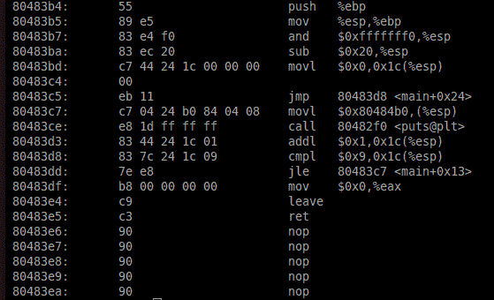
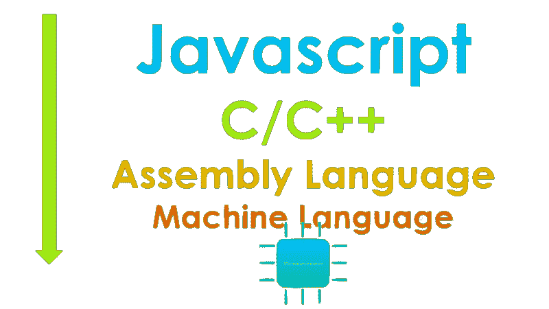
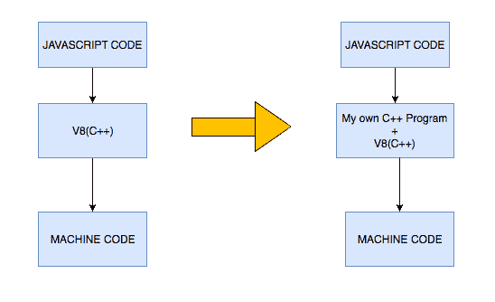
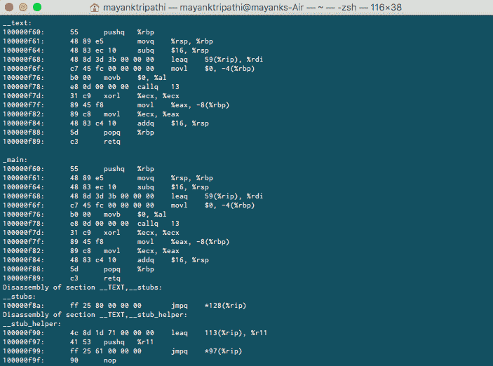

# 了解 Chrome V8 引擎如何将 JavaScript 翻译成机器码

> 原文：<https://www.freecodecamp.org/news/understanding-the-core-of-nodejs-the-powerful-chrome-v8-engine-79e7eb8af964/>

作者:马扬克·特里帕蒂

# 了解 Chrome V8 引擎如何将 JavaScript 翻译成机器码

在深入探究 Chrome V8 的核心之前，首先，让我们先了解一下基本原理。我们所有的系统都是由微处理器组成的，它现在就在你的电脑里，让你可以阅读这个。

微处理器是用电信号工作并最终完成工作的微小机器。我们给微处理器指令。这些指令是微处理器可以解释的语言。不同的微处理器使用不同的语言。一些最常见的是 IA-32、x86–64、MIPS 和 ARM。这些语言直接与硬件交互，因此用它们编写的代码被称为机器码。我们写在电脑上的代码被转换或编译成机器代码。

这就是机器码的样子:

Source : Google

它由在你的系统中一个特定的内存块上执行的低级指令组成。您一定觉得很幸运，因为您不必编写所有这些来运行您的程序！

高级语言是从机器语言中抽象出来的。在下面的抽象层次中，你可以看到 JavaScript 从机器层次抽象到了什么程度。C/C++相对来说更接近硬件，因此比其他高级语言快得多。

现在回到 V8 引擎:V8 是 Google 提供的一个强大的开源 Javascript 引擎。那么什么是 Javascript 引擎呢？它是一个将 Javascript 代码转换成微处理器可以理解的低级代码或机器代码的程序。

有不同的 JavaScript 引擎，包括 [Rhino](https://en.wikipedia.org/wiki/Rhino_(JavaScript_engine)) 、 [JavaScriptCore](https://en.wikipedia.org/wiki/WebKit#JavaScriptCore) 和 [SpiderMonkey](https://en.wikipedia.org/wiki/SpiderMonkey_(JavaScript_engine)) 。这些引擎遵循 ECMAScript 标准。ECMAScript 定义了脚本语言的标准。JavaScript 基于 ECMAScript 标准。这些标准定义了语言应该如何工作以及它应该具有什么样的特性。你可以在这里了解更多关于 ECMAScript 的信息。

Source: Google

Chrome V8 发动机:

*   V8 引擎是用 C++写的，用在 Chrome 和 Nodejs 上。
*   它实现了 ECMA-262 中规定的 ECMAScript。
*   V8 引擎可以独立运行，我们可以将它嵌入我们自己的 C++程序中。

让我们更好地理解最后一点。V8 可以独立运行，同时我们可以在 C++中添加自己的函数实现，为 JavaScript 添加新功能。

所以比如:`print('hello world')`在 Node.js 中不是一个有效的语句，如果我们编译它会给出错误。但是我们可以在 V8 的基础上用 C++添加我们自己的打印功能的实现，V8 在 [Github](https://github.com/v8/v8) 是开源的，这样就可以让打印功能在本地工作。这允许 JavaScript 理解比 ECMAScript 标准规定的 JavaScript 应该理解的更多的内容。

这是一个强大的特性，因为与 JavaScript 相比，C++作为编程语言有更多的特性，因为它更接近于硬件，比如处理硬盘上的文件和文件夹。

允许我们用 C++编写代码并让 JavaScript 可以使用它，这样我们就可以给 JavaScript 添加更多的特性。

Node.js 本身是 V8 引擎的 C++实现，允许服务器端编程和网络应用程序。

现在让我们看看引擎内部的一些开源代码。为此，您需要转到 [v8/samples/shell.cc](https://github.com/v8/v8/blob/master/samples/shell.cc) 文件夹。

这里你可以看到不同函数的实现，比如 Node.js 中没有的`Print`和`Read,`。

下面，可以看到`Print`函数的实现。每当在 Node.js 中调用`print()`函数时，它都会创建一个回调，函数就会被执行。

类似地，我们可以在 V8 中添加我们自己的不同 C++新函数的实现，让 Node.js 能够理解它。

对于一个简单的陈述来说，这当然太多了，这就是 V8 发动机在引擎盖下所做的工作。

现在你必须清楚地了解 Node.js 是如何工作的，以及 Chrome V8 引擎到底是什么。

感谢阅读这篇文章。下面我们就来跟进一下[**Twitter**](https://twitter.com/mayank_408)[**Linkedin**](https://www.linkedin.com/in/mayank-tripathi-a49563126/)[**Github**](https://github.com/mayank408)**[**脸书**](https://www.facebook.com/profile.php?id=100001106266064) 。**