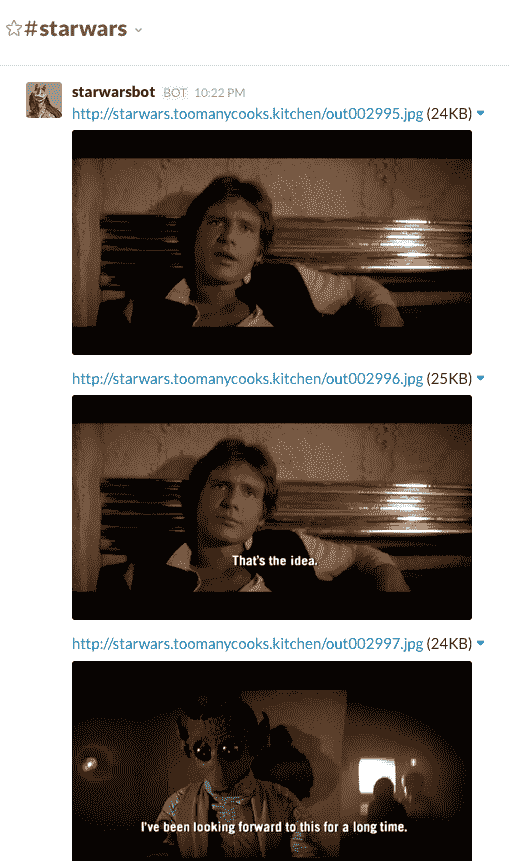
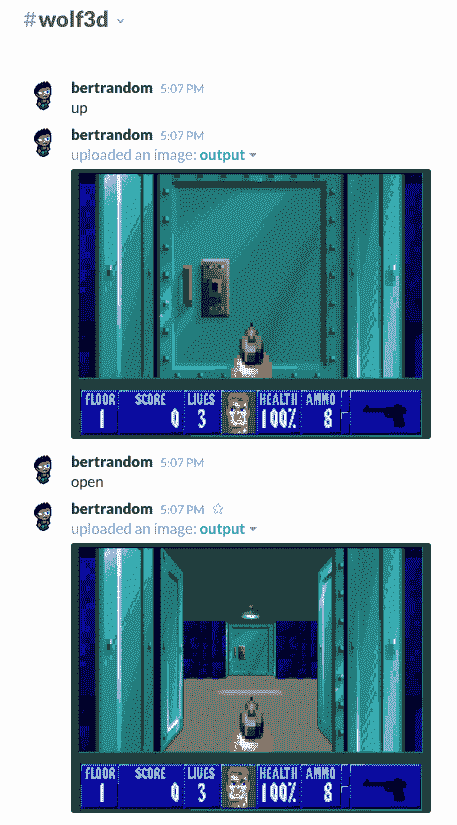
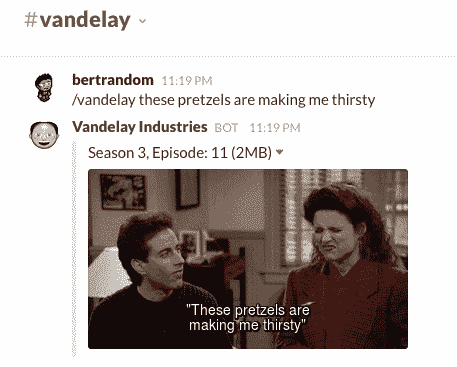

# 无法找到的 Slack 机器人

> 原文：<https://www.freecodecamp.org/news/unfundable-slack-bots-9369a75fdd/>

伯特兰·范

# 无法找到的 Slack 机器人

去年 12 月，Slack 宣布了一项 8000 万美元的基金，投资于补充其技术的软件项目。作为 Slack API 的早期采用者，我在 Slack 平台上下了一些“赌注”:

#### 一个玩全星球大战非专业版的 bot(韩先出手！)每十秒一帧。整个过程大概需要 20 个小时。



#### 一个主持抵抗运动游戏的机器人(可选隐藏议程资料片中的刺客模块)。秘密投票是通过 DM 与机器人进行的，而公开行动是在通道中进行的。


#### 一个让你通过发出命令(左、右、上、下、打开和开火)来玩 Wolfenstein 3D 的机器人。您可以选择指定向左和向右旋转多少度，但默认情况下，您将旋转 45 度。我从未成功完成第一关，但我成功杀死了几个守卫。



我很高兴地宣布，我已经完成了我的最新机器人[万德莱工业](https://vandelayindustries.online/)。Vandelay Industries 是《T2》Frinkiac 的无耻翻版，它让你可以搜索《宋飞正传》每一集的动画 gif。它包含了《宋飞正传》中所有的对话。



如果你想在你的 Slack 团队中尝试一下，只需进入[万德莱工业](https://vandelayindustries.online)并点击**添加到 Slack** 。它将请求您允许添加一个新的斜杠命令/vandelay，一旦获得授权，它应该可以立即在 Slack 中使用。

如果你对其工作原理的技术细节感兴趣，请继续阅读！如果没有，那么您已经设法超过了这篇文章的预计阅读时间。恭喜你！


#### 处理

我最初是从 91G 的《宋飞正传》全部九季，以令人惊讶的高质量 720p 开始。我最终得到了 111G 的动画 gif，它告诉了你关于这种文件格式的效率你需要知道的一切。这部分是关于我如何从一个到另一个。

这些文件在 MKV 的容器中，所以我可以使用 [MKVToolNix](https://mkvtoolnix.download/) 从它们中提取字幕。您可以使用 mkvinfo 列出各种片段轨道:

```
mkvinfo Seinfeld.S01E01.The.Seinfeld.Chronicles.mkv
```

有点难读，但是我们感兴趣的是 3 号音轨，第一个字幕音轨。记下曲目 ID (2)后，我们可以将字幕提取到 SRT 文件中，如下所示:

```
mkvextract tracks Seinfeld.S01E01.The.Seinfeld.Chronicles.mkv 2:S01E01.srt
```

SRT 格式相当简单。它包含计数器、开始时间、结束时间和字幕文本。使用像[字幕解析器](https://www.npmjs.com/package/subtitles-parser)这样的解析器，我们可以很容易地迭代字幕。

下一步是遍历每个字幕，并将时间范围从 MKV 提取到动画 GIF 中。有一篇关于使用 ffmpeg 编码高质量 GIF 的优秀文章，但是如果你现在不想看，技巧是从你感兴趣的视频部分提取一个专门的调色板，然后用它来编码 GIF。

这里有一个我为这个处理步骤改编的脚本:

320 是指生成的 GIF 有多少像素宽。您会注意到，我没有指定开始时间和结束时间，而是指定了持续时间。尽管 ffmpeg 声称支持结束时间，但无论我尝试哪个版本，都无法让它正确地提取正确的范围，所以我最终通过从结束时间中减去开始时间来计算持续时间，并像这样滥用 unix 纪元:

在应用 gifenc.sh 脚本后，我们得到了一个漂亮的动画 GIF，它包含正确的提取范围，如下所示:


但是我想在 GIF 的底部显示副标题文本，在研究了 ImageMagick 文档之后，我想到了这个:

这不是最优雅的解决方案，但它完成了工作。我们最终的 gif 看起来是这样的:


现在只要再做 104，782 次就完成了。在我 2011 年的顶级 Macbook Pro 上，通过 ffmpeg 和 ImageMagick 运行一整集大约需要 30 分钟。这是我想告诉你的故事的一部分，我设法利用亚马逊弹性代码转换器或做了一个 hadoop 工作来将负载分配给我家里的所有计算机，但实际上我所做的是将所有这些放在我的[修复的预算 OVH 服务器](https://www.soyoustart.com/)上，让它运行 5 天，同时我继续过我的生活。

一旦完成了对所有 gif 的编码，我就让 Apache 用一个长的 Expires 头静态地服务它们，并将 Cloudflare 放在整个域的前面。只有时间才能证明这是否能满足交通需求。

#### 搜索

我安装了 Elasticsearch，并对 SRT 文件的内容进行了索引。我在这里遇到了一些非技术性的障碍:在第六季中，第 14 集和第 15 集是一个长达一小时的剪辑节目，名为《百年精彩》，杰瑞·宋飞向你展示了前几集的一些旧剪辑。在《宋飞正传》第九季第 23 集的最后一集中，他们对前几集做了大量的倒叙。这两者通常都会在搜索结果中返回，所以我只是将它们从搜索查询中排除。可能有更好的方法来降低这些剧集的分数，但 Elasticsearch 中的文档就像上面提到的 ImageMagick 文档一样容易阅读。最后，没有人想看这两集的任何一集的片段。抱歉，拉里·戴维，最后一集糟透了。

#### 斜线命令

最后一步只是用 Slack slash 命令将它们打包在一起，这只是一个简单的 Express 应用程序，充当 Elasticsearch 实例的客户端。有一些 OAuth 将命令打包成 Slack 应用程序，并处理 Add to Slack 按钮，但是当请求通过时，我并不真的需要检查身份验证，所以我没有保存授权令牌。服务器的代码可从这里获得:[vandelayindustries-slack-server](https://github.com/bertrandom/vandelayindustries-slack-server)。

就是这样！我希望这篇技术文章能帮助下一个想从整个电视节目中提取 gif 的人，而没有什么实际原因。

