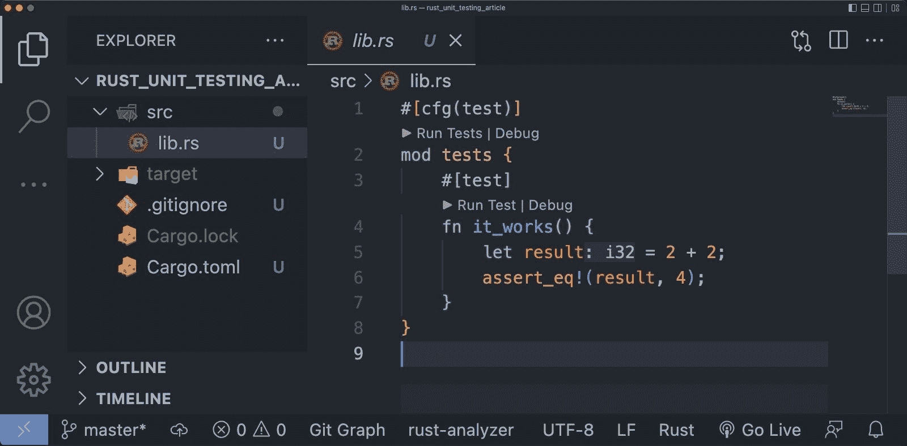
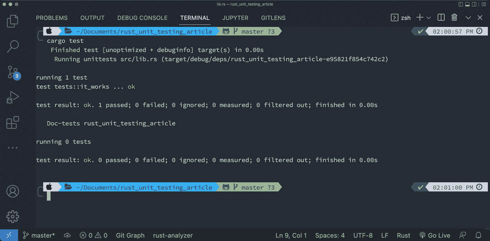
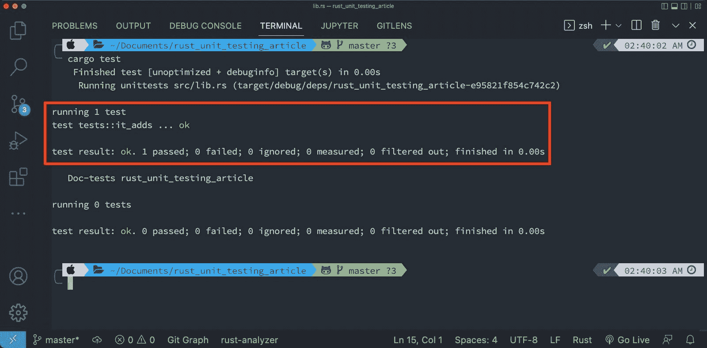
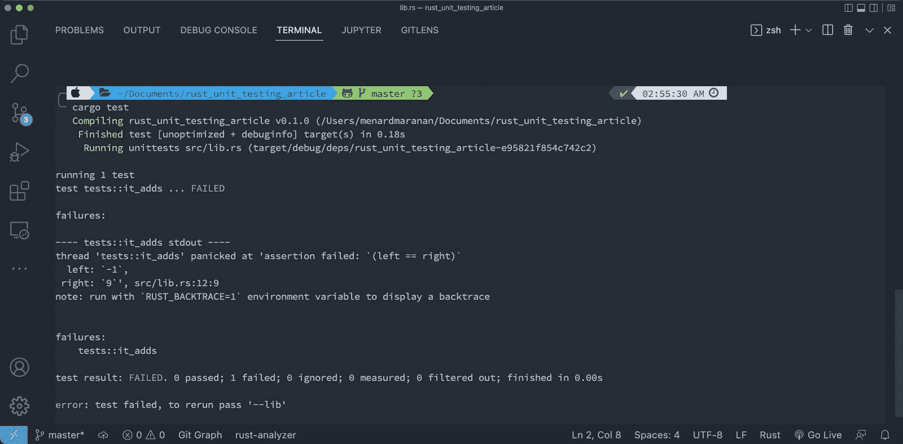
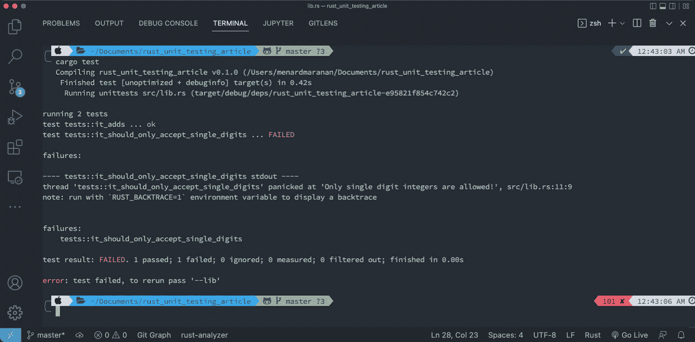
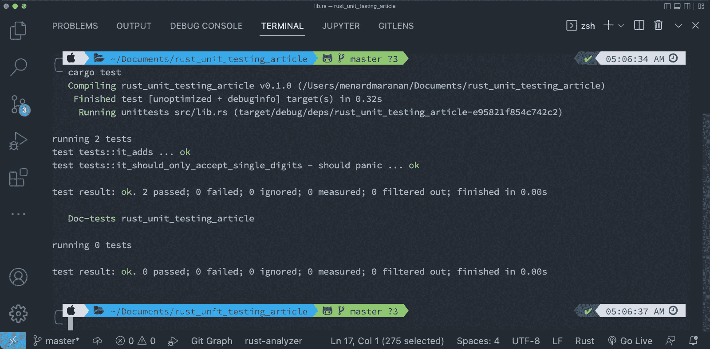

# 什么是单元测试？如何在 Rust 中执行单元测试

> 原文：<https://www.freecodecamp.org/news/unit-testing-in-rust/>

测试是软件开发的重要部分。测试您的代码可以确保您开发的软件按预期运行，并使其不易受到攻击者的攻击。

软件测试是一个非常广泛的话题。这就是为什么在软件行业，有专门从事 QA 和测试的独立专业人员。这些专业人员通常被称为质量保证工程师。

虽然 QA 是自己的事情，但这并不意味着开发者根本不做测试。

开发人员进行的最常见的测试是**单元测试**。单元测试是一种测试小单元代码(比如函数)的测试，因此有了单元测试这个术语。您通常通过将一个代码单元的预期行为与其实际行为进行比较来做到这一点。

单元测试是开发工作流程中不可或缺的一部分，一些公司的整个开发文化都围绕着所谓的 [**测试驱动开发**(或 TDD)](https://www.freecodecamp.org/news/test-driven-development-tutorial-how-to-test-javascript-and-reactjs-app/) 展开。

在 TDD 中，开发人员首先编写测试用例(来自特性需求，通常称为**用户故事**)，然后继续编写满足它们的代码。TDD 主要在需求非常具体的项目中大放异彩。

您可以在不同的编程语言中以不同的方式实现单元测试。但就其核心而言，单元测试只是比较代码的预期行为和实际行为。

因此，不管它是如何在一种特定的语言中实现的，当你在任何其他语言中工作时，同样的原则通常是适用的。

在本教程中，您将学习 Rust 编程语言中的单元测试。也就是说，你至少应该知道 Rust 中编程的[基础，尽管你不需要它的高级知识。](https://www.freecodecamp.org/news/rust-in-replit/)

本文将涵盖:

*   单元测试如何在 Rust 中工作
*   如何在 Rust 中编写单元测试
*   如何测试一个函数
*   为什么失败的测试是有用的
*   如何处理预期的错误行为，使您的测试不会失败

所以，说了这么多，让我们继续学习 Rust 的单元测试吧！

# 单元测试如何在 Rust 中工作

Rust 的核心是代码安全。Rust 严格的类型注释规则有助于在开发阶段早期消除大量错误。但是，这并不是万无一失的。

像任何其他语言一样，业务逻辑就在你的肩上，你必须帮助 Rust 理解在你的代码中什么是可接受的，什么是不可接受的。

是的，这就是我们做测试的原因。

你不需要安装一个测试套件来开始在 Rust 中测试，因为它有内置的测试支持。

首先，在您的本地机器上创建一个新的 cargo 项目(注意`--lib`标志),并在您选择的文本编辑器或 IDE 中打开它。对于本教程，我将使用 VS 代码。

```
cargo new --lib rust_unit_testing
code rust_unit_testing
```

Create a new cargo library project

然后，打开`src/lib.rs`文件。这是我们在本教程中花费最多时间的地方。



src/lib.rs file of a Rust Library Project

在 Rust 中新创建的库项目中，您会注意到默认情况下,`lib.rs`文件已经被一个示例测试代码预先填充了。

这样做的主要目的是让您在编写测试时有一个模板。我们将剖析这个简单测试的每个部分，并理解 Rust 中的基本测试概念。

所以首先，让我们理解那些测试代码行在做什么。在这个例子中，你会看到一个在`lib.rs`中定义的测试模块，里面有一个测试，测试 2 + 2 是否等于 4。

如果你还不知道 Rust 中模块和属性的概念，没关系，你现在可以忽略它们。

但是给你一个想法，Rust 中的测试是写在`tests`模块内部的(`mod tests`部分说它是测试模块),写在这个模块内部的任何东西告诉 cargo 只在测试期间运行它们(本质上这就是`#[cfg(test)]`属性的含义)。

Rust 中的测试本质上只是一个被标注为测试的函数。从上面的例子中，您会注意到函数`it_works`上面的`#[test]`属性。这只是告诉 cargo 这个函数是一个测试，应该在测试期间调用。

在`it_works`测试函数中，它检查从 2 + 2 得到的`result`的值是否等于 4。它使用`assert_eq!`宏执行检查。`assert_eq!`宏比较传递给它的左右值的相等性(`==`)。

在大多数编程语言中，有一个规则，即传递给 assert 的左边的值应该是期望值，而实际值应该在右边。在 Rust 中，没有硬性的规则，你可以将预期的和实际的结果传递给任何一方。

现在，尝试使用以下命令运行您的测试:

```
cargo test
```

Running Rust tests in cargo

以上示例的结果应该是这样的:



cargo test - results

通过运行`cargo test`，cargo 将执行您的测试用例，并在您的终端中输出报告。从那份报告中，你会看到货物运行的测试。

报告的第一行写着`running 1 test`，因为我们只有一个测试函数`tests::it_works`。在被测试的函数旁边，你会看到消息`ok`，意思是测试通过。

您还可以看到下面的结果摘要:

*   1 人通过
*   0 失败
*   0 被忽略
*   0 已测量
*   0 被过滤掉
*   以及表示`test result: ok`的结果的状态

这里的`1 passed`计数器代表通过测试的那个测试函数(`tests::it_works`)，而`failed`计数器告诉我们有多少个测试失败。这同样适用于其他计数器。

您还将在下面看到**文档测试**的结果。由于我们这里没有任何 doc 测试，您将看到`running 0 tests`。您现在可以忽略这一点，只关注单元测试。但如果你想了解更多，你可以查看 [Rust 的官方文档](https://doc.rust-lang.org/rust-by-example/testing/doc_testing.html)。

## 如何在 Rust 中编写测试

当编写一个测试时，你通常需要经历这三个步骤:

1.  模拟测试用例所需的数据或状态。这里，我的意思是提供您正在测试的代码所需的模拟或样本数据(如果必要的话)和/或设置测试用例运行所需的状态或环境。
2.  运行需要测试的代码(传递必要的模拟数据)。一个例子是调用你想要测试的函数。
3.  检查您正在测试的代码的实际行为是否与其预期行为相匹配。例如，通过将参数`x`传递给一个函数，您可以断言它的返回值是否与您期望它返回的值相同。或者检查一个代码单元是否会引发`panic!`——例如，这是预期的行为——如果给定了某个参数的话。

在 Rust 中，单元测试被写在被测试代码所在的文件中。然后，测试函数被分组到`tests`模块中(按照惯例是这样命名的)。

### 如何在 Rust 中测试函数

现在让我们继续测试 Rust 中的函数。

首先，我们需要一个简单的函数来测试。但是首先，移除`it_works`测试函数，因为我们不再需要它。然后，在`tests`模块上面写这个`adder`函数:

```
// src/lib.rs

pub fn adder(x: i32, y: i32) -> i32 {
    x + y
}

#[cfg(test)]
mod tests {
// ...
```

adder function - a sample code to test

上面的`adder`函数是一个简单的公共函数，它只是将两个数相加并返回和。为了测试它是否像预期的那样工作，让我们为这个函数编写一个单元测试。

根据我们之前讨论的编写单元测试的三个步骤，前两个步骤是:

*   为要测试的代码设置数据
*   运行代码。

所以回到`tests`模块，首先，将`adder`函数纳入它的作用域(使用`use`关键字)。然后编写一个名为`it_adds`的函数，用`#[test]`属性进行注释。

```
// src/lib.rs

pub fn adder (x: i32, y: i32) -> i32 {
    x + y
}

#[cfg(test)]
mod tests {
    // this brings everything from parent's scope into this scope
    use super::*;

    #[test]
    fn it_adds() {
    }
} 
```

Setting up the test for the adder function

测试函数内部是我们编写测试的地方。所以在其中，声明一个名为`sum`的变量，然后调用函数`adder`并传递 4 和 5 作为它的参数(这是我们的模拟数据)。

```
// src/lib.rs

// --snip--

    #[test]
    fn it_adds() {
        let sum = adder(4, 5);
    }
}
```

Running the code to be tested with mock data

最后，编写单元测试的第三步是检查我们测试的代码的预期和实际行为。

所以在这里，让我们使用`assert_eq!`宏断言由`adder`函数返回的`sum`的值是否等于`9`(这是我们的预期返回值)。

```
// src/lib.rs

// --snip--

    #[test]
    fn it_adds() {
    	let sum = adder(4, 5);
        assert_eq!(sum, 9);
    }
}
```

Asserting the expected vs actual behavior of the code

下面是我们在`lib.rs`文件中的代码和测试的最终版本:

```
// src/lib.rs

pub fn adder(x: i32, y: i32) -> i32 {
    x + y
}

#[cfg(test)]
mod tests {
    // this brings everything from parent's scope into this scope
    use super::*;

    #[test]
    fn it_adds() {
    	let sum = adder(4, 5);
        assert_eq!(sum, 9);
    }
} 
```

The final version of the code and test

如前所述，您可以使用以下命令运行该测试:

```
cargo test
```

run test cases with cargo

如果一切正常，我们应该得到`test result: ok`声明我们的测试通过了。



如果您愿意，可以在`tests`模块中为`adder`函数添加更多测试(例如，添加负数)。或者更好的是，创建您自己的函数，并为它编写一个(或多个)测试。

此外，除了`assert_eq!`宏之外，Rust 中还有很多内置的断言宏可以使用。其中包括用于断言不相等值(`!=`)的`assert_ne!`宏，以及仅断言您测试的代码是否返回`true`值的`assert!`宏。

如果你需要更多的断言宏(比如支持`>`、`<`、`>=`、`<=`的比较断言)，可以安装这样的外部板条箱: [claim](https://crates.io/crates/claim) 。您可以点击查看[索赔文件，了解更多信息。](https://docs.rs/claim/latest/claim/)

## 为什么失败的测试是有用的

到目前为止，我们的测试结果总是合格。

尽管这很好，但单元测试的真正力量来自于捕捉代码中的错误或 bug，并通过失败的测试来报告它们。所以这一次，让我们故意写一个‘错误’代码，看看会发生什么。

回到`lib.rs`文件，通过用`-`替换`+`操作符来修改`adder`函数。

```
// src/lib.rs

pub fn adder(x: i32, y: i32) -> i32 {
    // change the operator from '+' to '-'
    x - y
}

// --snip--
```

introducing an error to catch the bug through unit testing

现在使用`cargo test`再次运行测试。正如所料，您应该会看到这样一个失败的测试结果:



failing test by cargo

首先，注意测试函数`tests::it_adds`的状态是一个大红色`FAILED`。这就是货物测试失败的样子。

在下面，你会看到“失败”报告，它列出了失败的测试和一些关于失败原因的信息。

从我们的例子来看，`tests::it_adds`测试失败了，正如报告所说，传递给`assert_eq!`宏的左右值不相等(`==`)。

那是因为左边的值是`-1`，而右边的值是`9`。记住，在我们的`assert_eq!`断言中，我们传递给它的左边值是包含`adder(4, 5)`返回值的`sum`变量。

由于我们的操作是错误的，`adder`函数执行`4 - 5`而不是预期的`4 + 5`。这就是为什么我们得到的不是期望值`9`，而是`-1`。Cargo 注意到了这一点，因此提出了一个失败的测试。

在失败的测试报告下面是它的总结(某种程度上)，仍然在`failures`类别下，但是仅仅列出了失败的测试函数的名字。

最后，对整个测试进行总结:

*   状态为:`test result: FAILED`
*   0 通过
*   1 失败
*   0 被忽略
*   0 已测量
*   0 被过滤掉

这次，我们的`failed`计数器是`1`(指我们失败的测试函数)，而`passed`是`0`。

## 如何处理预期错误

从上一节中，您了解了错误会导致测试失败。

但是，如果您预计您正在测试的代码会失败(例如，通过给它一个无效的参数)，该怎么办呢？如果出现错误，cargo 会将其标记为失败的测试，即使您实际上预计它会失败。

你能预料失败的行为吗？

简短的回答是:是的，你可以！

为了演示这一点，让我们回到`lib.rs`文件并修改我们的`adder`函数。这一次，让我们为它设置一个规则，只接受一位数的整数(正数、零和负数)——否则，它应该会“惊慌失措”。出于可读性的目的，让我们将我们的`adder`函数重命名为`single_digit_adder`。

```
// src/lib.rs

// modify the `adder` function from earlier
// and turn it into `single_digit_adder`
pub fn single_digit_adder(x: i8, y: i8) -> i8 {
    fn is_single_digit(x: i8) -> bool {
        x < 10 && x > -10
    }

    if !(is_single_digit(x)) || !(is_single_digit(y)) {
        panic!("Only single digit integers are allowed!");
    } else {
        x + y
    }
}

#[cfg(test)]
mod tests {
// --snip--
```

A strict function that panics upon invalid parameter

因为我们希望`single_digit_adder`函数在接收到一个非一位数的整数时会“死机”,所以我们需要在测试函数中指定负责测试这种行为的函数。

为此，我们需要向我们的一个测试函数添加另一个属性。这就是`#[should_panic]`属性。

回到`tests`模块，首先，通过将`adder`函数调用重命名为`single_digit_adder`来编辑`it_adds`测试函数。

然后，用`#[test]`和`#[should_panic]`属性创建一个名为`it_should_only_accept_single_digits`的新测试函数。

在这个新的测试函数中，用一个无效参数(`11`)调用`single_digit_adder`函数。

```
// src/lib.rs

pub fn single_digit_adder(x: i8, y: i8) -> i8 {
    // ...
}

#[cfg(test)]
mod tests {
    use super::*;

    #[test]
    fn it_adds() {
        let sum = single_digit_adder(2, 3);
        assert_eq!(sum, 5);
    }

    // our new test function that expects `panic!` with invalid param
    #[test]
    #[should_panic]
    fn it_should_only_accept_single_digits() {
        single_digit_adder(11, 4);
    }
} 
```

A test case that expects a failing behavior

在`it_should_only_accept_single_digits`测试函数中你不需要任何断言宏，因为我们只需要`single_digit_adder`来“惊慌”。所以简单的调用函数就够了。

通过给它一个无效的参数(`11`，它不是一个单一的数字)，我们预计它会“恐慌”。然后，`#[should_panic]`属性将期望在`it_should_only_accept_single_digits`测试函数中会出现一些混乱。如果它没有捕捉到任何恐慌，这个测试就会失败。只有`single_digit_adder`慌了才会过去。

所以要测试它是否真的有效，先尝试注释`#[should_panic]`属性，然后运行`cargo test`。你应该预料到它会失败。



现在，取消对`#[should_panic]`属性的注释，并重新运行测试。您的测试应该如预期的那样全部通过:



The output of a test case expecting and actually catching a failing behavior

注意，在测试`tests::it_should_only_accept_single_digits`上，旁边有一个`should panic`，它通过了测试。这意味着这个测试函数如预期的那样陷入了混乱。

现在你知道了！您刚刚学习了什么是单元测试，以及如何用 Rust 编程语言执行单元测试。请使用从本文中获得的知识编写您自己的测试，并在您未来的项目中使用它。

# 结论

在本文中，您了解了什么是单元测试及其在软件开发过程中的重要性。您还学习了如何通过简单的三步过程编写单元测试，并使用 Rust 编程语言实际执行测试。

我们讲述了 Rust 中测试模块的结构以及如何构造测试函数，然后我们为它编写了一个简单的 Rust 程序和一些测试用例。我们还讨论了失败的测试以及如何在代码单元中处理预期的失败行为。

测试是软件开发过程的一个重要部分。测试您的代码有助于确保软件按预期运行。作为一名开发人员，重要的是你要测试你的代码以确保你发布的软件的质量，并且那些愚蠢的错误不会到达最终用户那里！