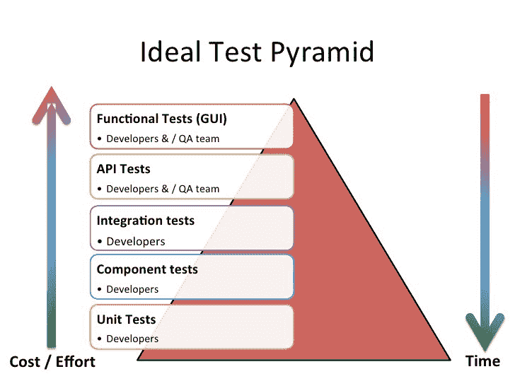
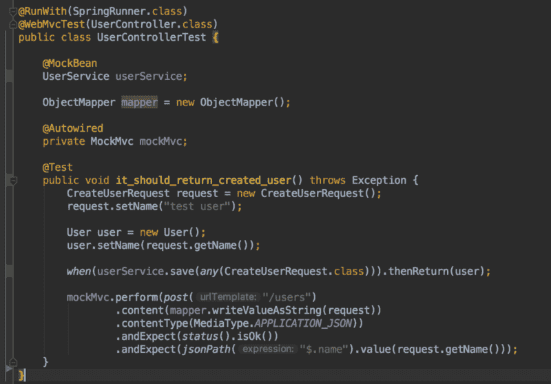
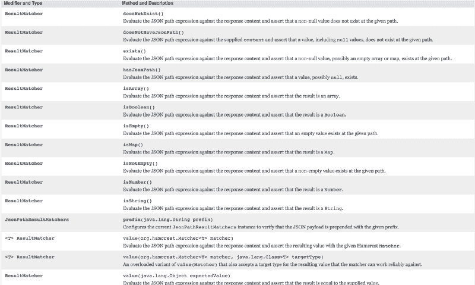
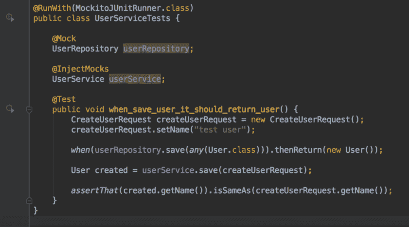
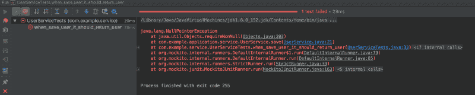
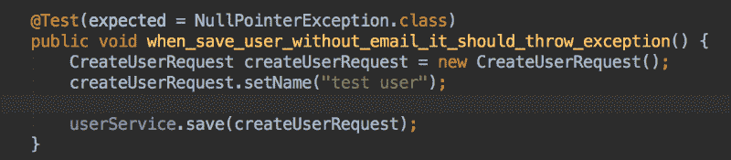
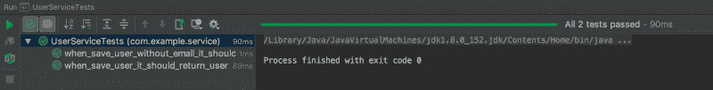
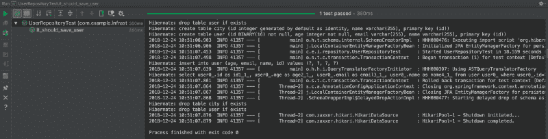
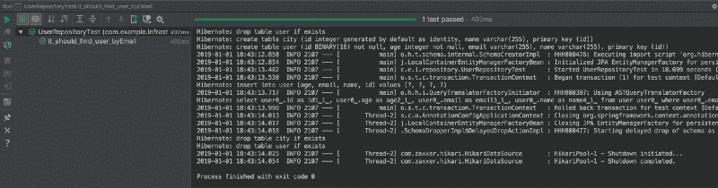

# 如何在 Spring Boot 测试服务、端点和存储库

> 原文：<https://www.freecodecamp.org/news/unit-testing-services-endpoints-and-repositories-in-spring-boot-4b7d9dc2b772/>

是检察官的命令

# 如何在 Spring Boot 测试服务、端点和存储库



在这篇文章中，我将向你展示如何在 spring boot 应用程序中编写单元测试。

为什么有必要编写单元测试需要另一篇文章来解释。但为了简单解释，我会告诉你几件事。

我通常为没有单元测试的代码是死代码这一观点辩护。因为，当开发人员向单元测试没有覆盖的代码中添加新特性时，很容易覆盖现有的业务规则(这会杀死之前编写的代码)。也许不太容易，但是你可以想象当一个复杂的项目需要改变时会出现什么样的错误。单元测试是保护您的代码免受破坏性更改的唯一方法。

#### **为什么要进行单元测试端点？**

每当我们编写一个端点时，我们都需要确保一些事情能够正常工作。端点应该以正确的结构返回数据，并正确处理请求。我们可以手动测试它，但这并不可取。所以我们编写单元测试来确保我们的端点正常工作。还有另一种测试端点的方法叫做自动化测试，但这不是本文的主题。

#### **为什么是单元测试服务？**

这应该已经很清楚了，但以防万一:我们需要确保我们的业务逻辑正确工作。

#### 为什么是单元测试存储库？

有几种情况可以测试存储库。当然我们不测试框架本身。但是我们确实编写单元测试来确保我们的规范或关系已经被正确实现。

### 那么，我们如何测试控制器呢？

现在是时候向您展示如何在春季启动时测试我们的控制器了。假设我们编写了一个允许我们在数据库中保存用户的应用程序。我们定义了用户实体、用户服务和控制器。

*注意:这篇文章中展示的例子不是真正的生产使用架构*

```
@Data@Entitypublic class User {    @Id    @GeneratedValue(generator = "uuid2")    @GenericGenerator(name = "uuid2", strategy = "org.hibernate.id.UUIDGenerator")    @Column(name = "id", columnDefinition = "BINARY(16)")    private UUID id;    private String name;    private String email;    private int age;}
```

```
@Datapublic class CreateUserRequest {    private String name;    private String email;    private int age;}
```

```
@RestController@RequestMapping("/users")public class UserController {    UserService userService;    @Autowired    public UserController(UserService userService) {        this.userService = userService;    }    @PostMapping    public ResponseEntity<User> createUser(@RequestBody CreateUserRequest request) {        User created = userService.save(request);        return ResponseEntity.ok(created);    }}
```

我们的控制器依赖于 UserService，但是我们现在对 Service 做什么不感兴趣。

因此，现在让我们为控制器编写一个单元测试，以确保它正确工作。



我们嘲笑我们的服务，因为我们不需要它的实现细节。我们只是在这里测试我们的控制器。我们在这里使用`MockMvc`来测试我们的控制器和对象映射器，以达到序列化的目的。

我们设置我们的`userService.Save()` 方法来返回期望的用户对象。我们向控制器传递了一个请求，然后我们用下面的代码行检查返回的数据:`andExpect(jsonPath("$.name").value(request.getName()))`。

我们也有其他方法来使用 T1。以下是方法列表:



当我们运行测试时，我们看到它通过了。


### 我们如何测试服务？

现在我们去测试我们的用户服务。测试起来相当简单。



我们模仿存储库并将我们的模仿注入到用户服务中。现在，当我们运行测试时，我们会看到它通过了。

现在让我们向 UserService 添加一个业务规则:假设用户必须有一个电子邮件地址。

我们将用户服务中的保存方法更改如下:

```
public User save(CreateUserRequest request) {    requireNonNull(request.getEmail());        User user = new User();    user.setName(request.getName());    user.setEmail(request.getEmail());    user.setAge(request.getAge());    userRepository.save(user);    return user;}
```

当我们再次运行测试时，我们会看到一个失败的测试。



在我们修复它之前，让我们编写一个满足这个业务的测试。



我们编写了一个新的测试，规定如果我们发送一封空邮件，它将抛出`NullPointerException.`

让我们通过向我们的请求添加一封电子邮件来修复失败的测试:

```
createUserRequest.setEmail("testemail");
```

运行两项测试:



### 我们如何测试存储库？

现在我们来测试存储库。我们使用带有`TestEntityManager.`的内存 h2 数据库

我们的存储库定义如下:

```
@Repositorypublic interface UserRepository extends JpaRepository<User, Integer>, JpaSpecificationExecutor<User> {    Optional<User> findById(UUID id);}
```

首先配置 h2db。在测试->资源路径中创建文件名 application.yaml:

```
spring:  application:    name: Spring Boot Rest API  datasource:    type: com.zaxxer.hikari.HikariDataSource    url: "jdbc:h2:mem:test-api;INIT=CREATE SCHEMA IF NOT EXISTS dbo\\;CREATE SCHEMA IF NOT EXISTS definitions;DATABASE_TO_UPPER=false;DB_CLOSE_DELAY=-1;DB_CLOSE_ON_EXIT=false;MODE=MSSQLServer"    name:    password:    username:    initialization-mode: never    hikari:      schema: dbo  jpa:    database: H2    database-platform: org.hibernate.dialect.H2Dialect    show-sql: true    hibernate:      ddl-auto: create-drop  test:    database:      replace: none
```

让我们首先为我们的存储库编写一个基本测试:保存一个用户并检索它:

```
@RunWith(SpringRunner.class)@DataJpaTestpublic class UserRepositoryTest {    @Autowired    TestEntityManager entityManager;    @Autowired    UserRepository sut;    @Test    public void it_should_save_user() {        User user = new User();        user.setName("test user");        user = entityManager.persistAndFlush(user);        assertThat(sut.findById(user.getId()).get()).isEqualTo(user);    }}
```

当我们运行它时，我们会看到大量的控制台输出，而且我们的测试也通过了:



现在，让我们向我们的存储库中添加另一种通过电子邮件搜索用户的方法:

```
Optional<User> findByEmail(String email);
```

并编写另一个测试:

```
@Testpublic void it_should_find_user_byEmail() {    User user = new User();    user.setEmail("testmail@test.com");    user = entityManager.persistAndFlush(user);    assertThat(sut.findByEmail(user.getEmail()).get()).isEqualTo(user);}
```

当我们在运行测试后查看控制台时，我们将看到 hibernate 生成的 SQL:

```
SELECT user0_.id AS id1_1_,user0_.age AS age2_1_,user0_.email AS email3_1_,user0_.name AS name4_1_FROM user user0_WHERE user0_.email=?
```



到目前为止一切顺利。我们已经用 spring boot 介绍了单元测试的基础知识。

现在你没有任何借口不写单元测试了！我希望你清楚如何为不同的目的编写单元测试。