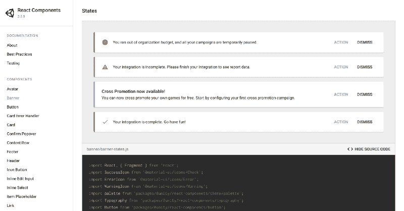
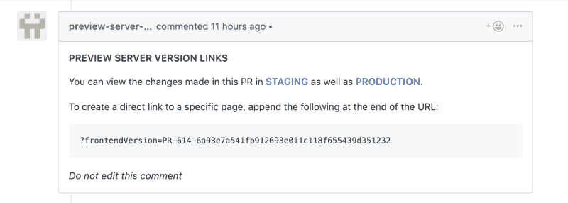
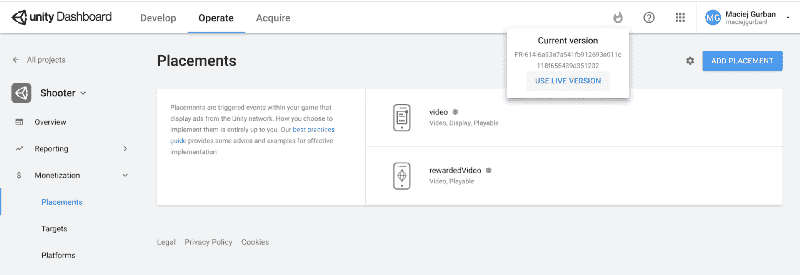
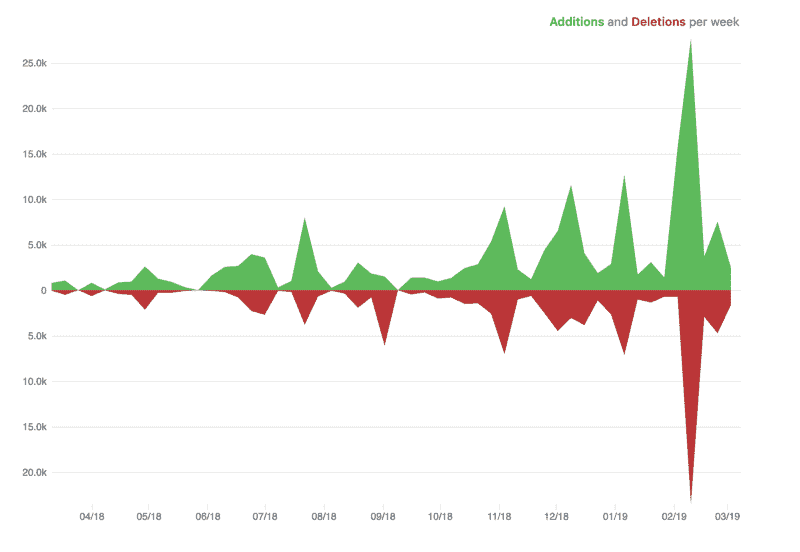
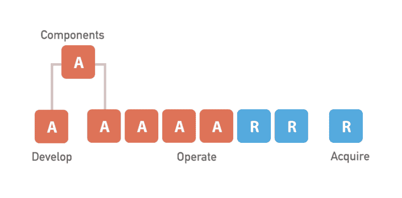
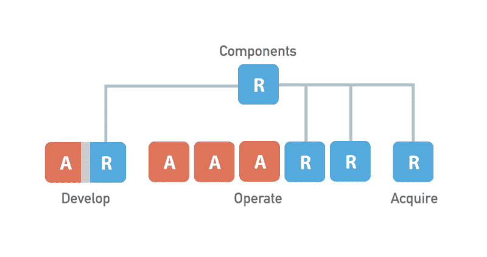
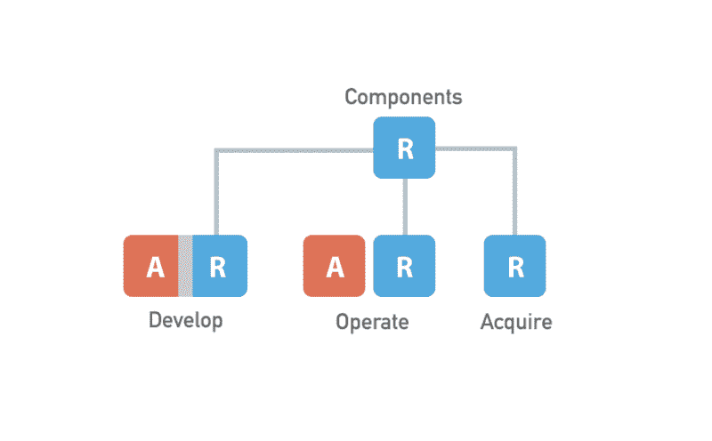

# unity Dashboard——扩展我们的前端、开发文化和流程的经验教训

> 原文：<https://www.freecodecamp.org/news/unity-dashboard-lessons-learned-scaling-our-frontends-development-culture-and-processes-d28f429bd70e/>

作者:马切伊·古尔班

# unity Dashboard——扩展我们的前端、开发文化和流程的经验教训


在 Unity，我们最近开始改进我们的仪表板，这不仅极大地改变了我们的前端技术堆栈，也改变了我们的工作和协作方式。

我们开发了最佳实践和工具来帮助我们扩展前端架构，构建具有出色 UX 和性能的产品，并更快地发布新功能。

本文收集了这些实践，旨在为每个决策提供尽可能多的理由。但首先，一些背景。

### 遗产

看看工程师的数量，Unity 在过去 4 年中的员工人数翻了两番多。随着公司的有机增长和收购，其产品也在增长。虽然最初在 Unity 开发的产品在技术和设计语言方面很大程度上是一致的，但新收购的产品自然不是这样。

因此，我们有多个视觉上截然不同的仪表板，它们工作和行为不同，并且没有共享的导航元素。这导致了糟糕的用户体验和沮丧的用户。从字面上来看，我们产品的前端状态消耗了我们的收入。

在分析了我们的产品组合后，我们得出 Unity Dashboard 将分为三个不同的部分:开发、运营和收购，每个部分都满足不同的业务需求，面向不同的客户群，因此包含彼此基本独立的功能集。

这种新的结构和通用导航元素的引入旨在解决我们的用户面临的第一个主要问题——在哪里找到他们正在寻找的信息和配置选项，虽然这在纸面上看起来很好，但如何到达那里却远非显而易见。

#### 考虑

我们的许多开发人员对迁移到 React 及其更现代的技术堆栈的可能性感到非常兴奋。由于这些解决方案已经在大型应用程序中经过了实战测试，并且它们的最佳实践和约定已经基本确定，所以看起来前景非常光明。

然而，我们的开发人员最了解的，也是我们大多数积极开发的应用程序都是用 AngularJS 编写的。决定一次性开始迁移所有内容将是一场迟早会发生的灾难。相反，我们首先在小得多的规模上测试我们的假设。

也许我们拥有的最脱节的一组产品是**货币化仪表盘**。这些项目最终会在**操作仪表板的保护伞下结束，**几乎在任何可能的方面都有很大的不同:使用的技术，UI/UX 的方法，开发实践，编码惯例——你能想到的。

情况大致是这样的:


State of our dashboards in April 2018\. Projects using Angular vs those using React.

经过一番头脑风暴后，我们确定了将所有产品整合在一起需要努力的主要领域:

#### 1.单一产品

我们需要这些仪表板(跨多个应用程序、领域和技术堆栈划分)来:

*   感觉像一个单一的产品(当用户浏览所有不同应用程序的页面时，没有完整的页面重定向)
*   具有一致的外观和感觉
*   包括通用导航元素的面板总是可见的，并且看起来是相同的，无论用户正在访问仪表板的哪个部分

#### 2.传统支持

虽然我们在新前端解决方案的技术选择方面有一个全新的计划，但我们必须适应需要集成到新系统中的遗留项目。一个解决方案，不涉及大的重构工作，不会停止特性开发，也不会拖上几个月而看不到尽头。

#### 3.实践和工具

虽然几乎所有的团队都使用 AngularJS，但他们使用不同的工具来应对同样的挑战。不同的测试运行器和断言库，状态管理解决方案或缺乏状态管理解决方案，jQuery 与本地浏览器选择器，SASS 与 LESS，图表库等等。

#### 4.开发人员生产力

由于每个团队都有他们自己的解决方案来开发、测试和构建他们的应用程序，所以开发环境经常充满了错误、手动步骤和低效。

此外，我们的许多团队在相隔 10 小时的不同地点工作(芬兰赫尔辛基和旧金山)，这使得对任何共享部分的高效决策成为一个真正的挑战。

### 新的

我们的主要关注领域是:

1.  在我们的团队中鼓励和保持敏捷的工作方式，让团队在很大程度上相互独立
2.  尽可能地利用和开发公共工具和约定，记录它们，并使它们易于访问和使用

我们相信，实现这些目标将显著提高我们的上市时间和开发人员的生产力。为了实现这一点，我们需要一个能够:

*   **构建具有更好用户体验的产品功能**
*   **提高代码质量**
*   **允许更好的协作**在此过程中不妨碍任何人的工作进度。

我们还希望鼓励和简化向现代技术栈的转移，以使我们的开发人员对他们的工作更加满意，并随着时间的推移远离我们过时的框架和工具。

我们工作的不断发展的结果是在 monorepository 中构建的基于 React 的 SPA，其中所有页面和更大的功能都构建在按需加载的基本独立的代码包中，并且可以由多个团队同时开发和部署。

作为一种沙盒化所有遗留应用程序但仍在相同的新应用程序的上下文中显示它们的方法，我们将它们加载到 iframe 中，从 iframe 中它们可以使用使用`[postMessage()](https://developer.mozilla.org/en-US/docs/Web/API/Window/postMessage)` API 实现的消息总线与主 SPA 通信。

### 单一知识库

下面是我们开始时的目录结构:

```
/src   /components  /scenes    /foo      /components      package.json      foo.js    /bar      /components      package.json      bar.js package.json index.js
```

根目录中的`package.json`包含了一组负责整个应用程序开发、测试和构建环境的`devDependencies` ，还包含了应用程序核心的`dependencies`(后面会详细介绍)。

所有较大的 UI 块都被称为*场景*。每个*场景*都包含一个`package.json`，其中定义了该场景的组件所使用的`dependencies`。这使得两件事成为可能:

1.  **部署仅更新已更改的文件**
    构建步骤为每个场景编译单独的供应商和应用捆绑包，使用哈希命名每个捆绑包，哈希仅在文件内容更改时才会更改。这意味着我们的用户只下载自他们上次访问后更改过的文件，仅此而已。
2.  场景仅在需要时加载
    我们异步按需加载所有场景，这极大地缩短了整个应用程序的加载时间。这里的“按需”通常是指访问特定的路径，或者执行一个 UI 动作，该动作执行一个[动态模块导入](https://github.com/tc39/proposal-dynamic-import)。

下面是这样的设置在实践中的样子(为了可读性，进行了简化):

```
// In src/routes.jsconst FooLoader = AsyncLoadComponent( () => import(‘src/scenes/foo/foo’), GenericPagePreloader,);
```

```
<Route path=”/foo” component={FooLoader) />
```

```
// In src/scenes/foo/foo.js<React.Suspense fallback={GenericPagePreloader}> <Component /></React.Suspense>
```

`AsyncLoadComponent`是围绕`[React.lazy()](https://reactjs.org/docs/code-splitting.html#reactlazy)`的一个薄包装器，另外接受一个预加载器组件，同样的组件通过回退到`[React.Suspense()](https://reactjs.org/docs/code-splitting.html#suspense)`，如果场景没有完成加载，预加载器应该在一个延迟之后被渲染。

这对于确保我们的用户从请求场景到下载所有文件、完成所有关键 API 请求以及组件完成渲染的整个过程中看到相同的预加载程序而没有任何中断或内容闪烁非常有用。

### 组件层

随着每个应用程序的增长，其目录结构和抽象也随之发展。经过大约半年的构建和向新代码库转移特性，拥有一个单一的*组件*目录被证明是不够的。
我们需要我们的目录结构来告知我们:

*   组件是被开发成通用的，还是只针对特定的用例？
*   它们是否足够通用，可以在所有应用程序中使用，还是应该只在特定的上下文中使用？
*   谁对代码负责，谁对代码了解最多？

基于此，我们定义了以下**组件层**:

#### 1.特定于应用程序(src/app)

满足该应用程序中特定用例的一次性组件，并且不打算重复使用或提取到组件库(路线、页脚、页眉等)。).

#### 2.通用(src/组件)

通用多用途组件，可在应用程序及其场景中使用。一旦我们为这些组件获得了一个稳定的 API，它们就可以被转移到公共组件库中了(下面会详细介绍)

#### 3.单个场景的组件(src/scenes/my-scene/components)

考虑到特定用例而开发的组件；不得用于任何其他场景。如果一个场景中的组件需要在另一个场景中使用，我们可以使用:

#### 4.多场景组件(src/场景/组件/我的功能)

跨多个场景使用的组件，但并不意味着通用到可以在任何其他地方使用。为了说明为什么简单地将它们移动到`src/components`还不够好:

想象一下，到目前为止，您有一个场景，其中包含用于构建一些特定数据图表的组件。您的团队现在正在构建第二个场景，该场景将使用不同的图表数据，但从视觉上看，这两个场景几乎是一样的。

将组件从一个场景导入到另一个场景会破坏场景的封装，这意味着我们无法确定对单个场景的组件所做的更改是否只影响该场景。

出于这个目的，任何组件或组件组，粗略地称为一个特性，将被放置在`src/scenes/components`中，从那里它可以被任何其他团队导入和使用，但是:

每当一个团队想要开始使用另一个团队开发的场景组件时，最佳实践是首先联系该团队，以弄清楚您想要这些组件的用例是否能够在未来得到安全的支持。给最初开发代码的团队提个醒，可以防止将来当您使用的代码不可避免地以您没有预料到的方式被更改时(当然，您怎么能这样呢！)，而且单元测试可能并不总能捕捉到。

#### 5.公共图书馆

我们已经在生产中测试过的组件，希望提取到我们的共享组件库中，供 Unity 的其他仪表板团队使用。

### 共享依赖颂歌

虽然能够在完全隔离的环境中构建和部署我们应用程序的每一部分非常方便，但某些依赖项——外部库和内部应用程序代码——将简单地在整个代码库中使用。像 React 本身、redux 和所有与 Redux 相关的逻辑、通用导航组件等等。

#### 推出变更

目前，完全封装场景是不切实际的，在许多情况下根本不可能。这要么需要多次运送许多依赖项，并在此过程中降低页面加载速度，要么需要构建抽象概念，以使某些库在它们没有被设计的情况下工作。

然而，随着 web 开发及其生态系统的发展，库似乎变得越来越独立和封装，我们希望在未来这将意味着很少或没有共享依赖，以及所有模块之间的真正隔离。

> 也许创作大规模应用程序的最大缺点是执行代码更改和依赖性更新，而不破坏过程中的某些东西

使用 monorepository 可以(虽然不是强制性的)以更渐进和安全的方式对代码进行更改和更新——如果更改导致问题，这些问题只会影响应用程序的一小部分，而不是整个系统。

虽然对一些人来说，同时对代码库的多个不相关的区域执行更新的能力会带来好处，但是让多个团队处理同一个代码库而不完全了解所有其他团队的特性的现实意味着，在构建应用程序脚手架和采取措施来最小化破坏风险时，需要非常谨慎。

#### 如何避免打碎东西

也许除了场景隔离之外，帮助我们做到这一点的最基本的策略是拥有**高单元测试覆盖率**。

1.  **测试**

单元测试当然不是一切——许多成熟的产品，即使是中等规模的产品，毕竟都投资于集成和 e2e 测试套件，这些套件在验证应用程序是否如预期的那样整体工作方面做得更好。然而，随着功能数量的增加，运行这些功能所需的维护成本和时间也在增加，对于不太重要但仍然重要的功能，这种成本并不总是合理的。

**我们从各种测试策略中学到的一些经验:**

*   尝试对尽可能多的代码进行单元测试，尤其是:条件逻辑、数据转换和函数调用
*   在决定编写任何 e2e 测试之前，投资并充分利用集成测试。集成测试的初始成本要高得多，但与 e2e 套房的维护费用相比就相形见绌了
*   不要反应过度，开始为单元测试或集成测试没有发现的东西编写 e2e 测试。有时，过程或工具是错误的
*   让测试用例来解释 UI 行为，而不是实现细节
*   自动化测试不能完全取代手工测试

**2。最小化共享代码的表面**

除了测试，整个应用程序中重用的代码保持在合理的最低限度。到目前为止，最有用的策略之一是将最常用的组件和代码移动到一个共享组件库中，在需要它们的场景中，它们将作为依赖项使用。这使得我们可以逐步地在每个团队或页面的基础上推出大部分的变更。

**3。问责制**

最后但同样重要的是，多个团队能够在同一个代码库中合作的一个重要因素来自于鼓励并让**开发人员对产品**承担个人责任和义务，而不是将正确测试一切正常的责任推卸给质量保证、测试人员或自动化。

这也适用于代码审查。确保每一个变化都被仔细地审查，这比表面上看起来要困难得多。当团队紧密合作时，成员之间会建立健康的信任度。然而，这种信任有时会转化为人们对更有经验或更值得信任的开发人员所做的变更不那么关注。

为了鼓励勤奋，我们强调**PR 的作者和评审者同样有责任确保一切正常**。

### 组件库

为了在仪表板的所有页面上实现相同的外观和感觉，我们开发了一个组件库。在我们的方法中，新组件几乎从不在该库中开发。

每一个组件，在仪表板的代码库中被开发之后，首先在代码库中的一系列特性中被使用。通常在几周之后，我们开始对组件可以被转移更有信心，因为:

*   API 足够灵活，可以支持可预见的用例
*   该组件已经在各种环境中进行了测试
*   性能、响应能力和 UX 都包括在内

这个过程遵循三个的[规则，旨在帮助我们**只发布真正可重用的**组件，并且在被移动到我们的公共库之前，已经在各种环境中投入使用。](https://blog.codinghorror.com/rule-of-three/)

我们要移动的组件的一些例子包括:页脚、页眉、侧边和顶部导航元素、布局构建块、横幅、按钮的启动版本、排版元素等。

在早期，组件库通常位于与应用程序本身相同的代码库中。从那时起，我们将它提取到一个单独的存储库中，以使 Unity 的其他团队的开发过程更加民主化——这在推动它的采用时非常重要。

#### 模块化组件设计

很长一段时间以来，构建可重用的组件意味着处理多种挑战，其中许多往往没有好的解决方案:

*   如何轻松地导入组件及其样式，仅此而已
*   如何在没有选择器特异性警告的情况下覆盖默认样式
*   在由多个较小组件组成的较大组件中，如何覆盖较小组件的样式

我们的仪表板以及组件库严重依赖并利用了 [Material UI](https://material-ui.com/) 。Material UI 的样式解决方案中唯一引人注目的是由和他们的[统一样式语言](https://medium.com/seek-blog/a-unified-styling-language-d0c208de2660)带来的潜力(非常值得一读)，这使得开发由设计封装的 UI*成为可能，就像在 [CSS 模块](https://github.com/css-modules/css-modules)的情况下一样，并且一步到位地解决上述问题。*

这与类似于 [BEM](http://getbem.com/) 的方法有很大的不同，这些方法通过约定提供了*封装，而后者的可扩展性和封装性较差。*

### 生活方式指南

一个组件库如果不能展示它所包含的组件，并且能够看到组件在整个版本中的变化，那么它将是不完整的。

我们对 [Storybook](https://storybook.js.org/) 有很好的体验，它非常容易设置和开始使用，但过了一段时间后，我们意识到需要一个更强大的端到端解决方案。非常接近 [Styleguidist](https://react-styleguidist.js.org/) 所提供的，但更适合我们的需求。

#### 现有设计文档

作为最新设计规范主要信息来源的文档位于 Confluence 中，在这里，设计人员通过截图展示了每个组件的最新规范，包括允许的用例、组件可能处于的状态和变化、列出的最佳实践，以及尺寸、使用的颜色等细节。遵循这种方法，我们面临了许多挑战:

*   **材料设计规范不断发展**因此，我们经常发现自己要么花时间更新所有截图和指南，要么让我们的设计指南变得过时
*   **找出哪个更正确:实现或规范**并不总是一件容易的事情。因为我们已经发布了每个组件和每个库版本的故事书演示，我们可以看到发生了什么以及如何变化。我们不能为设计规格做同样的事情。
*   **截图和视频只能交流这么多**。为了提供高质量的组件，并且可以由多个团队使用，有必要检查每个组件是否在所有分辨率下都能工作，是否没有错误，是否具有良好的 UX——如果没有设计师坐在你旁边观看屏幕上显示的实现演示，这是很难做到的

### 组件文档应用程序

我们的文档应用程序旨在提供设计师和工程师之间高效协作的方式，使双方更简单、更省时地记录、审查和开发组件。更具体地说，我们需要:

*   **拥有展示组件**、组件外观、行为和使用方式的单一参考点——为每个版本提供——用现场演示取代详细描述
*   **让设计人员和开发人员在组件及其文档上轻松协作**,并在组件发布之前就完成协作——无需共享视频、截图或身处同一地点
*   **将设计分成我们计划做的和已经做的**

与以前类似，组件库的每个版本都会导致新版本的生活方式指南的发布。然而，这一次有一些不同之处:

1.  **设计人员通过 Github UI 编辑文档文件，提交对最新版本的更改，从而直接为组件文档做出贡献**。
2.  **所见即所得**形式的组件演示——您所看到的作为如何实现组件的示例的相同代码用于呈现演示，包括任何中间文件导入、变量声明等。作为额外的奖励，包裹在`withStyles()`中的组件可以正确显示([问题](https://github.com/storybooks/storybook/issues/3851)目前出现在故事书中)。
3.  **对文档和代码的更改几乎立即可见**无需在本地签出分支并启动文档应用程序——每次提交时都会重新构建并发布应用程序。



### 开发经验

代码审查的主要目标之一是确保每一个变更在合并和部署之前都经过仔细的审查、考虑和测试。

为了尽可能无障碍地完成这项任务，我们开发了一个**预览服务器**，它能够在每次创建或更新 PR 时创建我们应用程序的新版本。



A comment containing version links gets added to every PR and is updated on every pushed change

我们的设计师、产品经理和工程师可以在整合之前，在试运行和生产环境中，以及在做出更改后的几分钟内，测试每一项更改。



Browsing production version of the application before merging the PR

### 结束语

自从我们着手整合仪表板以来，已经过去了将近一年的时间。我们花了那么多时间学习如何发展一个大而健康的软件项目，如何更好地协作和交流，以及如何提高我们自己的质量标准。

我们不仅根据代码行数，还根据在代码库中工作的工程师数量来扩展前端项目——这个数字从一开始就翻了两番。



Code frequency from the beginning of project’s existence until now

在处理团队之间的时差方面，我们做了 180 度的改变，从团队完全孤立工作的模式转变为每天都有密切协作和沟通的模式。

虽然我们还有很长的路要走，以确保我们可以将我们的方法扩展到更多的团队和更大的挑战，但我们已经注意到了一些改进:

*   **路线图和工作可见性**
    由于有一个所有工作都在其中进行的地方，进度得到跟踪，所有问题都集中在这里
*   **开发速度和上市时间**
    新功能可以在很大程度上从现有的和经过良好测试的组件中创建——通过我们的文档应用程序可以轻松找到
*   **代码质量&测试覆盖**
    当构建新的东西时，类似问题的解决方案通常已经存在，并且唾手可得，还有如何测试它的例子
*   总体质量& UX
    测试功能并确保其质量现在比以往任何时候都更容易，因为设计师、产品经理和其他利益相关者可以在他们自己的机器上用他们自己的账户和数据集测试每一项变更

很自然，在这一过程中，我们遇到了许多需要解决或者将来需要解决的挑战:

*   **构建& CI 性能**
    随着依赖项、构建包和测试数量的增长，部署所需的时间也在增长。在未来，我们将需要开发工具来帮助我们只构建、测试和部署发生变化的部分。
*   **开发文化**
    为了构建健康的软件，我们需要不断地研究健康的交流和交换思想的方法，而基于文本的交流使这项任务变得更加困难。我们正在努力通过一系列定期的领导力培训课程来解决这一问题，并采用更开源的工作方式，以及每年组织几次聚会，让团队面对面交流。
*   **破损隔离&更新**
    随着功能和页面数量的增长，我们将需要一种更健壮的方法来隔离我们的应用程序模块，以防止当出现问题时损害蔓延。这可以通过对所有共享代码(redux logic、src/components)进行版本控制来实现，或者在极端的情况下，生成特定功能的独立版本。

#### 陈述过去、现在和将来

这种迁移包括离开 AngularJS 以作出反应。以下是过去一年情况的变化:



April 2018



February 2019



Where we hope our dashboards will be by the end of 2019

这是一个总结！感谢您的阅读！你可以在 LinkedIn [这里](https://www.linkedin.com/in/maciejgurban/)找到我。

如果你对处理类似的挑战感兴趣，我们一直在寻找有才华的工程师加入我们遍布全球的团队。