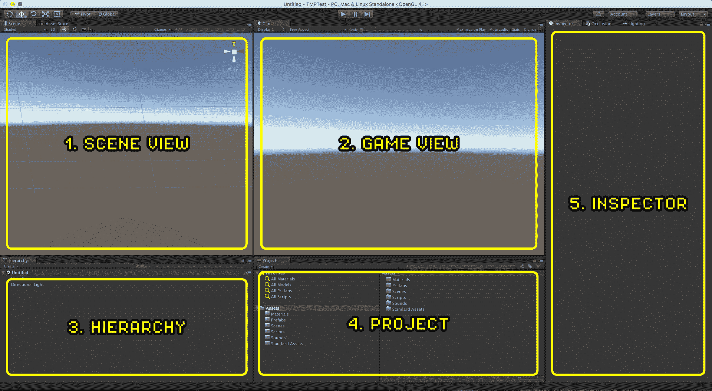

# Unity 游戏引擎指南:如何开始使用最流行的游戏引擎

> 原文：<https://www.freecodecamp.org/news/unity-game-engine-guide-how-to-get-started-with-the-most-popular-game-engine-out-there/>

## 【Unity 游戏开发

Unity 是由 Unity Technologies 开发的跨平台游戏引擎，主要用于开发电脑、游戏机和移动设备的视频游戏和模拟。在 2005 年的苹果全球开发者大会上，它首次宣布只面向 OS X，后来扩展到 27 个平台。

## **概述**

Unity 是一款通用游戏引擎，支持 2D 和 3D 图形、拖放功能以及通过 [C#](https://guide.freecodecamp.org/csharp) 编写脚本。

Unity 在移动游戏开发中特别受欢迎，他们的大部分注意力都集中在移动平台上。Unity3D 的 2D 管道是引擎的新成员，不如 3D 管道成熟。尽管如此，即使与其他专用 2D 引擎相比，Unity 对于开发 2D 游戏来说也是一个足够的平台，尤其是如果你计划在多个移动设备上发布游戏的话。

Unity 也是一个不错的 VR 开发选择，虽然目前 VR 是一个非常小的市场。移动和 PSVR 市场是虚拟现实中最大的市场，Unity 已经做好了将游戏移植到 PS4 和 PC 等许多平台或许多不同移动市场的准备。

该引擎针对以下图形 API:Windows 和 Xbox One 上的 Direct3DLinux、macOS 和 Windows 上的 OpenGLAndroid 和 iOS 上的 OpenGL ESweb 上的 WebGL 和视频游戏控制台上的专有 API。

此外，Unity 支持 iOS 和 macOS 上的低级 APIs Metal 和 Android、Linux 和 Windows 上的 Vulkan，以及 Windows 和 Xbox One 上的 Direct3D 12。在 2D 游戏中，Unity 允许输入精灵和先进的 2D 世界渲染器。

对于 3D 游戏，Unity 允许为游戏引擎支持的每个平台指定纹理压缩和分辨率设置，并提供对凹凸贴图、反射贴图、视差贴图、屏幕空间环境遮挡(SSAO)、使用阴影贴图的动态阴影、渲染到纹理和全屏后处理效果的支持。

Unity 还为开发者提供服务，包括:Unity 广告、Unity 分析、Unity 认证、Unity 云构建、Unity Everyplay、Unity IAP、Unity 多人游戏、Unity 性能报告和 Unity 协作。除此之外，Unity 有一个资产商店，开发者社区可以下载和上传商业和免费的第三方资源，如纹理，模型，插件，编辑器扩展，甚至整个游戏的例子。

Unity 以其针对多平台游戏的能力而闻名。目前支持的平台有 Android、Android TV、脸书 Gameroom、Fire OS、Gear VR、Google Cardboard、Google Daydream、HTC Vive、iOS、Linux、macOS、微软 HoloLens、任天堂 3DS 家族、任天堂 Switch、Oculus Rift、PlayStation 4、PlayStation Vita、PlayStation VR、三星智能电视、Tizen、tvOS、WebGL、Wii U、Windows、Windows Phone、Windows Store 和 Xbox One。

Unity 是任天堂 Wii U 视频游戏机平台的默认软件开发工具包(SDK)，任天堂在每个 Wii U 开发者许可证中都包含一个免费副本。Unity Technologies 将这种捆绑第三方 SDK 的做法称为“行业首创”。

## **界面**

在上图中，你会注意到五个部分:

1.  第一节。 ****场景视图**** :这是你为你的游戏、场景或 3D 项目创建关卡的地方。你所有的游戏物品都将在这里被放置和操作。
2.  第二节。 ****游戏视图**** :这里你会看到你的成绩，你的等级或者场景看起来怎么样。你需要有一个摄像机在现场，看看它是什么样子。有时它被称为相机视图。
3.  第三节。 ****层级**** :该窗口将显示所有直接放置在场景中的游戏对象。基本上你在游戏视图中看到的所有东西，都需要列在这里。这将包括非视觉和视觉游戏对象。
4.  第四节。 ****项目**** :这是你的项目窗口。基本上，它显示了你的磁盘上的资产文件夹中的内容。从游戏对象，脚本，纹理，文件夹，模型，音频，视频等等…都可以从这个窗口访问。
5.  第五节。 ****检查员**** :该面板会显示所选游戏对象的不同属性。根据选择，将列出适当的属性和组件。

## **值得关注的游戏:**

*   刺客信条:身份
*   神庙逃亡三部曲
*   太空堡垒卡拉狄加在线
*   炉石:魔兽英雄
*   里面的
*   库法达

## **历史**

支持另外两种编程语言:Boo 和 UnityScript，Boo 在 Unity 5 发布时已被弃用，Unity script 在 Unity 2017.1 发布后于 2017 年 8 月被弃用。

Unity 以前支持 7 个其他平台，包括它自己的 Unity 网络播放器。

Unity Web Player 是一个浏览器插件，仅在 Windows 和 OS X 受支持，它已被弃用，取而代之的是 WebGL。

Unity 是 Rust、Kerbal 太空计划和 Cup Head 使用的引擎。

## 关于 Unity 的更多信息:

*   [Unity 游戏开发终极初学者指南](https://www.freecodecamp.org/news/the-ultimate-beginners-guide-to-game-development-in-unity-f9bfe972c2b5/)
*   [如何在 Unity 中创建 2D 游戏](https://www.freecodecamp.org/news/how-to-create-a-2d-card-game-in-unity/)(视频)
*   [游览团结 2D](https://www.freecodecamp.org/news/take-a-tour-of-unity-2d/) (视频)
*   [Unity 与其他游戏引擎对比](https://www.freecodecamp.org/news/how-i-made-a-2d-prototype-in-different-game-engines/)