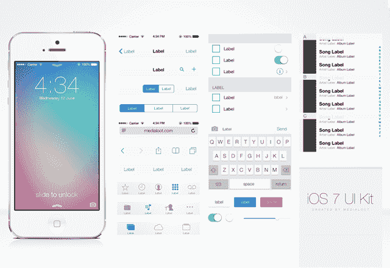
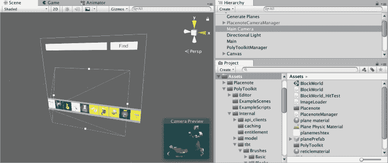

# Unity vs SceneKit:你应该使用哪个工具来构建你的 ARKit 应用

> 原文：<https://www.freecodecamp.org/news/unity-vs-scenekit-which-tool-you-should-use-to-build-your-arkit-app-3e93122058b1/>

尼尔·马修

# Unity vs SceneKit:你应该使用哪个工具来构建你的 ARKit 应用

#### 在构建我的第一个 ARKit 应用程序之前，我希望我知道的一切。

当开始 ARKit 开发时，几乎每个人都有的第一个问题是，我应该使用什么工具来构建我的 AR 应用程序？最常用的两个工具似乎是 **Unity** 和 **SceneKit —** 但是哪个更好呢？哪一个更强大，更灵活，更容易学习？哪个支持度最高？

我不得不自己解决这些问题中的大部分，就像迄今为止推出 AR 应用程序的大多数开发人员一样。因此，我认为深入研究这两个平台之间的主要差异将有助于您更容易地决定如何投资时间。

如果你正在开始 AR 开发，**这里有一些我希望在构建我的第一个 AR 应用程序之前了解 Unity 和 SceneKit 的事情。**开始吧。

### **首先，快速概述一下:**

[**Unity**](http://unity3d.com) 是一个成熟的 3D 游戏引擎，由于其对 3D 内容的强烈关注，它已经与 VR 和 AR 紧密联系在一起。开发的主要语言是 C#。Unity 中的 ARKit 开发是通过 Unity ARKit 插件完成的，该插件将 ARKit SDK 封装在 C#脚本中，以便轻松访问所有 ARKit 函数。

[**SceneKit**](https://developer.apple.com/scenekit/) 是苹果为原生 iOS 开发的 3D 游戏引擎，直接与 Xcode 集成。主要语言是 Swift 和 Objective C。

### **他们中的一个客观上更好吗？**

当比较两个产品时，网上最令人沮丧的回答似乎是，“看情况。”所以让我先说，在大多数情况下，你会发现 **Unity** 是 AR 开发的更好的解决方案。然而，在某些情况下，SceneKit 会胜出，我将尽力解释每种工具的优缺点，以便您做出明智的决定。

让我们首先来看看 AR 应用程序开发人员目前可能面临的两种情况:

1.  你正在构建一个应用程序(消费者、企业等)。)
2.  你在构建一个游戏或“体验”

#### **你正在开发一款应用**

如果你想将 ARKit 集成到现有的 iOS 应用中，别再犹豫了。使用 SceneKit。SceneKit 可以让您轻松地将 AR 视图集成到您的应用程序中，而无需更改 UX 中的任何其他内容。

如果你是一个有 XCode、Swift、Cocapods 等经验的 iOS 开发专家，你可能仍然应该使用 SceneKit。你将避免一个新平台的学习曲线，你将能够很快学会 ARKit SDK。

如果你正在构建一个新的消费者或企业 iOS 应用，并且你喜欢苹果的 UI 元素(如按钮、手势和通知)的外观，那么 SceneKit 还是更好的选择。作为苹果公司的产品，SceneKit 与 XCode 完美集成，让你以一种非常无缝的方式将 3D 场景视图与所有内置的 2D UI 元素集成在一起。

这里的一般规则是，如果 3D 内容不是你的应用程序的中心焦点，并且你关心 iOS UX 模板，请使用 SceneKit。

SceneKit makes it very easy to add Native iOS 2D UI templates to your app

**警告**如果你关心 iOS 和 Android 之间的快速跨平台开发，或者如果你的应用程序有很多 3D 内容，如动画模型、特效和物理，你应该考虑 **Unity。**作为一个跨平台的 3D 开发工具包，它更为成熟，因为它源于游戏引擎。

#### 你在构建一个游戏

如果你正在构建一个游戏或者一个沉浸式的体验，特别是一个有很多视觉 3D 内容的游戏，比如角色动画、游戏地图、特效和物理模拟， **Unity 绝对是更好的选择。**

Unity 充满了大量的内置方法，允许你做任何你能想到的事情。如果不是内置的，可能在 Unity Asset store 上有。由于这些因素，Unity 比 SceneKit 节省了你很多时间，在 scene kit 中，你可能会花很多时间来构建和调试基本功能，而不是构建你的游戏。

此外，Unity 允许您快速交叉编译到许多不同的平台，因此您可以将 ARKit 游戏移植到 Android，只需对实际的 AR 跟踪库进行少量更改。(这也很快会发生变化——Unity 正在构建一个跨平台的 XR SDK，它将低层 AR 库抽象化，以实现更快的移植)。对于开发者来说，开发速度通常是一个非常重要的因素，为不同的平台重写你的应用程序会是一个非常大的成本。

### **决策标准**

如果你不太适合上面的两种场景，或者如果你不确定你是在构建一个游戏，一个应用，一个游戏化的应用还是一个应用化的游戏，这里有一个基于 AR 开发者关心的一些共同标准的一般比较。

#### 1.表演

一般来说，使用 SceneKit 构建的应用程序或游戏文件较小，在某些情况下性能可能会更好。当使用 Unity 时，你会将一个成熟的物理引擎带入你的应用程序。因此，如果您不使用繁重的 3D 计算，使用 SceneKit 可能会更好。

然而，请记住，Unity 插件的所有相机代码和其他 AR 模块都是用 Objective C 编写的，因此它们在效率方面非常相似。主要是沉重的 3D 场景和项目设计中的任何低效会使它变慢。这里有一个关于这个话题的好线索。

结论:在这里，统一和场景是相当平等的。

#### 2.3D 格式兼容性

我个人有过将 3D 模型和动画导入 SceneKit 的痛苦经历。一般来说，在为你的游戏或应用程序提供 3D 内容时，请记住 SceneKit 会限制你使用 Collada(。dae)或波前(。obj)文件。此外，我偶尔会看到一些。obj 文件在 Scenekit 中无法正确渲染。

Unity 在处理任何类型的 3D 格式方面都要好得多。有了 Unity，你不仅可以导入。fbx 文件(包含动画的 3D 模型)，但也可以直接从 Blender 等 3D 设计工具加载场景。

**判决:+1 表示这里团结一致。**

#### 3.易于调试

Unity 是一个非常可视化的 IDE，拥有强大的可视化调试工具，可以让你在运行时看到场景中的所有 3D 内容并与之交互。虽然你需要直接在 iOS 设备上运行你的应用程序来正确测试和调试 ARKit 问题，但你可以使用像 [Unity ARKit Remote](https://blogs.unity3d.com/2017/08/03/introducing-the-unity-arkit-remote/) 这样的工具直接在 Unity editor 中原型化你的应用程序中的 3D 交互。

另一方面，SceneKit 只在 XCode 中提供控制台调试。虽然一些开发人员更喜欢这样，但这可能会妨碍快速测试你的应用程序或游戏中的 3D 交互。

**判决:+1 表示这里团结一致。**

Unity’s awesome visual scene debugger

#### **4。文档/教程/样本的可用性**

Unity 拥有海量的文档、教程和样本代码资源，几乎可以用来构建任何东西。因为他们有很大的开发者社区，所以也有很多由开发者创建的教程。

当然，iOS 开发者社区也相当庞大。虽然 ARKit 本身可能是新的，但该社区的庞大规模已经产生了大量的样本、博客帖子、视频教程和在线课程，可以让您轻松过渡到 AR 开发人员。

在 3D 几何和数学等 3D 内容问题上，unity 胜出，因为 Unity 游戏开发者的大型社区确保了您的大多数问题在互联网上都能找到答案。

如果你想开始，这里有我最喜欢的 Unity 和 SceneKit 的入门视频教程。

**Unity** : [打造行走的僵尸动画](https://www.youtube.com/watch?v=S7kKQZuOdlk)。
T5:scene kit:C[创建并查看简单的 3D 对象](https://www.youtube.com/watch?v=f3xFpRWZEz8)。

**判决结果:+0.5 为团结在这里**

#### 5.发展速度

很多开发者反映 Unity 的学习曲线比 Scenekit 短。这可能是因为在进入 AR 开发之前，你可以在 Unity 上以更简单的方式学习 3D 内容开发。

从技术角度来看，AR 游戏实际上只是一个带有摄像头背景的 3D 游戏。这样划分你的学习过程会让事情变得更加直观。

这里的另一个重要因素是跨平台开发。虽然你不能直接在 Android 上构建一个 Unity ARKit 项目，但你至少可以在任何平台上重用你构建的 3D 内容和交互。你只需要在每台设备上插入一个新的相机管理器。Unity 现在通过抽象 ARKit 和 ARCore 等硬件特定功能及其新的 XR SDK 使这变得更加容易。

**判决结果:+1 表示这里团结一致**

### 结论

总的来说，如果你正在开发一个游戏，Unity 几乎总是更好的解决方案。

如果你正在构建一个应用程序，你需要考虑你是否重视 iOS 原生开发和苹果的用户界面元素，而不是跨平台开发。如果你的应用只有最少的 3D 交互，SceneKit 会是更好的选择。否则，坚持团结。

我能给你的另一个建议是不要在这个决定上花太多时间。先从一个开始。如果你觉得一个工具不够好，你就不用浪费太多的时间去尝试和转换它。作为一名 iOS AR 开发人员，XCode 和 Unity 最终都将是需要掌握的有用技能。

总结一下，这里有一段来自 [ARKitCreators subreddit](https://www.reddit.com/r/ARKitCreators/comments/6p1a37/swift_vs_unity/) 的很好的引用。

> “如果您的应用程序相对简单，或者如果 AR 和 3D 交互不是您试图构建的核心，一个不错的经验法则是使用 Swift。而用团结换对立。”

### 我是谁？

我是 [Placenote](https://placenote.com) 的首席执行官和联合创始人，这是一个 SDK，它让移动 AR 应用程序能够将 AR 内容永久锁定到现实世界中的任何物理位置。因此，如果你正在开发一个像室内导航这样的应用程序，一个 AR 涂鸦应用程序，甚至是一个多人游戏，你应该看看 Placenote SDK。

Placenote SDK 为 Unity 和 SceneKit 开发人员提供了示例代码，因此请随意使用我们的示例应用程序来帮助您做出平台决策！

[**你可以在这里安装 SDK**](https://placenote.com/install)

### 参考

我在这些牛逼的 Quora 和 Reddit 帖子的帮助下编写了这篇文章。

1.  [在 Swift vs Unity 中创建增强现实应用的利弊？](https://www.quora.com/What-are-the-pros-and-cons-of-creating-augmented-reality-apps-in-Swift-vs-Unity)
2.  [Swift vs Unity](https://www.reddit.com/r/ARKitCreators/comments/6p1a37/swift_vs_unity/)
3.  [我想做 AR apps，应该先学 ARKit 还是 Unity？](https://www.quora.com/I-want-to-make-AR-apps-should-I-learn-ARKit-first-or-Unity)
4.  [对于一个 iOS 11 ARKit 项目，使用 iOS SceneKit 还是 Unity 游戏引擎开发更容易？](https://www.quora.com/Is-it-easier-to-use-iOS-SceneKit-or-the-Unity-game-engine-to-develop-for-an-iOS-11-ARKit-project)