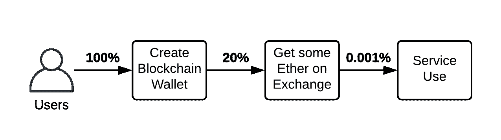
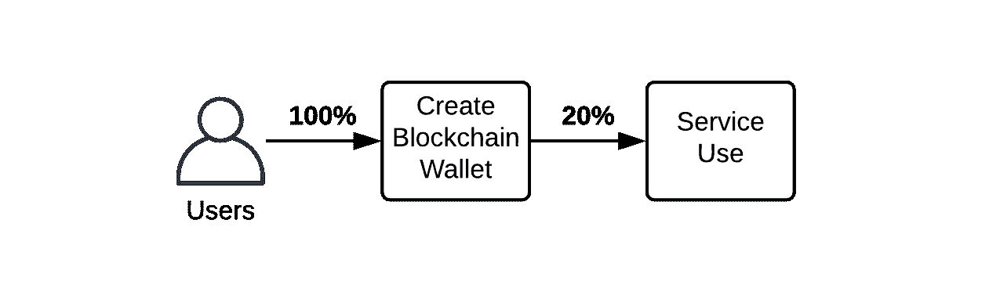
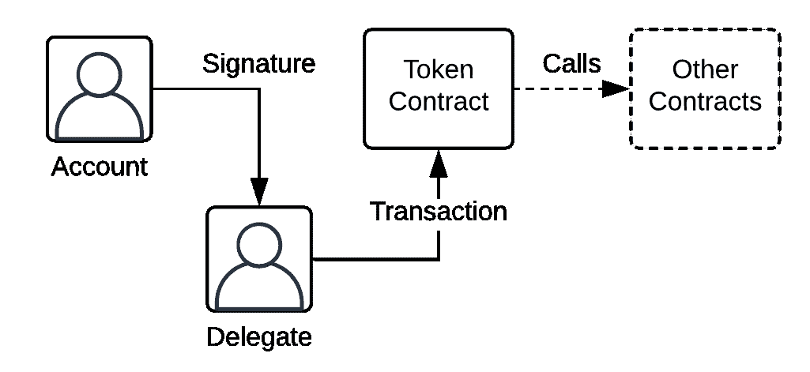
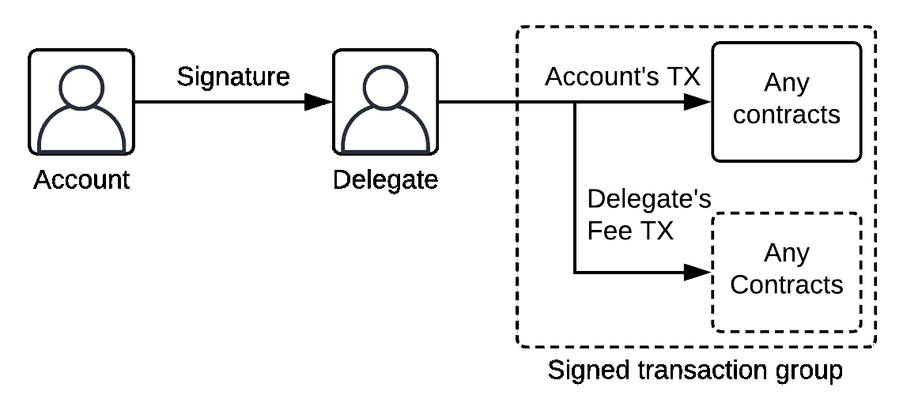
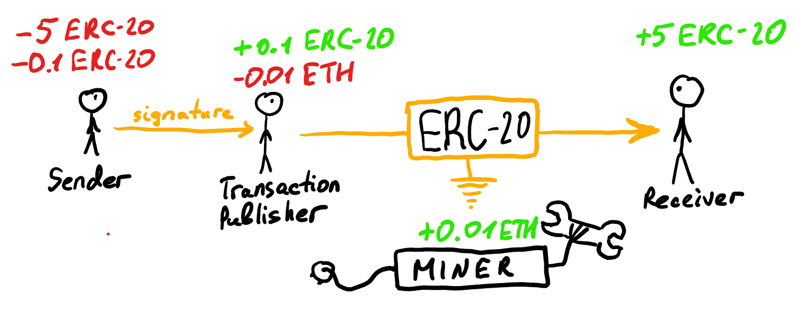
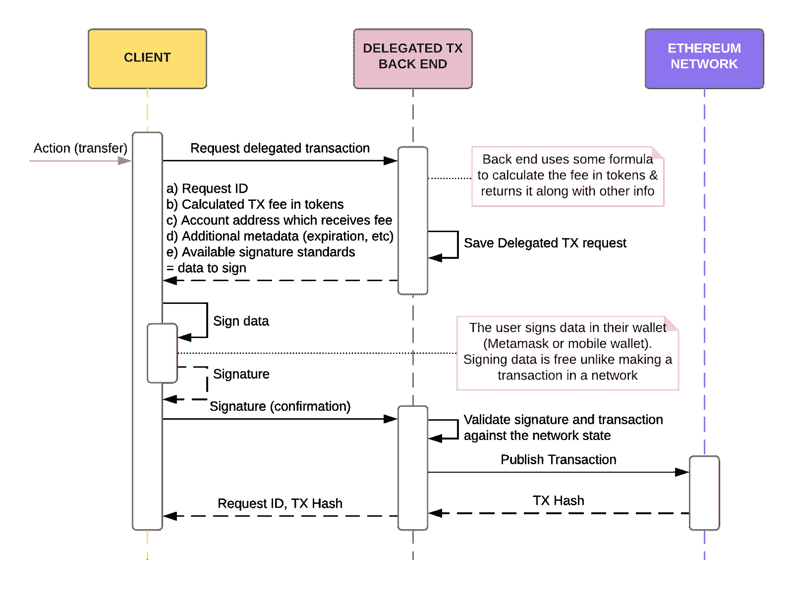
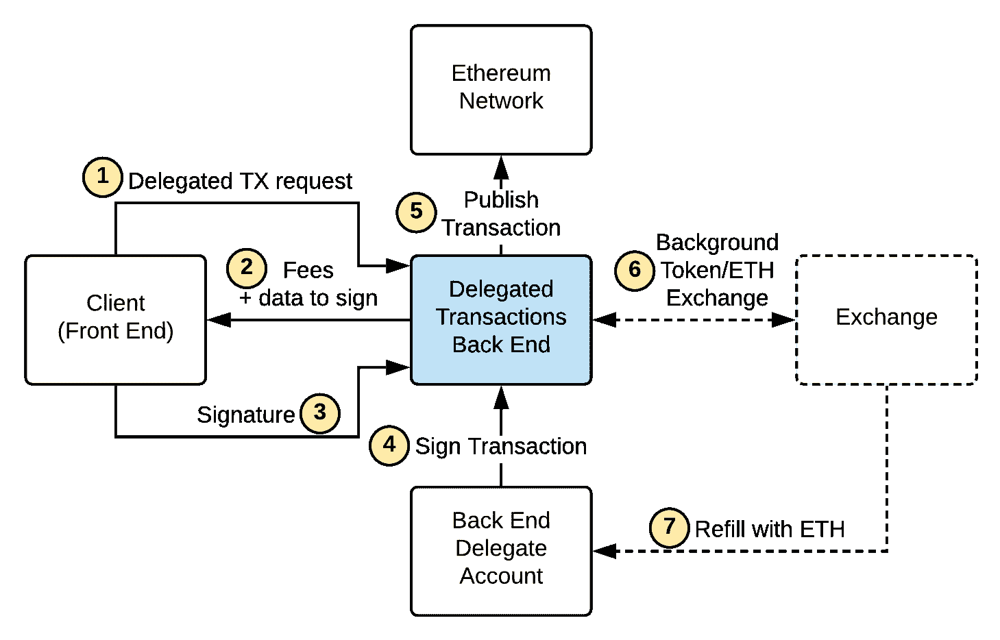
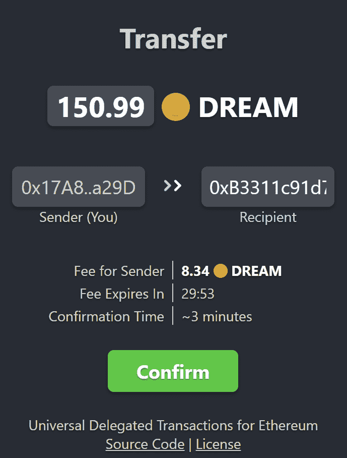

# 通用以太坊委托交易:不再收取交易费用

> 原文：<https://www.freecodecamp.org/news/universal-ethereum-delegated-transactions-no-more-ethereum-fees/>

> TL；DR 检查此[后端](https://github.com/ZitRos/ethereum-delegated-tx-service)和[前端](https://zitros.github.io/ethereum-delegated-tx-widget/)的委托交易解决方案。任何支持其功能委托的令牌都是通用的。下面阅读更多内容。

这篇主要是技术性的文章为以太坊令牌和应用程序提供了一个通用框架和一个 T2 工作解决方案，消除了在以太支付费用的需要，这个问题实际上扼杀了许多区块链应用程序的用户体验。

> 想象一下，花掉美元，然后被要求也交出一些 [*格里夫尼亚*](https://en.wikipedia.org/wiki/Ukrainian_hryvnia) *作为交易费。以太坊代币到目前为止就是这样工作的。*

换句话说，比如要转让任何以太坊令牌(像[系绳](https://coinmarketcap.com/currencies/tether/)、[戴](https://coinmarketcap.com/currencies/dai/)、[蝙蝠](https://coinmarketcap.com/currencies/basic-attention-token/)、[梦幻](https://token.dreamteam.gg/)等。)，用户还得花一些[以太](http://ethereum.org/use/#_2-what-is-eth-and-how-do-i-get-it)(内部以太坊平台货币)。这带来了一个很大的不便，阻碍了 DApps 的大规模采用:用户必须购买多种货币，而不是只有一种货币才能与区块链网络进行交互。

# 问题是

正如我们今天所想象的，令牌只是区块链网络之上的应用和服务的燃料。组织创建自己的令牌(使用 ico、ieo 等)并运行利用它们的服务/应用，从而引入自己的微观经济(被广泛称为[令牌经济](https://medium.com/@pentremont/token-economy-101-or-why-blockchain-powered-decentralized-networks-are-important-310de1cc8bac))。但事实证明，几乎每种代币本身都是一种相当复杂的货币。根据区块链网络的设计，为了用你的代币做一些事情，你还需要另一种货币——通常是以太币(以太坊的意思)来转移代币。

为了说明这个问题，让我们看看用户是如何使用不同的区块链支持的服务和应用的，例如:

*   [涓涓细流](https://trickle.gg/) -你可以用任何方式与不受信任的一方签订安全的、按小时计费的合同
*   [Loom](https://loomx.io/) -使用 Loom 令牌在 Loom 网络中创建侧链
*   [Cryptokitties.co](https://www.cryptokitties.co/)-你培育、交易和转移小猫的地方(ERC721 代币)
*   [其他](https://www.stateofthedapps.com/)(有很多！)

所有这些应用程序都使用令牌，并且需要您购买以太网。正如我们今天所知，使用加密令牌的复杂性是 99%的加密初创公司失败的最大原因之一(或者避免采用真正的加密，例如，用虚拟硬币取代它)。

您可能已经知道，应用程序越难使用，它从一开始就能获得的用户就越少。这就是所谓的[用户加入漏斗](https://www.appcues.com/blog/user-onboarding-funnel-amplitude)，对于基于区块链的应用和服务来说，这仍然是一个大问题:

The typical user onboarding funnel of a decentralized, blockchain-based application

为了理解我为什么把 0.001%的用户放在服务使用之前，让我们看看购买一些以太网到底意味着什么:

*   创建加密钱包
*   在 exchange 上注册(并了解所有的 Exchange 规则，包括国家政策！)
*   超越 KYC(尽管变得越来越容易，但许多国家的交易所准入仍然有限)
*   购买最低允许量的乙醚(通常，高达 50 美元，而你只需要 0.05 美元就可以完成一两笔交易)
*   把乙醚提取到你的钱包里
*   更不用说阅读关于如何正确执行所有这些步骤的冗长指南了

而不仅仅是:

*   创建加密钱包

当然，这在很大程度上取决于应用程序或服务是如何制作的。但是，到目前为止，没有更好的简化入职流程的方法了，只是从那里剪切加密令牌，或者使它们成为假的、具有存款和取款功能的“虚拟”货币。不幸的是，后一种方法现在是所有采用 crypto 的初创公司和公司的通用方法，原因有很多。另一个原因可能是货币化战略，但这是另一个值得专门写一篇文章的大故事(有兴趣吗？注释掉！).

回到交易费用问题，我们可以陈述如下，这是很难反驳的。

> *用户很自然的只购买**自己真正需要的加密货币(比如代币:*** [*系绳*](https://coinmarketcap.com/currencies/tether/)*[*戴*](https://coinmarketcap.com/currencies/dai/)*[*蝙蝠*](https://coinmarketcap.com/currencies/basic-attention-token/)*[*梦想*](https://token.dreamteam.gg/) *等等)。)，他们通常会希望用这种加密货币支付任何交易费用**。******

**那么，为什么不允许他们这样做呢？因为它确实很复杂。让我们看看为什么，以及这是如何通过我们的开源解决方案变得更容易(至少对于以太坊来说)。**

# **现有方法**

**从区块链诞生之初，就有几个解决方案可以将用户入职流程简化为下面描述的流程，避免购买以太等中间货币的步骤。尽管如此，创建一个区块链钱包并不是一个容易的步骤，但是一些理解应用程序/服务价值的用户很好地完成了这一步。**

**

The user onboarding funnel with delegated transactions** 

**允许避免使用中间货币(以太的以太坊)的解决方案被称为“委托交易”，或“元交易”。**

> ***简而言之，在区块链，委托交易或“元交易”是一种代表一个账户执行预定动作，同时由另一个账户(委托人)进行(发布)的交易，该账户实际支付交易费用。***

**围绕我在本文中提出的广义委托交易概念的[互联网](https://github.com/ethereum/EIPs/issues/1228)有[多种](https://medium.com/@austin_48503/ethereum-meta-transactions-90ccf0859e84) [方式](https://fravoll.github.io/solidity-patterns/proxy_delegate.html) [。但似乎没有一种方法仍然被广泛采用，因为这些方法本质上非常复杂，在实现方面非常具体，并且其中一些方法**非常复杂，难以标准化**。更有建设性的是，现有的方法可以分为 3-4 组:那些使用代理智能合约的方法，那些将委托嵌入智能合约本身的方法，理论上，还有一个区块链本地实现的机会(比如以太坊 2.0)。](https://medium.com/@e2toe4/ethereum-meta-transactions-36f10448619)**

## **1.使用代理合同的委托交易方法**

**代理合同，或在这种情况下，身份合同是一种微小的合同，用来取代想要避免支付费用的用户帐户。该智能合约被编程为充当钱包，以及其他智能合约功能的“调用方”(发送方)。关键是它是一个触发所有操作的委托帐户，而这个智能合约的真正“所有者”是另一个用户。用户只需生成正确的签名，就可以控制存储在智能合同地址(=钱包)中的资金。**

**

A visualization of how identity contracts look like** 

****这种方法的优点:****

*   **它与已经部署到网络的任何令牌和契约一起工作**

****这种方法的缺点:****

*   **用户看不到他们钱包中的令牌，因为他们实际上是在身份智能合同上**
*   **因此，需要开发定制的用户界面和定制的工具/钱包**
*   **智能身份合同部署和分配初始费用，而不是完全免费**
*   **需要一个全面的标准才能被广泛采用**

## **2.通过“操作员”模式进行的半委托交易( [ERC777](https://eips.ethereum.org/EIPS/eip-777) )**

**有一个令牌标准描述了这种方法— [ERC777](https://eips.ethereum.org/EIPS/eip-777) 。简而言之，任何令牌持有者都可以授权任何其他帐户自由管理他们的令牌。我不会称之为委托交易，但尽管如此，我需要提到的是，在这里，我们在某种程度上委托其他帐户控制您的令牌。**

**

A visualization of ERC777 standard's "operator" pattern** 

****这种方法的优点:****

*   **使标准化**

****这种方法的缺点:****

*   **高度集中于“运营商”账户**
*   **由于运营商对您的令牌拥有 100%的控制权，安全性较低**
*   **批准交易的初始费用**
*   **需要额外的用户界面/工具开发**

## **3.直接嵌入(令牌)智能合约的委托交易**

**正如可以在代理智能合约中实现自定义费用一样，以令牌支付费用也可以直接在令牌智能合约中实现。例如，使用我在上一篇文章中描述的方法，可以在智能契约中实现一个函数，它将传递接受用户签名的令牌，而不是要求用户直接调用这个函数。我们已经在我们的[梦想令牌](https://token.dreamteam.gg/)中实现了这种方法，该令牌在我们的 [dreamteam.gg](https://dreamteam.gg/) 平台上使用。**

**

A visualization of how embedding delegation into the token contract looks like** 

**您可能会注意到，与前面的方法不同，这里不再有身份契约，有一种可选的方法可以直接从令牌契约中调用其他智能契约。**

****这种方法的优点:****

*   **用户可以像往常一样在钱包余额上看到他们的代币**
*   **账户初始化不收取初始费用**
*   **甚至可能不需要标准(继续阅读)**

****这种方法的缺点:****

*   **如果您有一个已经部署到网络的(令牌)智能合约，则不能直接对其应用这种方法。虽然您可以随时部署新令牌，例如“迁移”应用工具，这将允许其他用户交换令牌(刻录旧令牌并铸造新令牌)**
*   **因为这种方法的标准还没有很好的定义，所以实现会有很大的不同**
*   **需要为委托交易开发定制的 UI/工具(继续阅读—已解决！)**

## **4.(区块链)平台层的委托交易**

**这是上面描述的所有方法中最好的一个，但也是还没有在任何地方实现的一个**(我指的任何地方是最流行的区块链平台)。以太坊 2.0 版本有希望支持它，或者至少我从 Vitalik 那里听说他们正在开发一些很酷的东西。****

****理论上，我们可以把这种方法想象成一次能够对两个交易进行“离线”签名:一个为想要避免支付费用的签名帐户做一些有用的事情(例如，转移令牌)，另一个为委托人做一些有用的事情(例如，用令牌向执行这两个交易的帐户支付费用)。****

****

A visualization of how platform-native delegated transactions could look like**** 

****但问题是，关于以太坊 2.0，这个功能只有在 2022 年甚至更晚才有机会落地。我还假设这个特性仍然需要一个专用的后端(类似于本文中介绍的那个)，因为很难想象矿工如何接受代币形式的费用。简而言之，如果他们中的一些人拒绝接受代币费用，那么在“挖掘”层面上这样做就毫无意义，更不用说以分散的方式跟踪所有交易所的代币价格和交易量需要多少钱了。****

******这种方法的优点:******

*   ****无需更改已经部署的智能合同****
*   ****账户初始化不收取初始费用****
*   ****如果标准化，甚至可能不需要定制的 UI/工具****

******这种方法的缺点:******

*   ****最有可能的是，仍然需要一个集中的后端(“代表”)****
*   ****尚未在平台层面实施(截至 2019 年)****

# ****解决方案****

****从上面的四种方法中，除了平台级方法尚未在 2022+实现和标准化，最有吸引力的是第三种方法，其中我们将委托功能直接嵌入到令牌智能合约中。因此，我们保存了标准令牌范式，允许钱包正常地与智能合约一起工作，而不需要等到委托交易将在顶级区块链平台之一中本地着陆。我们将坚持这种方法，并使其成为下面的**通用**。****

****令牌智能合约中的委托交易支持编程权利非常棒。但是如何应对它的弊端呢？事实上，唯一难以处理的问题(因为您无法修改现有的智能合约)，**如果您已经部署了没有委托功能的令牌智能合约**(例如，标准 ERC20 或 ERC721 令牌)，您将需要部署新的令牌智能合约。在这种情况下，下一步是添加将令牌从一个智能合约迁移到另一个智能合约的方法。例如，您可以决定在新的智能合约中再实现一个功能，允许令牌持有者从旧的智能合约中迁移他们的资产。****

****令牌迁移功能的实现可能会有所不同，如果以前的令牌支持 *approveAndCall* ，则从在新令牌中实现 *receiveApproval* 开始，或者如果您只有一个最少的 ERC20，则从利用*approve*+*transfer from*框架结束(用户*将*的令牌批准到新令牌契约地址，然后在新契约中调用一个函数，该函数会烧掉旧令牌并铸造新令牌，但这需要为用户支付标准的批准事务费用)。实际上，还有更多:您可以决定不烧掉旧令牌，而是将它们“锁定”在新令牌智能合约上，铸造新令牌—这为实施**双向令牌迁移**创造了机会，这太棒了— **您不需要在 exchange 上列出“新”令牌**，而用户仍然可以将旧令牌免费发送到以太网上的 exchange！如果你感兴趣，请在这里填写问题[如果你想知道如何做的更多细节，因为这种方法值得一整篇新文章。](https://github.com/ZitRos/ethereum-delegated-tx-service/issues)****

****在我的[上一篇文章](https://hackernoon.com/you-dont-need-ether-to-transfer-tokens-f3ae373606e1)中，我提供了一个 token smart contract 的例子，它支持诸如*转移*、*转移自*、*批准*和*批准和调用*等功能的委托。正是这些“委托”功能允许用户用代币付费，而不是以太网。****

****

How delegation works in Ethereum, in short. Read more in [this article](https://hackernoon.com/you-dont-need-ether-to-transfer-tokens-f3ae373606e1).**** 

****但这不足以开始大规模采用。在这篇文章中，我提供了一个完整的[通用后端解决方案](https://github.com/ZitRos/ethereum-delegated-tx-service)(上图中的交易发布者)，以及一个[可配置的小部件](https://github.com/ZitRos/ethereum-delegated-tx-widget) ( [查看此处](https://zitros.github.io/ethereum-delegated-tx-widget/))，它可以让你今天用令牌费代替以太费。****

****在我们开始之前，有几个要点:****

*   ****这个委托事务后端是通用的，或者说是**无标准的**，这意味着你可以让**在你的令牌中实现任何委托功能**和**使用任何签名标准**。从后端的角度来看，您只需要为您的令牌编写一个清单文件，描述它的用法。****
*   ****目前，将代币中收取的费用转换回以太网是交易所的手动操作。但它可能是未来自动化的潜在改进(如果需要的话)。****

# ****通用解决方案背后的概念****

****令牌支持委托交易意味着什么？让我们以 ERC20 标准令牌为例来看一下。****

## ****智能合同****

****至于令牌智能合约，方法非常简单。除了像 **transfer(to，value)** 这样我们希望“可委托”的每一个方法之外，我们还添加了一个伴随函数，该函数不是检查 **msg.sender** ，而是接受用户的签名，并通过在智能合约中验证该签名来完成与原始函数相同的任务。因此，例如，对于 **transfer(to，value)** 函数，我们可以添加 **transferViaSignature(to，value，...**功能。正如您从[公钥加密](https://en.wikipedia.org/wiki/Public-key_cryptography)中所知，除了私钥所有者，没有人能够创建有效的签名，所以这就是为什么这种方法与以太坊本身一样安全。****

****最酷的部分是，从委托后端的角度来看，委托函数的实现及其签名并不重要。您甚至可以决定为智能合约支持的所有其他功能实现一个“通过签名调用”功能。委托后端只需要知道**如何**调用这个函数，这个问题通过为委托后端提供一个链外契约清单来解决。例如， **transferViaSignature** 中的参数 *additionalParams* 可以变化，并且可以包括该列表中的任何内容，如果不是更多的话:费用、费用接收者地址、到期时间戳、使用的签名标准、签名本身、随机数或任何其他唯一的委托交易 ID 等等。关于智能合同设计，为了理解为什么会有这些争论，请阅读我的[前一篇文章](https://hackernoon.com/you-dont-need-ether-to-transfer-tokens-f3ae373606e1)。****

****我们也想让“代表们”赚些钱来支付他们的额外开支，同时也是有利可图的。因此，我们必须增加一笔费用，但比以太更自然的费用:令牌本身的费用。因此，例如，如果您需要转移 100 个令牌，您需要根据代理的价格和网络条件再支付 3 个令牌来执行转移，这应该保留在智能合约逻辑中。****

## ****后端****

****好了，现在我们有了一个令牌，允许通过使用其他人的签名来转移他们的令牌。现在，关键的部分是自动化请求和发布此类事务的过程。这就是我们开源的[后端](https://github.com/dreamteam-gg/ethereum-delegated-tx-service)(和一个[前端](https://github.com/dreamteam-gg/ethereum-delegated-tx-widget))发挥作用的地方。****

****下面是描述前端(客户端)如何从委托事务请求到发布到网络与后端通信的序列图:****

1.  ****(隐藏在图中)客户端从委托后端请求信息，以了解它支持哪些合同，以及它可以委托哪些功能。****
2.  ****客户端请求委派特定智能合约的功能。最重要的是，后端返回它收取的费用和一个需要客户签名的数据。****
3.  ****客户签署他们钱包中的数据。签名是一个免费的操作，不像在网络上发布交易。****
4.  ****客户发回他们的签名，从而确认他们执行该特定委托交易的意图。后端根据当前网络验证该事务。****
5.  ****最后，后端向网络发布事务。****
6.  ****(隐藏在图中)客户端不断轮询后端的委托请求状态，直到它收到一个挖掘状态。注意:重要的是轮询后端，而不是使用事务散列来了解事务何时被挖掘。当天然气价格突然上涨时，这是一种非常常见的情况，为了快速挖掘交易，后端可能会以更高的天然气价格重新发布交易。虽然目前还没有实现，但很可能很快就会实现。****

****

Sequence diagram representing the simplified flow of how delegated transaction is delivered to the network**** 

****这种方法是通用的，只需要后端的清单文件就可以理解如何计算费用以及在客户端使用哪种签名标准。这是系统组件及其交互序列的另一个可视化视图:****

****

Component diagram**** 

****我们为此解决方案提供了全面的[文档](https://github.com/dreamteam-gg/ethereum-delegated-tx-service#delegated-transactions-concept)。您可以检查后端 [API 是如何构造的](https://github.com/dreamteam-gg/ethereum-delegated-tx-service#api)，以及找到令牌[清单文件](https://github.com/dreamteam-gg/ethereum-delegated-tx-service/blob/master/config/contracts/mainnet/0x82f4ded9cec9b5750fbff5c2185aee35afc16587/manifest.js)，该文件描述了如何使用[特定令牌契约](https://etherscan.io/address/0x82f4ded9cec9b5750fbff5c2185aee35afc16587#code)。我们鼓励你在那里贡献你自己的代币！****

****你不需要太多的设置:它已经有了通用前端！****

## ****前端****

****[委托交易的开源前端部分](https://github.com/dreamteam-gg/ethereum-delegated-tx-widget)是为每个令牌设置的**用户界面:只要运行你的委托交易后端，你就可以开始了！******

****

What [it](https://send-token.dreamteam.gg) looks like**** 

****它是一个可嵌入的小部件，可以引导用户完成发送令牌的过程。你可以插入任何后端，令牌或者用它调用任何令牌函数，方法是利用你可以指定的额外的 URL 参数。****

****使用这个小部件，并通过在您的令牌智能合约中实现类似于广泛使用但未标准化的 ***approveAndCall*** 函数，您将能够通过在令牌中支付费用来调用具有任意数据的其他智能合约！****

****如果您想自己使用这个 UI，这里有一个快速指南:****

1.  ****通过[链接](https://zitros.github.io/ethereum-delegated-tx-widget/?contractAddress=0xcc7e25e30b065ea61814bec6ecdb17edb0f891aa)访问小工具。****
2.  ****它会要求您切换到 Kovan 测试网络。****
3.  ****使用任何可用的科万水龙头获得一些测试乙醚。****
4.  ****使用测试乙醚铸造一些[测试代币](https://kovan.etherscan.io/address/0xcc7e25e30b065ea61814bec6ecdb17edb0f891aa#writeContract):调用代币智能合约中的 [mintTokens](https://kovan.etherscan.io/dapp/0xcc7e25e30b065ea61814bec6ecdb17edb0f891aa#writeContract) 函数，它会给你 10 个测试代币。****
5.  ****现在，回到[widget](https://zitros.github.io/ethereum-delegated-tx-widget/?contractAddress=0xcc7e25e30b065ea61814bec6ecdb17edb0f891aa)并尝试转移这些代币！****

****如果您打开浏览器的开发人员工具，您可能会注意到默认情况下有几个后端连接在一起——它们为前端提供所有必需的信息，以便根据给定的小部件 URL 参数发出委托请求。在小部件加载期间，所有后端都被请求，如果它们中的任何一个可以为特定的契约功能提供委托，那么小部件就请求附加信息:费用、支持的签名等。如果有多个后端可以委托相同的合同功能，则所有后端都会被请求，并且提供最佳费用的后端将用于该事务。****

****事务挖掘时间看起来是固定的，但它会因网络条件而变化。后端在计算令牌费用时使用实际的网络费用，但是，在用户决定执行交易之前，网络费用可能会发生变化。因此,“定价过低”的交易被提交给网络，并可能被搁置一段时间。虽然后端目前没有编程来处理这种情况，但它可能会在未来实现-如果网络费用增加，交易将重新发布更高的天然气费用。但是，我们也需要把这个算进代币费用中。****

## ****签名标准****

****您可能想知道的最后一个问题是——对您的令牌使用哪种签名标准。有好几个可用: *eth_sign* (已弃用) *eth_personalSign* (注意老的 [Trezor](https://trezor.io/) 和 [Ledger](https://www.ledger.com/) 因为一个标准中的歧义产生了不同的签名，所以你可能想把两者都包括进去) *eth_signTypedData* (已弃用)[*eth _ signTypedData _ v3*](https://medium.com/metamask/eip712-is-coming-what-to-expect-and-how-to-use-it-bb92fd1a7a26)等等。我建议至少支持两个:ageless*eth _ personal sign*和 new[*eth _ signTypedData _ v3*](https://medium.com/metamask/eip712-is-coming-what-to-expect-and-how-to-use-it-bb92fd1a7a26)(截至 2019)。****

****

Signature standards comparison — what the user sees**** 

****前端被编程为总是优先选择用户可读标准，如 [eth_signTypedData_v3](https://medium.com/metamask/eip712-is-coming-what-to-expect-and-how-to-use-it-bb92fd1a7a26) 而不是任何其他 eth_personalSign。因此，如果您的令牌支持许多签名标准，并且您将它们全部添加到令牌的[清单文件](https://github.com/dreamteam-gg/ethereum-delegated-tx-service/blob/master/config/contracts/mainnet/0x82f4ded9cec9b5750fbff5c2185aee35afc16587/manifest.js)中，它将首先显示 [eth_signTypedData_v3](https://medium.com/metamask/eip712-is-coming-what-to-expect-and-how-to-use-it-bb92fd1a7a26) 提示。****

# ****结论****

****委托事务是伟大的:它们解决了区块链应用程序采用的最大问题之一，从整体上简化了加密的大规模采用。我会在这里以问答的形式放几篇论文给你，让你回答读完这篇文章后你可能还会有的最后几个问题:****

*   ****我们的开源解决方案可以免费使用，并且可以投入生产，请随意将其应用到您的应用程序或令牌中！****
*   ****所描述的方法既不损害安全性也不损害集中化。这样想:集中式后端只是想在以太中免费转让令牌的人的帮手。如果后端被黑客攻击，或者根本不可用，通过在以太网中付费，就可以像以前一样与网络进行交互。以及当使用适当的签名标准时，后端不能伤害或欺骗用户窃取他们的令牌(这取决于您的令牌实现)。****
*   ****有一种方法可以支持现有的、已经部署的令牌的委托事务。然而，它需要额外的消耗以太网的步骤来将现有令牌迁移到新的令牌契约。此外，通过适当地设计新的令牌合约，以及将您的应用程序设计为同时使用这两种令牌，您甚至可以避免在交易所中列出新的令牌。****
*   ****通过使用[现有令牌作为示例](https://github.com/zitros/ethereum-delegated-tx-service/blob/master/config/contracts/mainnet/0x82f4ded9cec9b5750fbff5c2185aee35afc16587/manifest.js)，它在委托事务[后端](https://github.com/zitros/ethereum-delegated-tx-service)和[前端](https://github.com/zitros/ethereum-delegated-tx-widget)存储库中可用，您可以为自己的令牌生成自己的清单。****
*   ****[阅读关于如何为令牌设置自己的后端的说明](https://github.com/zitros/ethereum-delegated-tx-service#setup)，然后将其添加到小部件的 URL(或提交到开源存储库)。****
*   ****拥有一个已经支持委托交易的令牌？通过这三个非常简单的步骤将它插入到我们的 UI 中:(1)为您的令牌创建一个清单，并在设置委托后端时放入您的令牌 abi 文件，(2)运行这个后端，公开一个公共 API URL，以及(3)在一个小部件中使用 URL 参数来引用您的后端或直接提交到我们的开源存储库。在 GitHub 的自述文件中了解更多信息。****

****我希望这是一个真正有用的信息，为所有的不可思议的搜索者。如果我遗漏了什么，请随时联系[我](https://nikita.tk/)或在此填写问题[。玩得开心，让代币经济简单起来！](https://github.com/ZitRos/ethereum-delegated-tx-service/issues)****