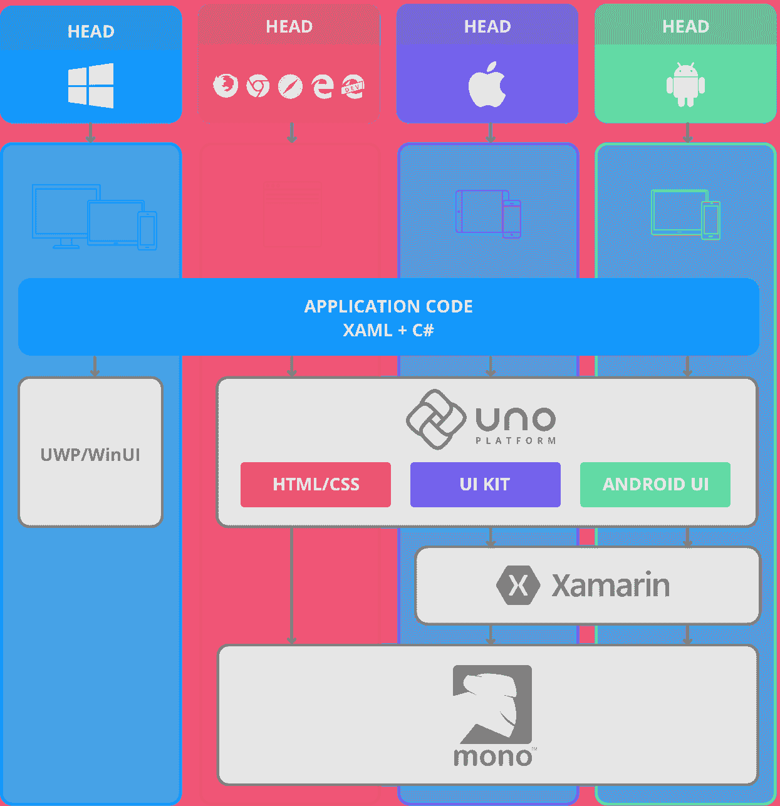
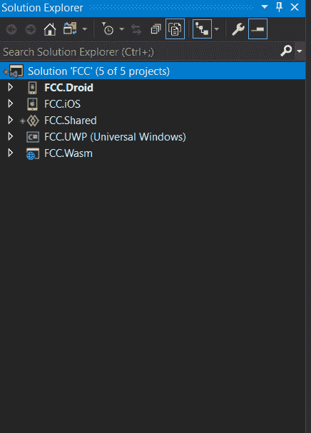
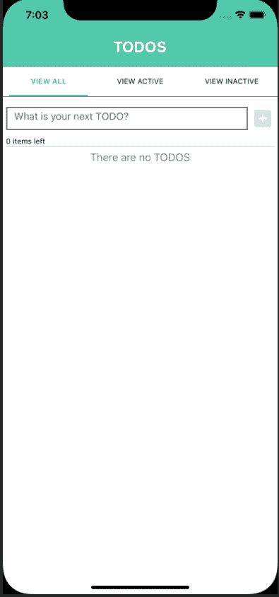
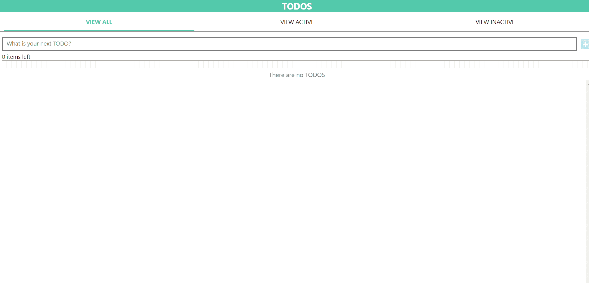
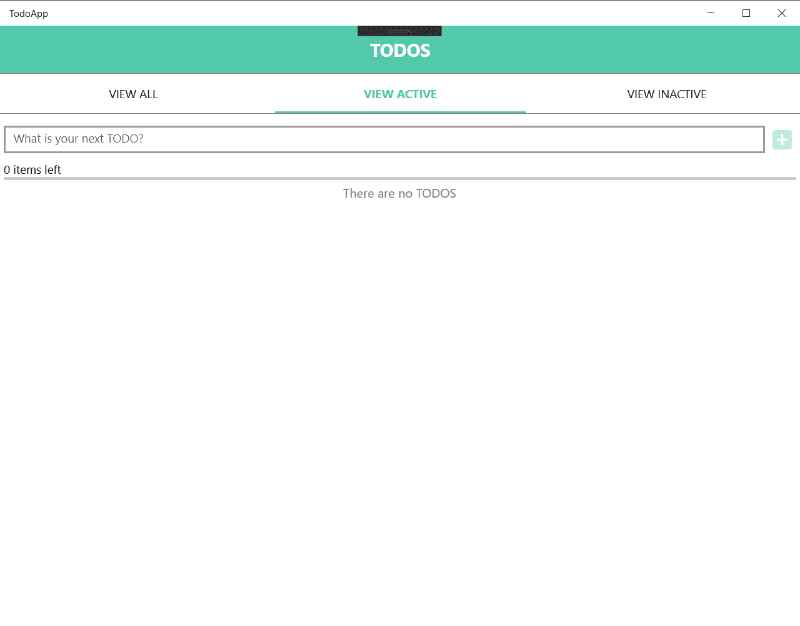
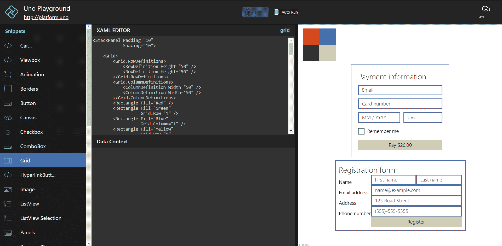

# 一个平台来统治他们

> 原文：<https://www.freecodecamp.org/news/uno-platform/>

首先，我们应该从 Uno 是什么以及为什么您应该关注它开始。

正如他们的网站上所说，Uno 是“唯一一个用 C#、XAML 从单一代码库构建原生移动、桌面和 WebAssembly 应用的平台。开源和专业支持。”

## 这是什么意思？

如果你有(或没有)开发移动应用和后续 web 应用的经验，除了可能通过 API 共享数据之外，你必须分别开发这两个应用。

在 Xamarin 之前，你甚至不得不使用不同的语言(分别是 Swift/Objective-C 和 Java/Kotlin)分别构建 iOS 和 Android 应用。Uno 引入了一种使用共享逻辑和 UI 为 iOS、Android、Web 和 UWP 构建的方法。

这是巨大的。

对于开发人员来说，在平台之间共享逻辑一直是“容易”的部分。然而，共享 UI 却不是。Android 和 iOS 之间的用户界面有着巨大的差异，web 和移动之间的差异甚至更大。Xamarin。Forms 允许我们在 Android 和 iOS 上共享用户界面，但是我们在 web 上仍然是独立的。

Uno 使您能够编写一次 UI，然后使用本机控件，将本机 UI 外观部署到您的每个平台。这意味着，您为一个按钮编写相同的代码，而不管该按钮用于什么平台，用户将看到他们平台的原生按钮。

## 它是如何工作的？

Uno 平台的工作方式因您所构建的内容而异。

特定于平台的 UI 是通过采用视觉树并呈现到平台支持的内容中来创建的:

**iOS** *-* UI 套件

**安卓** *-* 视图组和视图

**网页** *-* 原生控件

每个平台的逻辑部署也不同。

当建立一个 UWP 应用程序时，Uno 运行在 UWP 和 WinUI 之上。当构建 Android 和 iOS 应用程序时，Uno 运行在 Xamarin 原生堆栈之上。最后，当您构建 Web 应用程序时，Uno 运行在 WebAssembly 之上。手机应用和网络应用都运行在 Mono runtime 上。综合起来，它看起来有点像这样:

High level Uno Platform architecture

这看起来不错，但是在引擎盖下到底发生了什么呢？

## 让我们来分解一下:

**安卓和 iOS**

1.  你在 Visual Studio 中编写你的 C#和 XAML 代码
2.  Uno 获取代码并允许您添加任何 Xamarin 特定的库或工具
3.  Mono 运行时执行 C#代码

这一过程基本上与常规 Xamarin 相同。Xamarin 和 Uno 之间的最大区别在于能够在 Web 上运行相同的 UI。

**网络应用** -

1.  你可以重用为你的移动应用程序编写的**逻辑**和 **UI** 。
2.  Uno 使用 *Web 程序集引导程序*来获取任何。NET 标准库，并在 JavaScript 控制台中执行这些文件。
3.  Mono 运行时然后执行代码

Uno 利用 Web Assembly 的能力(这允许你用 C#而不是 JavaScript 编写代码)使得 Uno 如此独特。

**UWP**

1.  您可以重用为移动应用程序和 Web 组装应用程序编写的**逻辑**和 **UI** 。
2.  您的代码通过 Windows UI 运行，不需要 Mono 运行时来执行。

这里最大的区别是 UWP 应用已经有了 Windows 命名空间，不需要引用 Uno.UI 在这里提供的好处是能够重用你已经为移动和 web 编写的代码。

现在我们已经知道了这种美丽是如何工作的，让我们写一些代码吧！

要开始使用 Uno，请按照他们的说明[这里](https://platform.uno/docs/articles/get-started.html)。

当您在 Visual Studio 中创建您的 Uno 解决方案时，与创建 Xamarin 有相似的感觉。窗体解决方案，因为为您创建了不同的项目。下面是自动创建的项目:

就像你在 Xamarin 里看到的一样。Forms 项目中，每个平台都有单独的项目和一个共享项目。Droid、iOS、UWP 和 Wasm 项目都是一样的，就好像你为每个项目都创建了一个空白的应用程序，唯一的区别是对 Uno UI 的引用。神奇的事情发生在*共享*项目中。

类似于 Xamarin 中的*共享*项目。表单，这是您编写所有共享逻辑和 UI 的地方。Uno 提供了对 T2 MVVM T3 的支持，这是一种许多开发人员都熟悉和熟悉的设计模式。

## 那么，成品是什么样子的呢？

使用 Uno [here](https://github.com/unoplatform/workshops/blob/master/uno-bootcamp/modules/99-Ship-your-app/TodoApp.sln) 提供的示例“Todo”应用程序，下面是来自四个平台的示例。

ios

机器人

网

UWP

这些项目都使用共享项目中的逻辑和 UI。一次编码，四个 app。

## 先说调试。

在 Uno 中调试可能会有所不同，这取决于您要调试的平台。

**Android 和 iOS** -对于移动设备，您将使用与您在 Visual Studio 中习惯使用的相同的 Mono 调试器，可以访问所有您喜欢的断点、值更改等。

**Web** -目前只支持 Chrome 调试，也就是 Chrome 和 Edge。

**UWP**——在这里，工具来自于。NET studios，它在 mono 运行时效率不高。

**想试用 Uno 但不想通过 Visual Studio 完成设置的步骤？**

然后结账他们的[操场](https://playground.platform.uno/#wasm-start)！

Uno Playground 是一种有趣且简单的方式，可以用来查看不同的项目在不同的平台上是如何渲染的。它们使尝试新风格变得快速简单，对于初学者和教程来说非常有用。

## 我们可以期待的未来功能有哪些？

1.  支持 MacOS 或 Linux。
2.  来自 UWP API 的更多功能
3.  支持智能手表

Uno 的真正魅力在于它包含了我们作为开发人员应该努力实现的目标——在彼此成就的基础上构建。我们不需要重新创造轮子，真正的创新发生在当你站在巨人的肩膀上，我们都向上移动的时候。

快乐编码。

想了解更多关于 Uno 的课程和技巧，请查看我的博客。