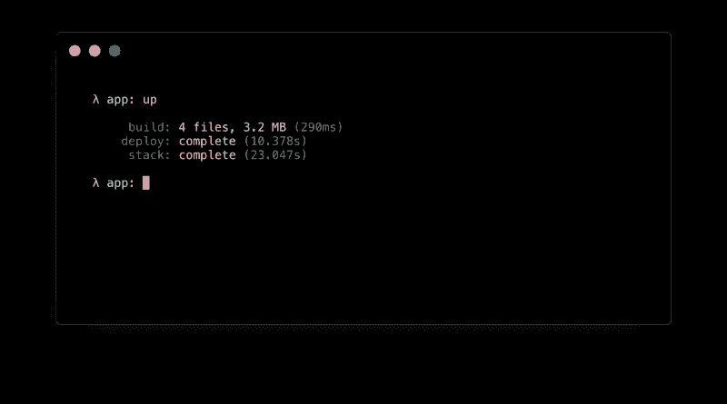
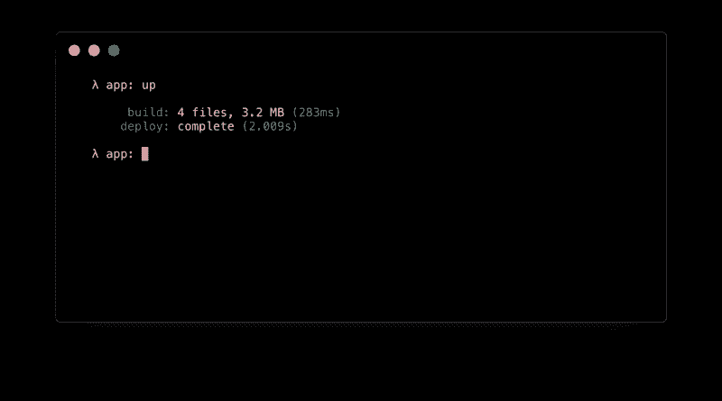
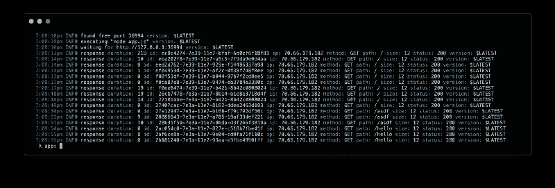
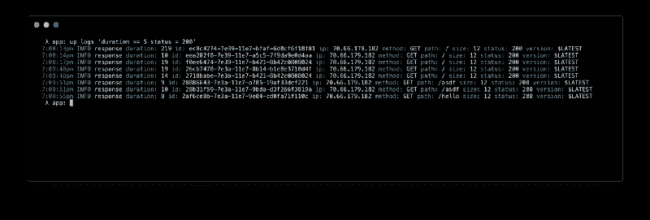
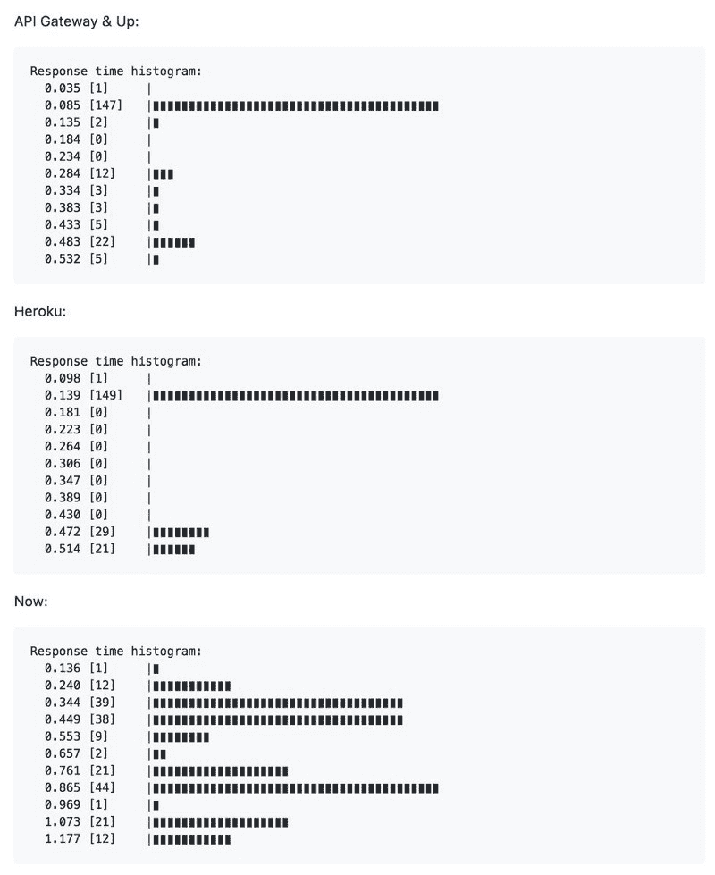
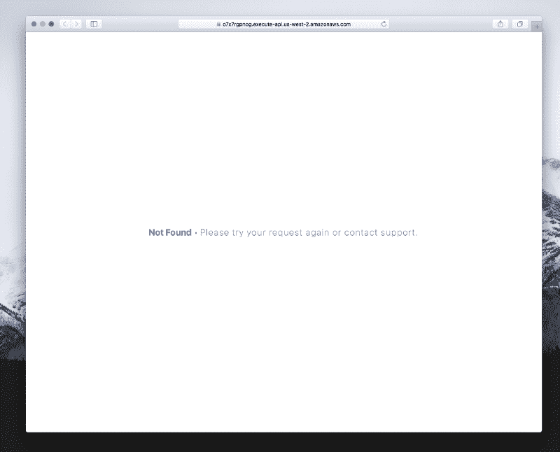

# 向上:在几秒钟内部署无服务器应用

> 原文：<https://www.freecodecamp.org/news/up-b3db1ca930ee/>

作者 TJ·霍洛韦丘克

# 启动–在几秒钟内部署无服务器应用


去年我为 Up 写了[蓝图，描述了如何用最少的努力在 AWS 上创建一个伟大的无服务器体验。这个帖子讲的是](https://medium.com/@tjholowaychuk/blueprints-for-up-1-5f8197179275) [**Up**](https://github.com/apex/up) 的最初 alpha 版本。

为什么关注无服务器？首先，它很划算，因为你只为你使用的东西按需付费。无服务器选项是自我修复的，因为每个请求都是孤立的，被认为是“无状态的”最后，它可以轻松地无限扩展，无需管理任何机器或群集。部署您的代码，您就完成了。

大约一个月前，我决定在 [**apex/up**](https://github.com/apex/up) 开始研究它，并编写了第一个小型无服务器示例应用程序 [**tj/gh-polls**](https://github.com/tj/gh-polls) 用于实时 SVG GitHub 用户投票。它运行良好，每月花费不到 1 美元来服务数百万次投票，所以我想我应该继续这个项目，看看我是否可以提供开源和商业版本。

长期目标是提供各种各样的“自带 Heroku ”,支持许多平台。虽然平台即服务并不是什么新鲜事，但无服务器生态系统让这种程序变得越来越琐碎。也就是说，由于 AWS 和其他软件提供的灵活性，它们经常在 UX 方面遭受损失。Up 将复杂性抽象化，同时仍然为您提供几乎无运营成本的解决方案。

### 装置

您可以使用下面的命令安装，并查看[临时文档](https://github.com/apex/up/tree/master/docs)开始安装。或者，如果你是通过安装脚本勾画出来的，就去找一个[二进制版本](https://github.com/apex/up/releases)。(请记住，这个项目仍处于早期阶段。)

```
curl -sfL https://raw.githubusercontent.com/apex/up/master/install.sh | sh
```

要随时升级到最新版本，只需运行:

```
up upgrade
```

您也可以通过 NPM 安装:

```
npm install -g up
```

### 特征

早期的 alpha 提供了什么特性？我们来看看吧！请记住，Up 不是一个托管服务，所以您需要一个 AWS 帐户和 [AWS 凭证](https://github.com/apex/up/blob/master/docs/aws-credentials.md)。如果您对 AWS 一点都不熟悉，您可能希望等到流程简化后再做决定。

我总是得到的第一个问题是:up(1)和 [apex(1)](https://github.com/apex/apex) 有什么不同？Apex 专注于部署功能，用于管道和事件处理，而 Up 专注于应用程序、API 和静态站点，也称为单个可部署单元。Apex 不会为您提供 API 网关、SSL 证书或 DNS，也不会提供 URL 重写、脚本注入等功能。

#### 单命令无服务器应用

Up 允许您用一个命令部署应用程序、API 和静态站点。要创建一个应用程序，你只需要一个文件，在 Node.js 的情况下，一个监听由 Up 提供的`PORT`的`./app.js`。请注意，如果您使用的是`package.json`，Up 将检测并利用`start`和`build` 脚本。

```
const http = require('http')const { PORT = 3000 } = process.env
```

```
http.createServer((req, res) => {  res.end('Hello World\n')}).listen(PORT)
```

额外的[运行时](https://github.com/apex/up/blob/master/docs/runtimes.md)支持开箱即用，例如 Golang 的`main.go`，因此您可以在几秒钟内部署 Golang、Python、Crystal 或 Node.js 应用程序。

```
package main
```

```
import ( "fmt" "log" "net/http" "os")
```

```
func main() { addr := ":" + os.Getenv("PORT") http.HandleFunc("/", hello) log.Fatal(http.ListenAndServe(addr, nil))}
```

```
func hello(w http.ResponseWriter, r *http.Request) { fmt.Fprintln(w, "Hello World from Go")}
```

部署应用程序类型`up`来创建所需的资源，并部署应用程序本身。这里没有烟雾和镜子，一旦它说“完成”，你就完成了，应用程序立即可用-没有远程构建过程。



后续部署甚至会更快，因为堆栈已经配置好了:



使用`up url --open`测试您的应用程序，在浏览器中查看，使用`up url --copy`将 URL 保存到剪贴板，或者使用 curl 试用:

```
curl `up url`Hello World
```

要删除应用程序及其资源，只需键入`up stack delete`:


例如，使用`up staging`或`up production`和`up url --open production`部署到登台或生产环境。请注意，自定义域名尚未推出，[它们将很快在](https://github.com/apex/up/issues/166)推出。稍后，您还可以将一个版本“提升”到其他阶段。

#### 反向代理

构成 unique 的一个特性是，它不只是简单地部署您的代码，它在您的应用程序前面放置了一个 Golang 反向代理。这提供了许多功能，如 URL 重写、重定向、脚本注入等等，我们将在本文中进一步讨论。

#### 基础设施作为代码

Up 在配置方面遵循现代最佳实践，因为对基础设施的所有更改都可以在应用之前预览，并且 IAM 策略的使用还可以限制开发人员的访问以防止灾难。另一个好处是，它还有助于对您的基础设施进行自我记录。

下面是一个通过 AWS ACM 配置一些(虚拟)DNS 记录和免费 SSL 证书的例子，它利用了 LetsEncrypt。

```
{  "name": "app",  "dns": {    "myapp.com": [      {        "name": "myapp.com",        "type": "A",        "ttl": 300,        "value": ["35.161.83.243"]      },      {        "name": "blog.myapp.com",        "type": "CNAME",        "ttl": 300,        "value": ["34.209.172.67"]      },      {        "name": "api.myapp.com",        "type": "A",        "ttl": 300,        "value": ["54.187.185.18"]      }    ]  },  "certs": [    {      "domains": ["myapp.com", "*.myapp.com"]    }  ]}
```

当您第一次通过`up`部署应用程序时，所有需要的权限、API 网关、Lambda 函数、ACM 证书、Route53 DNS 记录和其他都为您创建。

[变更集](https://github.com/apex/up/issues/115)还没有实现，但是你可以用`up stack plan`预览进一步的变更，然后用`up stack apply`提交，就像你使用 Terraform 一样。

查看[配置文档](https://github.com/apex/up/blob/master/docs/configuration.md)了解更多信息。

#### 全球部署

`regions`数组允许你为你的应用程序指定目标区域。例如，如果您只对单个区域感兴趣，您可以使用:

```
{  "regions": ["us-west-2"]}
```

如果您的客户集中在北美，您可能希望使用所有美国和加州地区:

```
{  "regions": ["us-*", "ca-*"]}
```

最后，您当然可以瞄准当前支持的所有 14 个地区:

```
{  "regions": ["*"]}
```

多区域支持仍在进行中，因为需要一些新的 AWS 功能来将事情联系在一起。

#### 静态文件服务

Up 支持开箱即用的静态文件服务，并支持 HTTP 缓存，因此您可以在应用程序前使用 CloudFront 或任何其他 CDN 来大幅减少延迟。

默认情况下，当`type`为“静态”时，提供工作目录(` .` ),但是您也可以提供一个`static.dir`:

```
{  "name": "app",  "type": "static",  "static": {    "dir": "public"  }}
```

#### 构建钩子

构建挂钩允许您在部署或执行其他操作时定义自定义操作。一个常见的例子是使用 Webpack 或 Browserify 捆绑 Node.js 应用程序，极大地减少了文件大小，因为 node_modules 非常大。

```
{  "name": "app",  "hooks": {    "build": "browserify --node server.js > app.js",    "clean": "rm app.js"  }}
```

#### 脚本和样式表注入

Up 允许您以声明的方式注入脚本和样式，可以是内联的，也可以是路径。它甚至支持谷歌分析和[片段](https://segment.com)的一些“罐装”脚本，只需复制&粘贴你的写键。

```
{  "name": "site",  "type": "static",  "inject": {    "head": [      {        "type": "segment",        "value": "API_KEY"      },      {        "type": "inline style",        "file": "/css/primer.css"      }    ],    "body": [      {        "type": "script",        "value": "/app.js"      }    ]  }}
```

#### 重写和重定向

Up 通过`redirects`对象支持重定向和 URL 重写，它将路径模式映射到一个新的位置。如果`status`被省略(或 200 ),那么它是重写，否则它是重定向。

```
{  "name": "app",  "type": "static",  "redirects": {    "/blog": {      "location": "https://blog.apex.sh/",      "status": 301    },    "/docs/:section/guides/:guide": {      "location": "/help/:section/:guide",      "status": 302    },    "/store/*": {      "location": "/shop/:splat"    }  }}
```

重写的一个常见用例是 SPAs(单页应用程序)，在这种情况下，无论路径如何，您都希望提供“index.html”文件。当然，除非文件存在。

```
{  "name": "app",  "type": "static",  "redirects": {    "/*": {      "location": "/",      "status": 200    }  }}
```

如果您想强制规则而不管文件是否存在，只需添加`"force": true`。

#### 环境变量

Secrets 将出现在下一个版本中，但是目前支持纯文本环境变量:

```
{  "name": "api",  "environment": {    "API_FEATURE_FOO": "1",    "API_FEATURE_BAR": "0"  }}
```

#### CORS 支持

CORS 支持允许你指定哪些(如果有的话)域可以从浏览器访问你的 API。如果您希望允许任何站点访问您的 API，只需启用它:

```
{  "cors": {    "enable": true  }}
```

您还可以自定义访问权限，例如，将 API 访问权限仅限于您的前端或 SPA。

```
{  "cors": {    "allowed_origins": ["https://myapp.com"],    "allowed_methods": ["HEAD", "GET", "POST", "PUT", "DELETE"],    "allowed_headers": ["Content-Type", "Authorization"]  }}
```

#### 记录

对于 0.5 美元/GB 的低价，您可以利用 CloudWatch 日志进行结构化日志查询和跟踪。Up 实现了一种定制的[查询语言](https://github.com/apex/up/blob/master/internal/logs/parser/grammar.peg)，用于改进 CloudWatch 提供的功能，专门用于查询结构化的 JSON 日志。



您可以查询现有日志:

```
up logs
```

尾部实时日志:

```
up logs -f
```

或者对它们中的任何一个进行过滤，例如只显示 200 个 GET / HEAD 请求，这些请求需要花费 5 毫秒以上的时间来完成:

```
up logs 'method in ("GET", "HEAD") status = 200 duration >= 5'
```



查询语言非常灵活，这里有更多来自`up help logs`的例子

```
Show logs from the past 5 minutes.$ up logs
```

```
Show logs from the past 30 minutes.$ up logs -s 30m
```

```
Show logs from the past 5 hours.$ up logs -s 5h
```

```
Show live log output.$ up logs -f
```

```
Show error logs.$ up logs error
```

```
Show error and fatal logs.$ up logs 'error or fatal'
```

```
Show non-info logs.$ up logs 'not info'
```

```
Show logs with a specific message.$ up logs 'message = "user login"'
```

```
Show 200 responses with latency above 150ms.$ up logs 'status = 200 duration > 150'
```

```
Show 4xx and 5xx responses.$ up logs 'status >= 400'
```

```
Show emails containing @apex.sh.$ up logs 'user.email contains "@apex.sh"'
```

```
Show emails ending with @apex.sh.$ up logs 'user.email = "*@apex.sh"'
```

```
Show emails starting with tj@.$ up logs 'user.email = "tj@*"'
```

```
Show errors from /tobi and /loki$ up logs 'error and (path = "/tobi" or path = "/loki")'
```

```
Show the same as above with 'in'$ up logs 'error and path in ("/tobi", "/loki")'
```

```
Show logs with a more complex query.$ up logs 'method in ("POST", "PUT") ip = "207.*" status = 200 duration >= 50'
```

```
Pipe JSON error logs to the jq tool.$ up logs error | jq
```

请注意，`and`关键字是隐含的，尽管如果您愿意也可以使用它。

#### 冷启动时间

这是 AWS Lambda 作为一个平台的特性，但冷启动时间通常远低于 1 秒，未来我计划提供一个选项来保持它们的温暖。

#### 配置验证

`up config`命令输出解析的配置，包括缺省值和推断的运行时设置——它还具有验证配置的双重目的，因为任何错误都会导致退出> 0。

#### 故障修复

使用 Up 作为反向代理的另一个好处是执行崩溃恢复——在崩溃时重新启动服务器，并在响应出错的客户机之前重新尝试请求。

例如，假设您的 Node.js 应用程序由于间歇性数据库问题而崩溃，并出现未捕获的异常，Up 可以在响应客户端之前重试该请求。以后这种行为将更加可定制化。

#### 持续集成友好

很难说这是一个特性，但是由于 Golang 相对较小且独立的二进制文件，您可以在一两秒钟内在 CI 中安装。

#### HTTP/2

Up 通过 API Gateway 支持 HTTP/2 开箱即用，减少了为具有许多资产的应用和站点提供服务的延迟。我将在未来对许多平台进行更全面的测试，但 Up 的延迟已经很不错了:



#### 错误页面

Up 提供了一个默认的错误页面，如果你想提供一封支持邮件或者调整颜色，你可以用`error_pages`自定义这个页面。

```
{  "name": "site",  "type": "static",  "error_pages": {    "variables": {      "support_email": "support@apex.sh",      "color": "#228ae6"    }  }}
```

默认情况下，它看起来像这样:



如果您想提供自定义模板，您可以创建以下一个或多个文件。最具体的文件优先。

*   `error.html`–匹配任何 4xx 或 5xx
*   `5xx.html`–匹配任何 5xx 错误
*   `4xx.html`–匹配任何 4xx 错误
*   `CODE.html`–匹配特定代码，如 404.html

查看[文档](https://github.com/apex/up/blob/master/docs/configuration.md#error-pages)以了解更多关于模板的信息。

### 扩展和成本

你已经做到这一步了，但是向上扩展有多好？目前，API Gateway 和 AWS 是目标平台，因此您不需要为了扩展而进行任何更改，只需部署您的代码即可。您只需按需为您实际使用的资源付费，扩展不需要手动干预。

AWS 每月免费提供 100 万个请求，但你可以使用[http://serverlesscalc.com](http://serverlesscalc.com/)来增加你的预期流量。在未来，Up 将提供额外的平台，这样，如果一个平台变得过于昂贵，您可以迁移到另一个平台！

### 未来

暂时就这样吧！它可能看起来不多，但它已经超过了 10，000 行代码，我刚刚开始开发。假设项目变得可持续，看看问题队列，看看未来会发生什么。

如果你觉得免费版本有用，请考虑在 [OpenCollective](https://opencollective.com/apex-up) 上捐赠，因为我在这上面没有赚到任何钱。我将很快着手开发专业版的早期版本，早期用户可以享受年度折扣价。无论是专业版还是企业版都将提供源代码，因此可以进行内部修复和定制。

确保遵循 [GitHub repo](https://github.com/apex/up) 获取更新。干杯！