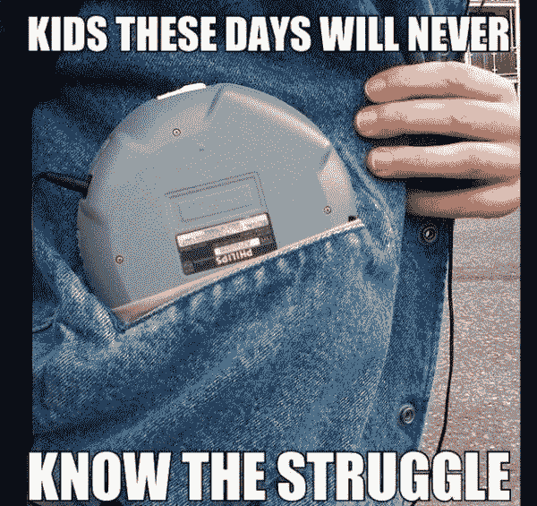
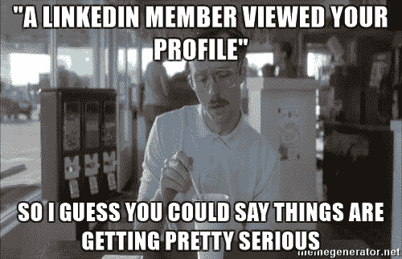

# 下一个:什么都没有？信息过载是如何影响我们的大脑的。

> 原文：<https://www.freecodecamp.org/news/up-next-nothing-how-information-overload-is-impacting-our-brains-d70cf9b2c05/>

由文尼

# 下一个:什么都没有？信息过载是如何影响我们的大脑的。

The ol’ red dot.

15 年前，我在早上上学前做了两个主要选择。我挑选了我想吃的谷类食品(莱斯克斯有多好？)，然后在我的 CD 收藏中筛选出一张放进我的随身听。

Thanks for the image, [Reddit](http://reddit.com)

当然，还有一些其他的微观决定。但是有了这两个主要的选择，我就可以准备好去学校，沿着马路跑到公交车站，打开我选择的 CD。可能是斯卡朋克。(对此我一点也不感到尴尬)。

我会到达公共汽车站，在外面闲逛，等公共汽车来。听我的音乐。我会上车，盯着窗外，一直听着。这张专辑可能会在我到学校，断开连接，去音乐教室弹吉他的时候重复播放。

这是一个完全不起眼的故事。我的早晨并不令人兴奋。

### 那时与现在

然而，试着做一个今天去上学的孩子。大多数青少年至少拥有一台设备。根据皮尤研究中心的数据，几年前，73%的青少年拥有智能手机。

想想我 15 年前的那次旅行。今天，事情就没那么简单了。有了智能手机和 Spotify 订阅，音乐选择从大约 50 张 CD 增加到超过 3000 万首歌曲。即使你成功地选择了一张专辑，你能坚持听完的几率有多大？

别介意有太多的歌曲可供选择。一路上你会遇到通知。**振动**。脸书记忆。**震动**。有人在推特上提到了你。**震动**。有人查看了您的 LinkedIn 个人资料。

Thanks [Meme Generator](http://meme generator.net) for this one

凝视窗外的日子一去不复返了。这些天在我乘坐电车的时候，我看到的都是低头盯着屏幕看的人。无论他们是在玩游戏、查看社交媒体，还是在发通知，突然之间，听音乐不再是他们的主要活动了。它是补充，是我们智能手机世界的背景音乐。

### 这很重要。

我关心这个——但不是因为我认为我们都应该分秒必争地关注，并与公交车上坐在我们旁边的每一个陌生人交谈。15 年前，我根本不参与社交活动。但是我开始我的一天是用心听音乐。

Hugh Van Cuylenburg (看看他)把这些都作为“弹性工程”的一部分来谈

根据休的研究，大约七分之一的小学生有心理健康问题。**小学生**。大约 30 年前，这个数字接近 50 分之一。

这真的令人惊讶吗？鉴于我们一周接收的信息量等于我们过去一年接收的信息量，我认为不是(休的数据可以追溯到 2014 年)。

更多疯狂的数据统计？

科学日报在 2013 年写的一篇文章指出，世界上 90%的数据是在 2011 年至 2013 年之间产生的。

虽然我不是心理学家，但我可以解释专家告诉我们的事情。可以毫不夸张地说，信息过载正在对我们的生活产生非常真实的影响。尤其是对于我们这些有足够特权使用智能手机和所有其他设备的人来说。

#### 不必要的注意力流失的例子

在网飞，当你结束一集时会发生什么？下一个已经排好了。在你选择的网站上阅读一篇新闻文章——在澳大利亚，我的网站是[时代](http://theage.com.au)——一段自动播放的视频映入你的眼帘。当你看一个[脸书](http://facebook.com)的视频时，当你看完后，他们会把你滚动到下一个。

其实你在这篇文章的底部会遇到什么呢？为什么，我想象一些“相关内容”的链接

是的，算法一直在变得更好，相关内容也越来越相关。那是什么意思？在脸书浪费更多时间。“快速浏览通知”变成了五分钟观看“1990 年代以来最伟大的英超进球”

好玩？是的。改善生活？没有那么多。

我们遇到如此多的通知。我们每天触摸手机[2617 次](https://www.networkworld.com/article/3092446/smartphones/we-touch-our-phones-2617-times-a-day-says-study.html)——这有多疯狂？所以我们最不需要的就是这样的东西:

随着技术的进步和我们在数据方面变得更加聪明，这场争夺我们注意力的战争在过去几年里愈演愈烈。像人工智能这样的技术使得提供更相关的内容变得更容易，这比以往任何时候都更吸引我们。手机就像我们口袋里的老虎机，我们正在接受检查可变奖励的培训。

我们的日子充满了无用的通知。最糟糕的是，它们出现在比以往更多的设备上。我们在屏幕之间的时间差不多就是睡觉。就是这样。

这可不好。我们可以大谈我们取得的所有技术进步，有些非常棒。但是我们什么时候才能停下来想想我们正在做的事情的心理后果呢？

### 我们停止建造东西了吗？

不。我不是提倡不做东西。我并不反对公司赚钱——如果我们的工作没有商业方面，我就不会有工作。

我提倡质疑我们为什么创造我们所创造的东西。我们需要教育使用我们产品的人。那些不是我们公司的设计师或心理学家的人可能不明白我们的产品能产生多大的影响。

作为一名产品设计师，我认为吸引和取悦顾客是很重要的。这让他们不断回来，为我创造的产品花钱。但我也认为，这种接触需要有一个人的基础。

“以用户为中心”并不仅仅意味着你将人物角色作为设计过程的一部分。这意味着你真诚地同情购买你产品的人。他们应该回到产品上来，因为你让他们的生活变得更好了，或者他们需要做些什么。不是因为你让他们想要完成某种连胜。

### 那我们该怎么办？

休(来自复原力项目)认为三个基本支柱很重要:****和**感恩**。我非常同意。那么我们如何实践它们呢？****

#### ****你能做的日常事情****

1.  ****在你的日常生活中创造时间积极练习感恩。可以是写感恩日记，去散步，或者腾出时间给一些重要的人打电话。****
2.  ****试试冥想。它并不适合所有人，但有了像 [Headspace](http://headspace.com) 和 [Calm](http://calm.com) 这样的应用，以及很棒的免费选项，绝对值得一试。肯定有足够可信的研究表明，这种技术可以有[生理上的好处](http://www.collective-evolution.com/2014/12/11/harvard-study-unveils-what-meditation-literally-does-to-the-brain/)(即。它确实改变了你的大脑)。****
3.  ****通过确保你参与到诸如积极倾听之类的事情中来练习移情。和伴侣说话时发短信，你有负罪感吗？当别人真的只想让你说“那糟透了”的时候，你说“至少……”是有罪的吗？****

#### ****让您的产品更好****

1.  ****这个怎么样:在使用自动播放这样的东西之前，让我们考虑一下。苹果最新版本的 Mac OS X 版 Safari 实际上是默认禁用的——这是一个好的开始！****
2.  ****加载新闻文章时需要播放视频吗？大概不会。也许安排下一集的网飞并没有那么糟糕——但是我们应该质疑这些决定的影响，而不是盲目前进。****
3.  ****质疑事物。让人们负起责任。我们不能让人们改变主意，但是让我们确保他们确切地知道他们正在做什么。注意我们的担忧，必要时承认失败，但确保在寻求答案时利用我们的技能。****
4.  ****使用[极限思维](http://liminalthinking.com)来确保我们与顾客感同身受。鼓励我们的领导者。秀，不要说。用故事向利益相关方传达客户的问题和需求。****
5.  ****知道你在和谁说话，以一种容易理解的方式提供内容。**同情不仅仅是为了用户，也是为了内部利益相关者**。用他们的方式看世界。****

******渴望了解更多信息？阅读并观看以下来自比我聪明得多的人的文章:******

****[**征服数字分心**](https://hbr.org/2015/06/conquering-digital-distraction)
[*思南·科阿斯兰/iStockphoto 数字超载可能是当今职场的定义性问题。日以继夜，在…*hbr.org](https://hbr.org/2015/06/conquering-digital-distraction)[**首页-复原力项目**](https://theresilienceproject.com.au)
[*”本次会议的反馈非常热烈....我们必须在全州推广这一计划“克林，全州…*theresilienceproject.com.au](https://theresilienceproject.com.au)****

****非常感谢你的阅读！如果你喜欢这篇文章，给我一些掌声，让更多的人看到它。请在 Twitter @ [doublethought](http://twitter.com/doublethought) 上关注我，如果你喜欢这类内容，请加入我下面的邮件列表！****