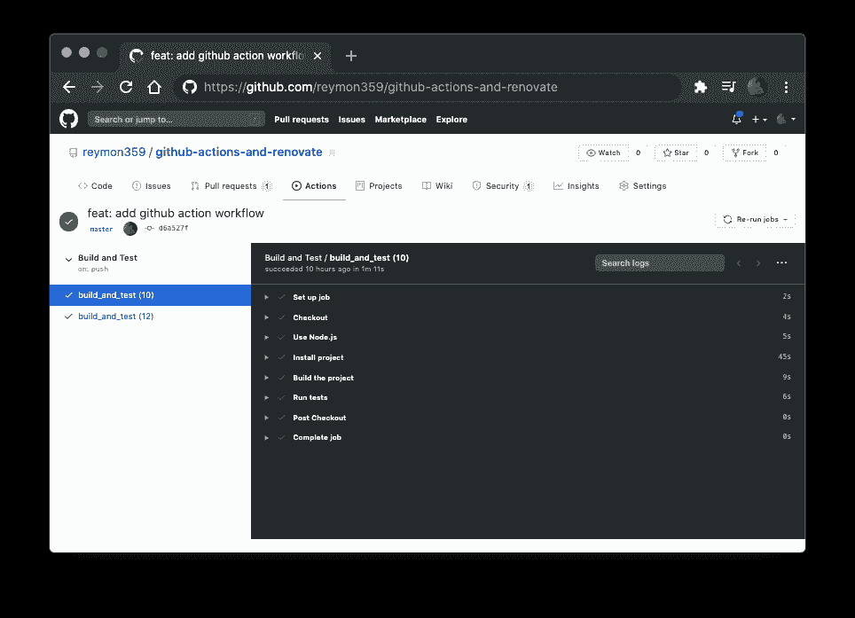

# 如何用 GitHub 动作安全自动地更新依赖项并翻新

> 原文：<https://www.freecodecamp.org/news/update-dependencies-automatically-with-github-actions-and-renovate/>

在软件开发中**跟上技术更新**至关重要。对于学习和更新技能的开发人员来说是这样，对于他们工作和维护的项目来说也是这样。

当您开始一个项目时，您通常用所有库和工具的最新稳定版本来设置它。

然后时间流逝，项目成长，新的特性和库被添加。但是**库和包的版本保持不变，团队从不更新它们**。

毕竟，如果项目与当前版本完全兼容，为什么要更新它们呢？


## 为什么您应该保持项目最新

以下是您应该保持依赖关系更新的一些原因:

*   解决旧版本的问题。
*   添加漏洞修复。
*   提高整体性能。
*   添加新功能。
*   ...

当您保持依赖关系更新时，您就解决了旧版本的问题，并通过新的优化提高了性能。您还可以使用其他开发人员添加的新功能。

所有这些改进都有助于代码的*可维护性，以及整个项目的健康。*

我们都曾参与过依赖关系从未(或很少)更新的项目。而且一点都不好玩。

那么，我们如何保持我们的项目是最新的呢？

首先，你可以运行`npm outdated`到[查看你目前正在使用的软件包的最新版本](https://docs.npmjs.com/cli/outdated)。

然后您可以运行`npm update`来更新它们(它不会将它们更新到主要版本)。但是你怎么知道哪些更新会破坏项目，哪些不会呢？

然后你要考虑什么时候应该更新一切。您应该每天什么时候检查更新？每周吗？...月份？

## 您将在本教程中学到什么

这就是我做这个项目的原因:了解 GitHub 动作，并使用它来拥有一种**安全的方式来自动更新依赖关系，而不会使项目失败**。

在本教程中，你将学习如何使用[renew app](https://github.com/renovatebot/renovate)来检查依赖项更新，然后提交 Pull 请求来更新它们。这让你*从检查更新中抽身出来，这样你就可以专注于更重要的事情。*

使用 [GitHub Actions](https://github.com/features/actions) 的目的是建立一个工作流，并在每个 Pull 请求时触发它。在将它们添加到项目之前，它将检查构建和测试是否通过了更新的依赖项。

## 目录

*   [入门](#Getting-Started)
*   [设置 GitHub 动作工作流程](#Set-up-GitHub-Actions-Workflow)
*   [添加翻新](#Add-Renovate)
*   [结论](#Conclusion)
*   [有用的资源](#Useful-Resources)

## 入门指南

虽然**这种方法可以应用于任何项目**，但我们将使用一个用 [Create React App](https://github.com/facebook/create-react-app) 制作的 [React](https://reactjs.org) 项目。这将为我们提供一个万事俱备的基本项目。

顺便说一下，如果您没有安装 Node.js，这里的[是安装的链接。](https://nodejs.org/en/download/)

如果你想在开始之前查看最终结果，[这里是](https://github.com/reymon359/github-actions-and-renovate)。

所以让我们从跑步开始

```
npx create-react-app my-app
cd my-app
npm start 
```

如果使用 npm 5.1 或更早版本，就不能使用`npx`。相反，全局安装`create-react-app`:

```
npm install -g create-react-app 
```

然后运行:

```
create-react-app my-app 
```

## 设置 Github 操作工作流

现在我们将继续在我们的存储库中定义一个 GitHub Actions 工作流来自动化这个过程。

*[GitHub Actions](https://github.com/features/actions) 是一个 GitHub 特性，可以帮助你自动化你的软件开发工作流程。它可以在您的存储库中处理从简单任务到定制端到端持续集成(CI)和持续部署(CD)功能的一切事情。*

在我们的根文件夹中，我们将创建一个新文件夹，并将其命名为`.github`。在里面，我们将创建一个`workflows`文件夹。完成这些步骤后，您的项目应该是这样的:

```
📁 my-app
├── 📁 .github
│   └── 📁 workflows
├── ...
... 
```

这里是我们创建和添加工作流的地方。Github Actions 工作流是我们希望在项目中运行的持续集成自动化流程。

工作流由包含一组步骤的作业组成。为了更清楚地解释它们，让我们创建自己的工作流，并一步一步地完成它。

在`.github/workflows`目录下，添加一个`.yml`或`.yaml`文件，命名为`main.yml`。我选择这个名字是为了简单起见，但是你也可以给它起其他名字，比如`build-test.yml`或者`continuous-integration-workflow.yml`。

```
📁 my-app
├── 📁 .github
│   └── 📁 workflows
│       └── 📄 main.yml
├── ...
... 
```

[这里](https://gist.github.com/reymon359/514cf378456457f1798293fe0ed99f3a)是工作流程最后会是什么样子，以防你只是想复制一下，直接加在解释之前。

```
name: Build and Test

on:
  push:
    branches: [master]
  pull_request:
    branches: [master]

jobs:
  build_and_test:
    runs-on: ubuntu-latest

    strategy:
      matrix:
        node: [10, 12]

    steps:
      - name: Checkout
        uses: actions/checkout@v2
      - name: Use Node.js ${{ matrix.node-version }}
        uses: actions/setup-node@v1
        with:
          node-version: ${{ matrix.node-version }}
      - name: Install project
        run: npm install
      - name: Build the project
        run: npm run build --if-present
      - name: Run tests
        run: npm test 
```

我们工作流的第一个参数是它的名字。

```
name: Build and Test 
```

第二个参数是**触发器**。

我们可以选择工作流是否由某个事件触发，比如对特定分支的推送或拉取请求，或者我们甚至可以安排一个 [cron](https://en.wikipedia.org/wiki/Cron) 到**在每隔一定时间自动触发它！**。

在我们的项目中，我们希望在推送到主分支时触发它，当 renewal 应用程序提交一个 Pull 请求来更新一个依赖项时触发它:

```
on:
  push:
    branches: [master]
  pull_request:
    branches: [master] 
```

接下来，我们定义**个作业**。

在这个例子中，将只有一个作业:**构建和测试**项目，并选择运行作业的虚拟机。

```
jobs:
  build_and_test:
    runs-on: ubuntu-latest 
```

现在是矩阵，我们将在其中配置运行工作流所需的版本和系统的组合。在我们的例子中，我们将在 Node.js 10 和 12 上运行它。

```
 strategy:
      matrix:
        node-version: [10, 12] 
```

最后，工作流程的步骤。首先是[检出动作](https://github.com/actions/checkout)，这是一个标准动作，当您需要一个存储库副本来运行工作流时，您必须将它包含在您的工作流中。

然后，您可以运行其他操作和流程。在我们的应用程序中，我们将使用 **setup-node** 动作和我们之前定义的矩阵。然后，我们将添加安装项目、构建项目和运行测试的步骤。

```
 steps:
      - name: Checkout
        uses: actions/checkout@v2
      - name: Use Node.js ${{ matrix.node-version }}
        uses: actions/setup-node@v1
        with:
          node-version: ${{ matrix.node-version }}
      - name: Install project
        run: npm install
      - name: Build the project
        run: npm run build --if-present
      - name: Run tests
        run: npm test 
```

现在为项目创建一个 GitHub 存储库，提交所做的本地更改，并将它们推送到这个存储库。

快速提示:如果你想更快地创建它，去 [repo.new](https://repo.new) 或 [github.new](https://github.new) 。你也可以用 [gist.new](https://gist.new) 做 gist！

提交更改后，工作流将会运行。然后你将能够在 GitHub 项目的`Actions` [标签中看到它是如何进行的。](https://github.com/reymon359/github-actions-and-renovate/actions)



## 添加翻新

[renewal](https://github.com/marketplace/renovate)是一款免费、开源、可定制的应用，通过接收拉取请求，帮助你自动更新软件项目中的依赖关系。

它被谷歌、Mozilla 和优步等软件公司使用，你可以在 GitHub、Gitlab、Bitbucket、Azure DevOps 和 Gitea 上使用它。

我们将添加一个 bot，当我们的项目依赖关系有更新时，它将向我们的存储库提交 pull 请求。

最酷的事情，也是我们项目的全部要点，是我们之前已经在工作流中定义了使用拉请求来运行测试。因此，当 renew 提交一个更新时，**我们将在将它们合并到主分支**之前，自动检查提议的更新是否会破坏项目。


为了给我们的项目添加 renew，我们必须将[的应用程序](https://github.com/apps/renovate)安装到项目的存储库中。

在选择要添加翻新的存储库时要小心，并选择之前创建的存储库。如果你犯了一个错误，你想重新配置它，你可以在你的帐户的[个人设置的应用程序标签](https://github.com/settings/installations)中进行。

几分钟后，您必须接受并合并您收到的 onboarding Pull 请求。

一旦您集成了它，您需要通过更新项目根目录上的`renovate.json`文件来配置它。记住在合并拉取请求之后拉取更改，以使其出现。

您可以使用默认配置，在该配置中，每当 renovate 找到更新并等待您合并它们时，它都会提交 pull 请求:

```
{
  "extends": ["config:base"]
} 
```

或者你也可以根据你的项目需求对其进行调整，比如[revenue self](https://github.com/renovatebot/renovate/blob/master/renovate.json)使用的那个。

为了避免任何问题，并学习更多关于这个工具的知识，我们将使用一个配置，它有一些最有用的特性。

如果你想了解更多关于它的配置[，这里](https://docs.renovatebot.com/)是它的文档。

[这个](https://gist.github.com/reymon359/4c4417522cd0922cfbc63ad75ca2c945)将是我们的`renovate.json`文件。你看一下，之后我会解释的。

```
{
  "extends": [
    "config:base"
  ],
  "packageRules": [
    {
      "updateTypes": [
        "minor",
        "patch"
      ],
      "automerge": true
    }
  ],
  "timezone": "Europe/Madrid",
  "schedule": [
    "after 10pm every weekday",
    "before 5am every weekday",
    "every weekend"
  ]
} 
```

在第一部分中，我们告诉 renew，我们的配置将是默认配置的扩展。

```
{
  "extends": [
    "config:base"
  ], 
```

然后我们有了`packageRules`。在使用了几个月之后，我意识到(不时地)检查拉取请求并在测试通过后接受它们是对时间的极大浪费。

这就是为什么`automerge`被设置为 true，所以如果工作流成功通过，renew 会自动合并 pull 请求。

为了稍微限制 renew 的自由度，我们定义它只能在`minor`或`patch`更新时执行`automerge`。

这样，如果是一个`major`或另一种更新，我们将是检查是否应该添加更新的人。

[在这里](https://docs.renovatebot.com/configuration-options/#updatetypes)您可以找到关于可用更新类型的更多信息。

```
 "packageRules": [
    {
      "updateTypes": [
        "minor",
        "patch"
      ],
      "automerge": true
    }
  ], 
```

最后，我们有时间表。如果你在特定时间单独工作或在团队中工作，最好在你不工作的时候进行更新，以避免不必要的分心。

我们选择我们的时区，并为它添加一个定制的[时间表](https://docs.renovatebot.com/presets-schedule/)。你可以在这里找到有效的时区名称。

```
 "timezone": "Europe/Madrid",
  "schedule": [
    "after 10pm every weekday",
    "before 5am every weekday",
    "every weekend"
  ], 
```

无论如何，如果您不关心提交拉请求的时间，或者对代码有贡献的人在不同的时区，那么您可以删除这一部分。

一旦我们更新了配置，我们会将更改推送到 GitHub，让 Renovate 应用程序适应新的配置。

现在，您终于拥有了安全更新的项目依赖项，而不必检查它们。[这是按照上面提到的所有步骤后得到的项目](https://github.com/reymon359/github-actions-and-renovate)。

请记住，如果您添加了时间表部分，您将不会自动合并拉取请求，直到它符合该配置。

## 结论

还有其他方法可以自动更新依赖关系。但是如果你使用 GitHub 来托管你的代码，你应该充分利用它令人敬畏的免费特性。

如果你想知道 GitHub 应用程序和操作还能做些什么和实现自动化，看看它的[市场](https://github.com/marketplace)就知道了。

另外，你可以看看[我做的一个项目](https://github.com/reymon359/up-to-date-react-template)，我时不时会做这个项目。这是本教程的基础。它比本教程中的更复杂，有更多的特性。

我希望你喜欢这篇文章，并了解 GitHub Actions 及其应用程序。如果你有任何问题、建议或反馈，不要犹豫，通过邮件从[我的网站](https://ramonmorcillo.com)或。

## 有用的资源

这里有一些链接和资源，我认为对改进和学习更多关于 GitHub 动作和应用程序是有用的。

*   [辅导项目](https://github.com/reymon359/github-actions-and-renovate)。-本教程产生的项目。
*   [GitHub 市场](https://github.com/marketplace)。-查找所有 GitHub 操作和应用程序的地方。
*   [GitHub Actions 工作流配置](https://help.github.com/en/actions/configuring-and-managing-workflows/configuring-a-workflow) -关于如何在 GitHub Actions 上建立工作流的完整文档。
*   [翻新 GitHub 应用](https://github.com/marketplace/renovate) -翻新 GitHub 市场上的应用主页。
*   [GitHub Actions 项目工作流程](https://gist.github.com/reymon359/514cf378456457f1798293fe0ed99f3a)。-本教程中使用的工作流。
*   [更新 App 的配置文件](https://gist.github.com/reymon359/4c4417522cd0922cfbc63ad75ca2c945)。-更新教程中 App 的自定义配置文件。
*   [最新反应模板](https://github.com/reymon359/up-to-date-react-template)。-使用本教程中描述的方法的个人项目。