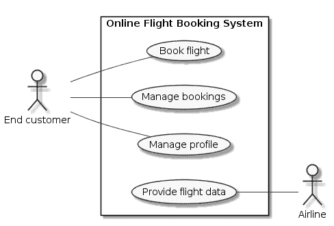

# 用例与组织结构

> 原文：<https://www.freecodecamp.org/news/use-cases-and-organizational-structure/>

用例图定义了系统的范围。但是用例也可以帮助你设计你的产品开发组织。

这里有一个用例图，展示了一个在线机票预订系统的用例:

如您所见，该图显示了用户的目标:一个*最终客户*想要*预订一个航班*。该图没有显示达到目标的步骤，例如搜索航班。

敏捷团队应该独立于其他团队交付价值。目标级用例就是这样一个价值单位。当敏捷团队负责整个用例时，与其他团队交流的需求是有限的。

例如，用例*预订航班*本身就是有价值的。它与用户从一个地方到另一个地方的需求联系在一起。这就是为什么它是软件的卖点。

*如果你想了解我正在做的事情或给我留言，请在[开发到](https://dev.to/bertilmuth)、 [LinkedIn](https://www.linkedin.com/in/bertilmuth/) 或 [twitter](https://twitter.com/BertilMuth) 上关注我。或者访问我的 [GitHub 项目](https://github.com/bertilmuth/requirementsascode)。*