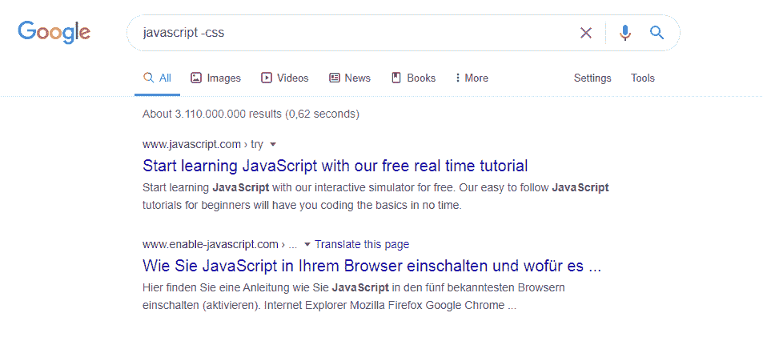
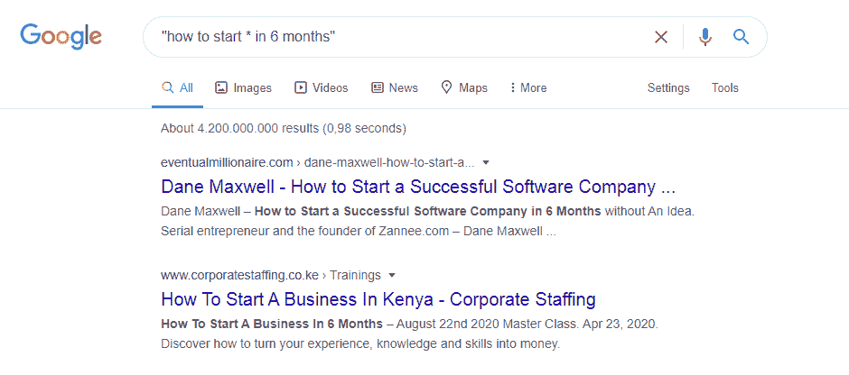
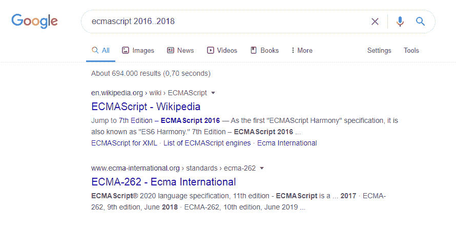
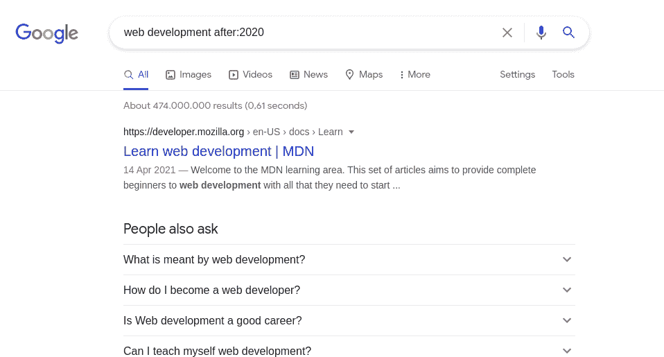

# 如何使用谷歌-搜索技巧以获得更好的结果

> 原文：<https://www.freecodecamp.org/news/use-google-search-tips/>

如果你知道如何正确使用，谷歌是世界上最强大的工具。让我告诉你如何更好地搜索。

## 1.使用引号进行精确匹配搜索

您可以使用引号强制进行精确匹配搜索。如果你确切地知道你正在寻找的搜索短语，这是非常有用的。如果你这样做，你只会得到更准确的结果。

`"what is javascript"`

## 2.使用 AND 运算符

AND 运算符将只返回与这两个词相关的结果。在下面的例子中，你可以看到这个操作符的完美用例。

`html AND css`

## 3.使用 OR 运算符

您可以使用 OR 运算符来获取与您输入的某个搜索词相关的结果。

`(javascript OR python) free course`

## 4.使用-(减号)运算符

运算符将排除包含术语或短语的结果。因此，在我们的例子中，我们希望获得 JavaScript 相关的结果，但排除任何 CSS 结果。

`javascript -css`

## 5.使用(*)通配符作为占位符

您可以使用(*)通配符作为占位符，它将被任何单词或短语替换。

这个是我最喜欢的。当我知道几乎整个搜索短语时，我使用它，只是用星号代替我不知道的部分。超级有用。

`"how to start * in 6 months"`

## 6.如何在单个网站中搜索

这是我经常使用的另一个。如果我在一个特定的网站上搜索某样特别的东西，这就是我的方法。

`site:freecodecamp.org`

## 7.如何找到特定的文件类型

您还可以使用这个非常有用的功能来帮助您找到特定的文件类型。如果你想找一些像 pdf 这样的材料，这很方便。如果你以前没用过，从现在开始你会用的。

`filetype:pdf learn css`

## 8.如何搜索一系列数字

这可以是任何东西。如果你正在寻找一个特定价格范围内的东西，或者你正在搜索包含特定年份范围的结果，这是给你的。

`ecmascript 2016..2018`

## 9.使用`before`操作符

使用 before 运算符仅返回给定日期之前的结果。您必须提供年-月-日日期或仅一年。例如:

`javascript before:2020`

## 10.使用`after`操作符

使用 after 运算符仅返回给定日期之后的结果。您必须提供年-月-日日期或仅一年。超级有用，如果你想排除过时的结果。

`web development after:2020`

如你所见，如果你知道如何正确使用，谷歌可以成为一个强大的工具。

如果有任何问题，可以通过 [Twitter](https://twitter.com/denicmarko) 联系我。

你可以在我的[博客](https://markodenic.com/blog/)上找到大量现实生活中的技巧和资源。