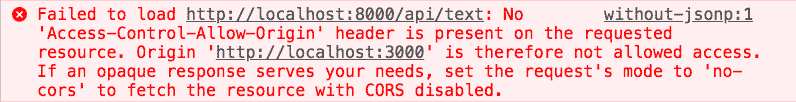
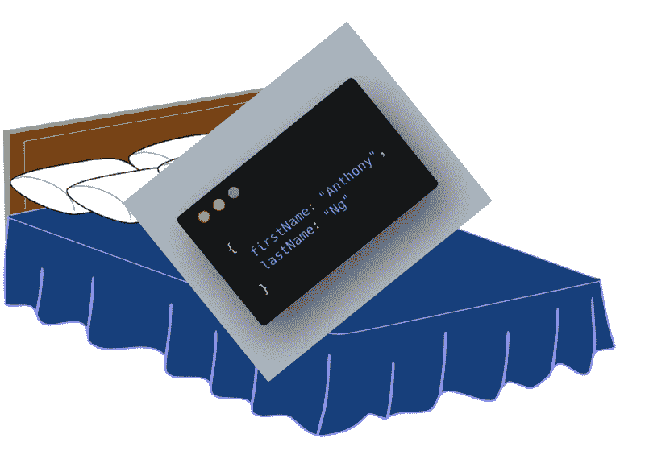
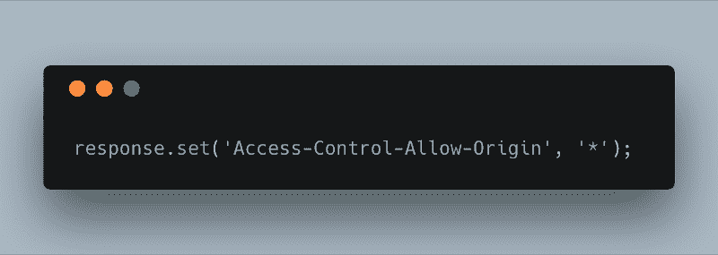

# 如何使用 JSON 填充(和其他选项)绕过同源策略

> 原文：<https://www.freecodecamp.org/news/use-jsonp-and-other-alternatives-to-bypass-the-same-origin-policy-17114a5f2016/>

作者安东尼·吴

# 如何使用 JSON 填充(和其他选项)绕过同源策略

Photo by [Ed 259](https://unsplash.com/photos/xcrI6CPkkJs?utm_source=unsplash&utm_medium=referral&utm_content=creditCopyText) on [Unsplash](https://unsplash.com/search/photos/roads?utm_source=unsplash&utm_medium=referral&utm_content=creditCopyText)

在本文中，我们将了解 JSONP 是什么，它的缺点，以及 JSONP 的一些替代方案。

您可能遇到过从一个原点到另一个原点进行 API 调用的情况。例如，我们有一个从 localhost:3000 提供的页面，它从 localhost:8000 调用 API。

**注意**:我们将把 localhost:3000 称为我们的客户端服务器。我们将 localhost:8000 称为我们的 API 服务器。

但是我们看到了这个可怕的错误。

Error when trying to make fetch call from client server to api server

这是同源政策在保护我们。该策略限制一个来源的资源如何与另一个来源的资源交互。这是浏览器中的一个关键安全机制。但是在某些情况下，我们希望向受信任的资源发出跨来源的请求。

JSONP(带填充的 JSON)为这个同源策略问题提供了一个变通办法。我们来看看 JSONP 是怎么来的。

### 技术潜水

我们可以在带有`<scri` pt >标签的 HTML 文件中运行 JavaScript 代码。

我们可以将我们的 JavaScript 代码移动到一个单独的 JavaScript 文件中，并用我们的 Script 标签引用它。我们的网页现在对 JavaScript 文件进行外部网络调用。但是在功能上，一切都是一样的。

Javascript 文件不一定要有`js`扩展名。如果响应的内容类型是 JavaScript，浏览器会将内容解释为 JavaScript。(`text/javascript`，`application/javascript`)。
大多数服务器允许您设置内容类型。在[快车](https://expressjs.com)中，你会做:

Setting Content-Type header for Response

你的`<scri` pt >标签可以引用一个没有 js 扩展名的 URL。

脚本标签不受同源策略的限制。还有其他的标签，比如`<i`mg>lt；视频>标签，不受同源政策限制。所以我们的 JavaScript 可以存在于不同的起源。

JavaScript 文件中的代码可以访问范围内的所有内容。您可以使用之前在 HTML 文件中定义的函数。

您可以像普通函数调用一样传递参数。

在上面的例子中，我们传递了一个硬编码的字符串。但是我们也可以传递来自数据库的数据。我们的 API 服务器可以用这些动态信息构建 JavaScript 文件。

这就是 JSONP。我们没有使用`[fetch](https://developer.mozilla.org/en-US/docs/Web/API/Fetch_API)`或`[XMLHttpRequest](https://developer.mozilla.org/en-US/docs/Web/API/XMLHttpRequest)`进行 API 调用来检索数据，而是使用了一个`<scri` pt >标签。因为我们 u`sed a &l`t；script >标签，我们能够绕过同源策略。

我上面提到过，JSONP 的意思是带填充的 JSON。填充是什么意思？正常的 API 响应返回 JSON。在 JSONP 响应中，我们返回用 JavaScript 函数包围(或填充)的 JSON 响应。

Artist rendition of JSON with Padding

大多数服务器允许您指定填充函数的名称。

服务器将您的填充函数名作为查询。它使用 JSON 数据作为参数调用填充函数。

您并不局限于将函数名作为回调函数来传递。您可以在查询中传递内联 JavaScript。

我还没有想到这样做的理由。

### 使用 JSONP 的替代方法

JSONP 没有官方规范。我认为 JSONP 更像是一个黑客。

`<scri` pt >标签只能发出 GET 请求。所以 JSONP 只能发出 GET 请求。

[跨来源资源共享](https://developer.mozilla.org/en-US/docs/Web/HTTP/CORS)有一个官方规范，并且是绕过同源策略的首选方式。

您可以通过在我们的响应中添加一个头来启用跨源资源共享。

这意味着所有来源都可以使用这种资源，而不用担心同源策略。

有时，您无法控制服务器代码。您将无法包含`Access-Control-Allow-Origin`标题。另一种解决方案是让您自己的代理服务器为您发出跨源请求。同源策略仅适用于浏览器。服务器可以自由地进行跨源请求。

有问题吗？评论？请在下面留言。

### 资源

*   [同源政策](https://developer.mozilla.org/en-US/docs/Web/Security/Same-origin_policy)
*   [包含 JSONP 和 CORS 示例的 Github 知识库](https://github.com/newyork-anthonyng/jsonp-example.)
*   [JSONP 详细说明](https://web.archive.org/web/20160304044218/http://www.json-p.org/)