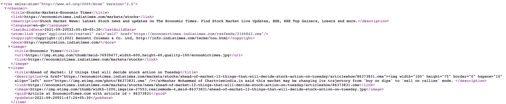
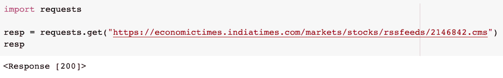
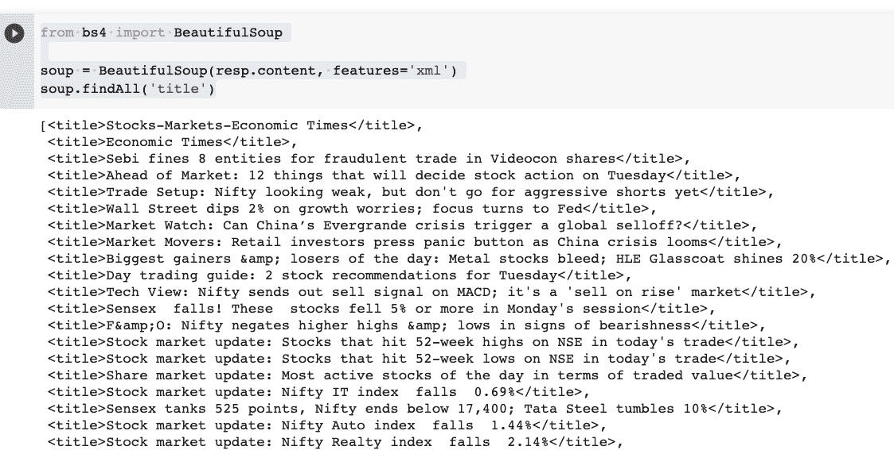
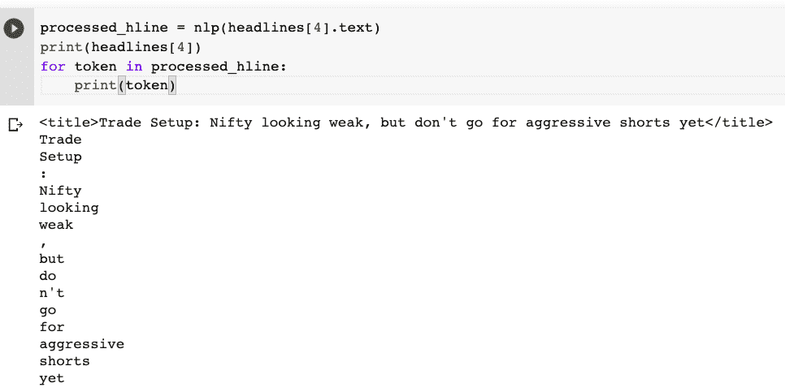
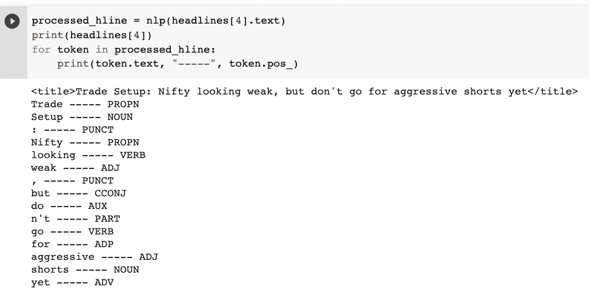
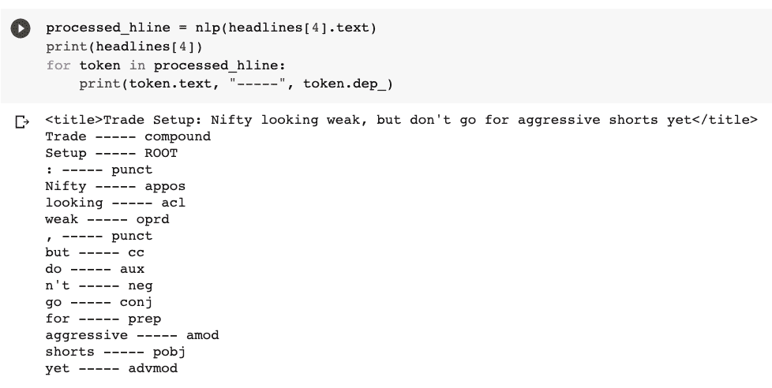
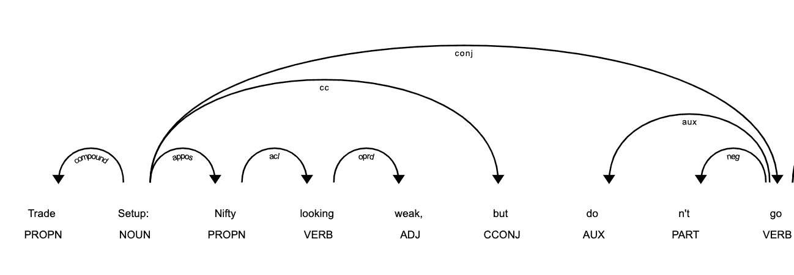
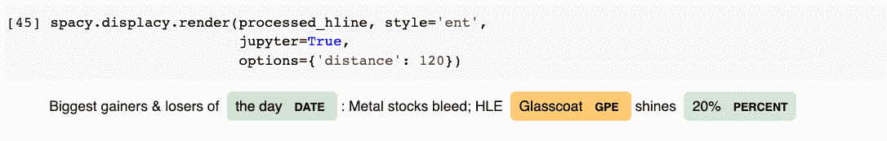
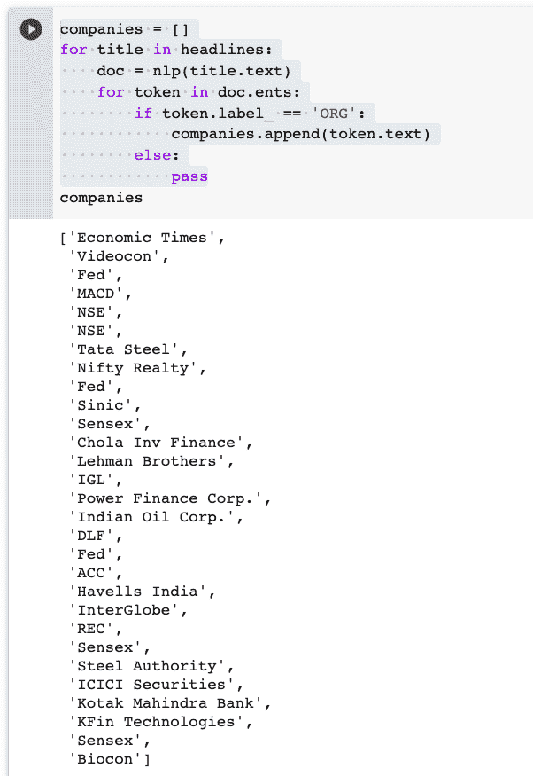
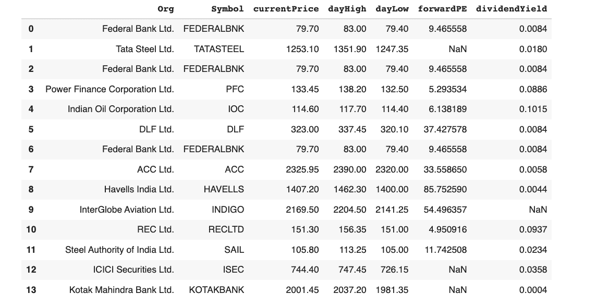

# 使用 Python、SpaCy 和 Streamlit 构建结构化的金融新闻提要

> 原文：<https://www.freecodecamp.org/news/use-python-spacy-streamlit-to-build-structured-financial-newsfeed/>

自然语言处理的一个非常有趣且广泛使用的应用是命名实体识别(NER)。

从原始和非结构化数据中获得洞察力至关重要。上传一个文档并从中获取重要的信息称为信息检索。

信息检索一直是自然语言处理中的主要任务和挑战。我们可以在金融、药物研究、电子商务等多个领域使用 NER(或 NEL——命名实体链接)进行信息检索。

在这篇教程文章中，我将向你展示如何利用 NEL 开发一个定制的股票市场新闻源，列出互联网上的热门股票。

### 先决条件

没有真正的先决条件。如果您对 Python 和 NLP 的基本任务(如标记化、词性标注、依存解析等)有所了解，将会很有帮助。

我将更详细地介绍重要的部分，所以即使你是一个完全的初学者，你也能够理解正在发生的事情。

所以，让我们继续吧！跟着做，你将会有一个最小的股票新闻提要，你可以在本教程结束时开始研究。

## 您需要什么来开始:

1.  Google Colab 用于数据和空间库的初始测试和探索。
2.  VS 代码(或任何编辑器)来编写 Streamlit 应用程序。
3.  股票市场信息(新闻)的来源，我们将在上面执行 NER 和后来的 NEL。
4.  一个虚拟的 Python 环境(我用的是 conda)以及像 Pandas，Spacy，Streamlit，Streamlit-Spacy 这样的库(如果你想展示一些 SpaCy 渲染。)

## 项目的目标

这个项目的目标是学习和应用命名实体识别来提取重要的实体(在我们的例子中是上市公司)，然后使用知识库(Nifty500 公司列表)将每个实体与一些信息联系起来。

我们将从互联网上的 RSS 提要中获取文本数据，并提取热门股票的名称。然后，在对这些股票建仓之前，我们将提取它们的市场价格数据，以测试新闻的真实性。

> 注意:NER 可能不是一个最先进的问题，但它在行业中有许多应用。

让我们转到 Google Colab 进行实验和测试。

## 步骤 1:如何提取趋势股票新闻数据

为了获得一些可靠的真实的股市新闻，我将在本教程中使用[经济时报](https://economictimes.indiatimes.com/markets/stocks/rssfeeds/2146842.cms)和[资金控制](https://www.moneycontrol.com/rss/buzzingstocks.xml) RSS 源。但你也可以使用/添加你所在国家的 RSS 订阅源或 Twitter/Telegram(群组)数据，使你的订阅源更具信息性/准确性。

机会是巨大的。本教程应该作为应用 NEL 构建不同领域的应用程序来解决不同类型的信息检索问题的垫脚石。

如果您继续查看 RSS 提要，它看起来像这样:



我们的目标是从这个 RSS 提要中获取文本标题，然后我们将使用 SpaCy 从标题中提取主要实体。

这里，标题出现在 XML 的`<title>`标签中。

首先，我们需要捕获整个 XML 文档，我们可以使用`**requests**`库来完成这项工作。确保在 colab 的运行时环境中安装了这些包。

您可以运行以下命令从 colab 的代码单元安装几乎任何软件包:

```
!pip install <package_name> 
```

在提供的链接上发送一个`GET`请求来获取 XML 文档。

```
import requests
resp = requests.get("https://economictimes.indiatimes.com/markets/stocks/rssfeeds/2146842.cms") 
```

运行单元格，检查在响应对象中得到什么。

它应该会给你一个 HTTP 代码为 200 的成功响应，如下所示:



现在您已经有了这个响应对象，我们可以将它的内容传递给 BeautifulSoup 类来解析 XML 文档，如下所示:

```
from bs4 import BeautifulSoup
soup = BeautifulSoup(resp.content, features='xml')
soup.findAll('title') 
```

这将为您提供 Python 列表中的所有标题:



太棒了——我们有了文本数据，我们将使用 NLP 从中提取主要实体(在本例中是上市公司)。

是时候将 NLP 付诸行动了。

## 步骤 2:如何从标题中提取实体

这是令人兴奋的部分。我们将使用来自`**spaCy**`库中的**预训练核心语言模型**来提取标题中的主要实体。

让我们再多谈谈 spaCy 和核心模型。

**[spaCy](https://spacy.io/)** 是一个开源的 NLP 库，以超快的速度处理文本数据。它是 NLP 研究领域的领先库，被大规模应用于企业级应用。

spaCy 以解决问题而闻名。它支持超过 64 种语言，可以很好地与 TensorFlow 和 PyTorch 配合使用。

谈到核心模型，spaCy 有两大类预训练语言模型，它们在不同大小的文本数据上进行训练，为我们提供最先进的推理。

1.  核心模型—用于一般用途的基本 NLP 任务。
2.  初级型号—适用于需要迁移学习的特殊应用。我们可以利用模型的学习权重来微调我们的定制模型，而不必从头开始训练模型。

由于我们的用例在本教程中是基本的，我们将坚持使用`en_core_web_sm`核心模型管道。

那么，让我们把它载入我们的笔记本:

```
nlp = spacy.load("en_core_web_sm") 
```

**注意:** Colab 已经为我们下载了这个，但是如果您试图在您的本地系统中运行它，您必须首先使用以下命令下载这个模型:

```
python -m spacy download en_core_web_sm 
```

`en_core_web_sm`基本上是一个针对 CPU 优化的英语管道，包括以下组件:

*   tok2vec —向量 s 的标记(对文本数据执行标记化)，
*   tagger —向每个令牌添加相关元数据。spaCy 利用一些统计模型来预测每个单词的词性。更多信息见[文档](https://spacy.io/models/en)。
*   解析器——依赖解析器建立标记之间的关系。
*   其他组件包括 senter、ner、attribute_ruler 和 lemmatizer。

现在，为了测试这个模型能为我们做什么，我将通过实例化的模型传递一个标题，然后检查一个句子的不同部分。

```
# make sure you extract the text out of <title> tags
processed_hline = nlp(headlines[4].text) 
```

管道执行从令牌化到 NER 的所有任务。这里我们先有代币:



您可以使用`pos_` 属性查看标记的词性。



每个令牌都标记有一些元数据。比如 Trade 是专有名词，Setup 是名词，`:`是标点，等等等等。标签的完整列表在这里给出[。](https://spacy.io/models/en)

然后，您可以通过使用`dep_`属性查看依赖关系图来了解它们是如何相关的:



在这里，Trade 是复合词，Setup 是词根，Nifty 是同位语修饰语。同样，所有的语法标签都可以在这里找到。

您还可以使用下面的 displacy `render()`方法来可视化令牌之间的关系依赖:

```
spacy.displacy.render(processed_hline, style='dep',
jupyter=True, options={'distance': 120}) 
```

这将给出这个图表:



### 实体提取

为了查看句子的重要实体，您可以在相同的代码中将`**'ent’**`作为样式传递:



我们对不同的实体有不同的标签，比如日期，Glasscoat 有 GPE，可以是国家/城市/州。我们主要是在寻找有 ORG 标签的实体，它会给我们公司、代理、机构等等。

我们现在能够从文本中提取实体。让我们开始使用 ORG 实体从所有标题中提取组织。

```
ent.py
companies = []
for title in headlines:
    doc = nlp(title.text)
    for token in doc.ents:
        if token.label_ == 'ORG':
            companies.append(token.text)
        else:
            pass 
```

这将返回所有公司的列表，如下所示:



很简单，对吧？

这就是空间的魔力！

下一步是在知识库中查找所有这些公司，为该公司提取正确的股票代码。然后我们将使用像 yahoo-finance 这样的库来提取它们的市场细节，比如价格、回报等等。

## 步骤 3-命名实体链接

了解什么股票在市场上炙手可热，并在您的仪表板上获得它们的详细信息是这个项目的目标。

我们有公司名称，但是为了获得它们的交易细节，我们需要公司的交易股票代码。

因为我正在提取印度公司的详细信息和新闻，所以我将使用一个外部数据库，这个数据库包含了 Nifty 500 家公司(一个 CSV 文件)。

对于每家公司，我们将在使用 pandas 的公司列表中查找，然后我们将使用 [yahoo-finance](https://pypi.org/project/yfinance/) 库捕获股票市场统计数据。

```
import yfinance as yf

## collect various market attributes of a stock
stock_dict = {
    'Org': [],
    'Symbol': [],
    'currentPrice': [],
    'dayHigh': [],
    'dayLow': [],
    'forwardPE': [],
    'dividendYield': []
}

## for each company look it up and gather all market data on it
for company in companies:
    try:
        if stocks_df['Company Name'].str.contains(company).sum():
            symbol = stocks_df[stocks_df['Company Name'].\
                                str.contains(company)]['Symbol'].values[0]
            org_name = stocks_df[stocks_df['Company Name'].\
                                str.contains(company)]['Company Name'].values[0]
            stock_dict['Org'].append(org_name)
            stock_dict['Symbol'].append(symbol)
            stock_info = yf.Ticker(symbol+".NS").info
            stock_dict['currentPrice'].append(stock_info['currentPrice'])
            stock_dict['dayHigh'].append(stock_info['dayHigh'])
            stock_dict['dayLow'].append(stock_info['dayLow'])
            stock_dict['forwardPE'].append(stock_info['forwardPE'])
            stock_dict['dividendYield'].append(stock_info['dividendYield'])
        else:
            pass
    except:
        pass

## create a dataframe to display the buzzing stocks
pd.DataFrame(stock_dict) 
```

你应该注意到的一件事是，我在这里添加了一个。NS ”,然后将其传递给`yfinance`库的`Ticker`类。这是因为印度 NSE 股票代码以一个`.NS`后缀存储在`yfinance`中。

活跃的股票会出现在如下的数据图中:



瞧啊。这不是很棒吗？这样一个简单而深刻的应用程序，可以为你指出正确的方向和正确的股票。

现在，为了使它更容易访问，我们可以用刚刚使用 Streamlit 编写的代码创建一个 web 应用程序。

## 步骤 4 —如何使用 Streamlit 构建 web 应用程序

是时候转到编辑器，为 NLP 应用程序创建一个新项目和虚拟环境了。

对于这样的演示数据应用程序，开始使用 Streamlit 非常容易。确保您已经安装了 streamlit。

```
pip install Streamlit 
```

现在，让我们创建一个名为 app.py 的新文件，并开始编写功能代码来准备应用程序。

像这样在顶部导入所有需要的库:

```
import pandas as pd
import requests
import spacy
import streamlit as st
from bs4 import BeautifulSoup
import yfinance as yf 
```

为您的应用程序添加标题:

```
st.title('Buzzing Stocks :zap:')
```

在您的终端中运行`streamlit run app.py`来测试您的应用。它应该会在你的网络浏览器中打开一个应用程序。

我添加了一些额外的功能来从多个来源捕获数据。现在，您可以将自己选择的 RSS 提要 URL 添加到应用程序中，数据将被处理，趋势股票将显示在数据框中。

要访问整个代码库，您可以在这里查看我的库:

[https://github.com/dswh/NER_News_Feed](https://github.com/dswh/NER_News_Feed)

如果您想一步一步地了解我，请在这里观看我编写这个应用程序:

[https://www.youtube.com/embed/G5ycs1hFSKk?feature=oembed](https://www.youtube.com/embed/G5ycs1hFSKk?feature=oembed)

您可以添加多个样式元素、不同的数据源和其他类型的处理，使其更加高效和有用。

我的应用程序在当前状态下看起来像横幅中的图像。

## 后续步骤

除了选择财务用例，您还可以选择任何其他应用程序——医疗保健、电子商务、研究和许多其他应用程序。所有行业都需要处理文档，提取和链接重要的实体。尝试另一个想法。

一个简单的想法是提取一篇研究论文的所有重要实体，然后使用谷歌搜索 API 创建一个知识图。

此外，如果你想将股票新闻应用程序提升到另一个水平，你可以添加一些交易算法来生成买入和卖出信号。

我鼓励你尽情发挥你的想象力。

### 你如何与我联系

如果你喜欢这篇文章，并希望看到更多这样的内容，你可以订阅 [**我的简讯**](https://dswharshit.substack.com/publish/settings#twitter-account) **或** [**我的 YouTube 频道**](https://www.youtube.com/channel/UCH-xwLTKQaABNs2QmGxK2bQ) 在那里我会继续分享你可以创建的有用而快速的项目。

如果你刚刚开始学习编程，或者想进入数据科学或 ML，你可以在[**WIP Lane Academy**](https://www.wiplane.com/p/foundations-for-data-science-ml)**查看我的课程。**