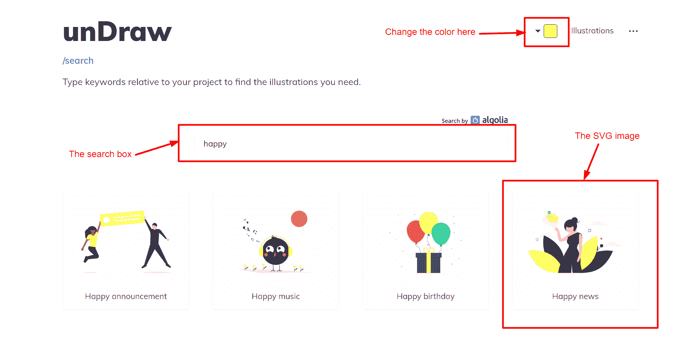
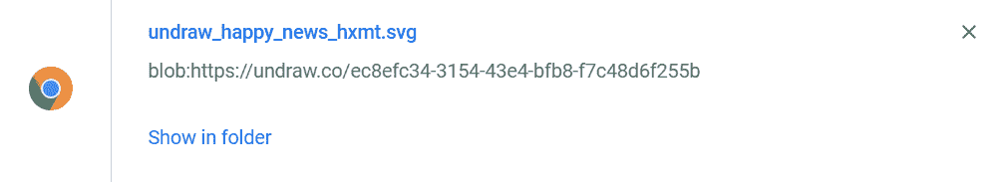

# 如何在 CSS 和 HTML 中使用 SVG 图像——初学者教程

> 原文：<https://www.freecodecamp.org/news/use-svg-images-in-css-html/>

SVG 代表可缩放矢量图形。对于用可扩展标记语言(XML)编写的基于矢量的图形，它是一种独特的图像格式。

在本教程中，我将解释为什么你想使用 SVG 图像，以及如何在 CSS 和 HTML 中使用它们。

# 为什么应该使用 SVG 图像？

使用 SVG 图像有许多原因，其中一些原因是:

*   当缩放或调整大小时，SVG 图像不会失去质量。
*   可以用 IDE 或文本编辑器创建和编辑它们。
*   它们是可访问的和可动画化的。
*   它们的文件很小，并且高度可伸缩。
*   它们可以被搜索、索引、编写脚本和压缩。

现在让我们看看如何实际处理 SVG 图像。

# 如何下载本教程中使用的 SVG 图像

如果您想使用我在本教程中使用的 SVG 图像，请按照下面的步骤(和图表)下载它。

*   转到[展开](https://undraw.co)。
*   将背景颜色更改为黄色。
*   在搜索框里搜索**快乐**这个词。



*   点击名为**喜讯**的图片。
*   在弹出窗口中，点击**下载 SVG 到你的项目**按钮。


如果您正确地遵循了上面的步骤，SVG 图像现在应该在您的计算机上了。



现在，在您喜欢的 IDE 或文本编辑器中打开 SVG 图像。将其重命名为 **happy.svg** 或任何您喜欢的名称。

# 如何在 CSS 和 HTML 中使用 SVG 图像

在 CSS 和 HTML 中使用 SVG 图像有几种不同的方法。我们将在本教程中探索六种不同的方法。

## 1.如何使用 SVG 作为``

这种方法是向网页添加 SVG 图像的最简单方法。要使用这个方法，将``元素添加到 HTML 文档中，并在`src`属性中引用它，如下所示:

```
 
```

假设您从 unDraw 下载了 SVG 图像，并将其重命名为 **happy.svg** ，那么您可以将上面的代码片段添加到您的 HTML 文档中。

如果你做的一切都正确，你的网页应该看起来完全像下面的演示。👀

[https://codesandbox.io/embed/svg-demo-mppxs?from-embed](https://codesandbox.io/embed/svg-demo-mppxs?from-embed)

当您使用``标签添加 SVG 图像而没有指定大小时，它会采用原始 SVG 文件的大小。

例如，在上面的演示中，我没有修改 SVG 图像的大小，所以它采用了它的原始大小(宽度为`915.11162px`，高度为`600.53015px`)。

**注意:**要改变原始大小，你必须用 CSS 指定`width`和`height`，正如你在下面的演示中看到的。也可以直接更新原来的`width`和`height`。

[https://codesandbox.io/embed/svg-demo-1-ey5me?from-embed](https://codesandbox.io/embed/svg-demo-1-ey5me?from-embed)

即使我们可以改变通过``标签添加的 SVG 图像的大小，如果您想对 SVG 图像进行大的样式改变，仍然有一些限制。

## 2.如何使用 SVG 作为 CSS `background-image`

这类似于使用``标签将 SVG 添加到 HTML 文档中。但是这一次我们用 CSS 而不是 HTML 来做，你可以在下面的代码片段中看到。

```
body {
  background-image: url(happy.svg);
} 
```

当您使用 SVG 作为 CSS 背景图像时，它与使用``有类似的限制。尽管如此，它允许更多的定制。

看看下面的演示，并随时使用 CSS 对其进行修改。

[https://codesandbox.io/embed/svg-demo-2-ftn6n?from-embed](https://codesandbox.io/embed/svg-demo-2-ftn6n?from-embed)

## 3.如何使用内嵌 SVG 图像

SVG 图像可以使用`<svg> </svg>`标签直接写入 HTML 文档。

为此，在 VS 代码或您首选的 IDE 中打开 SVG 图像，复制代码，并将其粘贴到 HTML 文档的`<body>`元素中。

```
<body>
 // Paste the SVG code here.
</body> 
```

如果你做的一切都正确，你的网页应该看起来完全像下面的演示。

[https://codesandbox.io/embed/svg-demo-3-zunkd?from-embed](https://codesandbox.io/embed/svg-demo-3-zunkd?from-embed)

当您在 HTML 文档中使用 SVG inline 时，它可以减少加载时间，因为它是一个 HTTP 请求。

与使用``或`background-image`方法相比，使用这种方法可以让您执行更多的定制。

## 4.如何使用 SVG 作为`<object>`

您还可以使用 HTML `<object>`元素将 SVG 图像添加到网页中，代码语法如下:

```
<object data="happy.svg" width="300" height="300"> </object> 
```

使用`data`属性来指定对象将使用的资源的 URL，在我们的例子中是 SVG 图像。

使用`width`和`height`来指定 SVG 图像的大小。

同样，下面是一个演示供您探索。😃

[https://codesandbox.io/embed/svg-demo-4-3ge0n?from-embed=&file=/index.html](https://codesandbox.io/embed/svg-demo-4-3ge0n?from-embed=&file=/index.html)

所有支持 SVG 的浏览器都支持使用`<object>`。

## 5.如何使用 SVG 作为一个`<iframe>`

尽管这并不可取，但您也可以使用`<iframe>`添加一个 SVG 图像，如下面的演示所示。

[https://codesandbox.io/embed/svg-demo-5-co3hg?from-embed](https://codesandbox.io/embed/svg-demo-5-co3hg?from-embed)

不过，请记住，`<iframe>`可能很难维护，并且对你网站的搜索引擎优化(SEO)不利。

使用`<iframe>`也违背了*可缩放*的目的，因为用这种格式添加的 SVG 图像是不可缩放的。

## 6.如何使用 SVG 作为一个<embed>

HTML `<embed>`元素是使用以下语法在 HTML 和 CSS 中使用 SVG 图像的另一种方式:`<embed src="happy.svg" />`。

但是，请记住，这种方法也有局限性。根据 MDN 的说法，大多数现代浏览器都不赞成并取消了对浏览器插件的支持。这意味着如果你想让你的网站在普通用户的浏览器上运行，依赖`<embed>`通常是不明智的。

下面是一个使用 HTML `<embed>`元素添加 SVG 图像的演示。

[https://codesandbox.io/embed/svg-demo-6-iwy0s?from-embed](https://codesandbox.io/embed/svg-demo-6-iwy0s?from-embed)

## 结论

我希望您能够了解在 CSS 和 HTML 中使用 SVG 图像的不同方式。这有望指导你在网站上添加 SVG 图片时选择正确的方法。

如果你有任何问题，可以在 Twitter 上给我发[消息，我很乐意回答每一个问题。](https://twitter.com/Didicodes)