# 如何在 Python 中使用丰富的库

> 原文：<https://www.freecodecamp.org/news/use-the-rich-library-in-python/>

在本文中，我们将了解一个强大的 Python 库，名为 [Rich](https://rich.readthedocs.io/en/stable/introduction.html) 。

Rich 是一个 Python 库，用于向终端写入丰富的文本(带有颜色和样式)。它允许您显示高级内容，如表格、降价和语法突出显示的代码。

那么，这为什么有用呢？好吧，如果你没有使用像 Rich 这样的工具，你的代码在终端上的输出可能会有点无聊，难以理解。如果你想让它更清晰、更漂亮，你可能想用 Rich——你来对地方了，学习如何做。

## 如何安装 Rich

您可以使用 *pip* 安装 Rich，如下所示:

```
pip install Rich
```

要了解所有 Rich 可以做什么，您可以在终端中键入以下命令:

```
python -m rich
```

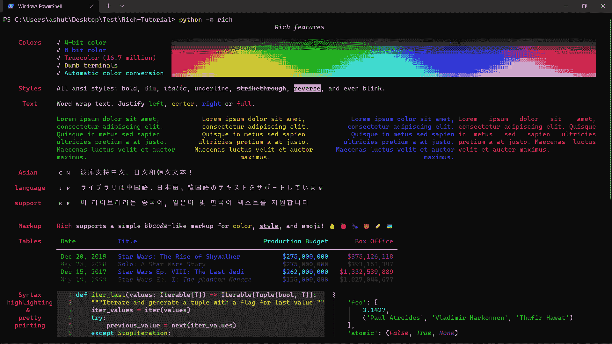

现在你可以看到我们可以用 Rich 做很多事情。让我们试几个看看它们是如何工作的。

## 如何用 Python 丰富打印

Rich 能够根据数据类型突出显示输出。我们将从 Rich 库中导入另一个函数`print`，它与内置函数`print`采用相同的参数。

为了避免与内置的`print`函数混淆，我们将从`rich`库中导入`print`作为`rprint`。

```
from rich import print as rprint

nums_list = [1, 2, 3, 4]
rprint(nums_list)

nums_tuple = (1, 2, 3, 4)
rprint(nums_tuple)

nums_dict = {'nums_list': nums_list, 'nums_tuple': nums_tuple}
rprint(nums_dict)

bool_list = [True, False]
rprint(bool_list) 
```

输出:

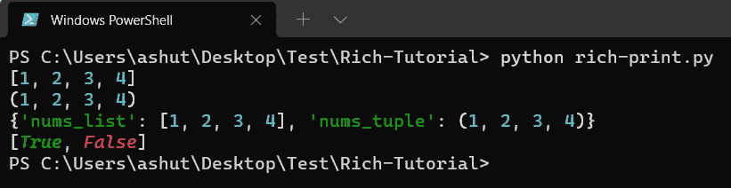

您看到不同的数据类型是如何用不同的颜色突出显示的吗？这在调试的时候可以帮到我们很多。

## 如何在 Python 中丰富 inspect

如果你使用内置的 **`help`** 函数来查看一个库的文档，你会看到一个枯燥的输出。

```
import rich

print(help(rich))
```

输出:

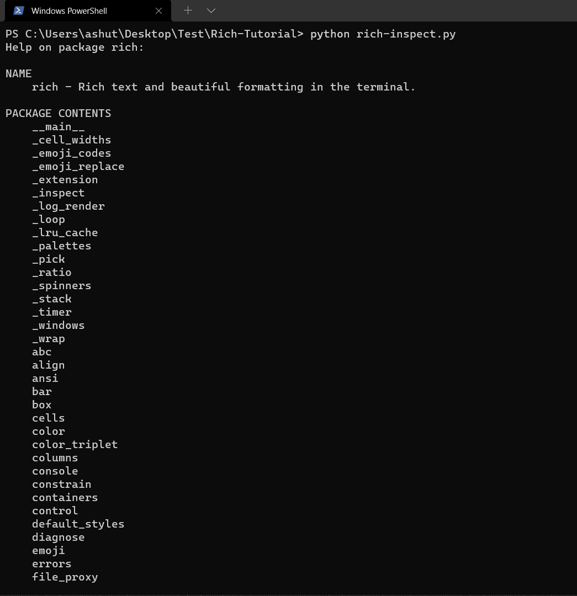

Rich 有一个 [`**inspect()**`](https://rich.readthedocs.io/en/stable/reference/init.html#rich.inspect) 函数，可以生成关于任何 Python 对象的报告。这是一个极好的调试助手，也是 Rich 可以生成的输出的一个很好的例子。

```
from rich import inspect
import rich

inspect(rich) 
```

输出:

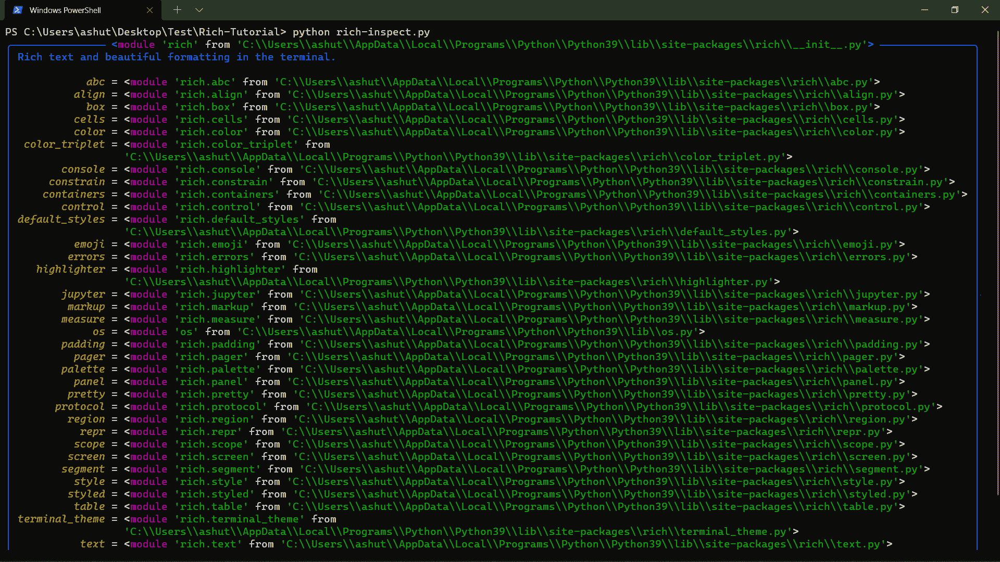

## 如何用 Rich 设计您的主机

为了完全控制终端格式，Rich 提供了一个 [`**Console**`](https://rich.readthedocs.io/en/stable/reference/console.html#rich.console.Console) 类。

让我们写一个函数来[合并 Python 字典](https://ireadblog.com/posts/76/how-to-merge-dictionaries-in-python)。

```
from rich.console import Console

console = Console()

def merge_dict(dict_one, dict_two):
    merged_dict = dict_one | dict_two
    console.log(merged_dict, log_locals=True)

merge_dict({'id': 1}, {'name': 'Ashutosh'}) 
```

输出:

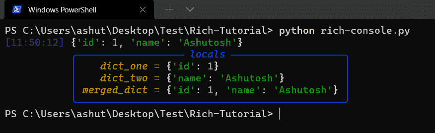

在上面的例子中，我们使用了`**[log](https://rich.readthedocs.io/en/stable/console.html#logging)**` 方法，它提供了与 print 相同的功能，但是增加了一些对调试正在运行的应用程序有用的特性。

还有其他几种方法，如`[print](https://rich.readthedocs.io/en/stable/console.html#printing)`、`[print_json](https://rich.readthedocs.io/en/stable/console.html#printing-json)`、`[out](https://rich.readthedocs.io/en/stable/console.html#low-level-output)`、`[rule](https://rich.readthedocs.io/en/stable/console.html#rules)`等等。点击了解更多关于他们[的信息。](https://rich.readthedocs.io/en/stable/console.html)

## 如何在 Rich 中使用树

Rich 有一个 [`**Tree**`](https://rich.readthedocs.io/en/stable/reference/tree.html#rich.tree.Tree) 类，可以在终端中生成一个树形视图。树形视图是展示文件系统内容或任何其他层次数据的一种很好的方式。树的每个分支可以有一个标签，可以是文本或任何其他丰富的可呈现。

让我们通过创建家谱来看一个例子:

```
from rich.tree import Tree
from rich import print as rprint

tree = Tree("Family Tree")
tree.add("Mom")
tree.add("Dad")
tree.add("Brother").add("Wife")
tree.add("[red]Sister").add("[green]Husband").add("[blue]Son")

rprint(tree) 
```

输出:

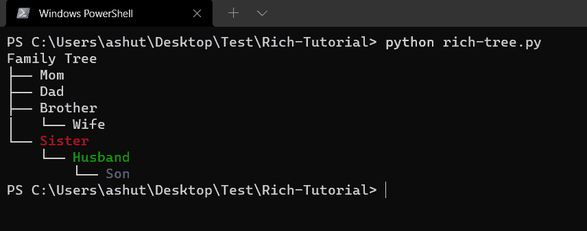

一旦我们创建了`**Tree**`类的实例，我们就可以使用`**add()**`方法向它添加分支。要创建一个复杂的树，你只需使用`**add()**`方法来添加更多的分支。注意上面例子中的*兄弟*和*姐妹*分支。

在官方文档中，我们有一个使用 tree 输出文件结构的 [tree.py](https://github.com/Textualize/rich/blob/master/examples/tree.py) 文件。输出如下所示:

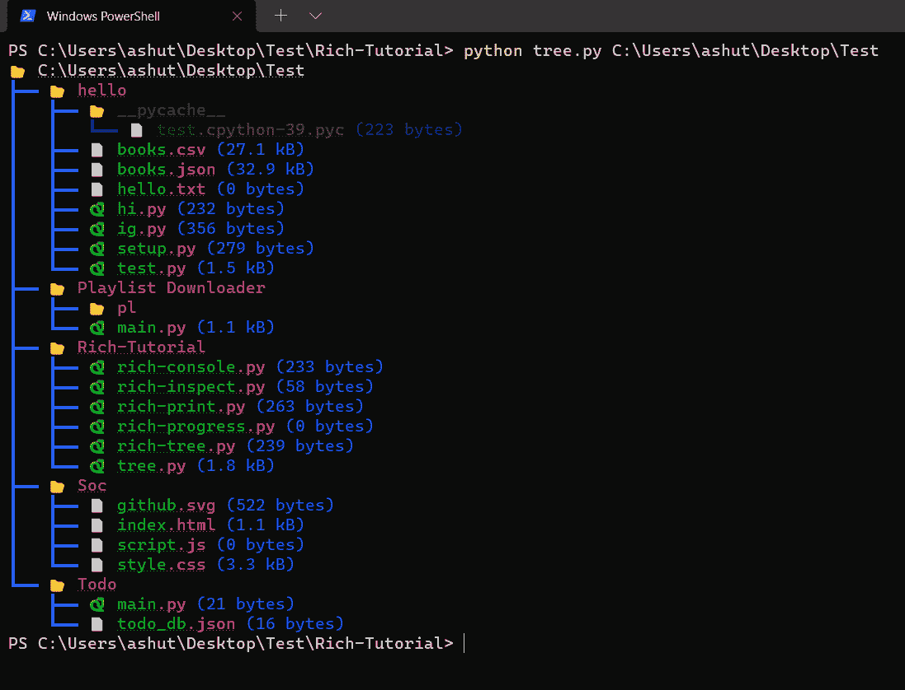

## 如何使用 Rich 显示进度条

Rich 可以显示关于长期运行的任务、文件副本等状态的不断更新的信息。您也可以自定义此信息。默认情况下，它会提供“任务”的描述、进度条、完成百分比和预期剩余时间。

丰富的进度显示支持多个任务，每个任务都有一个条形图和进度统计。您可以使用它来跟踪线程或进程中正在处理的几个作业。

让我们首先尝试使用`progress.track`方法来创建进度条。

```
from rich.progress import track
from time import sleep

def process_data():
    sleep(0.02)

for _ in track(range(100), description='[green]Processing data'):
    process_data() 
```

输出:

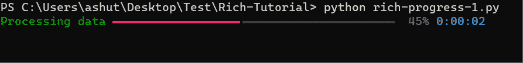

如果我们想记录一个特定任务完成执行的时间，我们可以使用`console.status`来代替。

```
from rich.console import Console
from time import sleep

console = Console()

data = [1, 2, 3, 4, 5]
with console.status("[bold green]Fetching data...") as status:
    while data:
        num = data.pop(0)
        sleep(1)
        console.log(f"[green]Finish fetching data[/green] {num}")

    console.log(f'[bold][red]Done!') 
```

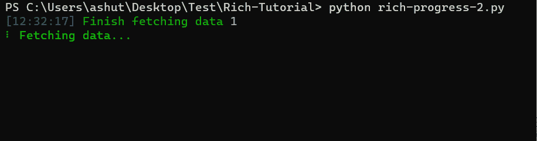

如果需要显示几个任务，或者想要自定义进度显示中的列，可以直接使用 Progress 类。创建进度对象后，使用(`add_task()`)添加任务，使用(`update_progress()`)更新进度。

Progress 类旨在用作上下文管理器，自动启动和停止进度显示。

```
import time

from rich.progress import Progress

with Progress() as progress:

    task1 = progress.add_task("[red]Downloading...", total=100)
    task2 = progress.add_task("[green]Processing...", total=100)
    task3 = progress.add_task("[cyan]Installing...", total=100)

    while not progress.finished:
        progress.update(task1, advance=0.9)
        progress.update(task2, advance=0.6)
        progress.update(task3, advance=0.3)
        time.sleep(0.02) 
```

输出:

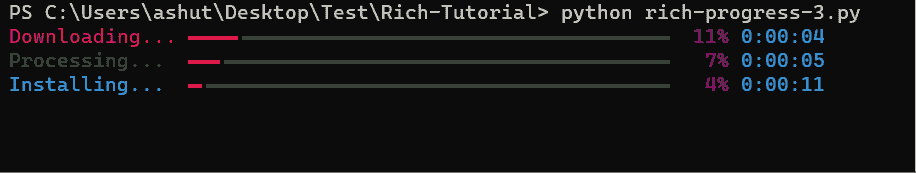

## 如何在 Python 中显示富列

Rich 可以使用 [`**Columns**`](https://rich.readthedocs.io/en/stable/reference/columns.html#rich.columns.Columns) 类在整齐的列中呈现文本或其他丰富的可呈现内容。要使用，用可呈现的 iterable 构造一个 Columns 实例，并将其打印到控制台。

```
import json
from urllib.request import urlopen

from rich.console import Console
from rich.columns import Columns
from rich.panel import Panel

def get_content(user):
    """Extract text from user dict."""
    country = user["location"]["country"]
    name = f"{user['name']['first']} {user['name']['last']}"
    return f"[b]{name}[/b]\n[yellow]{country}"

console = Console()

users = json.loads(urlopen("https://randomuser.me/api/?results=30").read())["results"]
user_renderables = [Panel(get_content(user), expand=True) for user in users]
console.print(Columns(user_renderables)) 
```

输出:

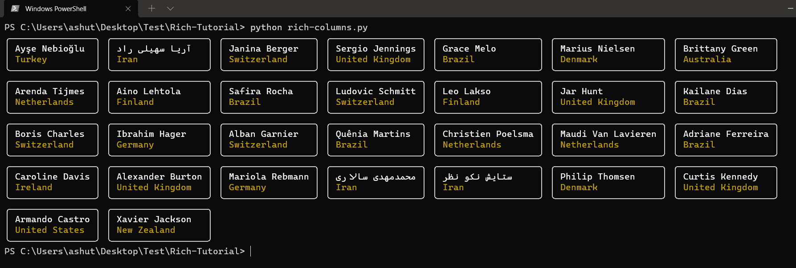

## 如何在 Python 中显示丰富的表格

Rich 的 [`**Table**`](https://rich.readthedocs.io/en/stable/reference/table.html#rich.table.Table) 类提供了多种方式向终端呈现表格数据。这个类有`**add_column()**`和`**add_row()**`方法分别向从`**Table**`类创建的表实例添加列和行。

让我们为待办事项列表创建一个表格。该表将有三列—*序列号*、*任务、*和*状态*。

```
from rich.console import Console
from rich.table import Table

table = Table(title="Todo List")

table.add_column("S. No.", style="cyan", no_wrap=True)
table.add_column("Task", style="magenta")
table.add_column("Status", justify="right", style="green")

table.add_row("1", "Buy Milk", "✅")
table.add_row("2", "Buy Bread", "✅")
table.add_row("3", "Buy Jam", "❌")

console = Console()
console.print(table) 
```

输出:

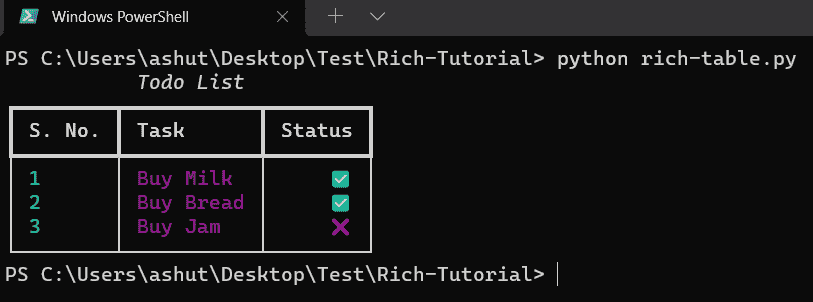

## 包扎

在本教程中，我们学习了如何使用 Rich 来美化终端。Rich 还支持许多其他特性。在[官方文档](https://rich.readthedocs.io/en/stable/introduction.html)中了解更多信息。

随意在这里叉玩这篇文章的源代码[。](https://gitlab.com/ashutoshkrris/rich-tutorial)

感谢阅读！

[Subscribe to my newsletter](https://www.getrevue.co/profile/ashutoshkrris)