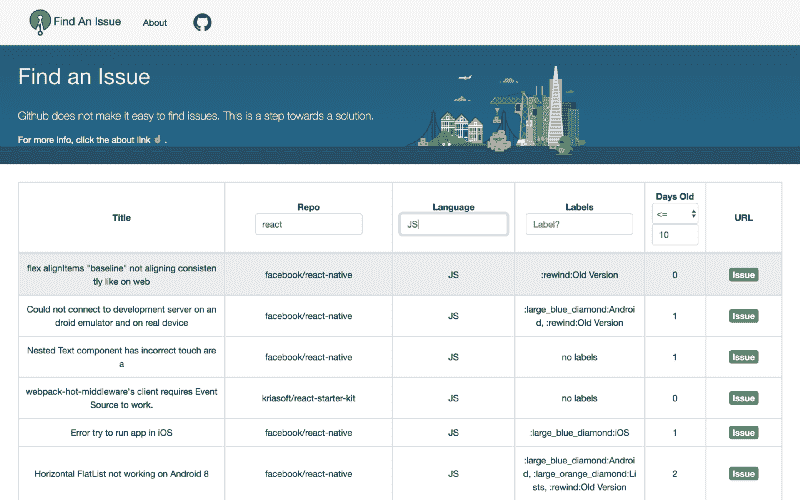
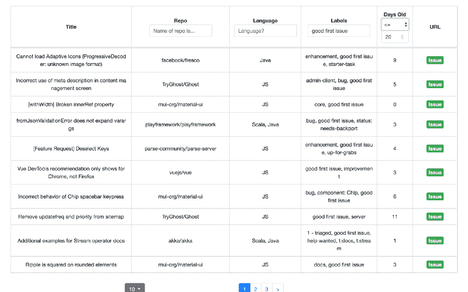
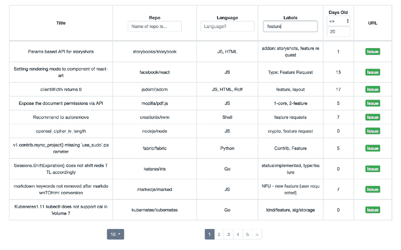

# 使用此网站对开放源代码做出贡献

> 原文：<https://www.freecodecamp.org/news/use-this-site-to-contribute-to-open-source-ec9b2751cb2/>

当我开始转型成为一名软件开发人员时，我知道为开源项目做贡献会极大地帮助我找工作。

因此，我跳到 GitHub 上，寻找我可以承担的问题。我一点也不知道这将是一次痛苦的尝试。

### 意识到

一开始，我认为我可以简单地进入 React 的回购页面(或另一个非常受欢迎的回购页面)并找到一个问题。

但这些回购实际上是被寻找问题的人追逐的。并且点击通过存储库是非常耗时的。

我的第二个想法是使用 [GitHub 的问题搜索](https://github.com/issues)，但是我在这里遇到了几个问题:

1.  您不能根据存储库的星级数量来筛选问题
2.  如果问题被逐字标记为语言，您只能按语言进行筛选。(因此，如果项目主要是一个 JavaScript repo，并且问题没有被标记为 JavaScript，您就没有办法通过语言来搜索它。)

#### 如何看待关注热门项目的问题？

基本上，你必须知道它们，并手动查找它们。

#### 你如何用你最熟悉的语言从一个受欢迎的项目中找到一个问题？

1.  如前所述，通过*以某种方式*了解项目的存在，进入项目的 GitHub 页面
2.  仔细研究这些问题。现在你可以通过标签进行过滤(想想 bug，特性，好的第一个问题)
3.  如果你找不到你能做的事情，你必须重新开始这个过程！

不用说，我花了很长时间才找到我想接手的问题。

快进几个月。我开始做一个网站，让开源贡献更容易。

### 创造的过程

Photo by [Luca Laurence](https://unsplash.com/@luca_tism?utm_source=medium&utm_medium=referral) on [Unsplash](https://unsplash.com?utm_source=medium&utm_medium=referral)

主要的挑战是获得我想要的数据。我知道我必须使用 GitHub API。

正如我之前所说的，当你在 GitHub 上搜索一个问题时，你不能通过星星或语言来搜索。这源于 GitHub 的 Repo API 请求没有提供这个选项。

我最初的想法是，我应该专注于寻找感兴趣的知识库。例如，1000 个最受欢迎的 JavaScript、Python 和各种其他语言。

嗯……你既不能通过语言也不能通过明星数量来搜索回复。

动态获取数据很酷，但是我怎么做呢？以下是为什么 GitHub API 如此困难的简明观点。

#### 接受 GitHub API

首先:每小时对 GitHub API 的请求限制为 5000 个。

这是一次获得一堆存储库的唯一方法:[https://api.github.com/repositories](https://api.github.com/repositories)这将给你大约 35 个存储库，但是*这些行都没有语言或星计数。*

但是，您可以查询从初始 API 请求返回的每个存储库(例如[https://api.github.com/repos/facebook/react](https://api.github.com/repos/facebook/react)和**然后你得到这个数据！**

但是等等…我必须浏览 GitHub 上的每个存储库...大约有**9000 万**个储存库。

#### **一点数学**

90，257，000(回购量和获得回购的请求量)/ 5000(小时费率限制)~= 18，000 小时或 750 天或 2 年左右…？

Photo by [Kai Pilger](https://unsplash.com/@kaip?utm_source=medium&utm_medium=referral) on [Unsplash](https://unsplash.com?utm_source=medium&utm_medium=referral)

#### 勉强做出的决定

所以我不得不手动查找存储库…？。感谢上帝给了我们这个网站:h[ttps://git star-ranking . com/](https://gitstar-ranking.com/)但是，还是要花上几个小时来点击这些存储库…

但是，我到了那里！这里是网站！？

### [FindanIssue.org](https://findanissue.org/)

The amazing website

我尽可能让它简单。通过准确的回购、特定语言(准确且区分大小写)、标签或发行时间进行搜索。所以，你可以找到你要找的东西的根源。

如果你是一个初学者，那么可以通过标签进行搜索，比如 *good first issue* 或者 *docs/ documentation* ，同时指定你选择的编程语言。

Beginner Issue Example

如果你是一个寻找挑战的经验丰富的开发人员，搜索标签如*功能*、*求助*、 *bug* ，或者你选择的其他标签。

More Advanced Issue Search

目前，数据每天刷新两次，因此旧问题将被删除，已标记的问题将被贴上正确的标签。

### 结束语

还有很多工作可以做:

*   最突出的问题是只有大约 900 个项目被展示。所以，有很多令人惊奇的项目没有被给予机会。
*   改进后端和前端的一些附加物真的会有所不同

总而言之，我这样做是因为我相信这是满足开源社区将问题与开发者联系起来的需要的一步。与其去野外寻找问题，该网站的目标是通过一个表格进行简单的几分钟搜索。

我希望你使用它，并发现你自己正在回报开源的世界，作为一个开发者，你每天都依赖它。

Photo by [Riccardo Annandale](https://unsplash.com/@pavement_special?utm_source=medium&utm_medium=referral) on [Unsplash](https://unsplash.com?utm_source=medium&utm_medium=referral)

> 这里是回购:[https://github.com/jMuzsik/find-an-issue](https://github.com/jMuzsik/find-an-issue)
> 这里是站点:[https://findanissue.org](https://findanissue.org/)

谢谢你的阅读！