# 如何使用 web 组件创建渐变过渡

> 原文：<https://www.freecodecamp.org/news/use-web-components-to-create-gradient-transitions-f9aad648824a/>

作者安东尼·吴

# 如何使用 web 组件创建渐变过渡

在本文中，我们将了解 Web 组件。我们将构建一个简单的 Web 组件来过渡它的渐变颜色。

Web 组件是一套不同的技术，允许您创建可重用的自定义元素。使用定制元素与使用`<div` / >没有什么不同。您可以在 HTML 中创建实例。可以用 JavaScript 创建一个实例。您可以将事件侦听器附加到自定义元素。

你是否曾经看过 HTML 规范，认为作者遗漏了一个重要的元素？这就是你的解决方案。自定义元素为开发人员提供了一种构建自己的全功能 DOM 元素的方式。

### 自定义元素和 Web 组件的区别？

许多人交替使用术语定制元素和网络组件。Web 组件是一套不同的技术，包括自定义元素、影子 DOM 和 HTML 导入。定制元素有自己的规格([见此处](https://w3c.github.io/webcomponents/spec/custom/))。

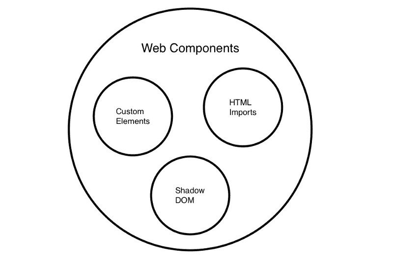

Web Components are a suite of technologies; Custom Elements, Shadow DOM, and HTML Imports.

Web 组件是浏览器的固有特性。使用这个功能不需要外部库。[您可以在这里看到标签为浏览器支持](https://www.webcomponents.org/)的浏览器支持表。

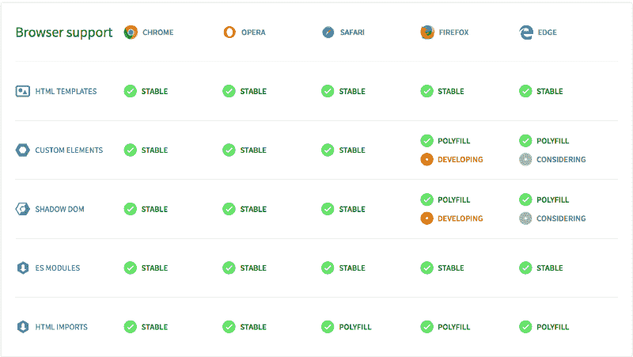

Browser Support for Web Components. [https://www.webcomponents.org/](https://www.webcomponents.org/)

你可以在这里看到对自定义元素的支持。
[你可以在这里看到对模板的支持。](https://caniuse.com/#feat=imports)
[这里可以看到对暗影 DOM 的支持。](https://caniuse.com/#feat=shadowdomv1)

### 这就是反应吗？

React 和 Web 组件解决不同的问题。Web 组件为可重用组件提供了强大的封装。React 提供了一个声明性库，使 DOM 与数据保持同步。React 对本地 HTML 元素和 Web 组件没有区别。它会像处理普通的 HTML 元素一样处理您定制的 Web 组件。

请看这个使用 Web 组件的 React 应用程序的例子。

React 文档还展示了如何在 Web 组件中使用 React。我还没有找到一个可以保证导入 React 的场景。

### 让我们过渡渐变背景

我们将建立一个渐变 Web 组件，如下图所示。

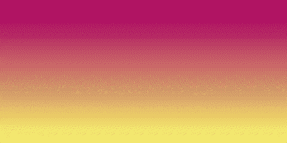

Gradient transitions

注意它是如何在渐变背景之间过渡的。默认情况下，我们不能过渡背景。[见 Codepen 此处](https://codepen.io/newyork-anthonyng/pen/PyJJmr)。

但是我们可以转换不透明度。[见 Codepen 此处](https://codepen.io/newyork-anthonyng/pen/mzBBBg?editors=1100)。

我们可以利用 CSS 伪类来获得想要的效果。[见 Codepen 此处](https://codepen.io/newyork-anthonyng/pen/MPEEPo?editors=1100)。

我们可以利用 CSS“before”伪类来获得想要的效果。[见 Codepen 此处](https://codepen.io/newyork-anthonyng/pen/MPEEPo?editors=1100)。

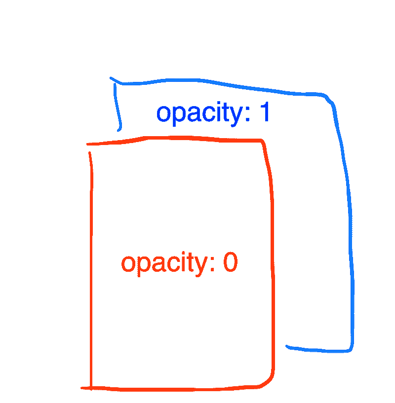

The div element has opacity 1; the pseudo-class before element has opacity 0

有一层(`<div` / >)有渐变颜色。还有第二个 l `ayer (div::`之前)渐变颜色不同。第二层位于第一层之上，T2 度为 0。为了开始渐变过渡，我们将第二层的不透明度从 0 过渡到 1。这给了我们渐变过渡的效果。

作为一名开发人员，这是您必须了解的许多事情。如果有一种简单的、声明性的方式来使用这种渐变不是很好吗？想象一个名为`<my-gradient-background` / >的 HTML 元素。它接受一个渐变颜色的独立属性，比如“红、白、蓝”。当我们改变`e the gr`渐变时，渐变颜色会像我们想要的那样过渡。这就是我们将要创造的。

### 构建 web 组件

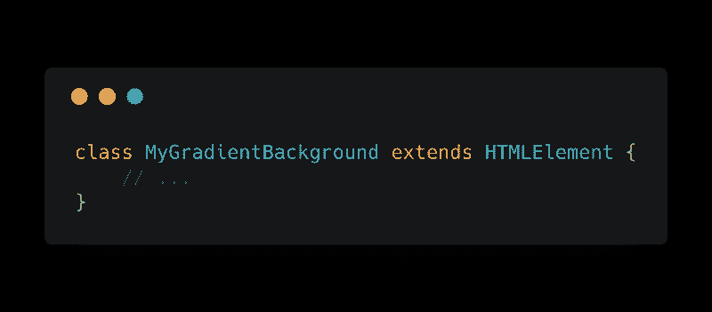

为了创建新的 Web 组件，我们声明了一个扩展 HTMLElement 的新类。

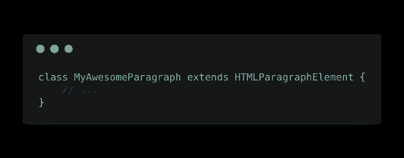

如果您想要扩展现有 HTML 元素的功能，您可以从它们进行扩展。例如，要扩展一个`<p` / >的功能，你可以使用`xtend HTMLParagraphE`元素。

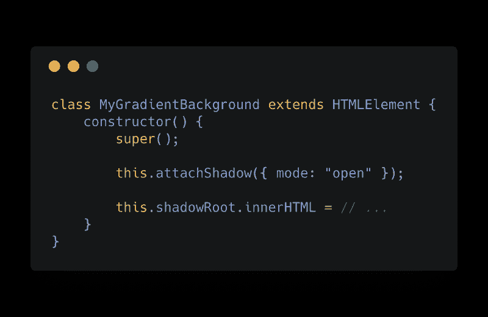

我们将一个影子根附加到 web 组件上。shadow DOM API 允许我们将 DOM 附加到渐变元素上。这个影子 DOM 封装在我们的组件中，并且(通常)对 DOM 的其余部分隐藏起来。[你可以在这里阅读更多关于暗影 DOM 的内容](https://developer.mozilla.org/en-US/docs/Web/Web_Components/Using_shadow_DOM)。

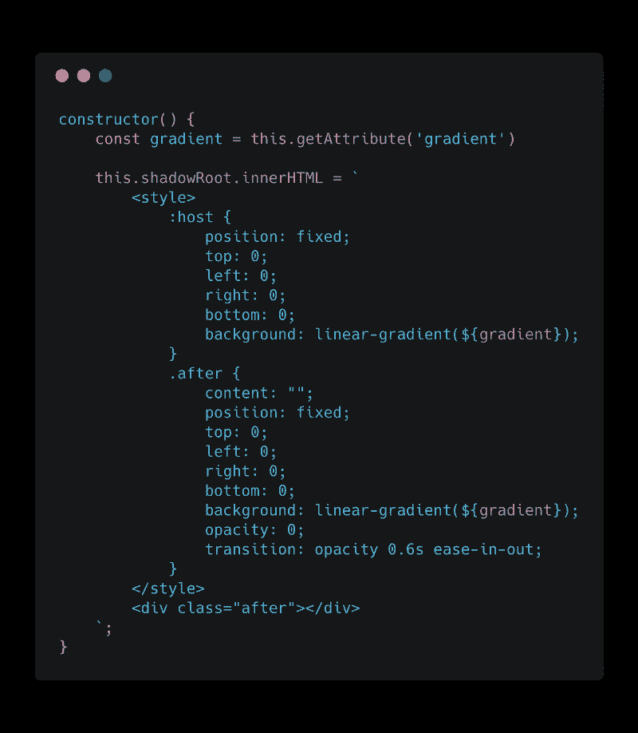

在我们的阴影 DOM 中，我们为渐变元素添加了一些样式。这里我们用一个`
代替伪元素。这是因为我们想用 JavaScript 引用这一层。我们不能用 JavaScript 引用伪元素。

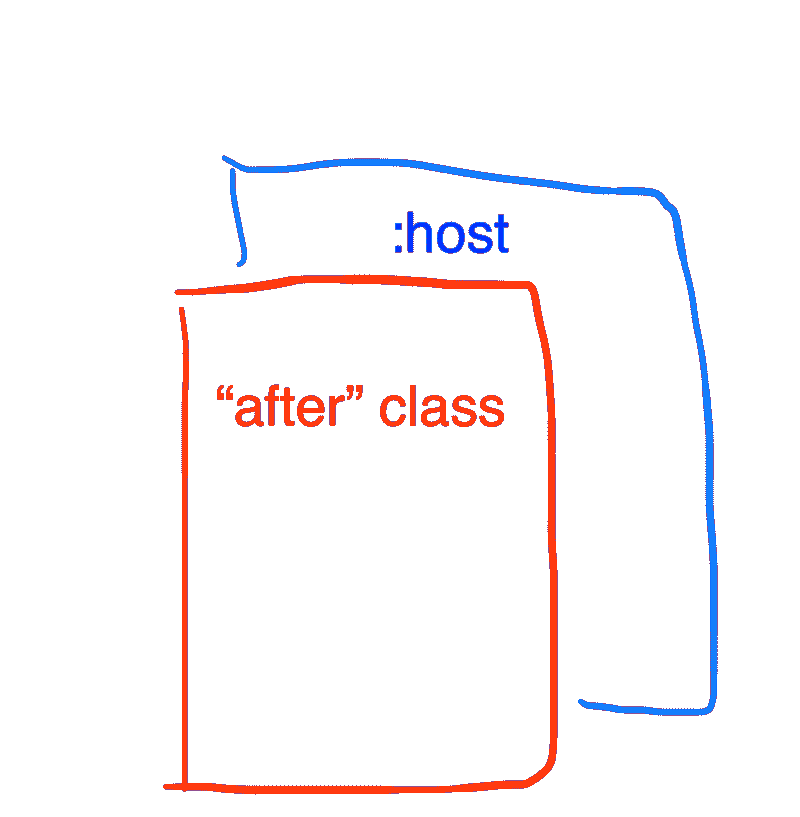

`host`元素是渐变元素本身。我们可以把它设计成一个`<div` / >元素。

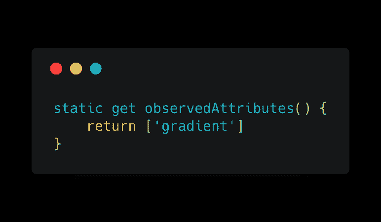

在观察到的属性中，我们返回一个我们想要观察的 HTML 属性列表。当这些被监视的属性改变时，我们的回调函数将被触发。

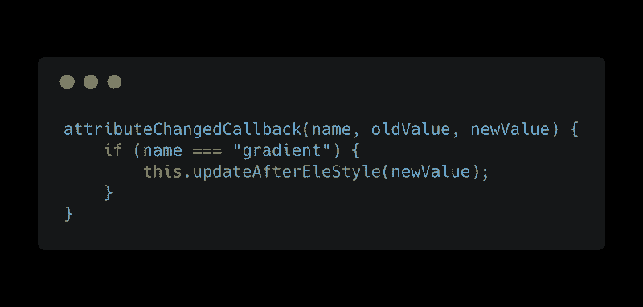

每当观察到的属性发生变化时，我们的`attributeChangedCallback`函数就会触发。我们在回调函数中得到 3 个参数。第一个参数是已更改属性的`name`。第二个参数是属性更改前的值。第三个参数是属性更改后的值。

在回调函数中，我们更新了“after”元素。

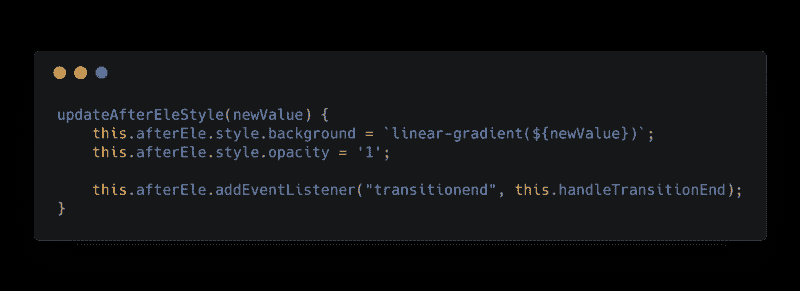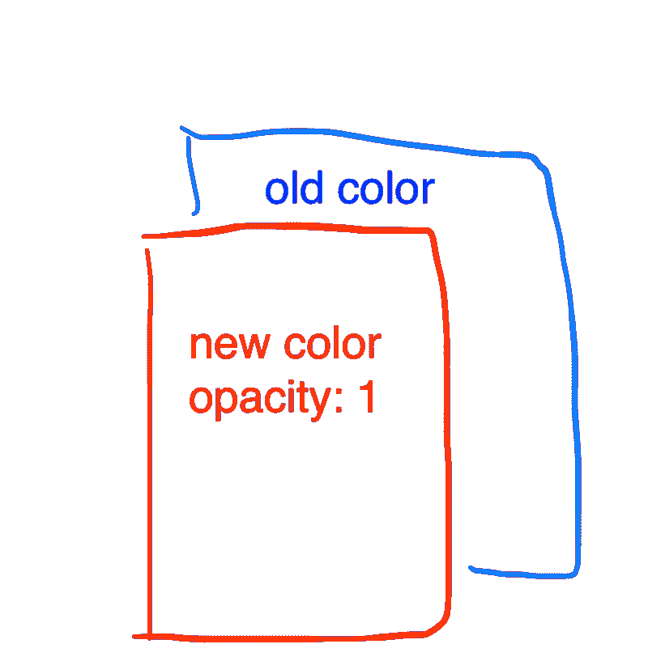

我们用新的渐变颜色更新“after”元素的背景颜色。我们也设置它的不透明度为 1。我们的“之后”元素将开始淡入，创造我们想要的效果。当“after”元素淡入完毕后，我们需要清理一些代码。

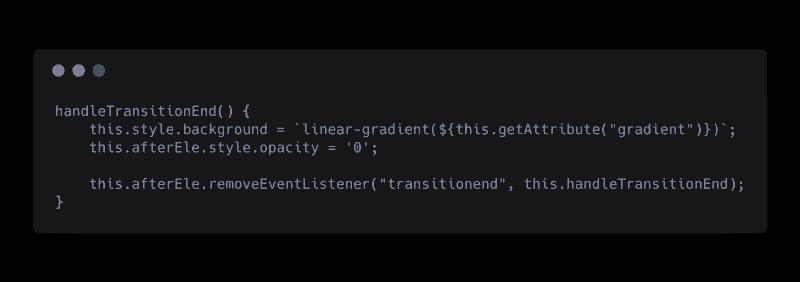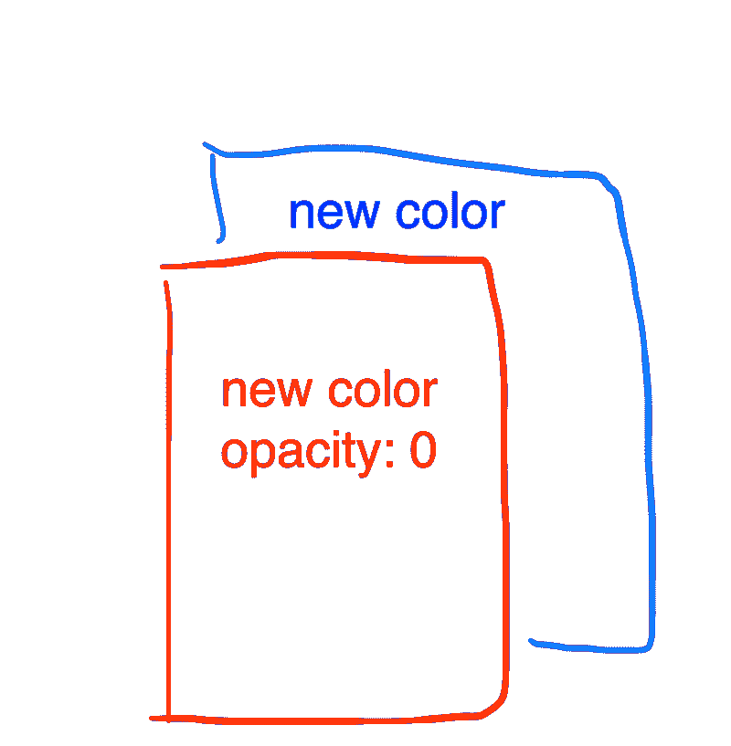

我们的“after”元素完成了创建渐变过渡效果的所有工作。我们将“主机”元素设置为新的渐变颜色。我们隐藏了“after”元素，以便为下一次淡入做准备。这就是我们需要的全部清理工作。

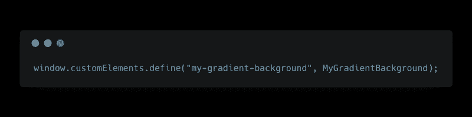

要使用这个新的 Web 组件，我们必须这样定义它。

现在，您将能够像普通的 HTML 元素一样使用`<my-gradient-background` / >。

你可以在这里查看完整的代码[。放心用`npm install — save my-gradient-background`下载吧。](https://github.com/newyork-anthonyng/my-gradient-background/blob/master/index.js)

### 参考

*   [https://developers . Google . com/web/fundamentals/we B- components/customelements](https://developers.google.com/web/fundamentals/web-components/customelements)
*   [https://www.webcomponents.org/introduction](https://www.webcomponents.org/introduction)
*   [https://developer.mozilla.org/en-US/docs/Web/Web_Components](https://developer.mozilla.org/en-US/docs/Web/Web_Components)
*   [https://reactjs.org/docs/web-components.html](https://reactjs.org/docs/web-components.html)
*   [https://html . spec . whatwg . org/multipage/custom-elements . html # custom-elements](https://html.spec.whatwg.org/multipage/custom-elements.html#custom-elements)
*   [https://W3C . github . io/web components/spec/custom/# custom-elements](https://w3c.github.io/webcomponents/spec/custom/#custom-elements)