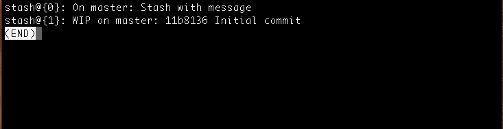
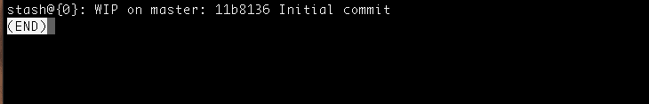
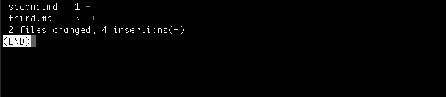

# 你可能不知道的关于 Git stash 的有用技巧

> 原文：<https://www.freecodecamp.org/news/useful-tricks-you-might-not-know-about-git-stash-e8a9490f0a1a/>

> 我已经发布了一份简讯 [Git Better](https://gitbetter.substack.com/) ，帮助学习 Git 的新技巧和高级主题。如果你有兴趣在 Git 中让你的游戏更好，你绝对应该去看看。

如果你使用 Git 已经有一段时间了，你可能会使用 Git stash。这是 Git 中有用的特性之一。

以下是我上周学到的一些关于 Git stash 的有用技巧。

1.  Git 存储保存
2.  Git stash list
3.  Git 存储应用
4.  Git 贮藏汽水
5.  Git stash 秀
6.  Git stash 分支<name></name>
7.  Git 隐藏清除
8.  Git stash drop

#### **Git 今晚拯救**

这个命令就像 Git stash。但是这个命令带有各种选项。我将在这篇文章中讨论一些重要的选项。

**Git stash with message**

```
git stash save “Your stash message”.
```

上面的命令隐藏了一条消息。我们稍后会看到这是如何有帮助的。

**隐藏未被追踪的文件**

你也可以隐藏未被追踪的文件。

```
git stash save -u

or

git stash save --include-untracked
```

#### **Git 藏匿清单**

在讨论这个命令之前，让我告诉你一些关于 stash 的工作原理。

当您使用 Git stash 或 Git stash save 时，Git 实际上会创建一个具有某个名称的 Git commit 对象，然后将其保存在您的 repo 中。

这意味着你可以随时查看你的收藏清单。

```
git stash list
```

请参见下面的示例:



git stash list example

你可以看到藏东西的清单。最近藏的东西在最上面。

您可以看到 top stash 被赋予了一条定制消息(使用 Git stash save“message”)。

#### **Git stash 申请**

该命令获取堆栈中最顶层的存储，并将其应用于 repo。在我们的例子中，它是 **stash@{0}**

如果您想应用一些其他存储，您可以指定存储 id。

下面是一个例子:

```
git stash apply stash@{1}
```

#### **Git stash pop**

这个命令非常类似于 stash apply，但是它在应用之后从堆栈中删除 stash。

下面是一个例子:



Git stash pop example

如您所见，顶部存储被删除，**存储@{0}** 被更新为较旧的存储。

同样，如果您希望弹出一个特定的 stash，您可以指定 stash id。

```
git stash pop stash@{1}
```

#### **Git stash show**

这个命令显示了存储差异的摘要。上面的命令只考虑最新的存储。

下面是一个例子:



Git stash show example

如果您想查看完整的差异，您可以使用

```
git stash show -p
```

与其他命令类似，您也可以指定 stash id 来获取 diff 摘要。

```
git stash show stash@{1}
```

#### **饭桶藏匿处<那**我>

这个命令用最新的 stash 创建一个新的分支，然后删除最新的 stash(像 stash pop 一样)。

如果你需要一个特定的存储，你可以指定存储 id。

```
git stash branch <name> stash@{1}
```

当您将存储应用到最新版本的分支后遇到冲突时，这将非常有用。

#### **Git stash clear**

该命令删除 repo 中的所有存储。可能无法恢复。

#### **Git stash drop**

这个命令从堆栈中删除最新的存储。但是小心使用它，它可能很难恢复。

您还可以指定存储 id。

```
git stash drop stash@{1}
```

希望你有一些有用的技巧。

> 如果您已经走到这一步，那么我认为您对 Git 非常感兴趣。查看我的时事通讯 [Git Better](https://gitbetter.substack.com/) 以了解 Git 的新技巧和高级主题。:)

如果你喜欢这篇文章，试着给点掌声并分享它:)