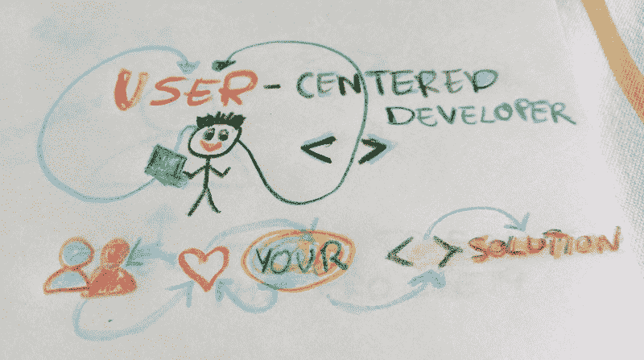
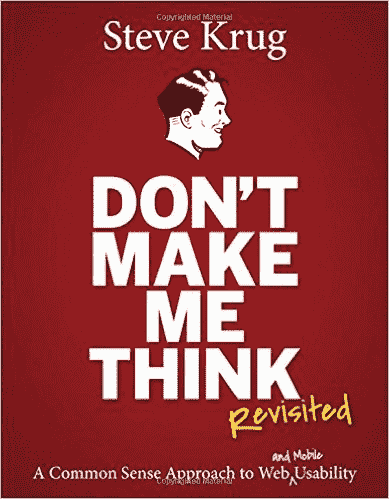
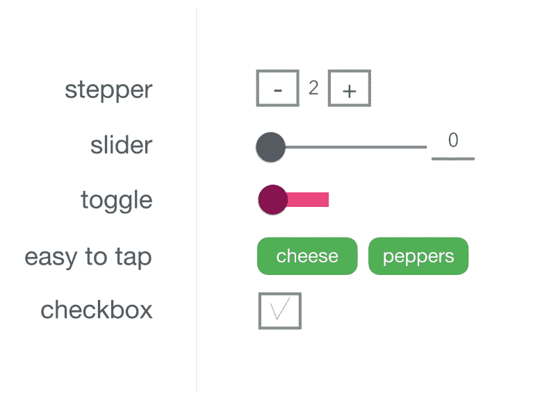

# 在 5 分钟内为新手前端开发人员解释用户体验

> 原文：<https://www.freecodecamp.org/news/user-experience-explained-in-5-minutes-for-newbie-front-end-developers-1293c1521407/>

埃娃·米切卡什卡

# 在 5 分钟内为新手前端开发人员解释用户体验

现在需要以用户为中心的前端开发人员。

用户体验(UX)是商业语言。

正如[用户测试](https://www.usertesting.com/)在其 2015 年度[报告中得出的结论:](http://info.usertesting.com/ux-industry-survey-2015.html)

> 在未来几年，公司将在基于客户的持续反馈创造产品和体验方面投入更多，客户体验将成为组织中所有团队的共同责任。

脱颖而出的项目需要**适合用户的“恰到好处”的度量**。在许多项目中，UX 设计师的角色掌握在前端开发人员手中。心理学和可用性是对 javascript 的补充。当然，你可以停留在代码层面，但是如果你超越了这种人为的职称界限，那会更有趣，也更有益。对你的客户和他们的用户来说**代码是工具，而不是目标本身。**

你将要工作的团队可能缺少一名 UX 设计师、研究人员或一名图形设计师。没有人说你必须成为一名视觉或交互设计师，希望你能与伟大的设计师和研究人员合作。然而，如果你想让你参与的项目成功，那么你最好至少对 UX 的一些基础知识感兴趣。完美的项目和团队并不是在每个角落都相遇。

好的体验等于快乐的用户。快乐的用户会带来留存。这为更高的收入创造了更大的机会。这就带来了收入。这让每个人都很高兴****你的代码真的被数百万人使用。**然后你开始对你编写的东西越来越自豪，因为**它解决了用户的实际问题**。当然，代码级别非常重要，如果产品有问题，没人会想用它。然而代码可以通过你运行的每一个测试，但是如果用户不喜欢结果，它在商业上就站不住脚了。**

**让我向您介绍一些用户体验的基础知识，以增加成功实现的机会。以下是开始的 5 条简短规则。**

#### **1.产品是给用户的**

**如果它不能解决他们的问题，产品所有者迟早会停止对它的投资。了解目标群体中的人。至少了解一下基本情况。**

**整个团队都应该知道要为谁建造什么。**

**经常问，经常测试，迭代。他们想解决什么问题？他们的目标是什么？他们在担心什么？是十几岁的女孩，还是上了年纪的男人([小心概括](https://medium.com/@indiyoung/describing-personas-af992e3fc527#.qnnkyf1hp))？是后端开发者还是美发师？他们什么时候会来看产品，他们首先需要找到什么？你如何能让他们更容易？他们接下来应该去哪里？**

**为了帮助他们解决问题，你真正需要从他们那里获得的最少信息是什么？让你的用户有家的感觉。利用惯例和最佳实践。**

**一点领域知识没有坏处，这是作为开发人员的额外收获。每个项目都教你一个新的世界，是不是很棒？好好利用它，观察周围的世界。这可能对你创造用户喜欢的产品有很大帮助。**

#### **2.不要让我思考是第一条可用性规则**

**

You should [read it](http://www.amazon.com/gp/product/0321965515/ref=pd_lpo_sbs_dp_ss_1?pf_rd_p=1944687622&pf_rd_s=lpo-top-stripe-1&pf_rd_t=201&pf_rd_i=0321344758&pf_rd_m=ATVPDKIKX0DER&pf_rd_r=0NKBX55V2MNMHSHD8CJA) if you want to develop your usability skills.** 

**克鲁格的书是可用性的浓缩**圣经。伟大的产品是清晰的，利用惯例，提供及时和合适的界面。前端不仅仅是用户行为背后的 javascript。保持一致，视觉层次，消除视觉噪音，编写人工警告和输入标签对产品的可用性很重要。****

**用户通过浏览网页来寻找信息，这样看起来更容易。使用合适的标题、字体大小、可承受的按钮、有意义的标签等。**

**如果你对文案有任何影响，请记住快乐的废话连篇是令人讨厌的。如果你写提醒，使用用户说的语言。提供信息和帮助。**

**确保导航对用户来说是清晰的，而不是超载的，合乎逻辑的。如果站点非常复杂，你也可以使用面包屑作为指示器来显示用户在哪里。**

**如果面包屑位于页面顶部，且>符号位于各层之间，最后一个元素为粗体，则效果最佳。如果菜单对用户来说是可见的，那么交互比隐藏在汉堡吧后面时要大得多。**

**注意不要夸大菜单中的项目和级别。您的用户不必一下子看到所有内容。当用户处于正确的水平并且真正需要它时，你可以介绍下一个项目。**

#### **3.移动版不是桌面版，而是缩小了尺寸**

**想象一下，你实现了一个移动版本的应用程序，你可以决定布局。你没有现成的设计，你被要求用引导组件来构建它。先启动**移动**。它让你首先关注最重要的元素和交互。**

**你可以先建立原型，线框或者至少是草图。最容易做的就是纸笔。你可以用[草图](https://www.sketchapp.com/)、[体验设计](http://www.adobe.com/products/experience-design.html)来帮助自己，或者简单地谷歌一下任何其他线框或原型工具。如果你不是一个视觉设计师，但仍然需要做原型工作，那么去使用原型工具，比如 [Proto.io](https://proto.io/) ，在那里你已经准备好使用 UI 库元素了。**

**移动意味着**对于快速点击、滑动或滴答**来说是舒适的。因此，如果你想创建一个表单，使用步进器、滑块、单选按钮组或切换器，而不是老式的桌面文本输入。**

****

**移动首先是触摸。移动意味着水平和垂直。移动通常用一只拇指大小的手。这也意味着最方便的触摸区域是在屏幕的底部。**

**移动设备受益于内置的各种设备功能，例如画廊访问、摄像头、移动传感器、麦克风或 GPS。好好利用它。**

**谈到莫比尔和 UX，让我暂时把你留给卢克·乌鲁布莱夫斯基。你可以从他身上学到很多东西。**

#### **4.你的代码设定了规则，所以要确保它们是正确的**

**不要在用户第一次访问时询问他们的鞋码，除非你是鞋店。即使你创建了一个鞋店，你也可以提供关于可用号码范围的信息，让用户先玩颜色、图案或场合。**

**许多应用程序以**一面注册墙**开始，这使得下线成为最明显的指标。看看[我写的关于人体形态设计的文章](https://medium.com/frontend-malaga/human-form-design-f285728d3d97#.1muud6qe3)。**

**无论你是为客户实施解决方案还是开发自己的产品，都要考虑建立关系的好处。给你的用户一个试用产品的机会，然后你给他们一个信用卡输入，让他们在注册免费试用时填写。不要筑墙。你希望你的用户使用你编写的代码，对吗？让他们试试。**

**[**渐进啮合**](http://www.lukew.com/ff/entry.asp?1130)**[优雅退化](https://www.w3.org/wiki/Graceful_degradation_versus_progressive_enhancement)** 都是你的表盘。**

**确保您的图像得到优化。将代码推向生产时，使用代码的精简版本。运行[谷歌页面测试](https://developers.google.com/speed/pagespeed/insights/)到**优化**。低速网络连接测试。照顾那些在乎每一口转让的人。让您的产品在宽带和 GPRS 上都可用。**

#### **5.充满多层次动画的像素完美时代已经死亡**

**卓越的产品体验基于可用性和益处。**不是像素射击游戏。**像素完美主义远离了桌面显示器。**

**你能玩复杂的 CSS 真是太棒了…**

**...但是不要为了展示你的技能而引入额外的动画噪音。**

**如果你想炫耀，就在 CodePen 上练习，并把它放在你的文件夹里。有意义的动画才是完美的。**

**UX 远不止于此。这只是对那些刚接触这门学科的人的介绍。如果你喜欢它，**点击中号心形图标并推荐给其他人**。如果你想从我这里听到更多关于可用性、用户交互设计、用户研究、原型等方面的信息。，请在评论中告诉我。**

**以用户为中心的编码快乐！**

**我是一名网络学习者。我是一名自由代码营员。我在[媒体](https://medium.com/@thedoer)发表文章，在[推特上发布关于 UX 和创业公司的消息。我喜欢有用的解决方案和伟大的合作。](https://twitter.com/thedoerdoes)**