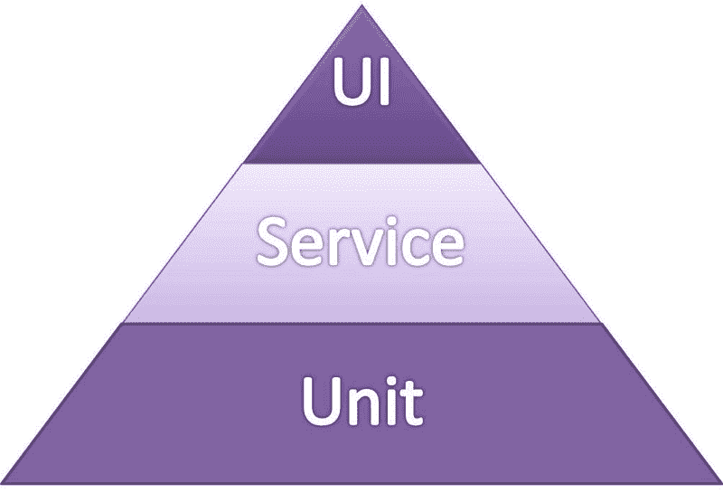

# 用户界面测试自动化

> 原文：<https://www.freecodecamp.org/news/user-interface-test-automation-3da36b132077/>

作者 Aditya Parab

# 用户界面测试自动化

测试自动化已经成为软件开发领域的一个重要方面。这个社区中的每个人都必须知道下面的敏捷测试自动化金字塔。这是我的迈克科恩开发的概念。

单元测试应该构成这个金字塔的基础。服务水平测试构成了下一层，最终用户界面(UI)测试构成了顶点。

Agile Test Automation Pyramid

传统的自动化测试意味着在 UI 级别测试端到端的执行流程。但随着上述概念和敏捷的实施，这种情况发生了变化。单元和服务水平测试构成了自动化策略的主要部分。UI 测试只是一小部分。

有充分的理由将更少的 UI 自动化测试作为自动化策略的一部分。下面我列举了几个:

*   这些测试**慢**。
*   这些测试很脆弱，可能会出现假阳性或假阴性。
*   基于 UI 因此需要大量的**改变**和**维护**。

话虽如此，UI 测试自动化仍然很重要，因为它测试的是用户将要浏览的部分。关于这一点的反馈肯定有助于改善用户在使用应用程序时的体验。

下面是一些 UI 测试自动化很有价值的例子:

*   回归测试。自动化可以将人类测试人员从回归测试的枯燥和重复的过程中解放出来。
*   没有开发单元测试的测试应用程序。这有助于在遗留应用程序中引入自动化测试。
*   跨浏览器和跨平台测试。这主要是在不同的版本上执行相同的测试。测试不同操作系统版本和设备型号的移动应用程序也是如此。
*   性能测试，因为它需要比手工测试更高的负载。

通过适当的策略，UI 测试自动化可以成为测试自动化套件中非常有用的一部分。开发有效测试策略的一些要点

### 确定要自动化的正确案例

任何测试最重要的方面是识别正确的测试用例。自动化测试也是如此。

以下是选择自动化测试用例的一些标准:

1.  经常作为冒烟和回归的一部分执行的测试用例
2.  实现复杂逻辑和计算的测试用例
3.  需要跨多个平台执行的测试用例
4.  手动执行可能有困难的测试案例，例如性能

### 从头开始准备

自动化任何功能的准备始于设计阶段。让测试工程师和开发人员一起参与这个阶段。创建自动化测试的策略。决定在单元和服务级别中覆盖哪些测试，以便在 UI 测试中没有重复。

如果应用程序是从零开始构建的，那么设计代码时要使其在应用程序稳定后易于自动化。可以是小事。例如，遵循 UI 元素的特定命名约定。以及相似地命名不同页面上的相似元素。这也有助于保持自动化脚本的一致性。

在现有应用程序发生变化的情况下，与开发一起开始自动化。由于所做的更改是递增的，所以一旦有了，就要执行测试。这有利于敏捷和持续的交付。其中，小增量需要为连续实施做好准备。

### 连续和并行执行

经常安排自动化测试的执行。每天至少一次。这提供了关于所做更改的连续反馈。它也给出了一个测试环境稳定性的好主意。

由于这些测试是在 UI 上执行的，所以执行速度较慢。但是随着不断的测试，我们想要更快的反馈。并行执行是解决这一问题的方法之一。同样，通过并行执行，可以实现跨平台的测试。

### 重构和维护

UI 自动化测试脚本应该被视为与应用程序代码相同。这提供了所需的焦点和注意力。与应用程序代码一样，这些脚本也需要不断的重构和维护。

通过适当的维护，测试执行变得一致。此外，它将有助于提高测试执行的性能，并使未来的更改更加容易。

有了适当的设计和执行策略，UI 测试自动化可以被证明是提高质量和加速连续交付的有用的一步。