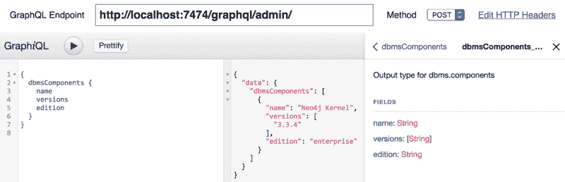
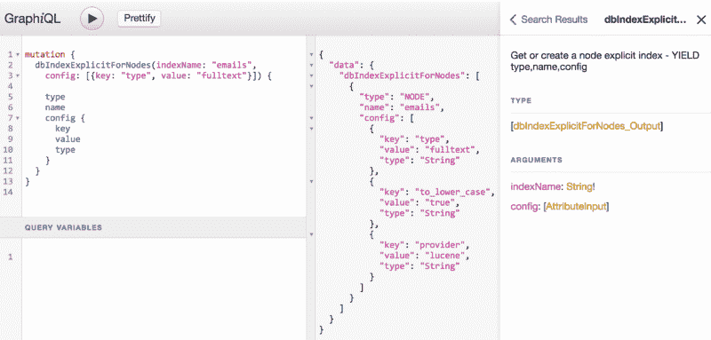
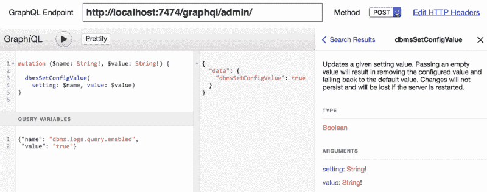
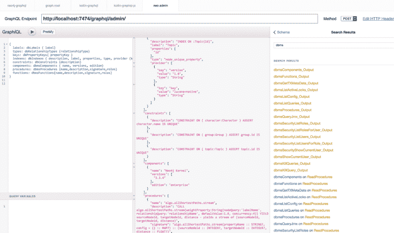
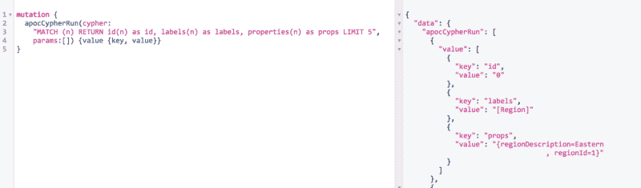
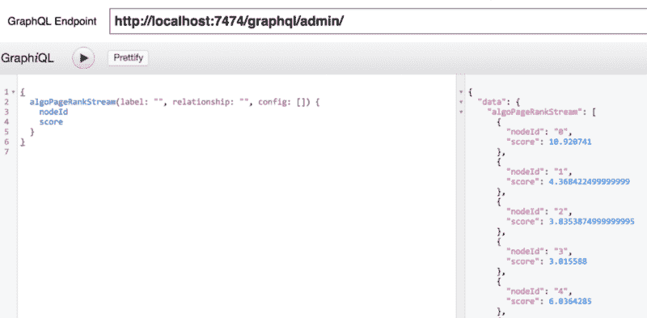

# 如何使用 GraphQL API 进行数据库管理

> 原文：<https://www.freecodecamp.org/news/using-a-graphql-api-for-database-administration-1a5039b43c8f/>

迈克尔·亨格

# 如何使用 GraphQL API 进行数据库管理


最近在 graphql-europe 上的一次讨论让我意识到，graphql 将成为一个令人惊叹的数据库管理 API。

您知道有太多的功能和选项来控制安全性、索引、元数据、集群和其他操作的细节吗？

我在回家的火车上为 Neo4j 构建了一个 GraphQL 管理端点，将所有可用的过程公开为查询或变异。幸运的是，使用 Kotlin，这只是几行(200)代码的问题。而且效果出奇的好。

如果你知道任何其他通过 GraphQL 公开其 admin-API 的数据库，请在评论中告诉我——我很想看看。

如果你受到启发，基于这个想法创作了一些作品，我会很荣幸，尤其是在署名方面:)

### TL；速度三角形定位法(dead reckoning)

通过安装最新版本的`[neo4j-graphql](http://github.com/neo4j-graphql/neo4j-graphql)`扩展，你可以在`/graphql/admin`获得你的 Neo4j 管理 API。在 [Neo4j 桌面](https://neo4j.com/developer/guide-neo4j-desktop/)中，只需点击数据库`version 3.4.0.1`插件部分的“安装 GraphQL”。您可能需要为数据库用户的凭证配置一个*基本认证头*。然后，您就可以通过 GraphQL 或 GraphQL Playground 查询新的、闪亮的管理 API 了。



An administrative query against the database API

端点**不限于内置程序。**像 APOC、图形算法或 neo4j-spatial 这样的外部库是自动公开的。

### 利益

在我看来，最大的好处是 GraphQL APIs 基于所提供的严格模式的**自文档化特性**。

输入和输出类型的强键入、文档和缺省增加了**清晰度**并减少了试错的次数。输出字段的定制选择和可选的结果结构的更深遍历允许快速定制您想要检索的内容。

有了对读取查询和写入突变的清晰划分，就很容易推断出调用的影响。

当然，**惊人的自动完成和内联帮助**以及 GraphQL 和 GraphQL-Playground 中自动可用的文档使与这样的 API 交互成为一种乐趣。？

**参数化**所有输入和限制结果大小只是锦上添花？。

另一个优点是，您可以将多个查询组合成一个调用。在单个请求中检索全屏的所有相关信息。

当然，您可以使用所有可用的 GraphQL 工具，比如中间件或库来快速构建前端应用程序(apollo-tools、reaction、语义 ui、victory 等)。).这使您可以将这些 API 快速集成到监控/管理脚本或控制面板中。

### 实施细节

与`[neo4j-graphql](https://github.com/neo4j-graphql/neo4j-graphql)`中的常规 GraphQL 端点一样，这是一个服务于 GET、POST 和 OPTIONS 端点的服务器扩展。它们接受*查询*、*变量*和*操作名称*以在单个事务中执行。执行后，*结果*或*错误*作为 JSON 返回给客户端。

必要的 graphql-schema 是从部署在 Neo4j 中的可用用户定义过程构建的。

您必须显式地允许通过配置设置`graphql.admin.procedures.(read/write)`使用 Neo4j 过程语法或管理端点字段名称来公开过程。例如，您可以将其设置为:

```
graphql.admin.procedures.read=db.*,dbms.components,dbms.queryJ*graphql.admin.procedures.write=db.create*,dbIndexExplicitFor*
```

#### **用户定义的程序**

2016 年，Neo4j 3.0 获得了一个整洁的新扩展点。您可以将带注释的 Java 方法作为用户定义的过程来提供，这些过程既可以独立调用，也可以作为数据库查询的一部分来调用。随着我们的(基于 React 的)Neo4j 浏览器从 HTTP 迁移到二进制传输，原来的管理 REST-API 增加了提供相同功能的过程。

每个过程可以接受*参数*并返回一个*数据流*，其中包含单独命名的列，类似于常规查询结果。输入和输出都可以使用来自[密码类型系统](https://neo4j.com/docs/developer-manual/current/drivers/cypher-values/#driver-neo4j-type-system)的数据类型。

```
call dbms.listConfig('dbms.connector.http')   yield name, value, description;
```

```
╒══════════════════════════════╤═══════╤════════════════════════╕│"name"                        │"value"│"description"           │╞══════════════════════════════╪═══════╪════════════════════════╡│"dbms.connector.http.enabled" │"true" │"Enable this connector."│├──────────────────────────────┼───────┼────────────────────────┤│"dbms.connector.https.enabled"│"true" │"Enable this connector."│└──────────────────────────────┴───────┴────────────────────────┘
```

从那以后，大量的功能被转移到过程和函数中，给我们提供了通过 GraphQL 公开的广泛选择。

为了构建模式，我遍历了可用的过程，为每个过程创建了一个*字段*。

我将命名的过程参数作为*输入参数*，并使用*自定义输出类型*(根据过程)保存返回的列。带有默认值的输入参数可以是*可空*，其他的被定义为非空。程序描述变成了*字段描述*，并且*弃用*信息也被转移。

我将基本的标量类型和列表直接映射到 GraphQL 类型。

只有对于`Map`(字典/对象)类型，我必须映射到每个属性所在的`List<Attribu` te >

```
type Attribute {   name: String!   value: String   type: String!  = "String"}
```

这对于输入和输出都非常有效。



Using the Attribute list for maps/dictionaries, both as input and output

类似地，我为`Node`、`Relationship`和`Path`创建了自定义类型。

对于这四种定制类型，我添加了适当的(反)序列化代码。所有其他未知类型都被呈现为字符串。

每个字段的*解析器*只是*用来自环境的输入参数执行包装的过程*。然后，结果被映射到输出类型字段(可选地被转换)并返回到端点。

基于它们的元数据，我将字段分别组合成查询和突变的对象类型。



Executing a mutating admin operations with variables

基本上就是这样。

当我在部署了扩展之后启动 GraphiQL 时，我自己也很惊讶，我能够直观地调用任何查询和变化而不会出现停顿。

### 挑战

我最大的挑战是 GraphQL 中缺乏名称空间。虽然您可以用嵌套类型很好地子结构查询，但这对于突变是不可用的。

为了保持两者的 API 命名一致，我决定**不分解**查询和类似的变化，而是将名称空间和过程名称的大写部分连接在一起。

于是`db.labels`变成了`dbLabels`。

另一个小挑战是在 Neo4j 过程的`DBMS`和`SCHEMA`范围中缺少关于读和写操作的信息。所以我不得不使用一个*白名单*来确定“只读”的，这当然是不够的。

### 著名的

其他 API 技术没有内置的东西，也是非常酷的东西，那就是选择和挑选任意数量的查询或您想要在一个**单个请求**中运行的变化的能力。

如果需要，您甚至可以用不同的参数为同一个查询的多次调用起别名(想想每个数据库的统计数据)。



Run multiple API operations in a single request.

你甚至可以运行图形算法或者密码语句作为这个 API 的一部分，这很酷。



Run a “Cypher” query.



Run a “graph-algorithm” procedure

### 后续步骤

目前，我只直接向用户公开过程参数和结果。今后，最好能派生出提供自己的(动态)查询字段的更高级类型，比如

*   也可以返回计数的标签类型
*   可以提供其群集角色或其他本地信息的服务器类型
*   为自定义遍历添加更多带有节点或关系类型参数的动态字段

我会喜欢？一堆监控和管理移动应用、网络应用和命令行客户端将建立在 T2 的管理应用程序接口之上。

我很高兴看到我们可以改进可用性的地方，以及我们得到的反馈和请求。当然，第一个目标将是为 [Neo4j 桌面](https://neo4j.com/developer/guide-neo4j-desktop/)开发的[图形应用](http://neo4j-apps.github.io)。因此，如果你对这些感兴趣，**请联系我们，让我们聊聊**。

黑客快乐！迈克尔

如果您遇到任何问题，请添加评论或提出 [GitHub 问题](https://github.com/neo4j-graphql/neo4j-graphql/issues)。