# 使用古代数学来丰富你的设计技巧

> 原文：<https://www.freecodecamp.org/news/using-ancient-mathematics-to-enrich-your-design-skills-ac360a83d297/>

作者:维沙尔·库马尔

# 古代数学如何丰富你的设计技巧

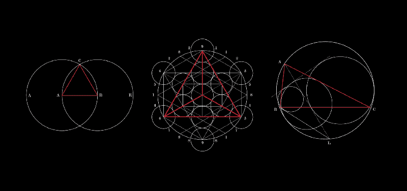

从 2017 年 3 月开始，我一直在通过数学来丰富我对设计的理解——具体来说，就是古代几何。当你向下滚动时，我希望我的发现也能丰富你的内容！

我提供了三个演示来解释古代数学中的定理如何帮助您提高设计技能。

首先，来自古代数学的定理可以是简单的、美丽的和艺术的。以等边三角形为例。你只需要两个同样大小的圆就可以组成一个完美的等边三角形。

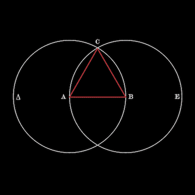

[1 vishalkumar.london](https://www.instagram.com/vishalkumar.london/)

在左边画圆。然后从那个圆的中间(A)到末端(B)画一条直线。在右边画一个大小完全相同的圆，使其穿过 A，然后从 A 和 B 到两个圆的交点(C)画两条直线。

很简单，对吧？甚至不需要计算器。令人难以置信的是，上面的红色三角形的边都是一样长的，所有内角都是 60 度——我们甚至不需要任何数字来制作它！

> “我从来不知道数学可以这么简单。”

这是一本名为《元素》的书的第一个定理，该书由古希腊数学家欧几里德在 2300 多年前写成。据估计，自 15 世纪机械印刷发明以来，它的版本数量仅次于《圣经》。

《元素》的影响力如此之大，以至于亚伯拉罕·林肯的办公桌上一直放着一本。(很酷的故事)。

等等，还有更好的。让我们更上一层楼。

等边三角形有许多神秘之处。你在上面看到的同样的红色等边三角形可以用来生成一系列其他的形状和形式。

下面我们看到等边三角形可以帮助画一个圆，六边形，矩形，和一系列其他多边形。看看你能找到多少。

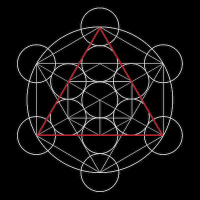

2 vishalkumar.london

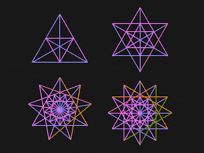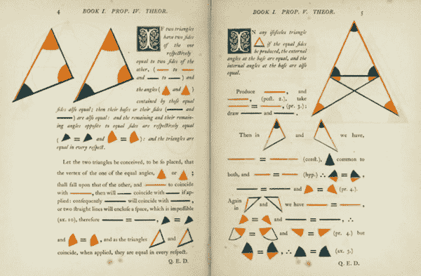

Image taken from [Jinju Jang](https://medium.com/@arle13/a-story-of-a-designer-conquering-mathematics-d0fd4585f0ba) on Medium (left) and t*he first six books of the Elements of Euclid (right), by Oliver Byrne (1847)*

纵观历史，等边三角形一直是人类文明、社会和宗教的基础。

在他 2010 年的论文《等边三角形 的奥秘》中，数学家 Brian McCartin 解释了这种形状如何帮助了广泛的设计——从构建地图到解决问题，到创作艺术作品和制作宗教符号和遗物。

让我们看看古希腊的建筑。下图(左)和我上图很像。它展示了建于公元前 432 年的帕台农神庙的正面，以及叠加在一起的同心等边三角形，每个连续的三角形都缩小了一半。这张图有助于想象帕台农神庙完美而精致的比例。

很明显，希腊人知道几何的重要性。

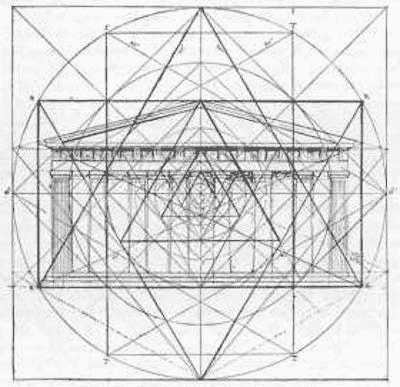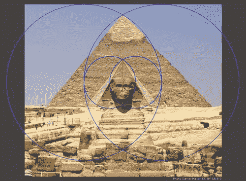

Image of the Parthenon (left) and image of Great Pyramid of Khufu
at Giza — Brian McCartin (2010)

另一个更古老的建筑用等边三角形的例子是埃及吉萨的金字塔群。构成金字塔的四个三角形边都是等边三角形。这些都是建筑中三角形力量的例子，因为金字塔已经屹立了 4000 多年。

#### 为什么这些都很重要？

采用几何方法来绘制基本的、平滑的形状可以为提高一个人的设计技能奠定基础。

几何方法让你以更简单的方式组织和安排你的空间**——无论你的空间是电脑还是手机屏幕、你的笔记本，甚至是便利贴。**

**看看苹果是怎么设计他们的 logo 的。Inkbot Design 挑战苹果的 logo，解剖它，问他们的 logo 是不是用黄金比例设计的。**

**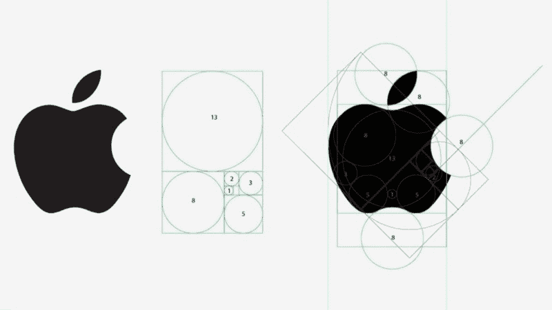

Image taken from [Inkbot](http://inkbotdesign.com/designing-logos-grid-system)** 

**相关故事: Jinju Jang 也[解释了她如何利用数学和几何](https://medium.com/@arle13/a-story-of-a-designer-conquering-mathematics-d0fd4585f0ba)来提高她的设计技巧。**

**到目前为止，等边三角形是我故事中的明星，但它只是许多有趣的角色和主角中的第一个。**

**欧几里得几何是我们在学校学习的经典几何，用来制作边缘‘光滑’的形状，比如三角形或圆形。欧几里得几何从公理逻辑地前进，到定理，然后到三维空间。**

**如果你增加一个“时间”维度，你就会得到牛顿物理学，形成一个单一的时空连续体。**

**[巴塞罗那的极简主义制作团队 Kroneker Wallis 甚至出版了当代设计书籍，更详细地解释了这一点！这也证实了我关于古代数学对今天的设计很重要的观点——所以，在 [Kickstarter](https://www.kickstarter.com/projects/1174653512/euclids-elements-completing-oliver-byrnes-work?ref=e2jxyc) 上支持他们吧！]**

**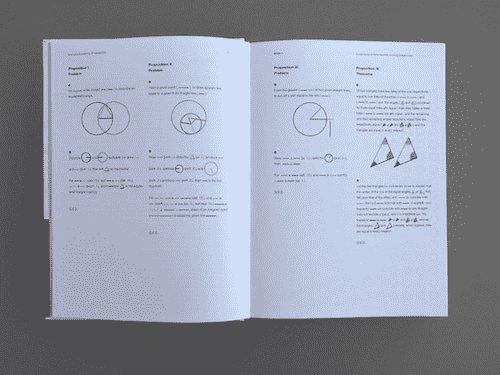****

*Euclid’s Elements* (left) and Newton’s Principia (right) by Kroneker Wallis in Barcelona** 

> **“我从来不知道数学可以这么艺术！”**

**然而，也有几何形状的调整，以制造无限复杂的形状，具有“粗糙”的边缘，除了空间和时间之外，还跨越多个维度:例如，基于生物或环境属性的设计材料。**

***进入分形几何。***

**分形几何被广泛应用于自然科学——数学、物理、化学和生物学——但最近被用于建筑和城市设计。例如，麻省理工学院媒体实验室的 Neri Oxman 通过计算模拟自然界的分形形式来设计和生成新的材料和建筑(见下文)。**

**此外，UCL Bartlett 高级空间分析中心的 Michael Batty 解释说，分形几何与城市的发展方式有很大关系。他的研究通过计算机模拟进化过程，提出“好”的城市设计，而不是“坏”的城市设计。**

**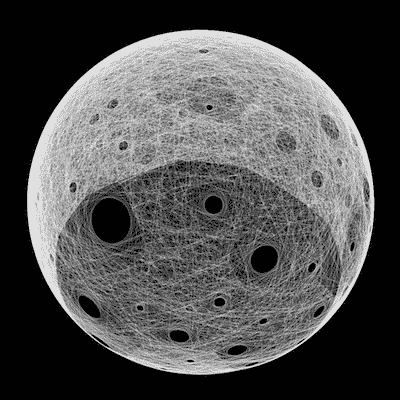

Silk Pavilion designed by Neri Oxman using fractal geometry (and more!)** 

**分形几何是 20 世纪 70 年代诞生的一个数学领域，主要由伯努瓦·曼德尔布罗发展。它可以导致不同尺度上的自相似形式，以这种方式唤起自然生长和设计——下图是一个嵌套的阿波罗垫圈。**

**分形理论也可以和复杂性理论、混沌理论联系起来——请看多米尼克·沃利曼[数学海报](https://www.flickr.com/photos/95869671@N08/32264483720)图左下方。**

**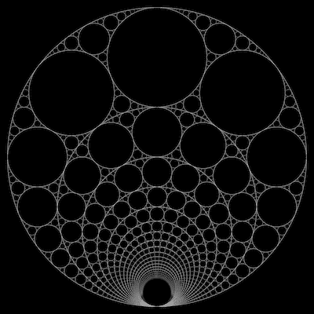

3 vishalkumar.london** 

**好吧，我保证这个帖子不会无聊，所以我就说到这里。(希望一直很充实！)**

### **结论**

**我想强调本文中的两个要点:**

1.  **来自几何和数学的简单想法对那些对所有设计领域都感兴趣的人来说是有帮助的和深刻的。Matej Latin [描述了](https://medium.com/design-notes/geometry-in-ui-design-61ef4f88218a)他如何使用几何学为他的项目获得像素完美的用户界面元素。**
2.  **使用更复杂的几何图形来创造更有趣的形状是可能的。比如生成类似自然形态的设计。**

**我将继续探索和解释数学是如何帮助我们在更深层次上理解设计的。这第一个帖子主要是关于几何，但我希望也看看来自代数，微积分和三角学的其他基本思想。**

**感谢您的阅读！**

#### **在你离开之前…**

**如果您觉得这篇文章很有帮助，请点击？按钮，在脸书、推特或 LinkedIn 上分享这篇文章，这样每个人都能从中受益。**

**在 insta gram[@ vishalkumar . London](https://www.instagram.com/vishalkumar.london/)或他的[网站](https://vishalkumar.london/)上看到更多 Vishal 的作品。**