# 如何在 React Native 中使用 Babel 宏

> 原文：<https://www.freecodecamp.org/news/using-babel-macros-with-react-native-8615aaf5b7df/>

作者卡兰·塔卡尔

# 如何在 React Native 中使用 Babel 宏

#### 使用 codegen.macro 解决 i18n 问题的实际用例

Background Photo by [Rayi Christian Wicaksono](https://unsplash.com/photos/6PF6DaiWz48) on [Unsplash](https://unsplash.com)

如果你在推特上关注肯特·c·多兹或 T2·苏尼尔·帕伊，你可能偶尔会读到关于巴别塔宏的推文。我也是。但就在昨天，我终于明白了炒作是怎么回事。**而且是光荣的！**

所以，问题来了:我想在 React Native 中添加一些实用程序来进行基于地区的数字格式化。由于在 React Native 中没有对国际化 API 的一致支持，所以我使用了一个聚合填充:https://github.com/andyearnshaw/Intl.js。现在，除了 polyfill，我还需要导入所有支持的语言环境文件。这里有两个选项:

1.  加载所有的语言环境:这很简单，因为我可以只导入一个文件。这通常应该避免，因为如果您只需要支持一些地区，它会不必要地增加您的包的大小。

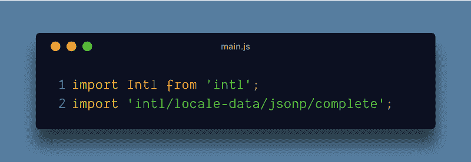

Load all locales provided by Intl.js

2.**只加载必要的语言环境**:这样，我只加载我的应用程序支持的语言环境。

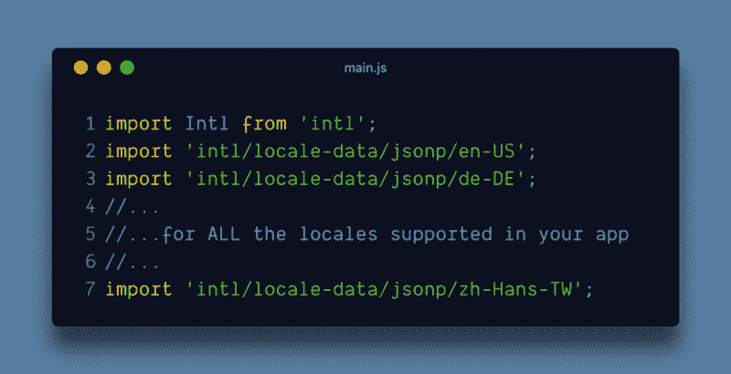

Load only the necessary locales from Intl.js

例如，如果应用程序支持 40 个地区，我必须为每个地区手动编写 40 个导入。随着您支持的区域列表的增加，这样做变得更加困难和乏味。

我想以一种不需要手动更改的方式自动完成这项工作。这对我们特别有用，因为我们在 CI 上运行后台作业，每当我们添加对新语言的支持时，这些作业会自动更新我们的语言环境文件。

如何动态导入多个文件，同时允许 React 本机打包程序在编译时拥有所有文件路径？ [**巴别-插件-宏**](https://github.com/kentcdodds/babel-plugin-macros) 和 [**codegen.macro**](https://github.com/kentcdodds/codegen.macro) ？

### 这些是什么…巴别塔的东西？

[由](https://babeljs.io/blog/2017/09/11/zero-config-with-babel-macros)[肯特·c·多兹](https://www.freecodecamp.org/news/using-babel-macros-with-react-native-8615aaf5b7df/undefined)撰写的这篇博文完美地描述了什么是 [**巴别-插件-宏**](https://github.com/kentcdodds/babel-plugin-macros) :

> 这是一种代码转换的“新”方法。它使您能够进行零配置、可导入的代码转换。

[**codegen.macro**](https://github.com/kentcdodds/codegen.macro) 就是这样一种转换，您可以在构建时使用它来“生成代码”。

### 你如何设置它？

React Native 允许你配置自己的巴别塔设置。你可以创造我们自己的”。babelrc "文件放在项目的根目录下。为了确保使用 React Native 自带的默认 babel 配置，安装[**babel-preset-React-Native**](https://github.com/facebook/react-native/tree/master/babel-preset)。

在此之上你必须安装另一个模块: [**codegen.macro**](https://github.com/kentcdodds/codegen.macro) 。codegen 插件使用[**babel-plugin-macros**](https://github.com/kentcdodds/babel-plugin-macros)**来完成它的工作。我们稍后会看到那是什么。**

**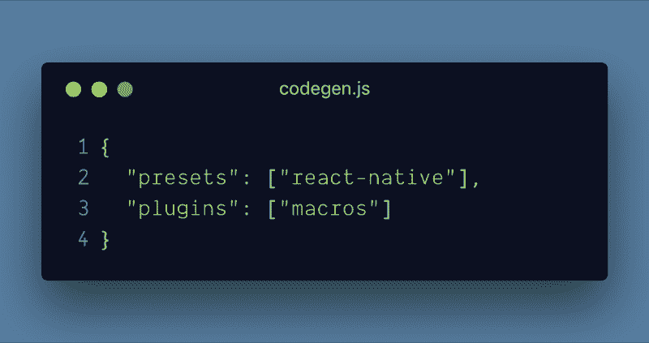

⬆️️This is how your **.babelrc** file should look** 

### **codegen.macro 是做什么的？**

**它获取一段代码，执行它，并用`export-ed`字符串替换自己。一旦你看到下面的例子，就会明白很多道理。给定一个区域列表和一个 codegen 宏，它会在构建时生成一个导入列表！**

**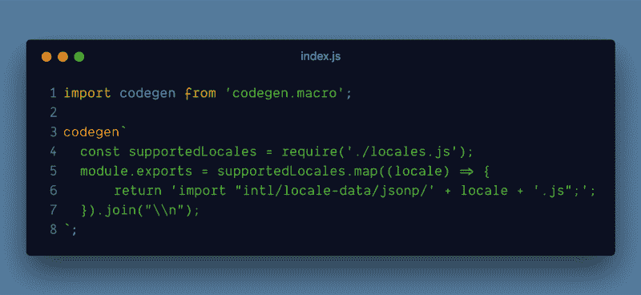****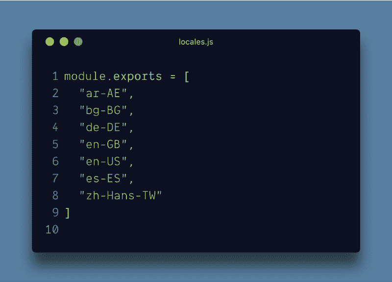

LEFT: codegen macro to build imports for all locales · RIGHT: Supported locales list** **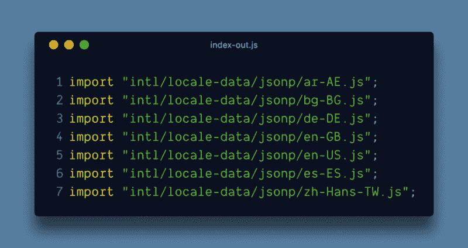

Output from babel after transpilation** 

### **但是，如果我需要语法高亮呢？**

**由于我们是在一个模板字符串中编写所有代码，所以很难突出显示正确的语法。您可能最终会花费大量时间试图找出为什么您的宏在传输时会出错。**

**谢天谢地，babel 宏支持几种不同的使用方式。我最喜欢的是使用 **codegen.require** 。这样，您可以将宏体移动到一个单独的文件中，并在任何需要的地方使用它，如下所示:**

**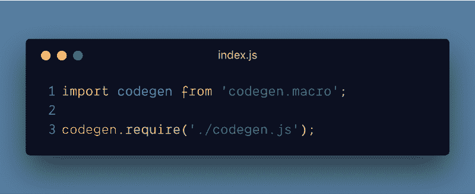****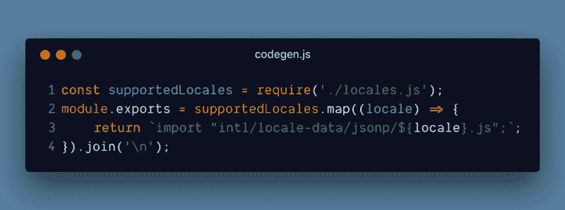

Import the codegen using a special **codegen.require** call** 

#### **使用此语法的优点:**

*   **嗯，语法高亮？？‍**
*   **不需要转义任何你需要使用的转义序列比如 **\n？****

**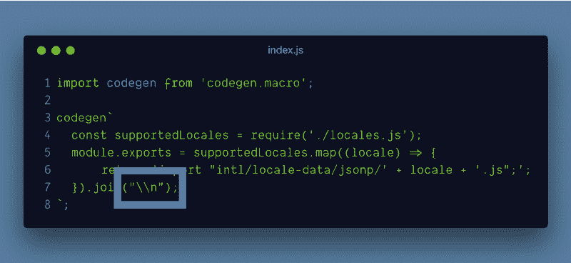****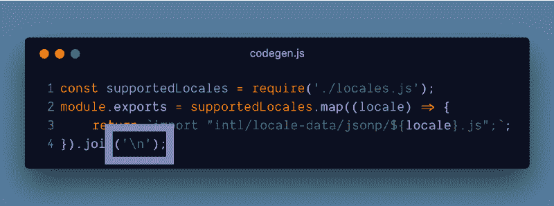**

*   **在 codegen 中使用模板文本？**

**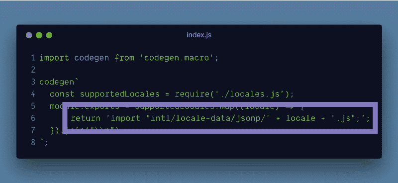****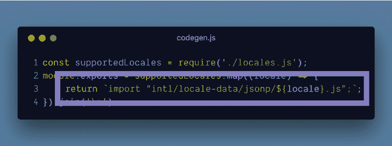**

### **注意:升级 React Native**

**如果您选择覆盖 babel 配置，那么每当您升级 react-native 时，您还必须升级 babel-preset-react-native 的版本，以匹配 react-native 版本中使用的版本。**

**就是这样，伙计们！你用 React Native 设置了 babel 宏？？如果您想尝试一些不同的东西，请查看其他可用的宏。**

**PS:感谢[纳伦德拉·N·谢蒂](https://www.freecodecamp.org/news/using-babel-macros-with-react-native-8615aaf5b7df/undefined)、[西达尔特·克谢特拉帕尔](https://www.freecodecamp.org/news/using-babel-macros-with-react-native-8615aaf5b7df/undefined)和[肯特·c·多兹](https://www.freecodecamp.org/news/using-babel-macros-with-react-native-8615aaf5b7df/undefined)审阅草稿并帮助完善？**

****

**嗨！？‍，我是阿兰·萨克。我在 T2 kyscanner 工程公司从事 React 本地基础设施的工作。之前，我在 C [rowdfire 领导网络团队。](https://www.freecodecamp.org/news/using-babel-macros-with-react-native-8615aaf5b7df/undefined)我喜欢在业余时间尝试新技术，我已经建立了 T [weetify](https://karanjthakkar.com/projects/tweetify) (使用 React Native)和 S[how My PR](https://showmyprs.com)(使用 Golang)。**

**我写的其他文章有:**

*   **[使用 GitHub 和 Cloudflare 建立网站的图解指南](https://medium.freecodecamp.org/an-illustrated-guide-for-setting-up-your-website-using-github-cloudflare-5a7a11ca9465)**
*   **[使用 Let's Encrypt Certbot 在你的亚马逊 EC2 NGINX 盒子上获得 HTTPS](https://medium.freecodecamp.org/going-https-on-amazon-ec2-ubuntu-14-04-with-lets-encrypt-certbot-on-nginx-696770649e76)**