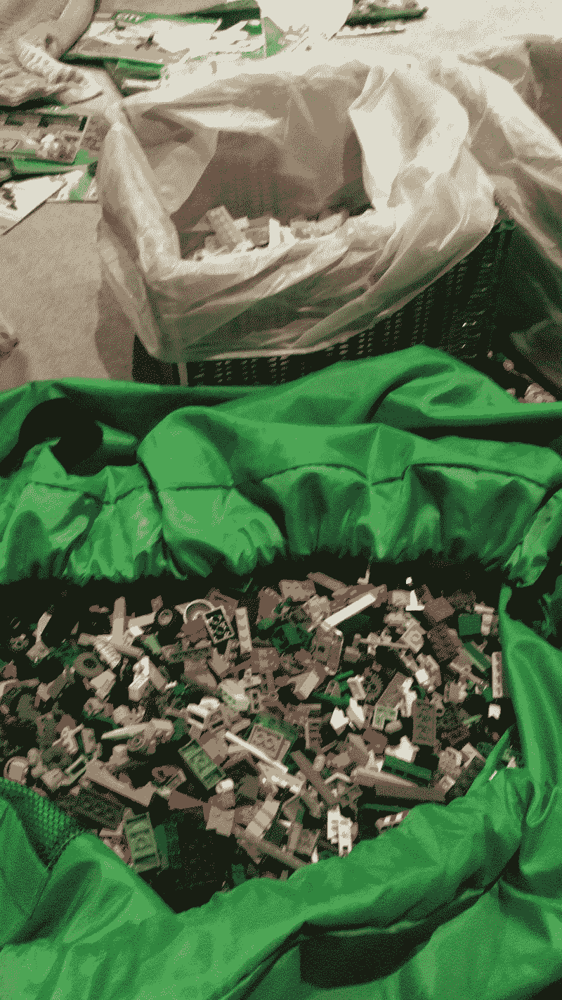
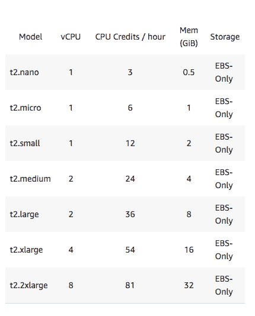
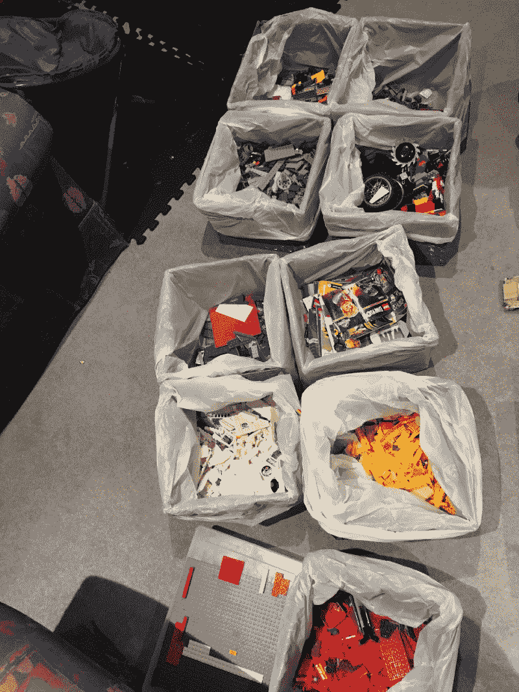

# 我是如何使用(计算机)科学的！来处理一千多块乐高积木

> 原文：<https://www.freecodecamp.org/news/using-computer-science-to-deal-with-more-than-a-thousand-lego-pieces-439a2d5a3278/>

大多数孩子绝对喜欢乐高玩具。我儿子一直在玩 [Duplo](https://www.lego.com/en-au/themes/duplo) 的，但是我们最近已经把他“升级”到普通的了。因为我们还没有收集常规的乐高玩具，所以我们选择继承别人的。当我们发现有人在出售他们孩子的乐高玩具时，我们终于有了突破，因为他们对他们来说太老了。

This is just half of the collection. Half was already sorted by colours, but these weren’t.

因为我们刚刚得到了一千多件的有效载荷，我们现在必须按照颜色对它们进行分类，以便对它们进行组织。我肯定不会按部分对它们进行分类或归类，因为那样会花很长时间。

因此，考虑到这项不可完成的任务，我们决定投入其中。我们开始分类，把所有的青砖捡起来，放在一个盆里洗。是的，这是一个非常古老的收藏，所以灰尘很多。

最初的攻击计划是这样的:

*   我将砖块分类，我的妻子会清理它们，包括架子。是的，这笔交易包括 3 个架子、9 个盒子、1 个乐高包(照片中)和 1 个乐高头，此外还有大约 5 到 1 万件物品
*   然后我们把它们打包——很容易，对吗？

这听起来是个不错的计划，直到我意识到按颜色分类的方式太慢了。我一次只能选择一种颜色。我大概只整理了大约 30 块砖，花了我五分钟。想象一下，我要花多长时间才能完成其他颜色，如黑色、灰色、红色和蓝色！

所以我不得不重新考虑我的计划。我和几个朋友开玩笑，然后他们提到我可能在做[冒泡排序](https://en.wikipedia.org/wiki/Bubble_sort)，这是我们那里最慢的排序算法之一(是的，还有其他一些更慢的算法！).我被这个笑话逗笑了，然后意识到我可能可以在这里使用我的计算机科学知识——至少是剩下的知识！大学是很久以前的事了，所以我知道我必须随机应变。

### 输入水平比例

我告诉每个人停下手头的工作，帮我整理一下袋子。这意味着现在有更多的人在分类，所以我基本上是通过增加更多的资源来完成工作。

作为一名 web 开发人员，我认为这是解决服务器负载问题的常用方法。

当您的服务器由于大量的输入流量而过载时，您通常有两种选择:垂直或水平扩展。

垂直扩展意味着您基本上为您的服务器增加了更多功能。例如，如果你正在使用 AWS，而不是只有 1 个 CPU 和 1GB RAM 的`t2.micro`，你可以将其升级到有 4 个 CPU 和 16GB RAM 的`t2.xlarge`。

[The Amazon EC2 instance types](https://aws.amazon.com/ec2/instance-types/)

水平扩展意味着您只需添加更多资源。因此，您没有升级您的单个`t2.micro`实例，而是增加了 5 个实例来容纳负载。

两者都有其使用案例，但是对于这个特定的实例，水平扩展是解决方案。

我的意思是，我不可能通过增加更多的脑力来纵向扩展自己，所以唯一的选择是通过增加更多的人来横向扩展。

经过五分钟的整理，我注意到我们确实取得了一些进展。但这对我来说还不够。时间在流逝，我越来越累了。我们需要让它更快！

### 分治算法

我有一个想法。我们有三个人，面前放着一个装满砖头的大袋子。我估计此时大概两千块左右。虽然我们在过去的五分钟里取得了一些进展，但我们仍然需要几个小时的分类。

从那以后，我改变了最初只寻找绿色积木的方法。相反，我只是快速地看了一眼哪种颜色看起来像大多数，然后用手尽可能多地去拿。将砖块放入相应颜色的篮子后，我又看了看那堆砖块，再次选择了“大多数”。它通常会改变，因为在得到一堆说，红色，它会有更少的红色。例如，下一个多数将是蓝色或绿色。

这看起来不错。但是在分析之后，我基本上是在看 2000 件，得到一种颜色的最大数量，得到那种颜色，然后从那堆颜色中减去它。我的处理速度很慢，因为在没有计算或估计的情况下，你如何得到大多数呢？

因为我承受了太多的认知负荷，所以我放慢了速度。因此，我不再看砖块最多的颜色，而是每次扔掉刚收集的砖块时，随机选择一种颜色。这稍微加快了我的处理速度，但我认为我们还可以改进。

于是，[分而治之](https://en.wikipedia.org/wiki/Divide_and_conquer_algorithm)就这样了。用计算机科学的术语来说，这意味着一种算法将一个巨大的问题分解成更小的部分，这样它们就足够简单，可以在更短的时间内解决。

假设您的站点接受用户上传的带有照片的 zip 文件并对其进行处理。如果您的服务器接受 zip 文件，解压缩它，并在您上传它的时候处理它，其他人将会等待它完成。当然，您可以水平或垂直扩展您的服务器，但是等待时间是不必要的。另外，当用户上传一个包含 100 张照片的 zip 文件时会发生什么？

您可以使用分而治之的方法来解决这个问题。首先，您将处理委托给一个延迟的作业基础设施，如 Rails 的 ActiveJob。或者如果你没有使用 Rails， [Sidekiq](https://github.com/mperham/sidekiq) 。尽管如此，如果是 100 张照片，这项工作将需要很长时间，而且你的员工可能会因工作量过大而死亡。

一种解决方案是用一个作业来解压缩它，**，然后**将每张要处理的照片作为一个单独的作业进行排队。现在，你的工人不再需要自己处理 100 张照片，而是将 100 个处理单张照片的小任务放在队列中，然后由其他工人来处理。

考虑到这一点，我和儿子达成了一项工厂协议:他必须从袋子里拿出一把(或两把)砖头，扔到我的角落里。这意味着我只有大约 50 块砖要分类，这更容易也更快——主要是因为到这个时候，我知道了大多数砖的颜色:灰色。

The most common block colour was grey.

如果我知道它是灰色的呢？嗯，这意味着我只需要挑选所有红色、绿色、黄色、蓝色、黑色和白色的砖块。当我只剩下灰色的时候，我把剩下的砖块扔进了灰色的盒子里——这样我就少了一种颜色来分类，如果是在更大的范围内，我就不能这么做了。

#### 一小时后…

全部完成！现在我们只需要清理它们。最初的计划是:

*   将一盒颜料倒入盆中。
*   用水和肥皂清洗
*   干燥的

这里的问题是什么？我给你猜一猜。

还在吗？好吧。如果我们用水和肥皂洗，这意味着我们必须把肥皂冲洗掉——这意味着我们必须洗两次！不会吧！所以我决定不加肥皂，只用温水彻底清洗。

修改后的计划是:

*   将一盒颜料倒入盆中
*   用水彻底清洗
*   干燥的

接下来是下一个问题:烘干乐高积木。

### 离心力来救援了！

最初，我们试着用毛巾擦干碎片。效果不是很好。下一步是用吹风机吹热空气。还好，但是还是没有把碎片弄干——我们越来越绝望，几乎决定把它们都放在地板上，让水分蒸发掉。

只是，那是秋天，所以天气不够热。因此，在思考如何烘干成千上万块乐高积木时，我突然想起我是如何用沙拉旋转器烘干沙拉叶子的。“我希望我能使用沙拉旋转器，”我想。我恍然大悟:一个[沙拉旋转器](https://en.wikipedia.org/wiki/Salad_spinner)的工作原理是利用[离心力将水从叶子中分离出来](https://en.wikipedia.org/wiki/Centrifugal_force)。我也可以这么做！

我把乐高积木包在一条毛巾里，然后把毛巾变成一个巨大的糖果包装纸来固定它们。我踩在毛巾的一端，尽可能拉紧另一端，开始旋转毛巾。

你知道吗——它真的有效！我可以看到毛巾突然变湿，因为水从碎片中流出，流进了毛巾。科学！

SCIENCE!

当然，乐高积木还没有完全干燥，所以我仍然必须用吹风机来帮助剩余的水滴蒸发。不过没关系——最困难的部分已经过去了。

我从没想过我会用我的计算机科学知识来做一些像整理乐高积木这样的事情。无论如何，这是一次很好很有趣的横向扩展的经历，使用了分而治之的策略，甚至发挥了离心力来组织我儿子新继承的乐高玩具收藏。不过，我并不期待有一天他会把它们都弄乱，然后我们又要重新分类。