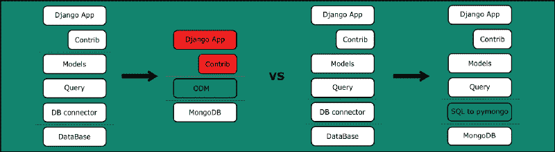
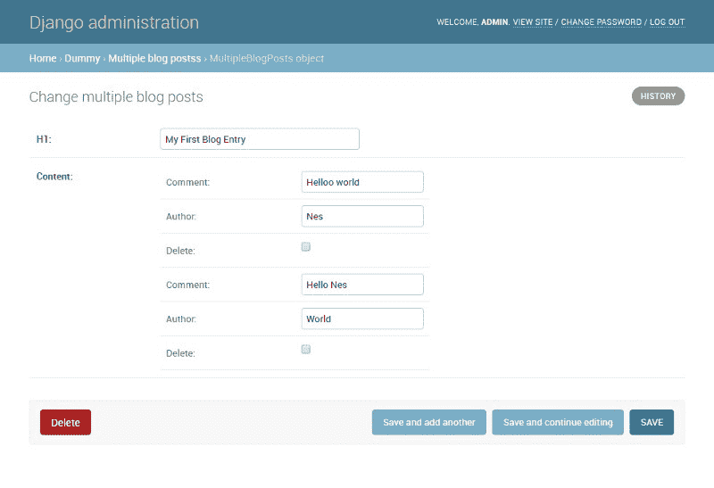
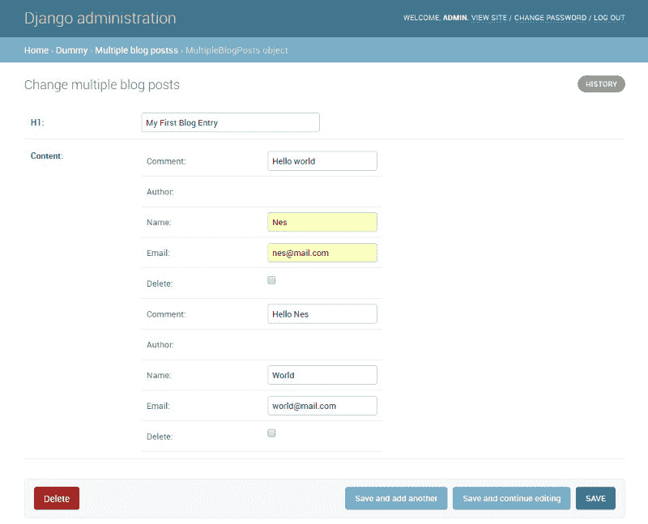
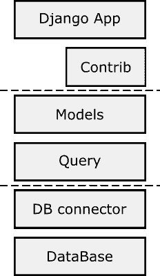
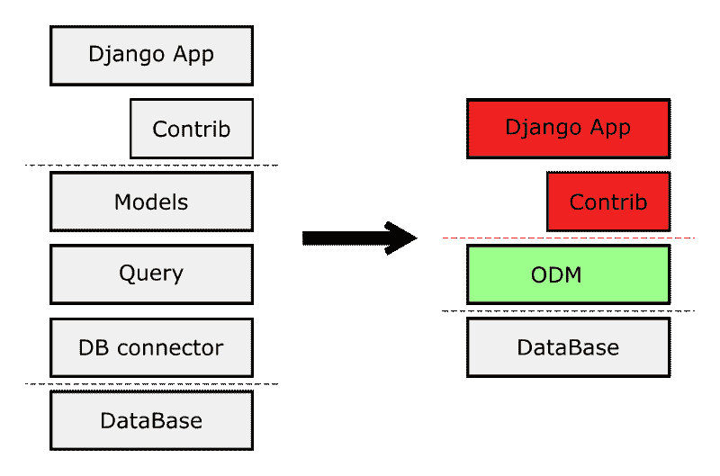
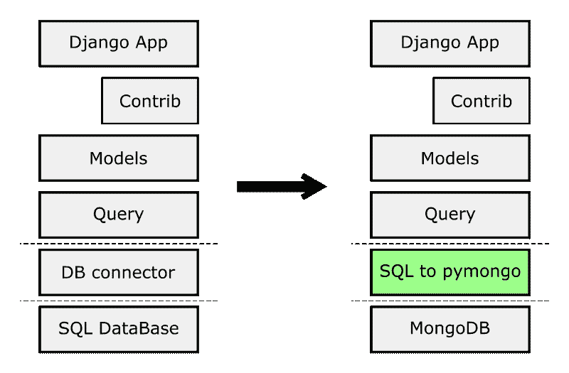

# 如何通过添加一行代码在 MongoDB 中使用 Django。

> 原文：<https://www.freecodecamp.org/news/using-django-with-mongodb-by-adding-just-one-line-of-code-c386a298e179/>

作者 Siddy Zen



# 如何通过添加一行代码在 MongoDB 中使用 Django。

要在 Django 项目中使用 [MongoDB 作为后端数据库，只需将**这一行**添加到 settings.py 文件中:](http://nesdis.github.io/djongo/)

```
DATABASES = {   ‘default’: {      ‘ENGINE’: ‘djongo’,      ‘NAME’: ‘your-db-name’,   }}
```

就这么简单！

接下来，登录到您的管理主页(localhost:8000/admin/)并开始使用管理 GUI 将“嵌入式文档”添加到 MongoDB 中:



2017 年 10 月，MongoDB 完成了上市的最后一步，[将其 IPO 定价为 24 美元](https://www.mongodb.com/press/mongodb-inc-announces-pricing-of-initial-public-offering)，并在此过程中筹集了 1.92 亿美元。公司的财务一直在稳步增长:

MongoDB 提供开源数据库软件。这对于那些在预算紧张的情况下寻求启动的早期创业公司来说非常有帮助。对 MongoDB 的谷歌搜索趋势的回顾显示了兴趣的稳步增长。


Google Trends — Search Term: MongoDB

MongoDB 越来越成为一个流行的数据库软件。数据库和数据库管理系统(DBMS)已经存在了五十多年。它们出现在 20 世纪 60 年代早期，最流行的是关系数据库系统。

但是 MongoDB 到处自称为“非关系型”数据库系统，并对其存储数据的方法大加吹嘘。那么，这里到底有什么大不了的？

#### MongoDB vs SQL

几乎所有的关系数据库系统都使用结构化查询语言(SQL)(或其改进版本)与数据管理软件通信。一些大学课程专门致力于理解和掌握 SQL 语法。

SQL 已经成为与任何数据库(DB)软件一起工作的事实上的语言，无论是专有的还是开源的。然后 MongoDB 出现了，它决定完全无视这种古老的权力语言，并引入了自己的查询语法。

> 这是魔多的语言，我不会在这里说。在普通语言中，它说，“一枚戒指统治所有人。一枚戒指找到他们。一枚戒指把他们都带来，在黑暗中把他们绑起来。”

> ——甘道夫(*出自*魔戒 *)*

**MongoDB 无模式 vs SQL 模式:**在 SQL 数据库中，除非在所谓的模式中定义表和字段类型，否则不可能添加数据。在 MongoDB 数据库中，可以随时随地添加数据。不需要预先指定文档设计甚至集合。

**MongoDB 文档 vs SQL 表:** SQL 数据库提供了相关数据表的存储。每一行都是不同的记录。设计是严格的:不能使用同一个表存储不同的信息，也不能在需要数字的地方插入字符串。

MongoDB 数据库存储类似 JSON 的字段-值对文档。相似的文档可以存储在一个集合中，类似于一个 SQL 表。然而，您可以在任何文档中存储任何您喜欢的数据— MongoDB 不会抱怨。SQL 表创建了一个严格的数据模板，所以很难出错。MongoDB 更加灵活和宽容，但是能够在任何地方存储任何数据会导致一致性问题。

有太多的在线内容认为 MongoDB 不是 SQL 的超集。运行在 SQL 上的应用程序不能移植到 MongoDB。我在这里大胆地宣称，在 Django 的上下文中， **MongoDB 是 SQL** 的超集。

那么，为什么普遍认为 MongoDB 不是 SQL 的超集，这种观点一开始就存在呢？

**MongoDB 需要数据的反规范化:**在 MongoDB 中没有 JOIN 支持。这意味着我们将不得不去规范化我们的文档。非规范化文档导致更快的查询，但是更新多个非规范化文档中的文档字段信息将明显更慢。

没有连接:SQL 查询提供了一个强大的连接子句。我们可以使用一条 SQL 语句获得多个表中的相关数据。在 MongoDB 这样的非关系数据库中，没有关系数据库中的连接。这意味着您需要执行多个查询，并在代码中手动连接数据。

**无事务:**在 SQL 数据库中，可以在一个事务中执行两个或更多的更新——一个保证成功或失败的全有或全无包装器。如果我们分别执行两次更新，一次可能成功，另一次可能失败——从而导致我们的数据不同步。在一个事务中放置相同的更新可以确保要么都成功，要么都失败。

**无外键约束:**大多数 SQL 数据库允许您使用外键约束来实施数据完整性规则。这将确保所有行都有一个有效的外键，用于匹配连接表中的一个条目的代码，并确保如果一个或多个行仍然引用它们，连接表中的记录不会被删除。

模式强制数据库遵循这些规则。开发人员或用户不可能添加、编辑或删除记录，这可能导致无效数据或孤立记录。MongoDB 中没有相同的数据完整性选项。您可以存储您想要的内容，而不考虑任何其他文档。理想情况下，单个文档将是关于一个项目的所有信息的唯一来源。

#### 对数据库模型的需求

对象是 Python 对数据的抽象。Python 程序中的所有数据都由对象或对象之间的关系来表示。虽然对象是表示数据的好方法，但当我们想让数据持久时，问题就出现了。数据量可能非常大，必须快速有效地从永久存储器中检索。必须使用这个数据库软件来存储对象。一种可能的数据库软件是基于 SQL 的关系数据库软件。

对象关系映射器(ORM)是一个代码库，可以自动将存储在关系数据库表中的数据转换成 Python 代码中使用的 Python 对象。ORM 提供了关系数据库的高级抽象，允许开发人员编写 Python 代码而不是 SQL 语法来创建、读取、更新和删除数据库中的数据和模式。开发人员可以使用他们熟悉的 Python 编程语言，而不是编写 SQL 语句或存储过程。

Python 的 ORM 框架的一个例子是 SQLAlchemy。SQLAlchemy ORM 提供了一种将用户定义的 Python 类与数据库表相关联的方法，以及将这些类(对象)的实例与它们对应的表中的行相关联的方法。它包括一个透明地同步对象及其相关行之间所有状态变化的系统。像 flask 这样的 Web 框架使用 SQLAlchemy 来持久存储数据。

Django ORM: Django 自带 ORM，简称模型。模型是关于你的数据的唯一的、权威的信息来源。它包含您正在存储的数据的基本字段和行为。通常，每个模型映射到一个数据库表。Django 模型还使得在各种关系数据库之间切换成为可能，比如 Oracle SQL、MySQL 或 MSSQL。

#### 使用 Django ORM 向 MongoDB 添加文档

假设您想使用 Django 创建一个博客平台，并以 MongoDB 作为后端。

在你的博客`app/models.py`文件中定义`BlogContent`模型:

```
from djongo import modelsfrom djongo.models import forms
```

```
class BlogContent(models.Model):    comment = models.CharField(max_length=100)    author = models.CharField(max_length=100)    class Meta:        abstract = True
```

要使用 Django Admin 访问模型，您需要为上述模型定义一个表单。如下所示定义它:

```
class BlogContentForm(forms.ModelForm):    class Meta:        model = BlogContent        fields = (            'comment', 'author'        )
```

现在使用下面的`EmbeddedModelField`将你的`BlogContent`嵌入到一个`BlogPost`中:

```
class BlogPost(models.Model):    h1 = models.CharField(max_length=100)    content = models.EmbeddedModelField(        model_container=BlogContent,        model_form=BlogContentForm    ) 
```

就这样，你准备好了！在 localhost 上启动 Django Admin:8000/Admin/


接下来，假设您想要“扩展”author 字段，以包含不仅仅是姓名。你需要一个名字和电子邮件。只需将作者字段设置为“嵌入式”字段，而不是“字符”字段:

```
class Author(models.Model):    name = models.CharField(max_length=100)    email = models.CharField(max_length=100)    class Meta:        abstract = Trueclass AuthorForm(forms.ModelForm):    class Meta:        model = Author        fields = (            'name', 'email'        )
```

```
class BlogContent(models.Model):    comment = models.CharField(max_length=100)    author = models.EmbeddedModelField(        model_container=Author,        model_form=AuthorForm    )    class Meta:        abstract = True
```

如果一篇博客文章有来自多个作者的多个内容，请定义一个新模型:

```
class MultipleBlogPosts(models.Model):    h1 = models.CharField(max_length=100)    content = models.ArrayModelField(        model_container=BlogContent,        model_form=BlogContentForm    )
```

用新的变化启动 Django Admin，您会得到:



#### 集成 Django 和 MongoDB 的方法。

Django ORM 由相互堆叠的多个抽象层组成。



The Django ORM stack

作为一名 web 开发人员，您可以通过两种方式将 Django 连接到 MongoDB。看一下上面的 Django 框架栈来猜测可能的入口点。

#### 使用 MongoDB 兼容模型



Switch from Django Models to an ODM

您可以完全避免在您的项目中使用“包含电池”的 Django 模型。相反，在 Django 项目中使用第三方框架，如 MongoEngine 或 Ming。

选择不同的型号意味着您错过了:

*   项目的 1500 多名核心参与者
*   [每小时修复和票证解析](https://dashboard.djangoproject.com)

您将减少现有 Django 模型的专业知识，增加新的模型框架。但是最大的缺点可能是你的项目不能使用任何 Django 的 contrib 模型！忘记在项目中使用 Admin、Sessions、Users、Auth 和其他 contrib 模块。

Django 本身的一个新分支抵消了这些缺点。Django-nonrel 是 Django 的一个独立分支，它为 Django 增加了 NoSQL 数据库支持。Django-nonrel 允许编写可移植的 Django 应用程序。但是，管理界面不能完全正常工作。Django-nonrel 项目没有积极进展。

Django MongoDB 引擎是 Django 的另一个 MongoDB 后端，它是 MongoEngine ODM 的一个分支。

#### Django SQL 到 MongoDB transpiler—[Djongo](http://nesdis.github.io/djongo/)



Djongo — The SQL to MongoDB transpiler

另一种方法是将 Django ORM 生成的 Django SQL 查询语法翻译成 pymongo 命令。Djongo 就是这样一个 SQL to MongoDB 查询编译器。它将每个 SQL 查询字符串翻译成一个 mongoDB 查询文档。因此，所有 Django 模型和相关模块都可以正常工作。通过这种方法，您将获得:

*   **Django 模型的重用:** Django 是一个稳定的框架，不断得到开发和增强。Django ORM 非常广泛，功能丰富。定义第三方 ORM 来使用 MongoDB 意味着再次复制整个 Django ORM。新的 ORM 需要不断地与 Django ORM 保持一致。Django 的一些特性永远不会出现在第三方 ORM 中。Djongo 的想法是**通过最终将 SQL 查询翻译成 MongoDB 语法来重用现有的 Django ORM 特性。**
*   不管 Django 将来会增加什么，SQL 语法永远不会改变。通过使用 Djongo，您的项目现在是面向未来的！

#### 让 Django 与 MongoDB 一起工作

**在 MongoDB 中模拟模式:**虽然在 MongoDB 中没有模式支持，但这是可以模拟的。Djongo 通过使用和定义 MongoDB 验证器规则的组合以及创建一个`__schema__`集合来提供 Django 中所需的模式支持。`__schema__`集合存储支持 SQL 自动增量键等特性的信息。

**在 MongoDB 中加入支持:**在 3.2 版本中，MongoDB 引入了`$lookup`操作符。它对同一数据库中的集合执行左外连接，以便从“连接”集合中过滤出文档进行处理。`$lookup`阶段在输入文档的一个字段和“联合”集合的文档的一个字段之间进行相等匹配。

对于每个输入文档，`$lookup`阶段添加一个新的数组字段，其元素是来自“joined”集合的匹配文档。`$lookup`阶段将这些经过整形的文档传递到下一个阶段。

Djongo 使用`$lookup`聚合操作符来执行所有 Django 相关的连接查询。这就是它如何让 admin 和其他 contrib 模块按原样工作的。

**MongoDB 中的事务支持:**尽管单文档原子操作很强大，但也有需要多文档事务的情况。当执行由顺序操作组成的事务时，会出现某些问题，其中如果一个操作失败，事务中的前一个操作必须“回滚”到前一个状态，即“全有或全无”

对于需要多文档事务的情况，Djongo 实现了[两阶段提交](https://docs.mongodb.com/manual/tutorial/perform-two-phase-commits/)模式，为这类多文档更新提供支持。使用两阶段提交可以确保数据的一致性，并且在出现错误时，事务之前的状态是可恢复的。

不过，Djongo 也有自己的一套折衷方案。那么在你的 Django 项目中选择使用 Djongo 的缺点是什么呢？

**性能:**Django ORM 负责将复杂的对象操作转换成标准的 SQL 查询字符串。如果您的后端数据库是基于 SQL 的，您可以将这个查询字符串直接传递给它，几乎不需要任何后期处理。但是，使用 Djongo，查询字符串现在必须转换成 MongoDB 查询文档。

这将需要一些 CPU 周期。但是，如果额外的 CPU 周期真的是一个问题，那么您可能首先就不应该使用 Python。

#### 结论

我向您介绍了几种集成 Django 和 MongoDB 的方法。您会发现大量的在线文献描述了 MongoEngine 和其他实现这一功能的变体。

我把重点放在了 Djongo 上，这是一个新的连接器，它以一种不同的方式让这成为可能。它易于使用，通过添加一行代码，使得从 SQL 后端迁移到 MongoDB 的过程非常简单**。**