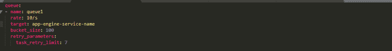
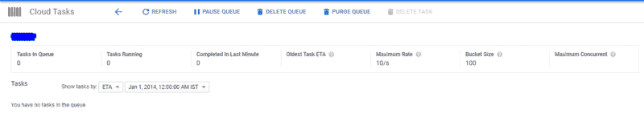
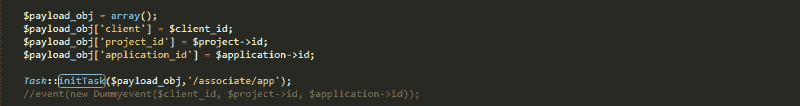
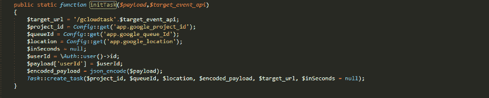
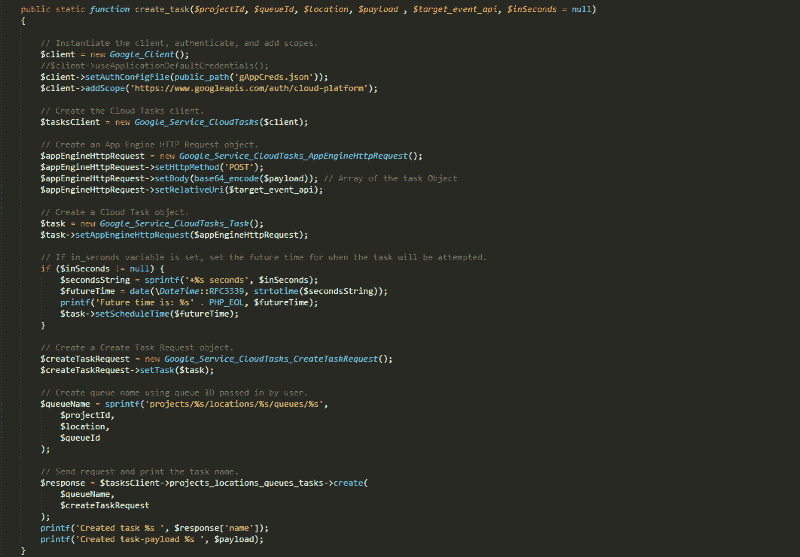
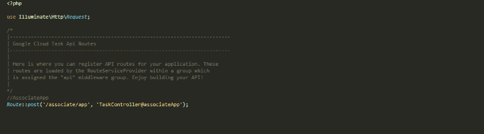
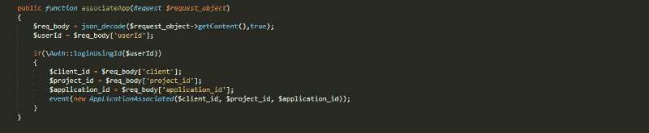

# 如何在 Laravel PHP 中使用谷歌云任务

> 原文：<https://www.freecodecamp.org/news/using-google-cloud-tasks-in-laravel-php-24985db107b/>

埃罗尔·费尔南德斯

# 如何在 Laravel PHP 中使用谷歌云任务

content.nanobox.io

由于有可用的文档，在 Google App Engine 上部署 Laravel 应用程序是一项相当容易的任务。但是在 Google Cloud 上有效地设置异步任务处理(Laravel Eventing)并不那么简单。

其中一种方法是使用 supervisord.conf 文件来设置 Laravel `queue:listen`命令。但这仅适用于 Google App Engine 灵活环境。所以如果你需要一个 Google App Engine 标准环境的解决方案，那么你需要使用 Google Cloud Tasks 来处理异步作业。

Google Cloud Tasks 是一项完全托管的服务，允许您管理大量分布式任务的执行、调度和交付。使用云任务，您可以在用户或服务到服务请求之外异步执行工作。

**第一步:**

创建任务队列来处理任务。这里我们使用 queue.yaml 文件来指定要在 Google Cloud 中创建的队列的配置。目标参数包含部署在 app engine 上的应用程序的名称。

**第二步:**

使用命令`gcloud app deploy queue.yaml`在 Google Cloud 中部署 queue.yaml 文件下图是在 Google Cloud 中创建的 Google 任务队列。

**第三步:**

我们需要传递 API 的路由和任务的有效负载对象。在下面的例子中，我们将把所需的数据传递给一个`initTask()`函数:

**第四步:**

创建 initTask()函数:

出于身份验证的原因，我们在有效负载中传递当前用户的 userID。现在有效负载已经准备好了，我们将所有需要的细节传递给任务构建器函数

**第五步:**

创建 create_task()方法。该方法将使用 Google API 构建一个云任务，并将其传递给任务队列。gAppCreds.json 文件是为定义应用程序角色而创建的 Google 服务帐户。

**第六步:**

现在我们使用 api.php 中的 RouteServiceProvider 创建 API 路由:

**第七步:**

现在我们创建一个 TaskController，它将不同的 API 路由到特定的函数。所以在下面的例子中，我们创建了一个`associateApp()`函数:

在上面的函数中，我们 json_decode 了我们在**步骤 4** 中发送的有效载荷，并将其传递给相应的事件进行处理。我们在**步骤 4** 中传递的用户 ID 用于验证传入 API 请求的真实性。

#### 最终裁决:

通常在 Laravel 中，我们直接从各自的控制器中调用事件。但是为了使用 Google cloud tasks，我们创建了一个 Task API，它依次调用 route，route 又依次调用事件来处理我们的数据。因此，简而言之，我们为我们的 Laravel 事件和作业创建多个 API，然后根据您在**步骤 3** 和**步骤 6** 中经过的路线，由 Google Task API 调用这些 API(**)。**

由于我正在使用 Google Cloud Tasks，我不需要担心主管或管理队列表中的作业，因为一切都由 Google Task Queue 处理。我所要做的就是监视任务队列是否有任何失败的任务。

使用 Google Cloud API，我可以为部署在 Google App Engine 上的不同目标应用程序创建多个队列，而不管环境是标准的还是灵活的。