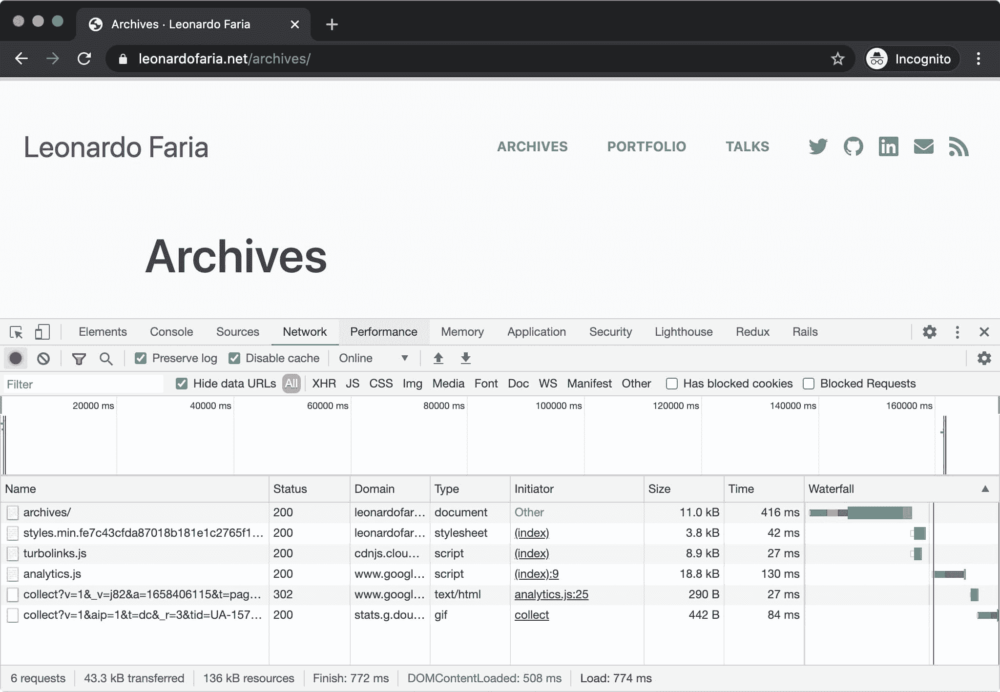
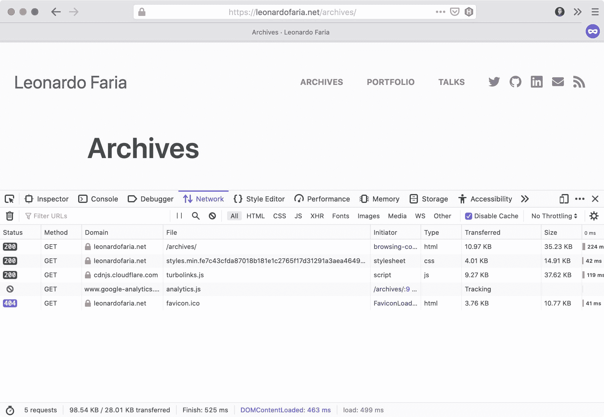
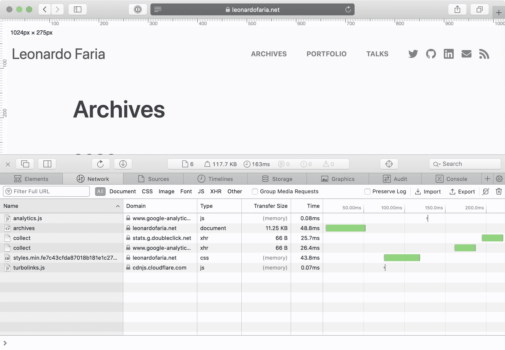
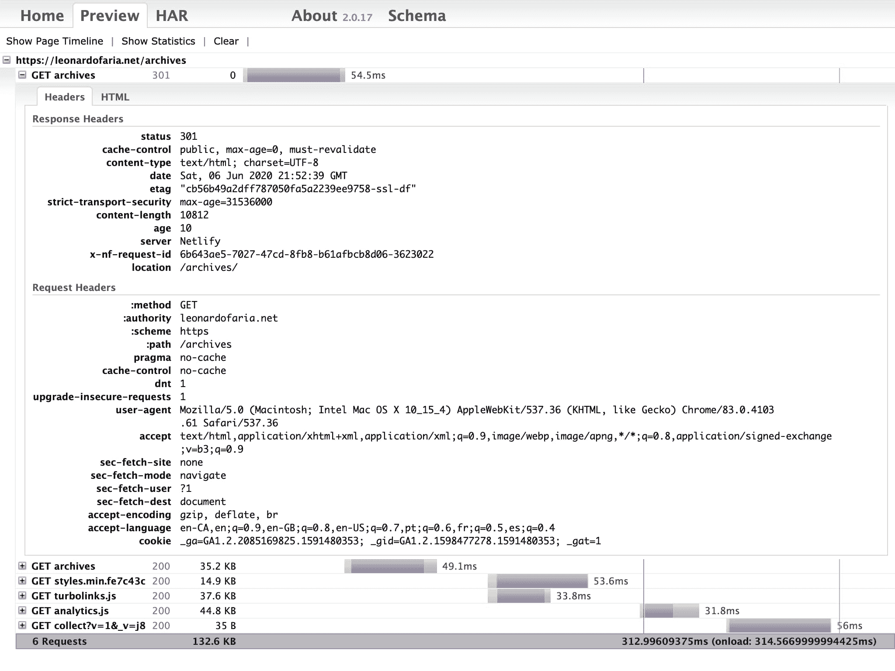

# 如何使用 HAR 文件分析一段时间内的性能

> 原文：<https://www.freecodecamp.org/news/using-har-files-to-analyze-performance-over-time/>

当我考虑一个网站的性能时，我会想到几件事。我会考虑查看页面的请求，了解正在加载哪些资源，以及这些资源需要多长时间才能提供给用户。

“网络”选项卡将为您提供一个包含页面上加载的所有资产的表格。它还将向您显示关于这些资产的来源(域、HTTP 状态代码、大小)、谁发起了请求以及它们在瀑布图中的加载顺序的相关信息。

通过右键单击其中一个表格标题并选择其他列，可以向该表格添加更多信息。

尺寸、时间和瀑布栏对于理解页面的性能至关重要。size 值将显示资源的 gzipped 大小(如果适用)，而 time 列显示从请求开始到收到响应中的最后一个字节的总持续时间。

最后，但同样重要的是，瀑布列演示了资产何时与其他请求一起被加载。

代码/环境的变化会带来明显的性能提升。那么，我们如何跟踪网络选项卡正在分析的内容呢？通过以 HAR 格式导出页面。

## 什么是 HAR 档案？

HAR(HTTP Archive 的缩写)文件是一个 JSON 文件，包含浏览器与页面交互的所有信息。它将包含 HTML 文档及其各自的 JS 和 CSS 文件。

除了这些内容，HAR 文件还将包含所有头信息和浏览器元数据(即每个请求的时间)。

这里有一点很重要，cookies 和表单数据也会被记录到文件中，所以在审计页面时要注意不要包含敏感信息(个人信息、密码、信用卡号)。

此外，您应该在私有窗口中审核页面，这样可以避免浏览器扩展。避免浏览器的扩展很重要，因为它们可能会修改页面的加载时间。

## 生成 HAR 文件

### 谷歌浏览器

*   关闭谷歌浏览器中的所有匿名窗口。
*   在谷歌浏览器中打开一个新的匿名窗口。
*   进入视图>开发者>开发者工具。
*   在“开发工具”面板中，选择“网络”选项卡。
*   选中保留日志和禁用缓存复选框以记录所有交互。
*   刷新页面。
*   单击导出 HAR(向下箭头图标)导出 HAR 文件。
*   保存 HAR 文件。

### 火狐浏览器

*   关闭 Firefox 中的所有私人窗口。
*   在 Firefox 中打开一个新的私人窗口。
*   进入工具>开发者>网络或 ctrl-shift-E。
*   刷新页面。
*   在 Cog 图标(页面的右上角)中，选择“全部另存为 Har”。
*   保存 HAR 文件。

### 旅行队

*   确保在 Safari >偏好设置>高级下选中了在菜单栏中显示开发菜单复选框。
*   选择“文件”>“打开新的私人窗口”。
*   访问出现问题的网页。
*   选取“开发”>“显示 Web 检查器”。将出现“Web 检查器”窗口。
*   刷新页面。
*   单击窗格右上角的导出。
*   保存 HAR 文件。

## 阅读 HAR 文件

一旦你有了 HAR 的档案，你可以试着在网上找几个 HAR 的观众。我个人最喜欢的是 Jan Odavarko 创作的[款。](http://www.softwareishard.com/har/viewer/)

我特别喜欢这个浏览器的一点是，你可以同时打开多个文件，这样比较起来更容易。

## 使用 HAR 文件分析页面性能

HAR 文件对于收集有关页面资源的信息非常有用。因为您有关于其内容的详细信息，所以您可以比较在新功能推出或重新设计完成后哪些方面得到了改进(或者在某些情况下，哪些方面没有得到改进)。

在我的工作流程中，我喜欢跟踪我正在处理的产品的几个页面的最终大小/时间值。

## 更多信息

*   [测量资源加载时间](https://developers.google.com/web/tools/chrome-devtools/network/resource-loading#view-network-timing-details-for-a-specific-resource)
*   [HAR 浏览器源代码](https://github.com/janodvarko/harviewer)

也发布在[我的博客](https://bit.ly/2zbBPud)上。如果你喜欢这些内容，请在 [Twitter](https://twitter.com/leozera) 和 [GitHub](https://github.com/leonardofaria) 上关注我。威廉·戴格瑙特/昂斯普拉什的封面照片