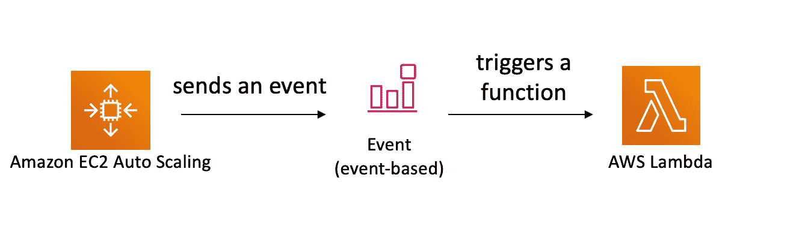
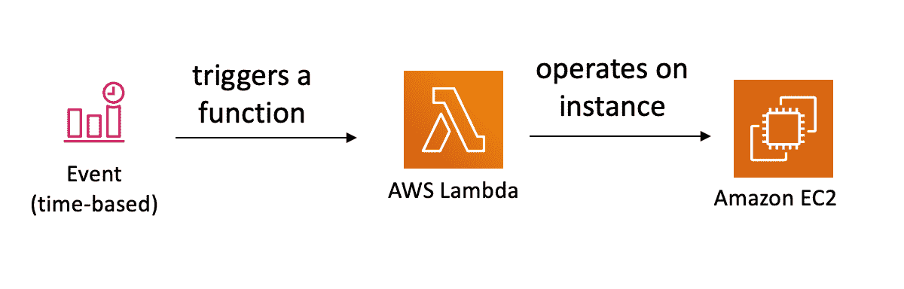
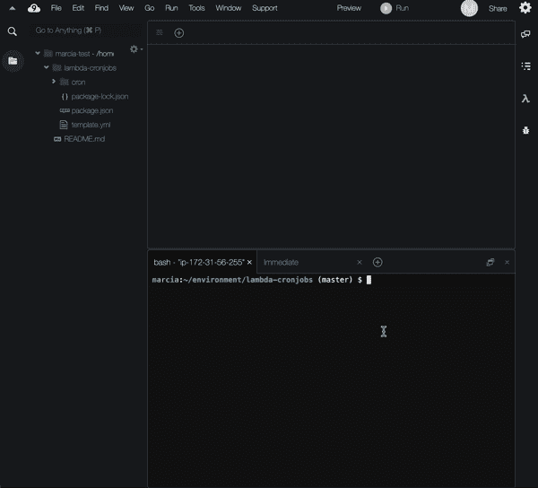
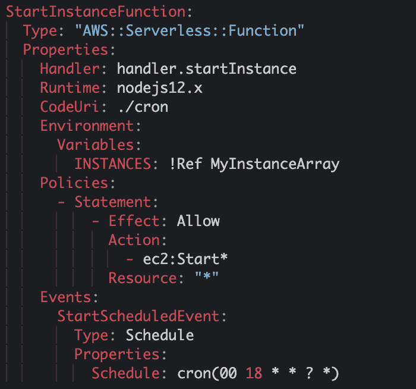
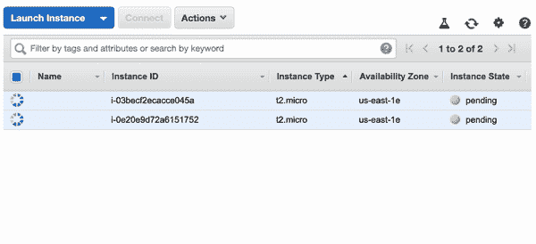
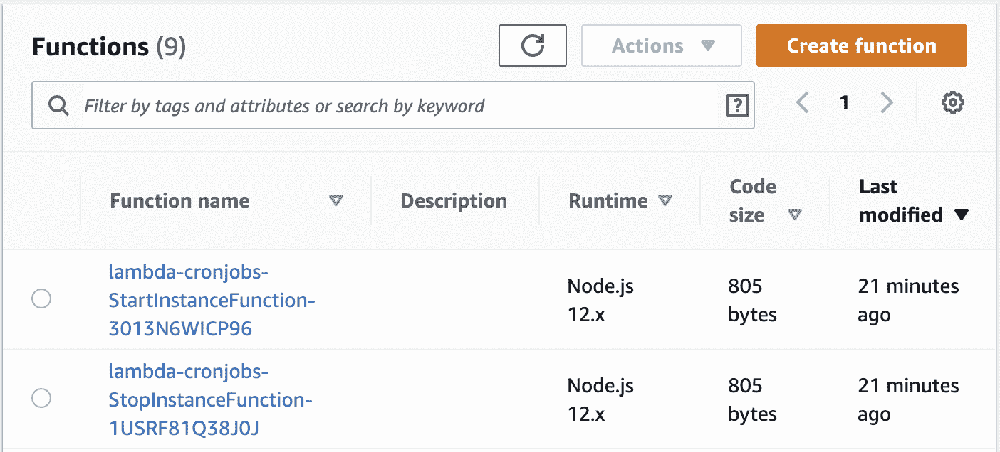

# Cron Job AWS Lambda 函数教程–如何调度任务

> 原文：<https://www.freecodecamp.org/news/using-lambda-functions-as-cronjobs/>

Cron 作业通常用于在特定时间调度命令。您可以将它们用于运行备份、监控系统状态或运行系统维护任务等任务。

Cron 作业对于系统管理员来说是一个有用的工具。当您在云中管理系统时，cron 作业仍然非常有用——您仍然需要在您的系统上执行大量管理任务。

在云中运行 cron 作业的一种方式是使用功能即服务(FaaS)，就像 AWS 生态系统中的 Lambda。

功能在被触发时执行，它们在云中运行代码，而不需要提供或维护任何基础设施。此外，函数可以配置为在特定时间或特定周期运行，就像传统的 cron 作业一样。

在这篇博文中，我将使用 AWS 生态系统向您展示一个具体的例子，说明如何使用云中的函数创建 cron 作业。

## 亚马逊云观察活动

为了将 Lambda 函数用作 cron 作业，我们需要理解 Amazon CloudWatch 事件。

当 AWS 资源发生变化时，会发送 Amazon CloudWatch 事件。这些事件可以触发 AWS Lambda 函数。当您的 AWS 资源改变状态时，它们会自动向事件流发送 CloudWatch 事件。

因此，您可以创建一个规则，在发生某些事情时触发特定的 Lambda 函数。例如，当自动缩放组发生变化时，可以自动调用 Lambda 函数。

此外，CloudWatch 事件可以调用 Lambda 函数定期执行。通过这种方式，您可以拥有一个 Lambda 函数，它在下午 6 点后关闭所有测试和开发 EC2 实例，另一个在上午 8 点后打开它们。



When there is a change in an autoscaling group the cloud watch event generated triggers a Lambda function

## 设置演示

我想向您展示一个 Lambda 函数的示例，它可以在您的 EC2 实例上执行操作。我将使用 [AWS SAM](https://docs.aws.amazon.com/serverless-application-model/latest/developerguide/what-is-sam.html) 将我的 Lambda 函数定义为代码形式的基础设施。

如果您想尝试这个演示，您需要有一个 AWS 帐户，并在您的 AWS 帐户中配置一个或多个 EC2 实例。这些是我们将要从 Lambda 函数中操作的。EC2 实例是云中虚拟机的 AWS 版本。

您可以在 [AWS Cloud9 IDE](https://aws.amazon.com/cloud9/) (基于浏览器的 IDE)上尝试演示，因为 AWS SAM 已经在该 IDE 中进行了配置。如果你想知道如何使用 AWS Cloud9 IDE 来操作 Lambda 函数，你可以看看这个[视频](https://youtu.be/JmEMBxfYtf4)。

[https://www.youtube.com/embed/JmEMBxfYtf4?feature=oembed](https://www.youtube.com/embed/JmEMBxfYtf4?feature=oembed)

在本例中，我们将使用在给定时间触发的两个不同的 AWS Lambdas 来启动和停止 EC2 实例。我们每天早上 8 点启动实例，下午 6 点结束时关闭实例。

为此，我们将使用 CloudWatch 事件在正确的时间触发 Lambda，并使用 AWS SDK 来执行实例中的操作。



At an specific time a Lambda function is triggered that will operate on a set of EC2 instances

这个例子的最终代码可以在这个 [GitHub](https://github.com/mavi888/lambda-cronjobs) 库中找到。要让这段代码在 AWS Cloud9 IDE 中工作，您需要[在 IDE 中配置您的 GitHub 帐户](https://help.github.com/en/github/authenticating-to-github/adding-a-new-ssh-key-to-your-github-account)，以便能够克隆项目，然后在 IDE 中克隆它。

准备好后，只需在克隆的目录中运行以下命令:

```
$ sam deploy --guided
```

运行该命令时，您将得到一组问题，您需要回答这些问题才能成功配置该项目。



How to deploy the project to the cloud using AWS SAM CLI

您需要定义的第一件事是您的项目的名称。然后您将设置部署它的**区域**——选择您的 EC2 实例所在的区域。接下来，我们需要给部署脚本一个我们想要操作的实例的**列表。然后我们就完成了——它会将项目部署到我们的 AWS 帐户。**

## 定义 AWS Lambda 函数

我想向您展示的第一件事是，我们如何使用 AWS SAM 定义在特定时间触发的 AWS Lambda 函数。这个定义将在名为“template.yml”的文件中。



AWS SAM of the StartInstance function

这是函数的样子。让我们看看重要的几行:

第一行是函数的名称，在本例中是“ **StartInstanceFunction** ”。

然后我们有了“**属性**的定义。第一个属性是“**处理程序**”。这里我们将指定需要执行的代码所在的模块(文件),然后指定该模块中的方法。

然后我们有" **CodeUri** "，这是显示在哪里可以找到该文件的路径。在这种情况下，我们的代码将位于名为“cron”的目录、名为“handler.js”的文件和名为“startInstance”的方法中。

之后我们有了“**运行时**的定义。我将使用 NodeJS 版本 12，但你可以使用 Python、Java、Go、C#或任何让你高兴的东西。 [Lambda 支持开箱即用的多运行时](https://docs.aws.amazon.com/lambda/latest/dg/lambda-runtimes.html)和[如果你愿意，你可以自带运行时](https://youtu.be/MS5pzddwwqU)。

然后我们有了"**环境**"定义，我们将使用它来定义一个环境变量。这个变量将允许我们根据部署时的配置，动态地向代码发送不同的实例 id。

之后，我们有一个名为“ **Policies** 的部分，在这里我们定义了这个特定的 Lambda 函数将拥有的权限。

要知道所有的 Lambda 函数都是在没有任何权限的情况下创建的，这一点很重要。这意味着他们不能在任何其他 AWS 资源上做任何事情。

为了让这个 Lambda 函数启动 EC2 实例，它需要在特定 AWS 资源上执行特定操作的权限。在这个特定的策略中，我们授予在这个 AWS 帐户中启动所有 EC2 实例的权限。在参考资料部分中，所有都用“*”表示。

如果您在生产环境中运行这段代码，我建议您将资源限制在您希望 Lambda 能够启动的范围内。

最后，最后一部分是“**事件**部分。这里我们将定义这个 Lambda 函数将如何被触发。这个函数将由一个预定的 CloudWatch 事件触发，该事件在每天早上 8 点触发 Lambda。基本上每天 8 点，它将打开您指定的所有 EC2 实例。

有许多规则可以形成这个 cron 表达式:例如，如果您想让这个表达式只在星期一到星期五运行，请编写 cron(0 8？*周一至周五*)。你可以在 CloudWatch events 的文档网站找到更多信息，这里:[https://docs . AWS . Amazon . com/lambda/latest/DG/services-cloudwatchevents-expressions . html](https://docs.aws.amazon.com/lambda/latest/dg/services-cloudwatchevents-expressions.html)。

## AWS Lambda 函数编码

现在我们已经定义了 Lambda 函数，我们需要为它提供一些代码。在文件夹“cron”中，在文件“handler.js”中，我们需要添加名为“ **startInstance** 的方法，如下所示:


Code of the startInstance function

这个方法将在每天早上 8 点该函数被触发时被调用。它将从一个环境变量中获得 EC2 实例的列表，我们在部署时传递了所有实例 id。然后它会创建一个数组。

当它有了那个，它将调用 AWS SDK 并发送实例 id 数组作为参数。如果有任何错误，它将记录并完成。在这个 Lambda 完成执行之后，您可以立即转到 EC2 控制台，看看您的实例是如何打开的。



EC2 instances starting automatically when the Lambda function executes

关闭 EC2 实例的功能非常相似，只是有一些不同。您可以在这个[链接](https://github.com/mavi888/lambda-cronjobs)中找到该功能的代码并查看它。

## 运行 cron 作业

要运行这个 cron 作业，剩下的工作不多。在您的 AWS 帐户中部署了这两个函数之后，在与您的实例相同的区域中，它们将执行并做它们被编程要做的事情。



AWS Lambda functions for starting and stopping instances deployed in my AWS account

现在你需要等到早上 8 点或下午 6 点，看看它们是否工作。或者，如果您想现在就进行测试，可以将 Lambda 定义中的事件时间更改为适合您的时间。如果您计划关闭实例或反过来关闭实例，请确保实例处于打开状态，以便您可以看到更改。

现在等着看 EC2 控制台会发生什么。在您设置之后，您将看到实例关闭或打开，然后在您设置的另一个时间执行相反的操作。这将永远持续下去，直到您删除 Lambda 函数。

## 清理您的 AWS 帐户

完成这个演示之后，我建议您关闭(或者删除您创建的用于测试的实例)并删除您刚刚创建的 Lambda 函数。

移除 lambda 函数就像在 AWS 管理控制台中进入 CloudFormation 服务并移除 AWS SAM 创建的资源堆栈一样简单。

另外，不要忘记终止和删除 EC2 实例，如果您是为这个演示创建的。


How to remove the AWS Lambda functions we created in this demo

## 最后

AWS Lambda 函数是一个非常有用的工具，可以在您的 AWS 帐户中执行各种任务。您基本上可以通过 CloudWatch 事件获得 AWS 资源中任何变化的通知，然后您可以使用 AWS SDK 访问几乎所有的服务。因此，您可以在基础架构上执行各种维护任务和自动化任务。

****感谢阅读。****

我是 Marcia Villalba，是 AWS 的开发者倡导者，也是 youtube 频道 FooBar 的主持人，在那里我有超过 250 个关于无服务器、AWS 和软件工程师实践的视频教程。

*   推特:[https://twitter.com/mavi888uy](https://twitter.com/mavi888uy)
*   YouTube:[https://youtube.com/foobar_codes](https://youtube.com/foobar_codes)