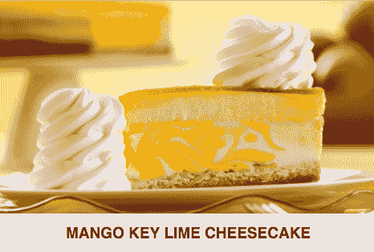

# 使用简单的工厂设计模式很像制作芝士蛋糕

> 原文：<https://www.freecodecamp.org/news/using-the-simple-factory-design-pattern-is-a-lot-like-making-cheesecake-92a119cde191/>

作者:黄思慧

# 使用简单的工厂设计模式很像制作芝士蛋糕

工厂模式是关于封装对象创建的。

但是在深入研究这些模式的细节之前，我们先来谈谈芝士蛋糕。因为芝士蛋糕是关于…幸福的！？？？

让我们把目光集中在我个人最喜欢的六种:原味芝士蛋糕、奥利奥芝士蛋糕、咖啡芝士蛋糕、提拉米苏芝士蛋糕、S'mores 芝士蛋糕和榛子芝士蛋糕。

我们是这样做芝士蛋糕的:

基于所选的类型创建一个芝士蛋糕实例->制作饼皮->在饼皮上添加层->烘烤它->冷藏它->在蛋糕上添加配料->退回蛋糕！？？？

等等…那个芒果匙莱姆芝士蛋糕看起来很诱人？？？。

让我把它加入我的清单:

一秒钟…

我最近喝了太多的咖啡因。我不想咖啡芝士蛋糕再出现在我的清单上了。让我再次更新一下 *make_cheesecake* 方法。

哦…他们有低碳水化合物版本的芝士蛋糕。选择低碳水化合物总是好的。它必须在我的清单上！

所以从第一次定义`make_cheesecake`开始，我们已经更新了三次。每一次，改变都是为了同样的原因——更新我的芝士蛋糕清单。而其他一切，`make_crust`*`add_layers`*`bake`*`refrigerate`**`add_toppings`，都保持不变。*****

***抱歉，我每三秒就改变主意。但是就像他们说的:**变化是生活中唯一不变的(还有软件开发)。*****

***老实说，我们至少需要再修改一次列表:南瓜芝士蛋糕将从 9 月份开始供应。世界闻名！毫无疑问，一旦 9 月到来，我们就需要把它加入清单。哎呀，这意味着我们需要在假期结束后将它从列表中删除。***

***很明显我的芝士蛋糕清单经常变。***

***有一个设计原则:**封装变化的**。***

***我们应该试一试。***

### ***奶酪蛋糕工厂的时间到了！***

***`CheesecakeFactory`是一个简单的类。它所做的只是根据给定的类型创建并返回正确的芝士蛋糕。***

***有了`CheesecakeFactory`的帮助，`make_cheesecake`的方法就变得简单多了。***

***`make_cheesecake`方法现在可以专注于制作芝士蛋糕的实际步骤，而不必担心不同的芝士蛋糕类型。***

***我们的`CheesecakeFactory`是一个使用简单工厂的例子。**简单工厂用于封装对象创建。*****

### ***工厂模式族***

***除了简单工厂，工厂模式家族还有另外两个成员:**工厂方法**和**抽象工厂。**我们不会深入这两种模式的细节。***

***简单来说，工厂方法和抽象工厂使用继承。工厂方法是关于创建一种类型的对象，抽象工厂是关于创建一系列不同类型的对象。这三个都是关于使用设计原则封装对象创建:封装变化的内容。***

### ***使用简单工厂的好处***

***根据给定的类型来创建正确的芝士蛋糕的逻辑是一个小步骤，它给我们带来了很多好处。最大的好处是我们可以修改 cheesecake 列表，而无需触及`make_cheesecake`方法及其测试。我们所需要做的就是更新`CheesecakeFactory`类，然后离开`make_cheesecake` 和它的测试。***

**我们想把经常变化的部分从稳定的部分中分离出来。因为每次我们修改代码的一部分，我们都可能引入错误。变化的部分是我们系统中脆弱的部分。我们想让稳定的部分远离脆弱的部分。因此，如果我们在更新系统的某个部分时引入了 bug，我们会更容易找到 bug。**

### **takealways:**

1.  **工厂模式用于封装对象的创建。**
2.  **设计原则:封装变化的东西。**

**我现在要去买个芝士蛋糕。**

**别忘了订阅，这样你就不会错过下一篇文章了！**

**下一次，我们将看看一些 waaaaaaaaffles！**

****