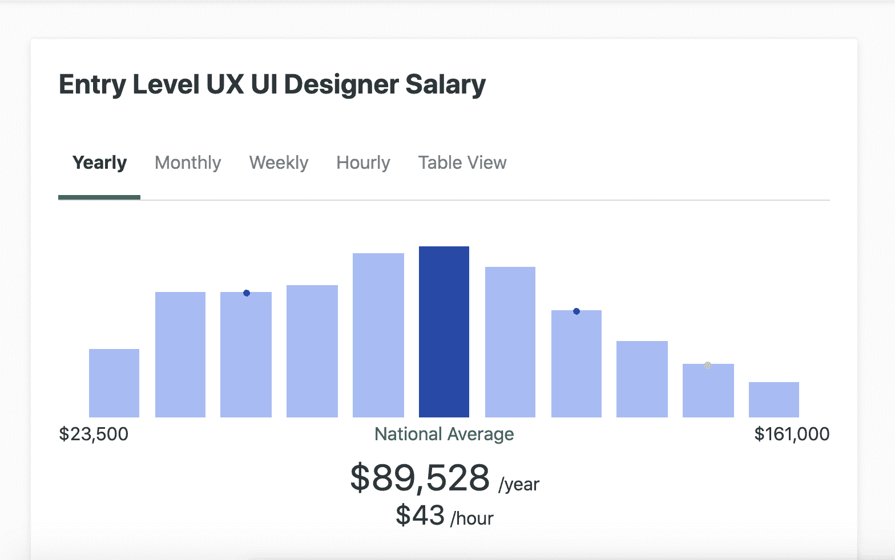
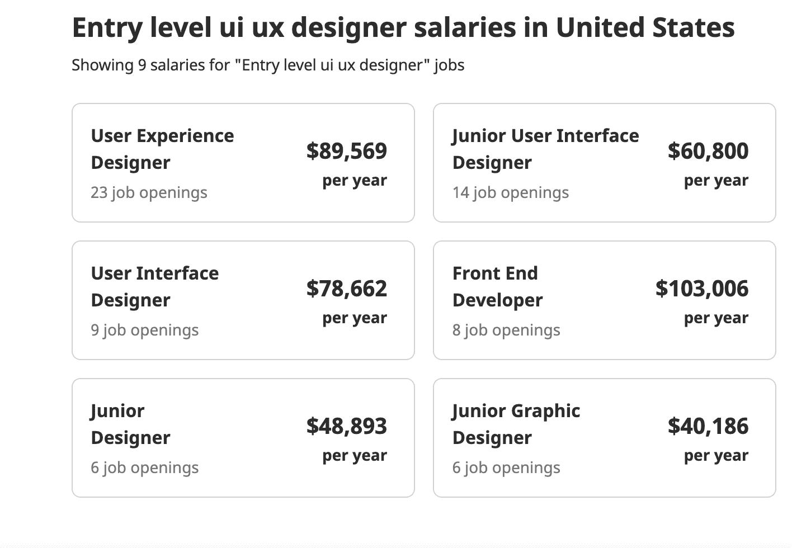
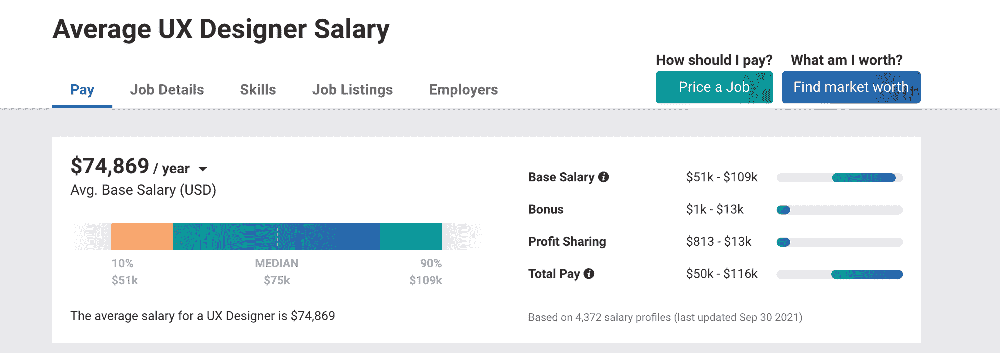
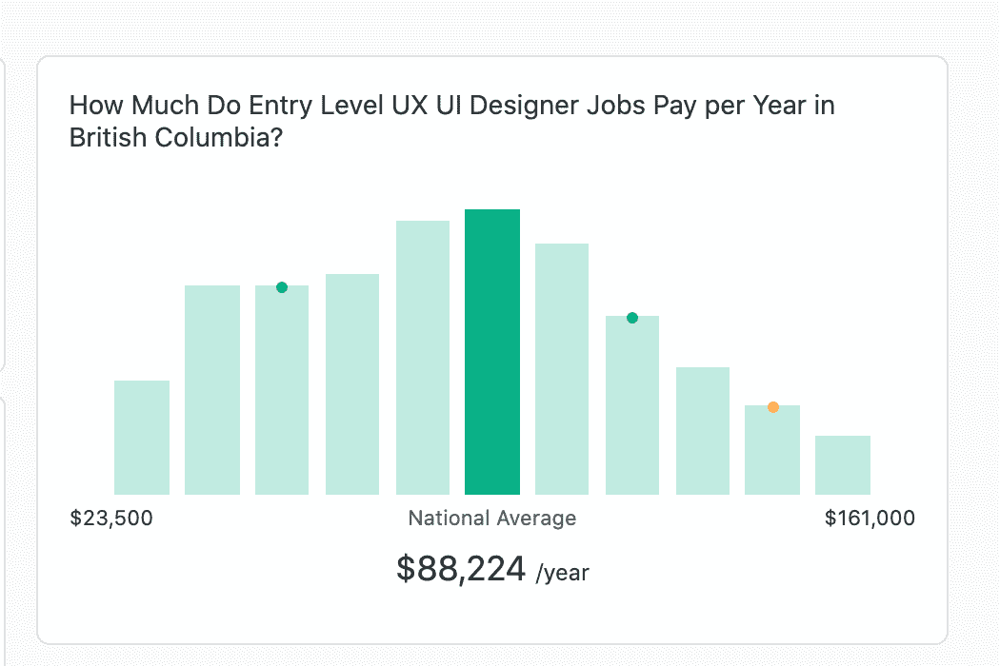
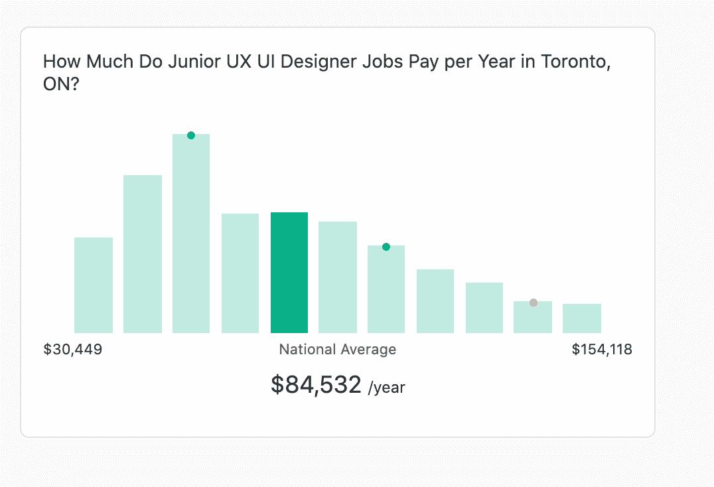
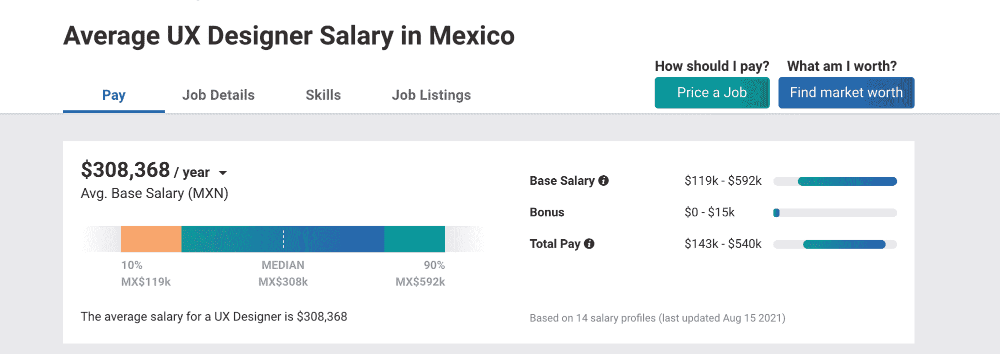
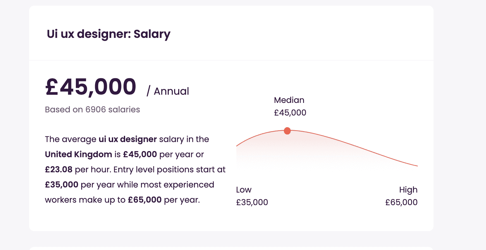

# UX 设计师工资——UX/UI 设计师的工资是多少？入门级范围

> 原文：<https://www.freecodecamp.org/news/ux-designer-salary-how-much-do-ux-ui-designers-make-entry-level-range/>

如果你是科技新手，你可能刚刚发现了 UI/ UX 设计，并想继续这条职业道路。但是初级 UX/UI 设计师的起薪是多少呢？

在这篇文章中，我将提供 UI/ UX 设计的定义以及世界各地的起薪信息。

## 什么是 UX 设计？

术语用户体验指的是用户如何与产品或服务进行交互。每当你登录一个网站，或在你的手机上玩游戏，你与该应用程序的互动被认为是用户体验。

如果你发现一个产品易于使用和理解，那么这将被认为是一个积极的用户体验。但是如果产品令人困惑和沮丧，那么这将被认为是一个负面的用户体验。

如果你想更多地了解 UX 设计，并找到资源开始学习，那么我建议你阅读我的文章[什么是 UX 设计？](https://www.freecodecamp.org/news/user-experience-design-what-does-a-ux-designer-do/)

## 什么是 UI 设计？

术语用户界面指的是产品的外观和感觉。对于数字产品，UI 设计关注所有视觉方面，包括字体、颜色、间距、响应式设计等等。

好的 UI 设计被认为是简单、容易理解和一致的。你不希望用户因为不直观而不得不费力地浏览产品。

糟糕的 UI 设计被认为是不一致的，难以理解的。如果用户面对低质量的图像、不一致的字体或视觉内容的对比度差，那么用户会希望尽快离开产品。

如果你对学习 UI 设计的基础感兴趣，那么我建议你通读一下这篇文章。

## 开始学习 UI/UX 设计的资源

这里有一个学习 UI/UX 设计的资源列表。

*   [用户体验基础(UX)设计](https://www.coursera.org/learn/foundations-user-experience-design?specialization=google-ux-design)
*   [2019 UI 设计初学者速成班](https://www.youtube.com/watch?v=_Hp_dI0DzY4)
*   [Figma 教程——一款免费的 UI 设计/原型制作工具](https://www.youtube.com/watch?v=3q3FV65ZrUs)
*   免费 UX 电子书

## 世界各地 UI/UX 设计师的薪水

在这一部分，我将向你展示一些入门级 UI/UX 设计师的薪水。

### 美国

这些数据来自 indeed.com、payscale.com 和 ZipRecruiter。

这个数据代表了全国平均水平。如果你想要你所在城市的数据，你可以在这些求职网站上搜索。

### 加拿大

这些数据来自 ZipRecruiter。

### 墨西哥

这些数据来自 payscale.com，以 MXN 货币表示。

### 英国

这些数据来自 uk.talent.com。UI/UX 设计师的平均起薪为 3.5 万英镑。

### 世界上的其他国家

如果你想了解世界各地其他 UX 的薪水，你可以去看看 https://uxdesignersalaries.com/

你也可以使用你所在地区的热门工作网站，找出 UI/UX 设计师的平均入门级工资。

我希望你喜欢这篇文章，并祝你的 UI/UX 之旅好运。