# 如何在 AWS 中验证拉请求并使代码审查更容易

> 原文：<https://www.freecodecamp.org/news/validate-pull-requests-in-aws/>

当项目增长时，开发人员频繁地推送代码，工作中的拉请求总有可能在某个地方中断。

这可能是因为一个 PR 在另一个之前被合并，或者目标分支提前了几个提交，导致了冲突。

或者可能是因为开发人员在推送之前没有运行测试，并且不知不觉地在产品的其他部分引入了一个 bug。这样的例子不胜枚举。

但这应该不是问题。每个组织都有代码审查的工作流程，对吗？但是还是要占用很多时间。尤其是对于那些中断甚至没有准备好接受审查的公关。

毫无疑问，每次在进行适当的代码审查之前，我们都可以手工构建和测试我们的代码。但是过了某个点之后，自动化似乎更好。

想象一个中等规模的组织，每周有 100-150 个公关。花时间反复验证这些可能会给公司带来一整套新功能。好吧，那么，让我们去得到那些特征！

## 先决条件

您应该对 AWS 服务有所了解。

我假设您知道如何创建和管理 Lambda 函数、代码构建项目、Cloudwatch 事件、IAM 角色，并且您正在使用 CodeCommit 来版本化您的代码库。

## 体系结构

让我们在高层次上理解，我们将如何处理这个项目。

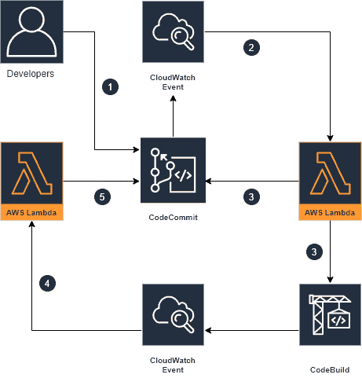

Uh huh, What?

一步一步来，让我们更好地理解我们的工作流程。

1.  假设创建了新的 PR/更新了现有的 PR。
2.  监视我们的存储库的 Cloudwatch 事件将被激活，并将相关数据发送给 lambda 函数。
3.  这个函数将做两件事
    →触发 CodeBuild 项目来构建我们最新的提交和运行测试。
    →评论我们希望在 PR 上显示的任何定制信息。
4.  在 CodeBuild 运行完构建之后，另一个 Cloudwatch 事件会将这些构建结果发送给一个 lambda 函数。
5.  这个函数将在我们的 PR 上注释构建结果。

好吧，那我们开始吧！

## 设置我们的应用程序

为了简单起见，我创建了一个简单的 Node.js 应用程序。它是用 TypeScript 编写的，构建阶段所做的就是将“app.ts”编译成“app.js”。

[这里是](https://github.com/aagam29/ValidatePR)回购的链接——如果你想跟进，可以复制并使用它。
本文中使用的所有相关代码都可以在那里找到。

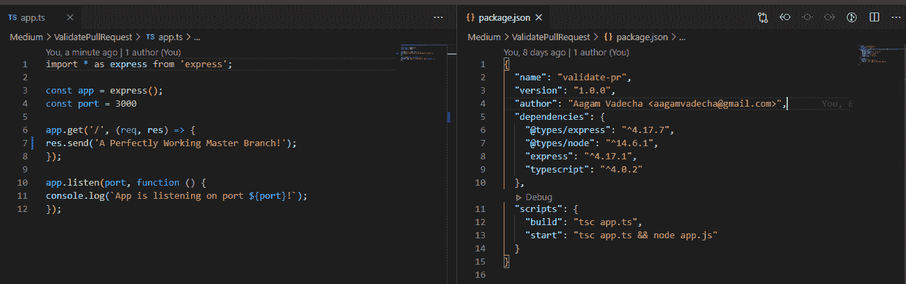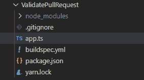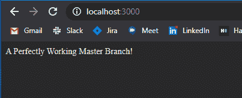

A Simple Express App

这里的`build`命令是一个简单的`tsc app.ts`，但是您可以将其更改为项目的 build 命令。

同样为了保持简单，我没有包括测试用例。你可以在`package.json`的脚本部分将它们链接到`test`并跟随。

## 代码构建项目

首先，您需要为您的存储库建立一个基本的 CodeBuild 项目。

**为此，请执行以下操作:**

*   将源代码设置为 Codecommit 存储库
*   引用类型应该是分支
*   环境应符合项目要求
*   您应该使用一个 buildspec 文件
*   剩下的应该就是默认了。

确保您的 repo 的根文件夹中有一个`buildspec.yml`文件。

注意:如果你处理的是单向回购，这可能会有所不同。在这种情况下，每个应用程序可能有单独的 buildspec.yml 文件，并且必须根据提交中更改的文件，有选择地将 buildspec 文件路径作为环境变量传递。

我们公司也有类似的设置，我们很喜欢目前的结果！

```
version: 0.2
phases:
  install:
    commands:
     - n 12.12
     - curl -sS https://dl.yarnpkg.com/debian/pubkey.gpg | apt-key add -
     - echo "deb https://dl.yarnpkg.com/debian/ stable main" | tee /etc/apt/sources.list.d/yarn.list
     - apt update
     - apt install yarn
     - yarn install
#   pre_build:
#     commands:
#     - yarn test
  build:
    commands:
     - yarn build
```

buildspec.yml

这个 buildspec.yml 是做什么的？它将每次构建的运行时命令传递给我们的 CodeBuild 项目。

然后做什么？？

*   安装节点 12.12.0
*   安装纱线
*   安装我们项目的依赖项。
*   纱线测试(它运行我们的测试用例。这里没有，但是如果需要，您可以取消注释该部分。)
*   yarn build(构建我们的项目。)

## λ函数

让我们设置两个函数，如上面的架构部分所讨论的。

函数 **TriggerCodebuildStart** 将接收一个 Cloudwatch 事件(我们稍后将设置它),它将触发我们的 CodeBuild 项目开始一个新的构建。

它还会发布一个带有时间戳的构建开始评论，并在我们的 PR 评论部分提供一个到构建日志的简洁链接。

函数 **TriggerCodebuildResult** 将从我们的 CodeBuild 项目接收一个 Cloudwatch 事件，该项目将包含构建结果。

它还将发布带有时间戳的代码构建结果评论，并在我们的 PR 评论部分提供一个到构建日志的简洁链接。

这是代码。那是你一直在等的，不是吗！？

```
const AWS = require('aws-sdk');
const codecommit = new AWS.CodeCommit();
const codebuild = new AWS.CodeBuild();

exports.handler = async (event) => {
    try {
        console.log('Received Event: ', event);
        const { destinationCommit } = event.detail;
        const { sourceCommit } = event.detail;
        const { pullRequestId } = event.detail;
        const pullRequestName = event.detail.title;
        const sourceBranch = event.detail.sourceReference.split('/').pop();
        const triggerCodeBuildParameters = {
            sourceBranch, sourceCommit, destinationCommit, pullRequestId, pullRequestName
        };
        const codeBuildResult = await triggerCodebuild(triggerCodeBuildParameters);

        const buildId = codeBuildResult.build.id;
        const postBuildStartedCommentOnPRParameters = {
            sourceCommit, destinationCommit, pullRequestId, buildId
        }

        await postBuildStartedCommentOnPR(postBuildStartedCommentOnPRParameters);

        return {
            statusCode: 200
        };
    }
    catch (error) {
        console.log('An Error Occured', error);
        return { 
            error
        };
    }
};

async function postBuildStartedCommentOnPR(postBuildStartedCommentOnPRParameters) {
    const { sourceCommit, destinationCommit, pullRequestId, buildId } = postBuildStartedCommentOnPRParameters;
    const logLink = `https://${process.env.REGION}.console.aws.amazon.com/codesuite/codebuild/projects/ValidatePullRequest/build/${buildId}`;
    const parameters = {
        afterCommitId: sourceCommit,
        beforeCommitId: destinationCommit,
        content: `Build For Validating The Pull Request has been started.   
        Timestamp: **${Date.now()}**   
        Check [CodeBuild Logs](${logLink})`,
        pullRequestId,
        repositoryName: process.env.REPOSITORY_NAME
    };

    const request = await codecommit.postCommentForPullRequest(parameters);
    const promise = request.promise();
    return promise.then(
        (data) => data,
        (error) => {
            console.log('Error In Commenting To Pull Request', error);
            throw new Error(error);
        }
    );
}

async function triggerCodebuild(triggerCodeBuildParameters) {
    const { sourceBranch, sourceCommit, destinationCommit, pullRequestId, pullRequestName } = triggerCodeBuildParameters;
    console.log(`Triggering Codebuild, Branch: ${sourceBranch}`);
    const parameters = {
        projectName: process.env.CODEBUILD_PROJECT,
        sourceVersion: `refs/heads/${sourceBranch}^{${sourceCommit}}`,
        environmentVariablesOverride: [
            {
                name: 'pullRequestId',
                value: pullRequestId,
                type: 'PLAINTEXT'
            },
            {
                name: 'sourceCommit',
                value: sourceCommit,
                type: 'PLAINTEXT'
            },
            {
                name: 'destinationCommit',
                value: destinationCommit,
                type: 'PLAINTEXT'
            },
            {
                name: 'pullRequestName',
                value: pullRequestName,
                type: 'PLAINTEXT'
            }
        ]
    };
    const request = await codebuild.startBuild(parameters);
    const promise = request.promise();
    return promise.then(
        (data) => data,
        (error) => {
            console.log('Error In Starting Codebuild', error);
            throw new Error(error);
        }
    );
}
```

TriggerCodeBuildStart-index.js

```
const AWS = require('aws-sdk');
const codecommit = new AWS.CodeCommit();
exports.handler = async (event) => {
    try {
        console.log('Event', event);
        const parameters = await getParameters(event);
        console.log('Parameters For Comment:', parameters);
        await commentCodeBuildResultOnPR(parameters);
        return { statusCode: 200 };
    }
    catch (error) {
        console.log('An Error Occured', error);
        return { error };
    }
};

async function getParameters(event) {
    try {
        const buildId = event.detail['build-id'].split('/')[1];
        const buildStatus = event.detail['build-status'];
        const environmentVariableList = event.detail['additional-information'].environment['environment-variables'];
        let afterCommitId, beforeCommitId, content, pullRequestId;
        for (element of environmentVariableList) {
            if (element.name === 'pullRequestId') pullRequestId = element.value;
            if (element.name === 'sourceCommit') afterCommitId = element.value;
            if (element.name === 'destinationCommit') beforeCommitId = element.value;
            if (element.name === 'pullRequestName') pullRequestName = element.value;
        }

        const logLink = `https://${process.env.REGION}.console.aws.amazon.com/codesuite/codebuild/projects/ValidatePullRequest/build/${buildId}`;
        content = `Build Result: **${buildStatus}**   
        Timestamp: **${Date.now()}**   
        Check [CodeBuild Logs](${logLink})`;

        return {
            afterCommitId,
            beforeCommitId,
            content,
            pullRequestId,
            repositoryName: process.env.REPOSITORY_NAME
        };
    } catch (error) {
        throw error;
    }
}

async function commentCodeBuildResultOnPR(parameters) {
    const request = await codecommit.postCommentForPullRequest(parameters);
    const promise = request.promise();
    return promise.then(
        (data) => data,
        (error) => {
            console.log('Error In Commenting To Pull Request', error);
            throw new Error(error);
        }
    );
}
```

TriggerCodeBuildResult - index.js

在使用这些函数之前，您需要填充适当的环境变量。读一遍代码，你就知道该怎么做了。

如果你需要查阅文件，就去这里的和那里的。？

## 配置 Cloudwatch 事件

好了，现在让我们来配置我们的 Cloudwatch 事件。

我们将创建两个事件:一个将从我们的存储库中接收新的提交数据，另一个将接收代码构建结果。这些事件的目标将是我们的 lambda 函数。

我在这里附上整版截图。这将使你更容易理解参考文献。

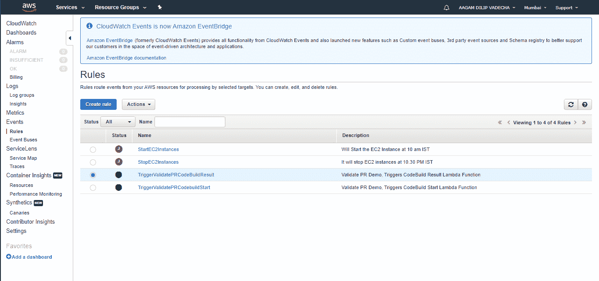

Focus on the Green Ones

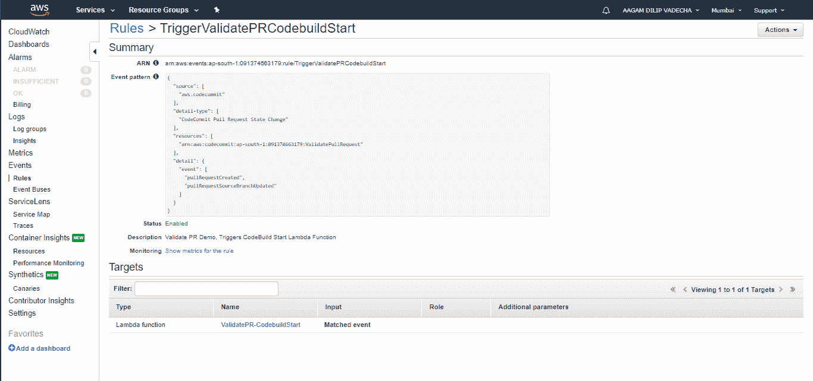

Replace with your CodeBuild project’s ARN.

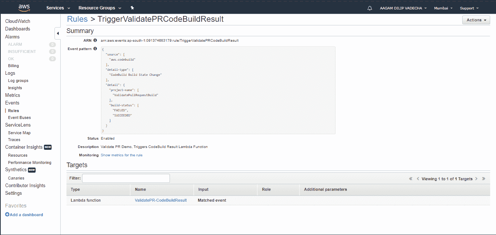

Almost there!

我选择在失败和成功的事件上触发 lambda 函数。但是您也可以选择所有事件，并根据您的需要进行定制。

## 开拍。

好吧，如果你做到了这一步，你就太酷了。？做了这么多工作，让我们看看我们取得了什么成果。

让我们发出两个拉请求，一个运行良好，另一个有故意的构建错误。

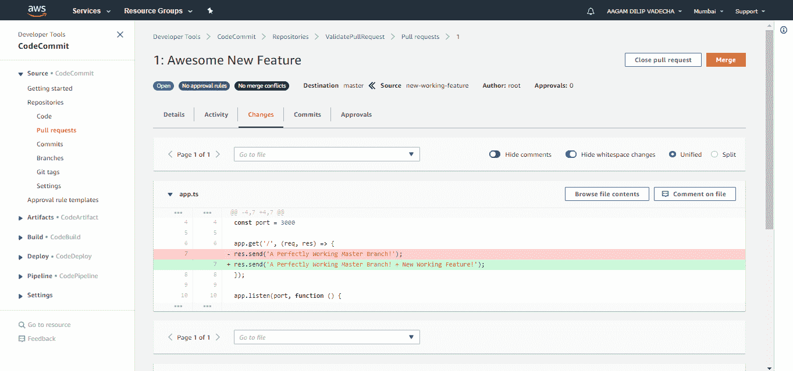

Error Free PR

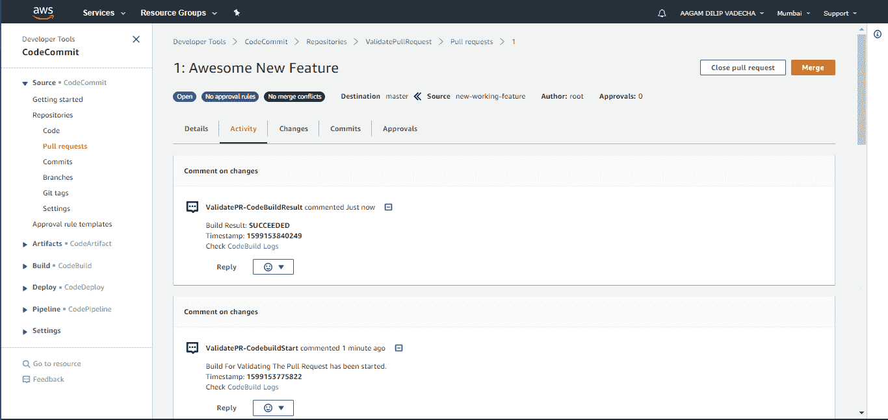

Great!

现在，让我们用 bug 创建一个 PR。看到这里，不是 **app.get** 而是有 **ap.get.** 这是故意的，很傻。但是现在它能完成工作。

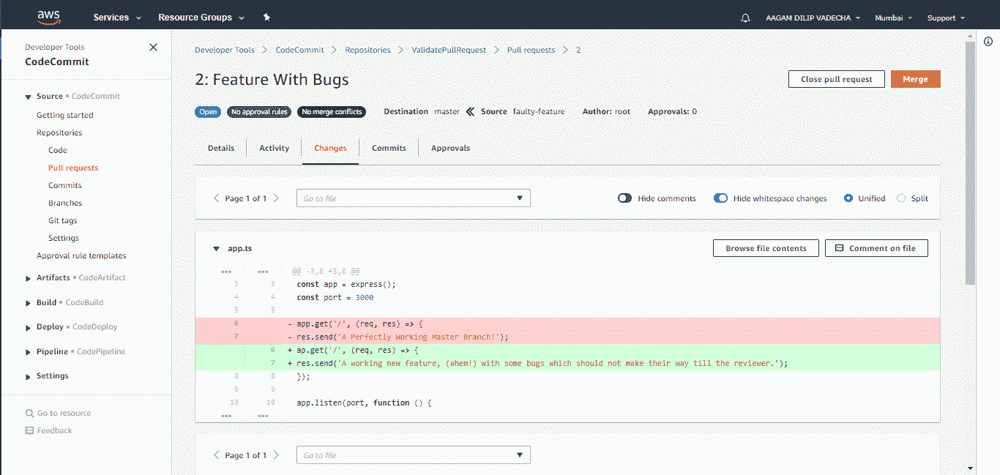

Faulty PR

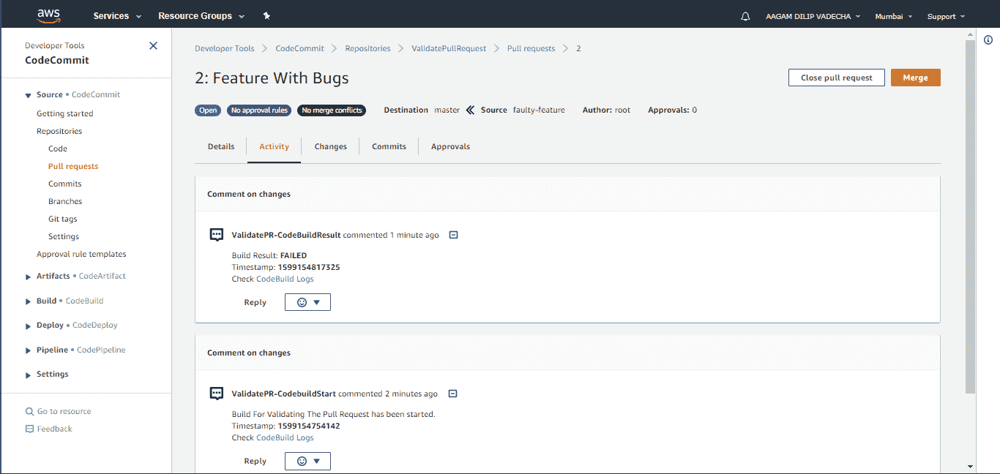

Failed Build Message, Happy reviewers. Didn’t have to checkout the branch and test!

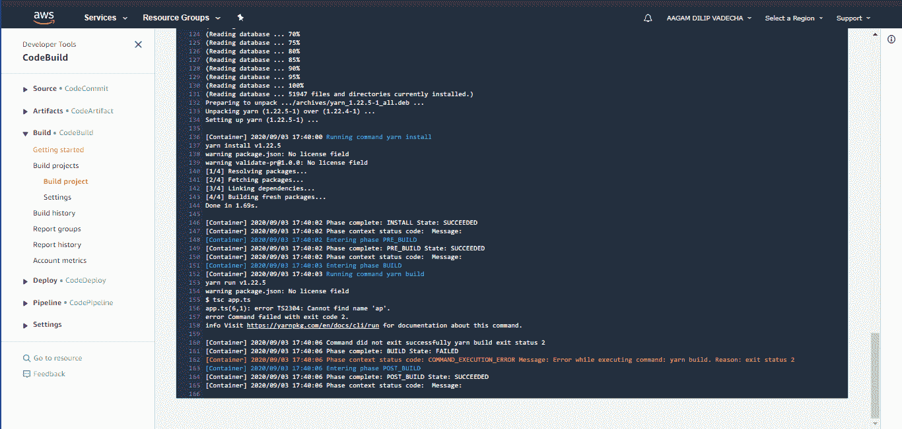

Devs, as usual, we’ve got logs for you!

## 包扎

为了更进一步，您可以触发对 Slack webhook URL 的 API 调用，以便在构建失败时立即在通道中发出通知。太棒了，对吧？

此外，这是一个非常简单的设置，现实世界的项目可能会更加复杂。例如，MonoRepos 可能有多个应用程序和版本，每个应用程序的测试都是不同的。

每次都触发所有这些测试是没有用的，而且会增加成本，造成混乱。您可能需要根据提交的文件和受影响的应用程序有选择地触发这些构建。

然而，这篇文章应该为你建立一个良好的基础。而且你肯定可以在上面展开。毕竟，你也很棒。:)

**感谢阅读！**如果你在这方面需要帮助，请随时通过 [LinkedIn](https://www.linkedin.com/in/aagamvadecha/) 联系我。希望能尽我所能提供帮助。